## 環境、社會及管治報告

### 1. 關於本報告

本報告為小米集團（以下簡稱「小米」或「集團」或「公司」或「我們」）發佈的第三份環境、社會及管治[Environmental, Social and Governance, ESG]報告，本報告旨在客觀、公允地反映小米及其附屬公司於2020年在環境、社會及管治方面之表現。報告遵循香港聯合交易所有限公司（下稱「香港聯交所」或「聯交所」）《上市規則》附錄二十七《ESG報告指引》要求編製。報告參考全球倡議組織[Global Reporting Initiative，GRI]《GRI準則》[GRI Standards]，並根據《GRI準則》：「核心」選項編製。有關管治部分內容建議與本年度年報所載《企業管治報告》章節一併閱讀。

在本次報告編製過程中，依據「重要性」、「量化」、「平衡」及「一致性」四大原則，以界定報告的內容及資訊的呈列方式。

本報告的報告期間為2020年1月1日至2020年12月31日（以下簡稱「本年度」或「年內」），為增強報告的可比性和完整性，部分披露內容亦覆蓋至其他時間。

本報告的資料和案例主要來源於2020年度公司統計報告、相關文檔及內部溝通文件。本集團承諾本報告不存在任何虛假記載及誤導性陳述，並對內容真實性、準確性和完整性負責。

本報告以中英文兩種語言發佈，如文本間存在差異，以中文版為準。

### I I. 聯合國全球契約與可持續發展目標

2020年，小米加入聯合國全球契約[United Nations Global Compact，UNGC]，並遵循其發起的倡議，致力於將人權、勞工、環境及反腐敗等十項原則納入企業運營與策略並保持一致，貫徹可持續發展。UNGC清晰的賦予我們可持續願景，通過動員企業行動，創造我們想要的世界。同時，UNGC是聯合國可持續發展目標[Sustainable Development Goals，SDGs]的堅定支持者。

小米積極回應聯合國提出的可持續發展目標，結合企業實際及價值鏈特徵，我們識別出可持續發展目標優先項，並圍繞小米「產品、用戶、環境與社會」四大核心領域，採取多項行動，踐行企業責任，努力實現可持續發展目標。

可持續發展 ☐ 標

無貨窮

 $ ^{*} $ 

2零飢餓

\\

3 良好 健康與福祉

5 性别平等

6 清潔飲水和衛生設施

7 經濟適用的清潔能源

8體面工作和經濟增長

9產業、創新和基礎設施

M

减少不平等

11 可持续

城市和社區

12 負責任

消費和生產

13 氣候行動

合

14 水下生物

15 陸地生物

~~

16 和平、正義與強大機構

17 促進目標實現的

夥伴關係

可持續發展

☑ 標

## 環境、社會及管治報告

<table border=1 style='margin: auto; width: max-content;'><tr><td style='text-align: center;'>SDGs</td><td style='text-align: center;'>小米2020行動</td></tr><tr><td style='text-align: center;'>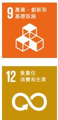</td><td style='text-align: center;'>產品領域
核心戰略
• 下個十年核心戰略:「手機×AloT」
產品質量
• 智能硬件和有品業務獲得ISO9001質量管理體系認證
• 為質量管理提供信息化支撐
• 覆蓋安全規範、電磁兼容、人體工學、能效、專利性認證等方面
科技創新
• 2020年研發投入93億元
• 連續三年上榜全球創新百強榜
• BCG波士頓諮詢「2020年全球創新50強」位列第24位
• 《麻省理工科技評論》「50家最聰明公司」[50 Smartest Companies, TR50]
• 首次躋身國際外觀設計體系(海牙體系)申請數量前五的中國企業
• 累計持有19,460件專利
標準化
• 參與國際標準化組織會議超過200人次，貢獻標準提案100餘篇
• 參與國內標準化會議超過300人次
• 參與的國際、國家、行業及團體標準制定超過100項
智能製造
• 智能工廠約92%的製造設備來自小米及小米投資企業自主研發
• 建立之初自動化率達到約63%
• 智能製造平台入駐上下游產品及技術供應商100餘家</td></tr></table>

## SDGs

## 小米2020行動

## 用戶領域

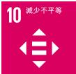

12 負責任

消費和生產

## 用戶體驗

中國大陸運營的小米之家門店數超過3,200家

全國擁有656家維修中心

全國1,553家店提供上門維修服務

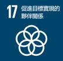

推出「1小時快修」、「2小時響應」服務機制

• 售後人員100%完成認證

• 舉行200多場線上和100多場線下培訓，10,000人次以上參與

## 隱私保護

• 發佈小米隱私品牌

• 獲得ISO27001信息安全管理體系認證

• 獲得ISO27701隱私信息管理體系認證

• 獲得TrustArc認證隱私印章

MIUI 12 操作系统三大用户隐私保护功能创新

## 米粉文化

• 成立新小米社區，累計用戶超1.2億，月活躍用戶超2,000萬

• 設計提案機制，參與反饋人次超4,000萬

開展100多個內測項目，吸引用戶超400萬

• 舉辦12場「內部吐槽會」、45場「微博MIUI負責人在線」活動

全球開展「米粉故事」、「夢想改造家」、「探索者活動」和「攝影大賽」等活動

- 全球開展「米粉故事」、「夢想改造家」、「探索者活動」和「攝影大賽」等活動

## 環境、社會及管治報告

<table border=1 style='margin: auto; width: max-content;'><tr><td style='text-align: center;'>SDGs</td><td style='text-align: center;'>小米2020行動</td></tr><tr><td style='text-align: center;'>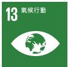</td><td rowspan="2">環境領域
綠色運營
• 獲得ISO14001環境管理體系認證
• 小米科技園達到《北京市綠色建築標準》二星级水平
• 園區全年節能約1,406,874千瓦·時(度)，減少溫室氣體排放約1,001.6噸二氧化碳當量
• 太陽能系統全年合計提供3,608噸熱水
• 使用節水設施並推廣中水使用
• 年內無害化處理1,882.5噸廚餘垃圾
• 中國大陸小米之家門店提供環保紙袋
• 年內共30,572單訂單獲得政府節能補貼</td></tr><tr><td style='text-align: center;'>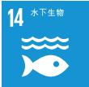</td></tr><tr><td style='text-align: center;'>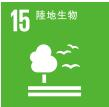</td><td style='text-align: center;'>綠色產品與包裝
• 推動產品全生命週期節能舉措
• 95%自有品牌產品應用減量化包裝方案，包裝空間利用率最高達80%
• MIUI 12.5系統應用功耗平均下降25%
• 從歐洲開始減少手機包裝塑料用量，減幅達60%
• 手機回收量127,271台，減少電子廢棄物產生量約25噸
• 推行包裝中箱複用，全年合計節省約32萬個紙箱、1萬個木質棧板
• 產品符合美國能源部[DOE]能效標準，加利福尼亞能效要求[CEC]，中國能效標籤[CEL]、歐盟生態設計[ERP]要求</td></tr></table>

## 小米2020行動

## 社會領域

## 員工關懷

22,074位員工遍布世界4個大洲、20個國家和地區

2020年新招聘入職正式員工7,885人，其中應屆生2,210人

推行績效申訴機制

制定並落實《小米集團國際派遣員工稅負平衡政策》

2020年董事會合計授予137,947,024份受限制股份單位予選定參與者，覆蓋4,686人次

• 獲得ISO45001職業健康與安全管理體系認證

3 良好

健康與福祉

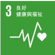

8 體面工作和經濟增長

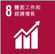

11 可持續

城市和社區

4 優質教育

2020年清河大學學習平台共上線課程468個、學習項目103個，線上上課人數總計超過12,000人

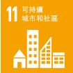

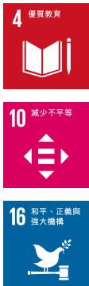

16 和平、正義與

猶大機構

## 合作共赢

累計31家小米生態鏈公司成功上市

- 天星數科累計為3,000多家公司提供累計超過900億元的信貸支持，為中小公司平均降低約2%的融資成本

## 社會責任探索

搭建「無障礙」、「災害預警」及「適老化」社會責任模塊

2020年地震预警範圍擴大至全國100多個城市

- 小米地震预警功能已累计成功预警4.0以上地震29次，累计预警数據下發總量9,445,961條

進入無障礙2.0時代，啟動「四大升級」指導小米無障礙發展之路

2020年小米提供殘障人士就業崗位185人次

- 逐步實現殘障人士支持體系建設，初步完成小米樣本打造，上線小米無障礙官網

## 抗擊疫情

小米集团、員工及北京小米公益基金會疫情相關捐款捐物累計價值超8,000萬元，向40個多個國家和地區捐贈防護物資超300萬件

截至2020年7月15日，北京小米公益基金會收到新冠肺炎疫情防控的捐贈款項超過人民幣2,700萬元，其中，來自集團高管和員工捐款超過1,200萬元

集團創始人、董事長兼CEO、北京小米公益基金會理事雷軍先生入選民政部第十一屆「中華慈善獎」

## 環境、社會及管治報告

### I II. ESG管治及策略

本年度，小米在治理層、管理層與執行層搭建體系化ESG管治架構。董事會在企業管治委員會的協助下全面監督與負責集團環境、社會及管治相關事宜；各ESG職能部門和業務板塊最高管理層組成ESG執行管理組負責統籌集團內外部資源，指導並支持ESG相關部門全面推進ESG政策有效落地；ESG工作組協同各部門ESG執行人員實施集團ESG策略、完成全部ESG工作。管治委員會定期在董事會層面探討ESG工作，根據集團ESG表現向ESG執行管理層及相關部門提出規劃方針及工作建議；同時，小米完成了工作機制及流程的確立，由ESG執行管理層代表定期向企業管治委員會匯報集團ESG工作，提出下一階段工作計劃與目標，檢討上一階段目標完成情況和工作成果。

我們深刻理解，良好的ESG管治表現是實現集團可持續發展目標的關鍵途徑，而有效的ESG策略對於指導集團ESG工作執行具有重大意義。我們通過風險管理及控制識別ESG重大風險並主動應對，以指導運營及業務優化。我們亦在價值鏈推廣ESG理念，以提升價值鏈的可持續性。我們還不斷探尋科技產品的可持續價值，為產品賦能，並影響廣泛的相關方群體，提升小米品牌的可持續性。本年度，我們在綠色運營、質量、科技創新、員工與僱傭、用戶、商業道德、價值鏈、回饋社會等維度執行ESG策略，全面推進ESG工作的落地與提升。

2020年，新冠肺炎疫情的爆發改變了社會運行的基本模式。面對時代前所未見的危機與不確定性，良好的ESG管治，在保障企業運營穩定、應對突發性挑戰與把握多樣化機遇等方面，展現了其關鍵作用與重要性。將企業管治策略與業務運營深度融合的小米，在複雜且困難的環境中，展現持續活力並實現穩定發展。在保護重要相關方權益的同時，小米為全球抗疫作出積極貢獻，更促進了產業鏈的復蘇與回暖。

未來，小米將持續提升ESG管治水平，與各利益相關方攜手，堅持做感動人心、價格厚道的好產品，讓全球每個人都能享受科技帶來的美好生活。

### I V. 利益相關方溝通

小米積極傾聽並回應利益相關方的期望。根據實際業務及運營特點，我們識別了以消費者和用戶、股東及投資者、員工、供應商及合作夥伴、政府及監管機構、媒體及非政府組織、社區等為小米主要利益相關方。我們建立了有效的溝通機制和多元化的溝通渠道，確保與利益相關方進行及時的溝通和反饋。

<table border=1 style='margin: auto; width: max-content;'><tr><td style='text-align: center;'>主要利益相關方</td><td style='text-align: center;'>主要溝通渠道</td></tr><tr><td style='text-align: center;'>政府及監管機構</td><td style='text-align: center;'>常規問詢、政策諮詢、高層會面、事件匯報、現場考察、信息披露、政府機構會議交流</td></tr><tr><td style='text-align: center;'>股東及投資者</td><td style='text-align: center;'>年度股東大會、年報／中期報告、業績公告、投資者見面會、新聞稿／公告、調研及問卷回應</td></tr><tr><td style='text-align: center;'>消費者／用戶</td><td style='text-align: center;'>官方網站、小米社區等社交平台、即時通訊軟件、用戶服務熱線、新聞發佈會、社交媒體、參與活動及項目</td></tr><tr><td style='text-align: center;'>員工</td><td style='text-align: center;'>員工交流會、工會活動、員工意見箱、即時通訊軟件</td></tr><tr><td style='text-align: center;'>供應商／合作夥伴</td><td style='text-align: center;'>供應商大會、合作夥伴溝通會議、商務談判、現場調研、項目合作</td></tr><tr><td style='text-align: center;'>媒體及非政府組織</td><td style='text-align: center;'>社交媒體、新聞發佈會及新聞稿、媒體採訪、調研及問卷回應</td></tr><tr><td style='text-align: center;'>社區</td><td style='text-align: center;'>社區活動、新聞發佈會、公益活動、社交媒體</td></tr></table>

### V. 實質性議題分析

2020年，通過與主要利益相關方持續有效的溝通，結合問卷調研結果，我們就《ESG報告指引》所列11個层面的ESG議題進行實質性分析，進一步細化各項議題內容，拆分為23個子議題，期望更為全面和系統地了解各利益相關方對於小米在ESG管理方面的評價和期望，並作為我們行動及披露參考，從而更好地回應利益相關方訴求。

## 環境、社會及管治報告

我們識別出「高度重要議題」包括產品質量與安全、信息安全和個人隱私、產品及技術創新、商業道德、人才吸引、供應鏈社會責任管理、知識產權保護；「一般重要議題」包括碳排放、員工健康與安全、員工培訓及發展、產品及包裝環保屬性、客戶投訴管理、員工權益、反貪污、能源使用、氣候變化應對、多元化與平等機會、廣告內容管理、水資源使用、公益活動。我們將在本報告各章節中分別討論各議題。

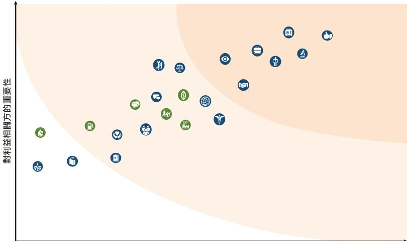

對小米可持續發展的重要性

環境

碳排放

產品回收及處理

能源使用

水資源使用

氣候變化應對

產品及包裝環保屬性

社會

員工權益

多元化與平等機會

人才吸引

員工健康與安全

員工培訓及發展

商業道德

供應鏈社會責任管理

產品質量與安全

服務品質

產品及技術創新

信息安全和隱私

智慧財產權保護

廣告內容管理

客戶投訴管理

反貪污

社區投資

公益活動

### 1. 綠色小米

積極應對氣候變化風險，降低業務及運營溫室氣體排放，抓住價值鏈轉型機遇，是小米應當承擔的社會責任和努力實現的願景。小米在積極響應國家「30·60」目標的同時，踐行綠色可持續發展理念。我們持續開展節能、節水、資源回收等一系列環保措施，不斷提升系統化資源管理的工作；我們加大可再生能源的使用，並將環保理念融入從設計到報廢處理的產品全生命週期，期望攜手合作夥伴，共同探索與環境和諧發展的商業模式。

### 1.1 綠色運營

小米秉承綠色運營理念，堅持對環境負責的態度，努力減少運營過程對環境的影響。我們嚴格遵守《中華人民共和國環境保護法》、《中華人民共和國節約能源法》和《中華人民共和國固體廢物污染環境防治法》等法律法規，同時根據ISO14001環境管理體系制定了《小米環境職業健康安全管理手冊》、《環境和職業健康安全監測管理程序》和《環境保護管理程序》等內部規章制度，為提高能源使用效率、管控排放物、廢棄物減量及材料循環利用提出規範指導和要求。本年度，小米科技園及小米香港辦公區獲得了ISO14001環境管理體系認證。

基於小米現有的運營模式，我們識別了資源消耗的主要區域——辦公區域、小米之家和數據中心，並採取針對性措施提升三個區域的能效、增加可再生能源使用及減少碳排放。

小米於中國大陸運營區域中涉及資源使用的主要區域為中國大陸主要辦公區域和小米之家直營店，2020年全年資源使用情況如下：

綜合能源消耗總量 $ ^{2} $ 

48,608.45兆瓦時

直接能源消耗總量3,192.70兆瓦時間接能源消耗總量45,415.75兆瓦時

溫室氣體排放總量 $ ^{3} $ 

31,347.06噸

用水總量 $ ^{4} $ 

303,132.92噸

直接溫室排放總量624,29噸

間接溫室排放總量30,722.77噸

自來水量187,339.02噸

中水量115,793.90噸

## 環境、社會及管治報告

## 辦公區域

我們在所有辦公區開展節水、節能和無紙化辦公等系列措施。小米科技園作為小米的主要辦公場所，依據綠色建築標準進行設計、建設及運營管理，園區辦公樓採用智慧能源管理系統，達到溫度、用電、照明等功能系統管理的智慧控制。2020年，小米科技園內所有建設及裝修工程通過《北京市綠色建築評價標準》二星級水平認證，建築物設計節能率65%，可再利用可循環材料設計佔比10%，線地設計佔比率20%。園區水資源使用方面，年內共20.8%的園區生活熱水採用太陽能系統供熱，35.2%的用水為非傳統水源 $ ^{5} $ 。

中國大陸主要辦公區域

人均能源消耗2.22兆瓦时

溫室氣體排放強度

0.061噸/平方米

人均用水量

15.80噸

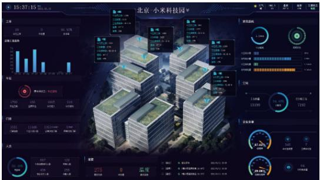

小米科技園全園區安裝智慧能源管理系統，並在所有寫字樓通過人體感應系統和後台智能操控節能燈管、插座和空調的開關時間，地下車庫採用不同時段控制照明亮度，洗手池暖水寶採取季節控制使用；室外照明採用時段控制，根據季節設定控制開關時間。通過以上措施，園區每年約節能1,406,874千瓦·時（度），減少溫室氣體排放約1,001.6噸二氧化碳當量。

我們選取滿足二級用水效率等級的衛生器具及配件，並滿足《節水型生活用水器具》、《節水型產品技術條件與管理通則》、《用水器具節水技術條件》標準要求及綠色建築標識認證的規定。同時，我們還通過張貼節水標識，噴淋綠化澆灌，提升中水使用率等方式，節約水資源使用量。

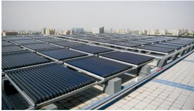

我們在園區配備兩套太陽能熱水系統，包含太陽能集熱器124組，日吸熱17.2兆焦耳/平米，每個系統在夏季和冬季分別提供日均11.6噸和6.8噸熱水，全年合計提供3,608噸生活用熱水。

本集團運營過程中產生的無害廢棄物，主要為辦公區域生活及廚餘垃圾，我們採取從源頭減少、分類處理或就地轉化等方式減低其對環境的影響。本集團運營過程中產生的有害廢棄物，主要為辦公區域打印設備產生的廢硒鼓及廢墨盒，均由打印機供貨商回收處理。

中國大陸主要辦公區域

有害廢棄物

0.367噸

人均有害廢棄物

0.019千克

無害廢棄物

4,661.07噸

人均無害廢棄物

0.24噸

## 環境、社會及管治報告

對於生活垃圾，我們設置分類垃圾桶，在保潔人員將收集的垃圾送至中轉站時，進行二次分類，以確保垃圾分類的準確性。我們通過宣傳片及小程序，讓員工了解正確垃圾分類的重要性及方法；同時對保潔人員展開技能培訓，保證其分類的準確和專業。

小米科技園食堂日均提供20,000餘人次用餐，通過使用專業的廚餘垃圾處理設備，將廚餘垃圾加工轉化為符合國家標準的有機肥料，實現廚餘垃圾資源化利用。2020年，小米科技園食堂實現1,882.5噸廚餘垃圾就地無害化處理，轉化成為188.25噸有機肥料。同時，通過提高食物出成率、張貼號召性標語提升員工節約意識，從源頭減少廚餘垃圾產生。採購過程中，我們亦盡量選取可重複利用包裝袋，以減少一次性產品使用率。

## 小米之家

2020年，我們將「無紙化理念」從總部推行至小米之家門店，全面取消紙質標籤，落實電子價格標籤。購物紙袋也從塑料袋改為環保紙袋。同時，小米之家直營店積極響應北京市節能減排促消費政策，電視、冰箱、空調、空氣淨化器等一系列產品參與其中，全年訂單中共有30,572單獲得政府節能補貼。

## 中國大陸小米之家直營店

能源消耗强度

0.16兆瓦時/平方米

溫室氣體排放強度

0.096噸/平方米

## 數據中心

我們的目標是建設綠色、高效的數據中心，採取一系列管控措施降低運行能耗。

• 服務器選型方面，我們選擇具備高能效及白金級消耗轉換率的機型；

- 冷却系统方面，我們的自有數據中心採用水冷空調製冷，搭配自然冷卻系統，在冬季採用水側自然冷卻技術，春秋採用部分自然冷卻；

配件選擇方面，我們的自有數據中心採用效率更高的不斷電供應系統設備，使整機效率達到96%以上，節能模式下達到99%。

我們正在逐步推進使用雲服務器替代物理服務器，在選取租賃雲服務和數據中心服務商的過程中，我們將節能降耗表現作為重要衡量指標，在滿足業務需求的基礎上優先考慮能效水平較高的雲服務和數據中心。

### 1.2 綠色產品與包裝

作為一家產品面向用戶的終端品牌，小米提供產品的數量超過2,000種，在踐行綠色低碳理念的道路上，產品成為了最佳載體。我們嘗試將低碳理念融入產品的全生命週期，在開發、設計、選材、生產、物流倉儲、使用和回收等環節探索減碳空間和節能舉措。

#### 產品包裝材料使用總量 $ ^{6} $ 46,808.15噸產品包裝材料使用強度0.19噸/百萬元

我們通過在設計端的優化，持續減少包裝材料用量，並提升非塑材料和環保材料的使用比例，增加環境友好型材料的用量。我們充分利用產品端的技術優勢，通過軟硬件節能設計，整體降低產品能耗。同時，我們也對我們的生態鏈產品包裝進行設計優化，通過極簡設計等方案降低了原有材料的用量。我們逐步推廣廢舊產品回收，加強了部分材料的循環使用，延長了產品的生命週期。

## 系统節能

小米擁有行業頂尖的手機操作系統開發團隊。2020年，我們在MIUI12及MIUI12.5操作系統中發佈數個行業獨創、首創的系統功能以降低系統能耗。

MIUI 12.5降耗：该系统后台内存占用平均下降35%，系统应用功耗平均下降25%；

- 全域深色模式：屏幕是手機耗電佔比最高的部分，MIUI12在省電建議頁面和省電結果頁面增加了開啟「夜間模式」推薦項，鼓勵更多用戶開啟深色模式節約能耗；

AI Power 4.0智能節能：通過AI Power智能節能技術的使用，對4G、5G智能切換、屏幕亮度自適應調節、幀率智能切換、睡眠模式智能切入、應用資源佔用智能管控、推送智能管理等，達到功耗節省的效果；

- Adaptive Sync技術：小米業界首創7檔30–144Hz自適應動態幀率，實現了對多種顯示內容的精準匹配，確保各場景下顯示效果極致流暢的同時，有效增強整機續航表現，避免不必要的電量浪費；

## 環境、社會及管治報告

- 智能充電保護：系統通過學習用戶的充電習慣，在用戶休息時為用戶智能調整充電模式，在降低安全風險的同時，減少用戶持續飽充時間，延長電池壽命；

- 異常耗電提醒：實時監控各個應用的耗電情況，當發現有應用在短時間內耗電異常時，系統將耗電問題和省電建議前置到首頁首屏，以引導用戶關注當前存在的耗電問題。

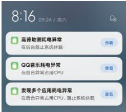

## 產品節能

在產品的生產和使用上，我們了解現行的全球能效政策和法規，把握新興的產品節能趨勢，汲取節能設計前沿理念，結合小米產品特點開發產品端的節能舉措和實踐，受到市場和用戶的歡迎。

小米手機：隨著小米旗艦手機小米11的上市，我們推出附贈充電器的「套裝版」和不含充電器、數據線的「標準版」兩個版本，兩款同價，將是否需要充電器的選擇權交給用戶。作為國產手機廠商在此領域的首次嘗試，我們不但減少產品製造、運輸、包裝過程中的碳排放，同時也將我們的環保理念傳遞給用戶。小米11開售當天，有約20,000名用戶選擇更加環保的「標準版」。

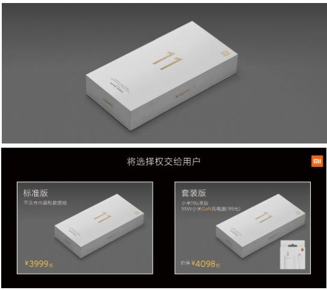

## 将选择权交给用户

小米電視：小米通過在供應鏈的影響力，推動電視背板生產中注塑工藝及內部結構件質量改善，降低產品接觸碰刮傷風險，還實現了生產環節的能耗減少，單台電視生產平均節電0.06度，全年減少溫室氣體排放約326噸二氧化碳當量；我們還改善背板噴漆技術，實現了單台電視生產平均節電0.084度，全年減少溫室氣體排放約457噸二氧化碳當量。

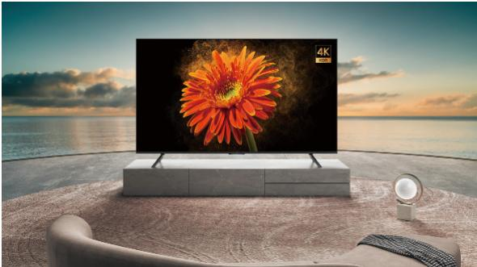

## 包装减材

小米產品種類繁多，產品包裝形態各異，產品銷量的提升帶來包裝材料消耗的增加。全年小米產品包裝材料使用總量46,808.15噸。我們延續在綠色包裝方面的探索和嘗試—從包裝的設計和選材進行改良，減少了整體材料的耗用，增加了環保材質的用量。截至2020年底，小米在95%的自有品牌產品上應用了減量化包裝方案，包裝空間利用率達70%-80%。

「一紙盒」包裝：於2019年推出行業首創的「一紙盒」包裝，較普通包裝最多可節約40%的包材用量。2020年我們將「一紙盒」包裝成功推廣至頭戴耳機、無線藍牙耳機、戶外音響、手環、鼠標鍵盤、智能手錶配件、智能燈泡、電動牙刷、吹風機、電子體溫計、手持吸塵器等多個產品品類；

手機包裝盒：本年度對手機包裝進行了全系列的盒型設計優化，包括簡化內托，減少高、中端手機系列黏膠面積，取消低端系列黏膠。這些優化使單個禮盒平均減重5克，全年約節省約770噸白卡紙，減少溫室氣體排放約731噸二氧化碳當量。12月上市的小米11手機使用更輕薄的包裝盒並簡化包裝，減少約45%的包裝體積；

## 環境、社會及管治報告

產品說明書：年內生態鏈產品說明書選用更環保材質，減少用紙量最高可達30%。

米家滑板車Pro：從設計端改小底部紙托、取消EPE墊片，大幅節約包材、人工工時、運輸成本及倉儲成本，塑料用料減少約12%，用紙量減少約83%。

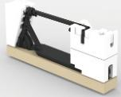

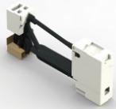

## 包装降塑

我們通過識別塑料在小米產品包裝中的來源、用量與使用場景，推行設計端減少塑料用量、紙質材料和其他環保材料替代部分塑料。2020年10月我們率先從歐洲開始逐步減少手機包裝中的塑料用量，減幅達60%。

手機包裝：用可降解的環保挹貝紙替代禮盒熱縮膜，用生物降解材質替代塑料材質的封口貼，用白牛皮紙袋代替塑料防水袋；

• 電視包裝：取消EPS泡沫，採用更環保的氣柱包裝；

生態鏈產品包裝：小型產品用紙結構或者紙漿托替代塑料緩衝，中大型生態鏈產品採用蜂窩板或紙漿托結構做承托保護。

小米九號平衡車Mini：通過用紙結構替代固定輪胎的兩個EPS內托，減少了40%的EPS泡沫用量，同時取消配件盒以減少用紙量。

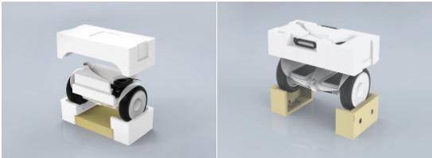

## 設備回收

對廢棄設備進行回收，不但可以延伸產品生命週期、減少潛在的電子廢棄物，還可以促進循環經濟發展，為相應產業和所在地區帶來新機遇。我們倡導產品及資源的循環利用，推行以舊換新計劃和產品專業回收。

2020年，我們升級了以舊換新計劃。在中國運營區，線上和門店以舊換新覆蓋手機、筆記本、平板、電視、音響等多品類設備。我們提供清晰準確的質檢報告作為最終定價依據，成功交易後，等價款項會在2小時內以現金或「換新現金券」的形式發放給用戶。該計劃還支持線上線下多種回收方式，並提供免費上門等便捷服務，鼓勵和倡導用戶參與以舊換新。在海外運營區也廣泛推進以舊換新、產品保養等工作，截至2020年底，小米已在香港、意大利、法國、德國和荷蘭開通以舊換新服務。

對於小米內部產生的產品功能及質量均完好的舊電子設備，我們通過捐贈、員工福利內購等形式實現產品的再利用。2020年，公司捐贈了筆記本電腦280台，員工內購筆記本電腦420台。

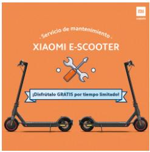

滑板車保養項目：小米從2020年正式開始實施海外滑板車保養項目，通過提供保養服務，使產品長時間保持在良好狀態下使用，降低產品損耗，延長產品使用壽命，促進節能減排。

我們將回收設備交由具有專業資質的第三方進行回收後處理，我們監控第三方平台產品流向，最終可以進行合規銷售或經拆解提取有價值材料，減少有害電子廢棄物對環境的污染。同時，我們執行嚴格的隱私保護程序，對回收設備數據進行深度清除，保障用戶信息安全。2020年，小米及紅米品牌手機回收量超過127,271台，減少潛在電子廢棄物超過25噸。

## 物流包装回收

我們亦積極推進物流包裝的循環減量使用：部分產品的到貨商品中箱在包裝品相、質量達標的前提下，重新循環至庫內業務線進行二次利用，實現物流包裝循環周轉，並在包裝箱上黏貼循環標識。此舉可將產品包裝箱循環使用比例提升9%，全年合計節約紙箱約300萬個。此外，我們推行將包材廠出貨的中轉箱和木質棧板二次利用，全年合計節省約32萬個紙箱、1萬個木質棧板。

為系統化管理廢舊物料回收，我們建立了包裝物料循環回收系統，實現全國配送中心廢舊物料回收信息化管理。

## 環境、社會及管治報告

社會認可

2020年，小米因積極推動綠色產品及包裝，獲得用戶和行業的廣泛認可。小米產品符合美國能源部[DOE]能效標準，加利福尼亞能效要求[CEC]，中國能效標簽[CEL]、歐盟生態設計[ErP]要求等各司法管轄區能效標準。本年度，小米多項產品獲得中國節能產品認證[CECP]。

<table border=1 style='margin: auto; width: max-content;'><tr><td style='text-align: center;'>CECP標準認證主體</td></tr><tr><td style='text-align: center;'>Redmi顯示器1A 23.8英寸</td></tr><tr><td style='text-align: center;'>小米快速液晶顯示器24.5英寸</td></tr><tr><td style='text-align: center;'>小米顯示器23.8英寸</td></tr><tr><td style='text-align: center;'>小米曲面顯示器34英寸</td></tr></table>

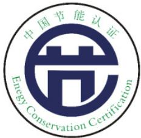

### 2. 行穩致遠

質量是小米的生命線，是小米對所有相關方的承諾。「創新決定我們飛得有多高，質量決定我們走得有多遠」，是小米不斷挑戰自我提升產品質量的動力。2020年，我們圍繞「強化質量管理，提升用戶體驗」的目標開展質量工作。

### 2.1 大質量觀

小米倡導「以用戶為中心，集產品質量、用戶體驗、服務品質為一體，全員參與、全週期閉環管理」的「大質量觀」，落實全週期質量管理。

## 管理體系

集團質量委員會與2019年成立，負責統籌管理全集團的質量工作。2020年，質量委員會繼續在集團層面推出一系列管理制度，覆蓋質量評價、行為規範、事故處理與複盤和質量獎勵等方面，包括《小米集團質量績效管理方案》、《小米質量獎評獎規則》和《小米集團質量事故管理制度》等。還設置和推行業務質量指標、獎懲機制、應急處理機制。針對已識別的質量異常問題，我們開展專業分析、實施改善措施、改善後進行總結和優化流程，以閉環管理確保質量持續優化、用戶體驗不斷改善及品牌競爭力不斷提升。

2020年，小米有品和智能硬件獲得ISO9001管理體系認證。截至2020年底，小米獲得ISO9001管理體系認證的業務線及服務部門包括手機、電視、筆記本、智能硬件、大家電和小米有品。

## 管理實踐

小米電視部實施全生命週期質量責任制，將開發品質、工廠品質、質量運營三大板塊組成「戰鬥小組」，各小組從設計階段開始對自己的產品負責，直至產品生命週期終止。通過強化責任機制，2020年電視產品的產品故障反饋比例[FFR]同比下降約15%。

智能硬件部建立多维度質量監控體系，包括QMS質量管理系統、Eagle鷹眼系統、採風預警系統等，科學設置FFR目標，實時監控質量投訴，舉行每週質量例會，進行專項故障分析，推動質量改善，實現遠低於市場水平的產品故障反饋比例。

小米有品制定平台售前風險控制機制，識別的不達標產品不予上架。同時實施質量標準和產品質量「兩個閉環」成長模式，針對現有標準不能覆蓋的用戶痛點問題及時制定增項標準，以標準規範產品質量，以產品質量促進標準提升，實現質量標準和產品質量同步改善。

關於服務質量的更多內容，請見5.1用戶服務和5.2用戶體驗章節。

### 2.2 產品安全

小米承諾為用戶提供健康安全的產品。我們高度重視產品的安全屬性，進行貫穿產品的全生命週期的評估，包括研發設計、材料選型、開發驗證、產品上市及售後等環節。同時，我們關注國際相關標準變動趨勢並及時回應，以國際標準為參照制定材料和產品標準，致力於實現產品在安全規範、電磁兼容、無線認證、環境保護、人體工學、能效、專利性認證等方面的出色表現。

## 獲中國質量認證中心CQC認證主體

## 環境、社會及管治報告

小米對有毒有害物質及成分進行嚴格管控。我們遵守《斯德哥爾摩公約》對使用持久性有機污染物的限制（POPs），遵守《關於限制在電子電氣設備中使用某些有害成分的指令》（RoHS）、《化學物質的註冊、評估、授權和限制》（REACH）、《玩具安全指令》（Toy Safety Directive）對有害成分和化學物質的限制，同時遵守各個運營所在地對有毒有害物質的監管要求。

在遵守國際國內法規的同時，我們根據各項標準的更新及集團質量方針的調整，同步更新內部制度規例。本年度，集團對內更新和發佈了《產品環境有害物質管理準則》。我們在確保產品符合產品銷售所在區域的相關法規和標準的同時，主動申請並獲取非強制產品健康與安全認證：

CQC標誌認證是中國質量認證中心開展的自願性產品認證業務之一，該認證重點關注安全、電磁兼容、性能、有害物質限量等直接反映產品質量和影響消費者人身和財產安全的指標，旨在維護消費者利益，促進提高產品質量，增強國內公司的國際競爭力。

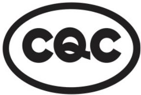

米家電烤箱32L

米家手持掛燙機

小米米家智能開關

米家LED燈泡 藍牙MESH版

電動滑板車M365

TÜV萊茵低藍光認證

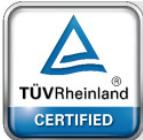

Low Blue Light

(Software Solution)

## 獲德國TÜV萊茵低藍光認證主體

Redmi顯示器1A 23.8英寸

小米顯示器27英寸165Hz版

小米快速液晶顯示器24.5英寸

小米顯示器23.8英寸

小米曲面顯示器34英寸

TÜV萊茵護眼認證

Eye Comfort

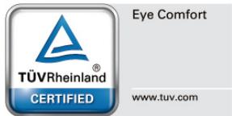

www.tuv.com

獲德國TÜV萊茵護眼認證主體

米家枱燈Pro

### 2.3 質量宣貫

2020年，小米建立了完整的質量管理培訓體系框架，結合業務實際，我們開發質量通識類、質量專業類、質量實戰類課程，對新員工、質量管理人員開展線上線下培訓，培訓內容覆蓋質量體系、產品健康安全規範、用戶洞察等領域，參與員工人數超過3,500人。

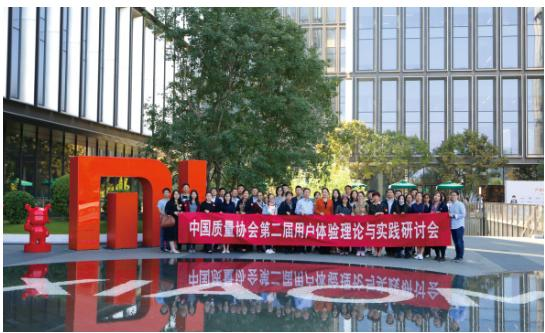

小米質量月：2020年9月，小米舉辦了首屆小米質量月，圍繞「強化質量管理，提升用戶體驗」的主題，舉辦了40多場形式多樣的質量專題活動。參與者包括小米高層、全體員工和相關供應商及合作夥伴。

## 環境、社會及管治報告

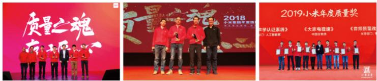

小米質量獎：2017年開始，我們在集團內設立「小米質量獎」，旨在倡導工匠精神併表彰質量工作中有卓越貢獻的項目團隊。2020年，第四屆小米質量獎增設部門質量獎，集團20多個部門積極參與，近200個項目參與評審。小米質量獎已經成為小米人心中最高質量榮譽。

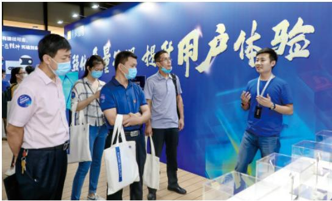

手機質量成果展：2020年，在小米成立十週年之際，手機質量部聯合集團質量委員會和質量監管機構，與北京代表企業聯合舉辦了「手機質量成果展」。我們展示了一塊普通的玻璃如何通過生產工藝進化成手機後蓋，通過近距離體驗硬件品控細節，展示了小米質量人對品質精益求精的追求和實踐。

### 2.4 社會認可

本年度，小米質量管理成果獲得了行業和社會認可，榮獲多個獎項。

<table border=1 style='margin: auto; width: max-content;'><tr><td style='text-align: center;'>獎項名稱</td><td style='text-align: center;'>主辦單位</td></tr><tr><td style='text-align: center;'>質量技術獎二等獎</td><td style='text-align: center;'>中國質量協會</td></tr><tr><td style='text-align: center;'>空氣淨化器企標領跑者</td><td style='text-align: center;'>中國標準化研究院</td></tr><tr><td style='text-align: center;'>2020年企業標準領跑者—空氣淨化器行業領跑者</td><td style='text-align: center;'>國家市場監督管理總局</td></tr><tr><td style='text-align: center;'>2020年企業標準領跑者—淨水器行業領跑者</td><td style='text-align: center;'>國家市場監督管理總局</td></tr><tr><td style='text-align: center;'>2020年「百項團體標準應用示範項目」—智能門鎖智能水平評價技術規範</td><td style='text-align: center;'>中華人民共和國工業和信息化部</td></tr><tr><td style='text-align: center;'>最佳用戶體驗</td><td style='text-align: center;'>印尼客戶中心協會(ICCA)</td></tr></table>

註：以上為2020年度部分獲獎信息。

### 3. 科技創新

小米視技術為立業之本，堅信創新決定小米「飛行的高度」。科技創新是定義小米基因的重要一環，我們的研發工程師和設計人員不斷突破，期望不斷拓寬科技的邊界、進入他人未曾涉足的領域、探求通過科技創新引領產品和行業的變革。我們在操作系統、產品、平台、功能等領域取得卓越創新成果，我們相信精益求精的信念和打破陳規的勇氣是我們不斷獲取和鞏固競爭優勢的來源。

2020全年，小米研發投入約93億元，位列中國公司研發投入金額前20位。憑藉在科技創新領域的傑出貢獻和出色表現，小米連續三年上榜全球創新百強榜，在BCG波士頓諮詢2020年全球創新50強榜單中位列第24位，在EmTech China 2020全球新興科技峰會上成功登上《麻省理工科技評論》「50家最聰明公司」[50 Smartest Companies, TR50]榜單。

Xiaomi

listed as

Top 100 Global Innovator

three years in a row

BCG

BOSTON

CONSULTING

GROUP

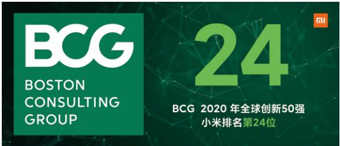

BCG 2020 年全球创新50强

小米排名第24位

### 3.1 技術立業

2019年，小米在集團層面成立技術委員會，從技術戰略、技術人才、技術組織、技術合作和技術文化五大方面帶領公司探索未來技術趨勢。本年度，技術委員會進一步完善架構及職能，設立技術體系

## 環境、社會及管治報告

組、技術合作組和技術文化組，統籌相關部門的工作和規劃，促進系統化、專業化和規範化技術管理。

技術文化

建設一流的技術文化和卓越的工程師文化，提升工程師成就感

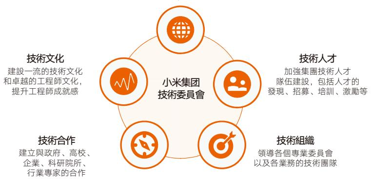

我們重視知識產權佈局，鼓勵專利申請，制定《小米集团公司專利獎勵與報酬管理辦法》，對專利申請人予以豐厚獎勵。本年度，小米在全球範圍內共提交專利申請8,053件，有3,372件專利已獲得授權，共登記各類著作權180餘件。截至2020年底，我們累計持有19,460件專利，其中AI領域專利申請數量是全球互聯網公司最多的之一。

小米2018–2020年專利數量（個）

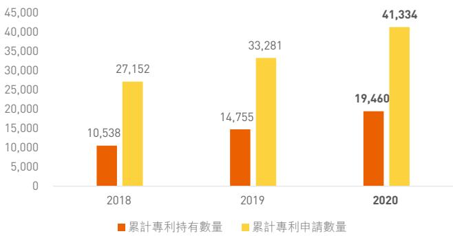

我們通過設立如「百萬美金技術大獎」、「數據挖掘大賽」和「黑客馬拉松」等系列活動，獎勵技術創新，提升小米的技術氛圍。

小米首届黑客馬拉松於2020年10月份啟動，經過48小時的不間斷編程，11個參與部門共產出了24組創意作品。本次大賽貢獻13項專利，為工程師們提供了更多維度實現價值的機會，為公司發掘優秀項目和創意想法提供通道。

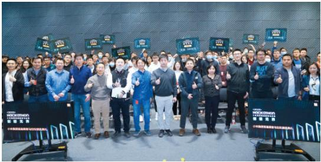

## 環境、社會及管治報告

為了獎勵為小米技術創新做出突出貢獻的精益團隊，我們設立了「百萬美金技術大獎」。本年度，小米為兩個團隊頒發了兩個百萬美金大獎：小米秒充技術團隊和MIUI隱私保護團隊，集團董事長兼CEO雷軍先生親自為其頒獎。

2020小米年度技术大奖——百万美金大奖

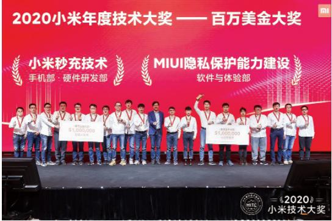

隨著「5G×AIoT」時代的到來，小米積極廣泛參與和引領國內外標準化工作，主導5G終端行業標準討論，以及相關技術領域的標準制定，同時積極開展與大學、科研事業單位的技術合作項目。

關於行業標準化與技術合作更多內容請見7.4產業影響章節。

### 3.2 產品技術創新

小米2020年领先技術及主要創新成果：

<table border=1 style='margin: auto; width: max-content;'><tr><td style='text-align: center;'>小米透明電視</td><td style='text-align: center;'>2020年，在小米十週年發佈會上，小米透明電視首次亮相。該款透明電視去除傳統電視背板，採用全新顯示技術，360°通透明可見，打破空間界限，打造5.7mm極致輕薄且極具未來感的透明屏幕。</td></tr><tr><td style='text-align: center;'>伸縮式大光圈鏡頭技術</td><td style='text-align: center;'>伸縮式大光圈鏡頭技術是小米自主研發的專業影像技術，融入手機拍照功能中，服務廣大手機用戶。伸縮式大光圈鏡頭技術使用超大光圈，進光量提升300%，拍人像、暗光環境都能帶來出眾效果，同時引入全新防抖技術，畫面清晰度提升20%。</td></tr></table>

<table border=1 style='margin: auto; width: max-content;'><tr><td style='text-align: center;'>第三代屏下相機技術</td><td style='text-align: center;'>小米第三代屏下相機採用全新自研像素排布，通過子像素的間隙區域讓屏幕透過光線，無論横向、縱向像素數量全部翻倍，結合小米自研相機優化算法，成像媲美傳統前置相機。</td></tr><tr><td style='text-align: center;'>複眼分佈式相機開放協議</td><td style='text-align: center;'>複眼式分佈相機是一套完整的生態系統，囊括拍攝、視頻聊天、投屏、手機互聯及多攝同開能力，實現手機與IoT設備影像協同和共享，獲取更好畫質、更高分辨率、滿足更多拍攝需求。</td></tr><tr><td style='text-align: center;'>「一指連」UWB技術</td><td style='text-align: center;'>「一指連」UWB技術是具備超精準定位的新一代連接技術。借助UWB超寬帶通信和小米自研天線排列及算法，支持小米UWB技術的手機可以實現對智能設備的定向操控，角度測量精度可達±3°，帶來全新互聯體驗。</td></tr><tr><td style='text-align: center;'>120W有線秒充</td><td style='text-align: center;'>小米是全球首家研發120W秒充技術的公司，也是全球首家量產120W快充產品的公司，充滿4,500mAh手機僅需23分鐘，在硬件架構和充電算法上實現多項重大突破。</td></tr><tr><td style='text-align: center;'>80W無線秒充</td><td style='text-align: center;'>2020年，小米全球首發80W無線秒充，4,000mAh電池8分鐘充電50%，19分鐘充滿，刷新手機無線充電記錄，成為無線充電行業領跑者。</td></tr><tr><td style='text-align: center;'>MiNLP平台3.0</td><td style='text-align: center;'>MiNLP 3.0平台（小米自然語言處理平台）升級至四大功能版塊，在基礎算法、語義解析基礎上新增內容理解、與情分析版塊，基於文本、語音、圖像和視頻等多模態特徵，實現對內容精準理解。</td></tr><tr><td style='text-align: center;'>MACE Micro</td><td style='text-align: center;'>MACE Micro是小米自行研發的移動端深度學習框架，集成大量AI算法，是小米為小規模物聯網(IoT)產品打造的AI引擎。其超低功耗、超低成本的特點助其全面賦能AIoT。</td></tr><tr><td style='text-align: center;'>小米Kaldi</td><td style='text-align: center;'>新一代Kaldi語音識別工具包括核心算法、訓練數據準備、示例脚本集合三部分，本次迭代優化讓開發者更易實現各種語音識別相關算法，各種音頻和文本的元數據的操作更加方便。</td></tr></table>

註：以上為2020年度部分產品及技術成果。

## 環境、社會及管治報告

## 人工智能

作為公司核心戰略儲備技術，小米在人工智能[AI]領域投入巨大，我們探索和研發先進的AI技術，不但為集團關鍵業務做技術輸出，還將AI技術成果開放給社會，讓價值鏈合作夥伴利用AI技術成就業務。

小米AI技術聚焦於研究計算機視覺、聲學、語音、自然語言處理[NLP]、知識圖譜和其他機器學習六大主要領域。經過數年的努力和積累，小米建立了較完整的能力圖譜和小米AI能力平台，在此基礎上打造相關應用，形成強大的智能硬件生態，為AI能力的快速提升建立了基礎。

在搭建和更新人工智能领域基礎框架與工具的同時，智能語音引擎「小愛同學」不斷推進在人工智能領域的迭代升級。「小愛同學」搭載在小米手機、小愛音箱、小米電視等眾多小米設備中，為用戶提供衣食住行全場景智能解決方案，具備超過1,400項技能。截至2020年底，小愛同學激活累計喚醒約495億次。

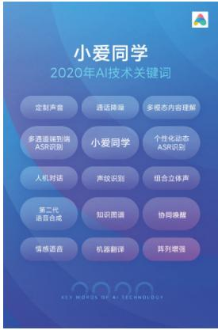

2020年小米發佈「小愛同學」5.0，實現五大升級：

- 全場景智能協同：在多設備環境下智能決策，實現協同喚醒、協同響應、協同提醒；

對話式主動智能：主動學習用戶知識，建立「記憶」，主動對話；

- 定制化情感聲音：通過自適應學習合成定制聲音；

- 多模態融合交互：提供聲音、肢體語言、文字圖片等多模態交互，定義下一代智能產品和人的專屬交互模式；

- 智慧學習好助手：整合海量優質網課資源，打造AI翻譯、AI課程表等功能。

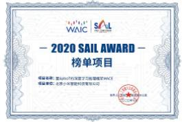

2020年，小米MACE獲得由世界人工智能大會組委會辦公室頒發的SAIL獎「Top30項目榜單」。

## 頂尖設計

在推進技術突破的同時，小米探究將科技創新與設計美學融入產品和包裝之中。秉承合理性、實用性和普遍性的設計理念，小米形成了簡約普遍的自身經典設計風格「Mi Look」。本年度，小米斬獲多項設計大獎。

<table border=1 style='margin: auto; width: max-content;'><tr><td style='text-align: center;'>獲獎主體</td><td style='text-align: center;'>獎項名稱</td></tr><tr><td style='text-align: center;'>小米AX3600</td><td style='text-align: center;'>深圳市消費者委員會、澳門特別行政區政府消費者委員會獲評五星產品</td></tr><tr><td style='text-align: center;'>小米小愛觸屏音箱Pro 8</td><td style='text-align: center;'>紅點設計獎</td></tr><tr><td style='text-align: center;'>Redmi小愛音箱Play</td><td style='text-align: center;'>紅點設計獎</td></tr><tr><td style='text-align: center;'>小米小愛觸屏音箱大屏UI界面設計</td><td style='text-align: center;'>紅點設計獎</td></tr><tr><td style='text-align: center;'>米兔兒童聲波電動牙刷包裝</td><td style='text-align: center;'>紅點設計獎</td></tr><tr><td style='text-align: center;'>小米手錶包裝</td><td style='text-align: center;'>紅點設計獎</td></tr><tr><td style='text-align: center;'>小米藍牙耳機青春版包裝</td><td style='text-align: center;'>紅點設計獎</td></tr><tr><td style='text-align: center;'>小米鐵圈四單元耳機包裝</td><td style='text-align: center;'>Graphis；Design Annual 2021 Competition金獎</td></tr><tr><td style='text-align: center;'>印度系列包裝</td><td style='text-align: center;'>A&#x27; Design Award銀獎</td></tr><tr><td style='text-align: center;'>小米圈鐵四單元耳機包裝</td><td style='text-align: center;'>A&#x27; Design Award金獎</td></tr><tr><td style='text-align: center;'>小米手錶包裝</td><td style='text-align: center;'>A&#x27; Design Award銀獎</td></tr><tr><td style='text-align: center;'>米兔兒童聲波電動牙刷包裝</td><td style='text-align: center;'>Dieline個護類第三名</td></tr><tr><td style='text-align: center;'>米兔兒童聲波電動牙刷包裝</td><td style='text-align: center;'>Pentawards銅獎</td></tr><tr><td style='text-align: center;'>小米圈鐵四單元耳機包裝</td><td style='text-align: center;'>Pentawards銀獎</td></tr><tr><td style='text-align: center;'>小米手錶包裝</td><td style='text-align: center;'>Pentawards銀獎</td></tr><tr><td style='text-align: center;'>「一紙盒」包裝結構設計</td><td style='text-align: center;'>IF設計大獎</td></tr></table>

註：以上為2020年度部分產品及包裝設計獲獎

### 3.3 智能製造

小米在多年與製造業夥伴合作的過程中，積累了寶貴的產業鏈實踐經驗。我們發現可以利用自身的技術優勢、產業資源優勢以及業務形態優勢，打造全自動化產線的智能製造研發基地，從而賦能全產業合作夥伴的智造升級。我們於2019年正式落成投產小米智能工廠，工廠內裝載小米自主研發的智能製造裝備，組成全自動化旗籃手機生產線，總建築面積1.68萬平方米，投資金額達6億元。

智能工廠在自動化建設、機械手升級、自研視覺標定體系搭建等方面取得了卓越的創新與突破，工廠可達到24小時不停產，92%的製造設備來自小米及小米投資企業自主研發，生產效率較行業現有領先水平大幅提升，建成之初自動化率達到63%，經過迭代後產線自動化率會得到進一步提升。

# 環境、社會及管治報告

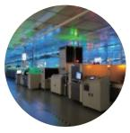

無人化生產方案實現24H黑燈生產

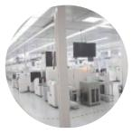

系統級共型生產達成20分鐘機型切換

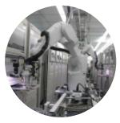

板測系統

業界首創，一鍵標定&換線

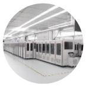

整測系統

業界第一條直線型高柔性全自動測試線

智能生產線四項重大突破

2020年內，小米正式宣佈啟動「星辰行動」，將小米的智能工廠技術中已經得到充分驗證的全套解決方案向製造業夥伴輸出，將小米的成功賦能產業鏈。截至2020年底，小米已經成功帶動產業鏈上下游100餘家公司，初步形成國產製造裝備供給生態集群。

### 4. 以人為本

作為一間以科技創新驅動的公司，小米深知人才是保持活力和競爭力的內在源頭。我們秉承以人為本、「真誠·熱愛」的價值觀念，用充滿競爭力的招聘、僱傭、福利和激勵政策吸引和留住專業人才；我們提倡多元化的工作氛圍，尊重和保護員工權益，為員工打造安全舒適的工作環境和共融的團隊文化；我們相信健康和諧的生活狀態有利於員工的身心健康，尤其鼓勵員工在工作和生活中達到平衡，維持其優秀的工作表現；我們也為有志提升自我的員工提供各類培訓，覆蓋通識、專業及非專業領域，匹配員工與公司的成長路線和需求。

截至2020年12月31日，我們在全球擁有22,074名正式員工。我們承諾為所有員工竭盡全力，激發其歸屬感和使命感，為成為員工心中的「最佳僱主」而不斷努力。

### 4.1 員工權益

## 招聘與僱傭

小米依照「公平、公正、公開」的原则，嚴格遵守《中華人民共和國勞動法》和《中華人民共和國勞動合同法》以及其他運營所在地適用的法律法規與國際懷例。通過制定小米招聘僱傭規章制度，以規範全球範圍的員工招聘、僱傭、薪酬福利、考勤、績效、平等機會、反歧視及員工多元化等方面的管理，杜絕因種族、年齡、性別、婚姻狀況、宗教信仰等不同而給予差異化的待遇。我們重視本地僱傭，在全球許多運營區域，我們均優先考慮僱傭當地人才。截至2020年末，小米員工遍佈世界四個大洲、20個國家和地區，包括中國大陸員工20,418人，海外員工1,656人。

我們制定了《員工手冊》，在幫助員工學習公司制度要求的同時，清楚了解自身可享受的權益保障。我們嚴格遵守《女職工勞動保護特別規定》，保障女性員工的合法權益和身心健康。同時，我們嚴格禁止僱傭童工及強迫勞動，並針對僱傭階段、日常運營和突發情況制定涉及員工全方面的管理和補救措施。

今年我們將招聘專家直接下沉至各業務線，以解決業務在發展過程中無法及時招聘關鍵人才的痛點，大幅提升了招聘的響應速度和效率。同時我們成立了人才策略組，負責集團核心和戰略級崗位的人才引進，以及行業內優秀業務和組織形態的研究工作。我們還不斷拓寬校園招聘渠道、擴大引進高校的範圍，並通過結構化面試，吸納優秀應屆生人才。

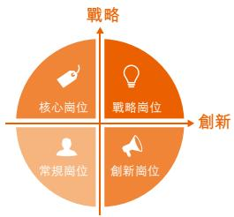

2020年度，我們招聘新入職正式員工7,885人，其中應屆生2,210人。新入職正式員工中，技術類崗位佔比73%。在2020年小米開發者大會上，小米宣佈2021年將在十大領域招募5,000名工程師，超過目前小米員工總數的20%。

按性別劃分的僱員構成

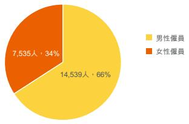

按崗位劃分的僱員構成

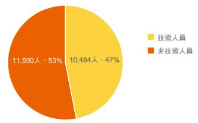

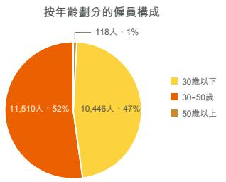

按地區劃分的僱員人數

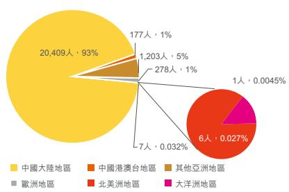

在廣泛吸納人才的同時，我們通過開展各類人才管理項目，發掘、吸引、定位、培養優秀人才，為公司的發展夯實基礎。

## 環境、社會及管治報告

## 小米未來星

我們以全球化視野制定「小米未來星計劃」項目，該項目面向全球高校博士和優秀碩士，以培養小米未來技術精英以及領域專家為目的。入職後以前沿探索性的科學研究與工程實現為己任，助力小米在前沿領域保持領先的行業競爭力。2020年，「小米未來星計劃」共招納29名頂尖人才，其中69%為博士，31%為碩士。

中关村科技园区海淀园管理委员会

博士后科研工作站

POSTDOCTORAL PROGRAMME

北京小米移动软件有限公司

人力资源和社会保障部

全国博士后管委会

二〇一九年九月

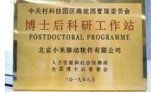

## 博士後科研工作站

為引進、培養高層次創新型優秀人才，我們設立了博士後科研工作站，與清華大學、北京大學、武漢大學等國內高校建立聯合培養機制，吸引人工智能、大數據、通信等相關領域優秀人才加入小米。

2020年，我們在人才僱傭方面的工作收穫了社會的認可。

<table border=1 style='margin: auto; width: max-content;'><tr><td style='text-align: center;'>獎項名稱</td><td style='text-align: center;'>主辦單位</td></tr><tr><td style='text-align: center;'>獵聘2020多元非凡僱主</td><td style='text-align: center;'>獵聘</td></tr><tr><td style='text-align: center;'>中國大學生喜愛僱主</td><td style='text-align: center;'>前程無憂&amp;應屆生求職網</td></tr><tr><td style='text-align: center;'>2020中國人才管理科技典範獎</td><td style='text-align: center;'>北森人才管理研究院</td></tr><tr><td style='text-align: center;'>拉勾2020中國互聯網Top僱主</td><td style='text-align: center;'>拉勾</td></tr><tr><td style='text-align: center;'>「中國力量」2020HR科技創新—全球化進程獎</td><td style='text-align: center;'>CDP集團、中國戰略與管理研究會、聯合國全球契約組織及上海聯合國研究會</td></tr><tr><td style='text-align: center;'>2020中國年度最佳僱主—最受大學生關注僱主</td><td style='text-align: center;'>智聯招聘</td></tr><tr><td style='text-align: center;'>2020中國年度最佳僱主—全國100強</td><td style='text-align: center;'>智聯招聘</td></tr><tr><td style='text-align: center;'>2020年度互聯網行業中國最具吸引力僱主Top3</td><td style='text-align: center;'>優興諮詢</td></tr></table>

## 薪酬與福利

小米始終堅持同工同酬，以「全面薪酬」與「以績效為導向」的薪酬策略，公平地為員工提供有競爭力的薪酬及福利。本年度，我們通過設置「輔助評價者、徵求意見者、主評人」三種角色對員工進行多維度績效評價。同時，我們推行績效申訴機制，為員工提供公開公平的溝通渠道，以保證員工績效評價的公平客觀。對於海外員工，我們實行薪酬標準全球統一，制定並落實《小米集團國際派遣員工稅負平衡政策》，以保證集團外派員工稅務負擔的公平合理。

為激發員工活力，我們積極推行股權激勵機制。2020年，董事會合計授予選定參與者 $ ^{7} $ 137,947,024股獎勵股份，覆蓋4,686人次。

我們在提供員工國家和地區法規規定的社會保險和福利的基礎上，為員工提供一系列公司福利：

提供補充商業保險、年度體檢、生日福利、新婚福利、生育福利、週年紀念和員工關懷等多樣化福利；

- 為外派員工額外提供全球商務差旅保險，包含意外財產損失、醫療、身故、航延、緊急救援等權益，致力全方位保障員工在海外的人身財產安全；

提供員工幫助計劃[Employee Assistance Program, EAP]，通過線上和線下的方式對員工及親屬提供免費、專業的心理諮詢，幫助疏導心理問題。截止2020年底，員工幫助計劃共服務員工1萬餘人次，舉辦線下活動11次。

### 4.2 員工保障

## 健康與安全

小米重視員工健康與安全的保障工作，我們嚴格遵守《中華人民共和國安全生產法》、《中華人民共和國職業病防治法》和《工作場所衛生監督管理規定》以及其他運營所在地適用的法律法規與國際慣例。我們依據ISO45001職業健康與安全管理體系標準，建立各運營區域的健康安全管理體系。本年度，小米科技園及小米香港辦公區獲得了ISO45001職業健康與安全管理體系認證。

## 環境、社會及管治報告

針對安全、消防、設備設施故障相關的重點風險和突發情況，我們制定應對計劃，如《小米項目應急執行手冊》和《物業安全生產隱患排查》，為全面保障員工人身和財產安全提供規範化指導。公司定期對員工進行安全宣導和教育，組織消防安全演習與消防器材實操演練，將安全意識傳遞至每個員工，提高員工處理突發事件的基本技能。同時，公司定期開展安全檢查，針對發現的安全隱患進行整改。

## 員工活動

小米倡導工作與生活的平衡，積極打造幸福暖心職場，為員工創造豐富多彩的業餘活動平台。截至2020年，小米共創立57個員工俱樂部。本年度，我們舉辦了5場集團大型活動和超過300場員工活動，共有超過一萬名員工積極參與。

2020年是小米創立10週年，我們舉辦了小米十週年系列活動，包括直播十週年、小米達人秀、小米家庭日、小米科技園開園週慶典和小米卡丁車競速體驗賽，讓員工和家人一起感受小米的青春與活力。

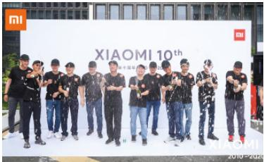

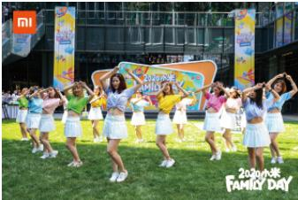

2020年，我們在工作之餘積極組織了不同主題的俱樂部活動，如籃球俱樂部、足球俱樂部和羽毛球俱樂部活動。

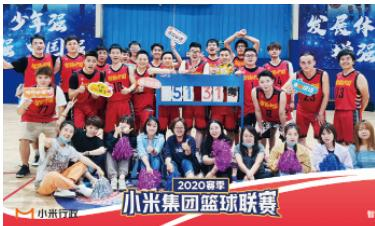

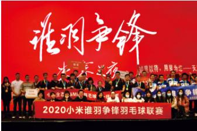

## 員工溝通

為保障員工的真實反饋得到傾聽，小米為員工提供了一系列溝通渠道。同時，我們定期對溝通平台進行滿意度調查，以保障平台及時、準確反饋員工真實意見。

內部在線平台：小米辦公

電話熱線：010-5328-5678

官方郵箱：admin-lz@xiaomi.com

微信官方賬號：小米行政

### 4.3 員工發展

## 員工晉升

小米重視員工發展，期待員工與公司的共同成長。我們以工作表現和績效為考核標準公平決定員工的常規晉升，同時也為作出重大貢獻的員工提供激勵機制和獎勵晉升通道。小米以梯隊建設的形式培養年輕潛力人才，同時搭建後備人才梯隊，以不斷助力提升關鍵人才勝任力，為高潛力人才提供廣闊、開放與透明的晉升路徑，並持續為公司的可持續發展打下堅實的人才基礎。

## 員工培訓

小米重視人才培訓，為全球範圍內的員工提供全方位培訓，包括通識、企業文化、前沿科學技術、管理技能、科學思維方法等不同類型課程，旨在幫助員工提升基本素質、職業素養、專業能力和領導力。

2019年，我們成立了清河大學，目標是打造一所具有小米特色的企業大學。2020年，清河大學繼續秉承「服務集團戰略，提升組織能力，解決業務問題，培養小米人才」的理念，不僅為各部門、各級別員工提供線上線下培訓，還通過構建高效的學習組織，培養員工自主學習的能力和意識。

2020年，清河大學學習平台共上線課程469門、學習項目103個，線上用戶激活25,000餘人。清河大學針對不同學員量身定制培訓計劃，包括針對應屆生的入職培訓計劃，針對管理人員的領導力培訓計劃，針對員工的通用力、專業力培訓計劃等，培訓覆蓋人數總計超過12,000人。

環境、社會及管治報告

<table border=1 style='margin: auto; width: max-content;'><tr><td style='text-align: center;'></td><td style='text-align: center;'>參與人數(人)</td><td style='text-align: center;'>人均時長(小時)</td><td style='text-align: center;'>培訓內容</td></tr><tr><td style='text-align: center;'>「小米辦公」</td><td style='text-align: center;'>12,637</td><td style='text-align: center;'>4</td><td style='text-align: center;'>向全員普及軟件使用技巧，讓小米辦公得到深度應用，提高集團內部辦公效率。</td></tr><tr><td style='text-align: center;'>「環境與健康安全」</td><td style='text-align: center;'>5,273</td><td style='text-align: center;'>0.5</td><td style='text-align: center;'>向全員培訓ISO14001環境管理體系和ISO45001職業健康安全管理體系框架及運行，介紹小米管理方針、組織架構以及目標。</td></tr><tr><td style='text-align: center;'>「領導力」</td><td style='text-align: center;'>2,940</td><td style='text-align: center;'>20</td><td style='text-align: center;'>項目承載清河大學提升組織能力的使命，從而成為小米核心幹部成長的搖籃。</td></tr><tr><td style='text-align: center;'>「應屆生培訓計劃」</td><td style='text-align: center;'>2,198</td><td style='text-align: center;'>40</td><td style='text-align: center;'>為新入職應屆生提供職業化培訓，幫助其掌握職場必備軟、硬技能，完成校園人到職場人的快速轉身。</td></tr><tr><td style='text-align: center;'>「導師面試官」</td><td style='text-align: center;'>1,887</td><td style='text-align: center;'>2</td><td style='text-align: center;'>為新入職員工匹配導師，幫助新員工快速融入並上手工作，賦能導師，提升其輔導能力。</td></tr><tr><td style='text-align: center;'>「店長項目」</td><td style='text-align: center;'>1,485</td><td style='text-align: center;'>24</td><td style='text-align: center;'>面向中國區小米之家，研究店長科學培養路徑，縮短店長成長週期。</td></tr><tr><td style='text-align: center;'>「星火公開課」</td><td style='text-align: center;'>1,264</td><td style='text-align: center;'>5</td><td style='text-align: center;'>通過經理開門8件事課程，應時應景助力各層級團隊管理者。</td></tr><tr><td style='text-align: center;'>「星火計劃」</td><td style='text-align: center;'>908</td><td style='text-align: center;'>43</td><td style='text-align: center;'>從角色定位、目標達成、團隊管理、打造團隊四個方向幫助新任經理提高崗位勝任能力。</td></tr><tr><td style='text-align: center;'>「財金項目」</td><td style='text-align: center;'>618</td><td style='text-align: center;'>43.4</td><td style='text-align: center;'>為現有部分財務同學專業賦能，提供職業發展所必需的專業技能，滿足集團對財務各層級人才專業化需求。</td></tr><tr><td style='text-align: center;'>「內訓師」</td><td style='text-align: center;'>484</td><td style='text-align: center;'>12.5</td><td style='text-align: center;'>配合集團戰略，搭建內訓師和分享者團隊，並引入外部優秀講師，提升內訓師授課能力。</td></tr></table>

<table border=1 style='margin: auto; width: max-content;'><tr><td style='text-align: center;'></td><td style='text-align: center;'>參與人數（人）</td><td style='text-align: center;'>人均時長（小時）</td><td style='text-align: center;'>培訓內容</td></tr><tr><td style='text-align: center;'>「管理分享會」</td><td style='text-align: center;'>404</td><td style='text-align: center;'>1.5</td><td style='text-align: center;'>帶領幹部開視野、學經驗、長知識，通過學習經典案例汲取經驗。</td></tr><tr><td style='text-align: center;'>「火炬計劃」</td><td style='text-align: center;'>275</td><td style='text-align: center;'>68</td><td style='text-align: center;'>以組織部能力要求為切入點，根據能力調研分析結果，設計以行動學習為核心以幫助中層管理者問題分析與解決為目標的課程。</td></tr><tr><td style='text-align: center;'>「專業力POM」</td><td style='text-align: center;'>67</td><td style='text-align: center;'>59.5</td><td style='text-align: center;'>以產品運營經理典型工作任務為基礎而開發的9門核心課程，包含《承接戰略需求與洞察》，《新品上市籌備》與《定價策略》等。</td></tr><tr><td style='text-align: center;'>「燃計劃」</td><td style='text-align: center;'>62</td><td style='text-align: center;'>106</td><td style='text-align: center;'>針對公司戰略需要和幹部能力現狀進行定向突破提升，讓出色管理者脫穎而出，培養和選拔業務領軍人。</td></tr></table>

## 社會認可

2020年，我們對於員工的培養獲得社會各界的廣泛認可。

<table border=1 style='margin: auto; width: max-content;'><tr><td style='text-align: center;'>獎項名稱</td><td style='text-align: center;'>主辦單位</td></tr><tr><td style='text-align: center;'>2020-2021(第十二屆)中國人才發展菁英獎最佳學習項目—星火計劃</td><td style='text-align: center;'>《培訓》雜誌</td></tr><tr><td style='text-align: center;'>2020年全國企業學習項目設計銀獎—火炬計劃</td><td style='text-align: center;'>CSTD第五屆全國學習設計大賽</td></tr><tr><td style='text-align: center;'>2020中國人才管理科技典範獎</td><td style='text-align: center;'>北森人才管理研究院</td></tr><tr><td style='text-align: center;'>2020年清河經管學院共啟未來潛力獎</td><td style='text-align: center;'>清華經管學院高管教育中心</td></tr><tr><td style='text-align: center;'>2020博奧獎(優秀產品思維應用獎)</td><td style='text-align: center;'>在線教育資訊網</td></tr></table>

## 環境、社會及管治報告

### 5. 用戶至上

小米相信用戶是成功的關鍵，獨具特色的用戶運營策略讓小米品牌在國內外市場享有聲譽。我們的願景是「和用戶交朋友，做用戶心中最酷的公司」。對於我們而言，用戶並非上帝，用戶應是朋友，我們一起學習、一起成長。

從成立之初，小米便將用戶需求放在首位、打造獨有的用戶參與感文化。本年度，我們從過往的服務經驗中總結與提煉，將設立在各個業務部門中的服務團隊整合為集團服務體驗部，聚集專業的人才，希望為用戶帶來更佳的服務體驗。我們還通過更新MIUI人性化功能、升級線上線下服務體驗、積極組織米粉互動等活動，拉近與用戶的距離。

### 5.1 用戶服務

## 客服中心

小米客服中心提供熱線、在線、微博、微信等全渠道、7×24小時不間斷的用戶服務。接收用戶反饋後，客服統一進行分配、處理、跟進和分析。根據不同渠道的用戶需求差異，我們按渠道類型劃分客服團隊，確保快速準確處理客戶問題。小米從服務應答率、質檢通過率、用戶滿意度等多維度進行全面考核，設置相應獎勵機制，同時及時將客戶意見反饋至相關業務線及部門，督促內部流程、服務、管理的優化，確保客戶服務質量和滿意度。

客服熱線：400-100-5678

客服網址：https://www.mi.com/service/contact

2020年，小米客服團隊從人工智能輔助、服務體系協同改善、高端品牌專屬服務等三方面提升客戶服務質量。小米利用人工智能技術進一步升級自助答疑、智能知識匹配等智能輔助工具的能力。客服部與互聯網業務、物流、售後、銷售等部門聯合開展多個專項，如簡化用戶訂單地址修改流程、優化影視會員服務流程等。同時也針對中高端用戶提供專屬服務，以滿足不同用戶群體對服務的需求。本年度，小米的客服熱線評價滿意度達到97.25%，在線滿意度達90.61%。

小米主營產品品類豐富、數量繁多，為了幫助用戶快速找到產品對應的客服，小米客服團隊基於人工智能語音識別功能打造智能IVR系統，用戶通過語音描述產品名稱即可智能分配至該產品的客服人員，目前分配準確率已達90%以上，極大提升了服務效率。

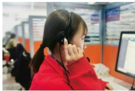

本年度，我們為Redmi智能電視MAX98配備了一對一專屬服務，包括前期溝通，專業勘測、後續送裝一體化等全流程專業化服務，讓用戶更省心、更安心。同時我們為相關員工提供針對性培訓，全程跟進用戶直至滿意安裝。2020年全年針對本服務項目，用戶滿意度達98.5%以上。

## 售後服務

售後是客戶服務的重要環節，我們針對不同售後需求提供多樣化售後服務模式，同時擴大售後維修中心覆蓋地區，為用戶創造方便。

- 到店服務：我們在全國擁有656家維修中心，覆蓋23個省、5個自治區、4個直轄市，較2019年增加136家店，覆蓋比例提升26%；

- 寄修服務：我們建立了18家寄修中心，產品故障時，用戶可通過指定寄修渠道，將產品郵寄至小米服務中心，服務中心完成維修或者換貨後再寄回給用戶，對於保修期內因質量問題需要使用寄修服務時，用戶無需承擔任何費用；

- 到家服務：我們在全國共有1,553家門店提供上門維修服務，較2019年增加553家，覆蓋比例提升55%。

2020年，我們在改善售後時效性方面推出兩項快速響應活動，縮短售後服務流程的響應時間，並以此作為售後團隊考核標準。「1小時快修」針對在小米商城進行到店預約服務的客戶，按約定時間到達門店後，服務人員將在1小時內完成預約產品的維修；「2小時響應」則對應到家服務用戶，在與小米客服聯繫並報修後2小時內，有專人與用戶聯繫，預約到家服務的時間，為米粉提供有溫度、有速度的售後服務保障。

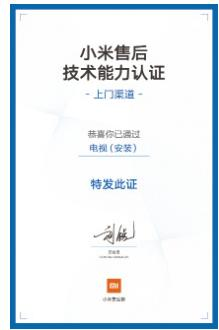

小米要求售後人員只有通過對應品類及業務的考試並獲得認證後，才能向用戶提供售後服務。2020年，小米售後團隊在全國完成搭建25家培訓基地，通過建設培訓基地，我們實現了售後人員100%認證。本年度小米舉行了共計超過300場線上線下售後培訓活動，培訓人次達一萬人以上。

## 環境、社會及管治報告

## 小米之家

小米之家是集「品牌+新零售+服務+人才培養」功能為一體的小米官方零售體驗店。店內可以看到幾乎所有新款產品，單店平均陳列產品品類達300個以上，供每位到店客戶體驗及選購。為了提升客戶進店體驗，小米之家用貼近用戶習慣的產品組合，打造充滿科技感的智能場景。

本年度，小米之家對服務及門店品牌形象進行了升級。門店推行7天無理由退貨，是3C（電腦、通訊、消費電子）行業線下門店的重大突破和嘗試。門店還推出代客售後、免費貼膜等多項增值服務，從細節打造一流門店體驗。

截至2020年12月31日，小米之家在中國大陸覆蓋28個省，267個市。未來小米之家會覆蓋更多地區，努力實現「讓每個縣城都有小米之家，讓每個米粉身邊都有小米之家」。

## 社會認可

小米憑藉其出色的客戶服務贏得了用戶和業界的廣泛認可。

<table border=1 style='margin: auto; width: max-content;'><tr><td style='text-align: center;'>比賽名稱</td><td style='text-align: center;'>獎項名稱</td></tr><tr><td style='text-align: center;'>2020年度「金耳麥杯」中國最佳客戶中心</td><td style='text-align: center;'>創新管理客戶中心榮譽稱號</td></tr><tr><td style='text-align: center;'>2020年度中國客戶聯絡中心</td><td style='text-align: center;'>「卓越服務獎」榮譽稱號</td></tr><tr><td style='text-align: center;'>2020年度「金耳麥杯」中國最佳客戶中心</td><td style='text-align: center;'>卓越智能應用獎</td></tr><tr><td style='text-align: center;'>中國電子商會年度十佳呼叫中心</td><td style='text-align: center;'>「卓越客戶體驗獎」</td></tr></table>

### 5.2 體驗升級

伴隨互聯網環境的發展和業務生態的擴大，我們的用戶量每年迅速增長，如何真正「與用戶做朋友」成為了不斷驅動小米突破服務邊界的動力。我們並不止步於對用戶的基礎服務，我們追求提升各個業務環節的用戶體驗。2020年，我們將現有業務中客戶服務、售後服務、物流中服務體驗功能合併，成立了「服務體驗部」，深度跟蹤行業變動及拓展服務創新、開展服務活動策劃與宣傳，以及持續監控和提升服務體系整體質量結果和表現。同時，我們將用戶體驗反饋納入服務體系下各部門的業績考核指標，以更加精细化的管理方式全方位推動體驗升級。

我們力求站在用戶視角審視小米服務，從體驗感知完善服務流程和細節。在內部我們通過論壇留言、客服渠道、用戶調研等渠道收集用戶反饋，舉辦研討會識別用戶體驗提升的方向，進而制定專項開展針對性改進；我們通過策劃和舉辦多樣化的服務體驗活動，面對面地獲取和了解用戶感受，從而更加深入地發現用戶體驗的改善空間。

2020年，疫情當頭，我們在充分準備且安全防疫的前提下，依然舉辦了「安心服務月」活動，為用戶提供了大家電免費清潔服務、手機消毒貼膜等服務，共完成了消毒貼膜服務208,442單。

我們還推出49元換電池的活動，為23款機型提供半價電池的購買和安裝，幫用戶用較低的成本大幅延長了現有手機的生命週期，一舉兩得。活動獲得用戶熱烈的反響和需求，我們將原定活動期限延長三個月，以滿足更多用戶需求，合計提供換電池服務230,380單。

我們在服務體系中重點打造了「米粉體驗官」項目，從用戶角度出發，了解用戶真實需求。2020年10月，我們舉辦第一期活動，圍繞大家電產品，在小米社區公開招募米粉體驗官，積極收集來自米粉服務體驗過程中的問題，以幫助不斷改善小米在服務方面的各種瑕疵，為米粉提供更好的服務。2020年，合計3,740名米粉參與了全流程服務體驗。

1. 酷意井热要小东：

2. 厚景提出宝商建仪：

3. 2020年10月21B-2020年11月18日期间在小米高端有购买手机、小米大家电产品（电视、空调、冰箱、洗衣机等）的计转或销售后需求：

3. 2020年10月21B-2020年11月18日期间在小米高端有购买手机、小米大家电产品（电视、空调、冰箱、洗衣机等）的计转或销售后需求：

洗新是我们要寻找的未来和绝密吧！

## 環境、社會及管治報告

我們發現不少老人因為子女不在身邊或沒有其他渠道支持，在面對智能手機時束手無策。未解決老年用戶的問題，2020年感恩節期間，我們開展以「讓父母手中並不智能的手機智能起來」主題活動，讓店員為老人面對面解答手機使用的疑惑和問題。

我們還推出《給爸媽的智能手機小畫冊》，在小米商城上線6,000本、線下門店印刷了3萬餘本，通過登記申請、到店領取的方式，以實物免費贈與老年人。「小米服務」公眾號也上線了畫冊電子版，方便有需要的用戶查看。2020年11月，我們根據用戶反饋更新了《給爸媽的智能手機小畫冊第二版》。截至2020年底，電子版「小畫冊」在線查看量達220多萬。

### 5.3 米粉融合

小米是一家少見的擁有粉絲文化的高科技公司。對小米而言，米粉是小米生存發展最重要的基石，這一點始終未變。小米熱衷打造獨有的「米粉文化」，激發用戶參與感。我們建立了包括小米社區等多種與米粉溝通的渠道，把做產品、做服務、做品牌與做銷售的過程開放，建立與用戶共同成長的品牌。自2010年小米成立以來，「米粉」已適佈世界各個角落，小米採用「總部賦能，區域落地」戰略，由總部給予區域經驗及技術指導，將米粉運營的成功案例在全球範圍內推廣。

## 深度參與

我們重視用戶意見和反饋，通過開發內測機制和提案處理機制，舉辦多場線上線下用戶交流活動，邀請米粉深度參與小米產品開發，讓用戶體驗參與產品與功能迭代的樂趣。

小米社區作為小米官方米粉大本營，是小米各業務維護自己的核心粉絲和獲取用戶反饋的主要陣地。為了更好地為米粉服務，在2019年小米將MIUI論壇和小米社區合併，成立新小米社區，為米粉提供官方資訊、產品圈子、內測反饋、福利兌換、米粉互動等多個功能。截至2020年底，小米社區的累計用戶達1.2億，月活躍用戶超2,000萬，社區內容閱讀量超3.65億，擁有300多個不同領域的社區群。

## 小米社区

合并MIUI论坛和原小米社区，全新上线，更好地和用户交朋友

小米社區用戶日均發帖量超過2萬，為實現高效的反饋處理，小米設計了提案機制，用戶組將客戶反饋的相似問題進行整合，形成提案，官方處理完畢後可將處理結果一鍵通知所有提案參與者。2020年，小米社區用戶發佈了超過200萬條建議反饋帖，參與反饋人次超過4,000萬。

2020年，小米社區打造了全新的內測平台，提供從內測項目建立、內測用戶篩選、反饋收集和高效處理到功能宣傳推廣的一站式管理，開展了包含系統內測和軟件APP內測等100多個項目，吸引了400多萬用戶報名參與，為本年度MIUI12和MIUI12.5成功發佈提供了重要意見和支持。

2020年4月MIUI12發佈後，超過1,000名用戶發帖提議對橫屏模式下的通知欄顯示進行優化，提議在小米社區形成提案，吸引超過14.5萬人參與投票，社區官方收到反饋意見後立即採納用戶建議，協同產品部門優化橫屏模式下通知欄顯示，收穫了大量用戶好評。

小米定期邀請小米各部門業務負責人和用戶交流，傾聽用戶聲音。2020年度共舉辦12場「內部吐槽會」、45場「微博MIUI負責人在線」活動，共計87位業務負責人參加。

## 環境、社會及管治報告

2020年9月，小米舉辦了一系列「負責人在線」活動，邀請互聯網各部門、手機部、電視部、筆記本、服務部等多個部門的87位經理和業務負責人參與，與超過20萬用戶直接溝通交流，微博話題閱讀量累計超過2.6億，幫助小米深度了解客戶需求，獲取產品改進靈感。

## 與米粉同行

小米是一家年輕並極具創造力的公司，我們擁有大量活躍在社區的年輕米粉，我們希望通過多樣有趣的活動充分號召年輕米粉的熱情與創造力，將可持續發展理念與社區共建融入米粉活動中，傳遞真誠與熱愛。2020年，我們在全球開展了「Mi Fan Story米粉故事」，「Mi Renovation夢想改造家」、「Mi Explorers探索者活動」、「ShotByMi攝影大賽」、沿海垃圾清理等一系列豐富多樣的米粉活動，吸引了全球米粉的熱情參與。

米粉故事：Mi Fan Story是一系列由小米國際社區拍攝的紀錄片，通過記錄米粉的真實故事以及他們對於真誠與熱愛的踐行，傳遞小米的品牌精神。第一期米粉故事在巴基斯坦拍攝，記錄了一對米粉兄弟從偏遠的山區走出，堅持自己鍾愛的事業並最終改變了家庭命運的故事。未來國際社區還將持續記錄全球米粉的故事。

Mi Renovation：聚焦於有居住痛點的米粉家庭，小米邀請專業家裝設計師，從生活的需求出發，使用小米全套AIoT產品，與Mi Home App連接操控，打造實用、智能的「夢想改造家」。目前，項目第一輪已於俄羅斯、德國、泰國落地，未來Mi Renovation還會在越南、法國、墨西哥等更多國家展開，為更多國家的米粉家庭實現美好家居的夢想。

Your Vision, Your Story

ShotByMi 2020

Open for Entries

ShotByMi：由全球小米社區主辦的全球攝影比賽，所有米粉都可以通過上傳與該主題匹配的小米手機拍攝照片參與。活動自2019年起辦已經收到超過21萬作品投稿，覆蓋人群超過170個國家。

Mi Explorer：2020年全新改版，邀請米粉用小米產品探索世界，產出高質量作品，並在社區、社交媒體等平台推廣傳播。截至2020年底，國際小米社區已經成功舉辦過超過20次的探索者活動，報名者來自全球超過120個國家地區，累計報名人數超過5萬人，選拔出300多名探索者，為小米產品產出優質原創內容超過800篇。

環境、社會及管治報告

Mi Pop 24 New Year：在2020年至2021年跨年之際，小米聯合來自全球24個時區的米粉進行了一場跟隨當地時間跨年的世紀狂歡，通過線上直播與粉絲連線完成的24次倒計時跨年，小米為米粉送上最具創意的新年祝福活動，這也是小米首次連線全球米粉共度新年。

### 6. 商業道德

小米秉承合規、誠信經營的原則，遵守相關地區所有適用的法律法規，同時按照最高的商業道德標準開展業務。我們要求員工恪守商業道德，主動維護良性的市場競爭秩序，引領公平、透明的營商生態。我們攜手利益相關方，接受社會監督，並承諾以專業團隊的素養、出色的產品及服務和良好的商業道德聲譽贏得商業機會。

集團運營層面，在全球重點市場和區域建立合規風險手冊，為合規運營提供系統指導；產品層面，小米將合規的考量融入產品的全生命週期，確保從設計研發、出廠檢測、銷售及展出至產品售後的各個階段均符合相關法律法規要求；員工層面，我們要求全體員工均簽署並遵守《員工手冊》及《小米集團員工行為準則》，並明確要求全球員工在商業活動中恪守正直、誠信、遵紀守法三大重要原則和並根據條例約束自身行為。

作為產業內核心企業，小米深刻理解自身在商業道德應承擔的責任，並不斷將自身的商業道德實踐推廣至全價值鏈。我們通過搭建覆蓋公司運營和價值鏈上下游的合規管理體系，匹配全球各運營地高速增長的合規管理需求，積極回應社會對小米商業道德的關注。

### 6.1 隱私保護與信息安全

小米一直將用戶的信息安全和隱私保護視為我們的生存之本。我們不斷完善隱私保護與信息安全管理體系，通過制度完善和人員監督，保障體系的穩定運行。2020年，小米隱私品牌正式發佈，我們秉承企業責任、用戶可控、公開透明、安全保障、法律合規五大隱私保護原則，運用到旗下各產品和服務，用心守護信息和隱私安全。小米的隱私保護與信息安全管理達到行業領先水平。

小米嚴格遵守《中華人民共和國網絡安全法》、《全國人大常委會關於維護互聯網安全的決定》和《全國人民代表大會常務委員會關於加強網絡信息保護的決定》等相關法律法規及專項文件要求。在海外市場，小米嚴格遵守歐盟《通用數據保護條例》GDPR、美國《隱私權法》、日本《個人信息保護法》等法律法規，持續識別各國家和地區相關政策，確保隱私安全的合規性。

## 管理體系

小米在集團層面建立信息安全與隱私委員會，統籌集團安全與隱私管理，建立安全與隱私指標測量機制。委員會下轄上百名業務安全與隱私專員和十多名專業的隱私律師，為小米的信息安全與隱私保護保駕護航。我們組建信息安全與隱私部、手機系統安全部和安全辦公室，從人力和組織方面夯實信息安全與隱私保護的基石。

為了確保小米滿足各地對信息安全和隱私保護的要求，我們開展了全球隱私法律調研。截止2020年，我們已識別了全球82個國家和地區的隱私合規政策，形成合規政策數據庫，對於數據的收集、儲存、使用、共享進行審慎嚴格的風險評估和生命週期管理，確保數據的管理和使用符合相關國家或地區的法律法規。

我們在全球六個國家建立了數據中心，進一步保證用戶數據安全與合規管控。2020年，小米針對出口歐盟的全部產品開展了系統性的梳理和測評，加強了出口歐盟產品的數據隱私安全防護。

有效保護信息安全與隱私的標準依賴於完善的管理制度。本年度，小米共修訂信息安全與隱私保護管理體系文件36份，制定了《安全與隱私漏洞管理流程》、《第三方系統或服務安全評估流程》、《移動應用安全測試流程》、《服務端安全測試要求》和《智能硬件設備安全測試要求》等流程和指引文件，指導安全評估與測試。

小米不但在業務各環節提出信息安全和隱私保護的要求，還開發了一系列工具確保要求得以滿足。我們建立了隱私合規申報平台和隱私合規檢測平台，以確保業務在多項常見隱私合規場景下滿足要求；我們通過智能硬件產品安全測試率、安全與隱私漏洞按時修復率等16項信息安全與隱私保護重點指標，對相關業務部門信息安全與隱私管理進程進行整體管控；我們還針對各業務部門制定了信息安全與隱私管理積分制度，形成量化考核指標，有效敦促各部門在信息安全與隱私保護方面的提升。

繼2019年獲得ISO/IEC27001、ISO/IEC27018和ISO/IEC29151三項ISO信息安全與隱私保護認證後，2020年，小米通過了ISO27001信息安全管理要求的監督審核以及ISO27701隱私信息管理體系認證。

小米的隱私政策和隱私實踐均符合全球領先的數據隱私管理公司TrustArc企業隱私與數據治理實踐評估標準，被授予TrustArc認證的隱私印章。

小米隱私官方網站：https://privacy.miui.com

## 環境、社會及管治報告

## 系統防護

本年度MIUI操作系統的升級開發圍繞著安全和易用展開。軟件、硬件和服務在手機上的相互協作大幅度提升信息安全和隱私保護的各項功能，為用戶提供端到端的安全保護。

## 應用合規

今年我們加強了對App信息安全的審核。作為用戶獲取App的重要途徑，小米應用商店在App上架前開展病毒掃描、隱私檢測和兼容性測試，上架前經過人工核驗。2020年，App因隱私協議不合格不合規而被拒絕上架的次數達50萬次。小米自動化隱私檢測平台針對App對用戶信息的收集和權限索取進行檢測，防止相關違規行為，截止2020年12月31日，已累計開展上千款App的檢測工作。

2020年4月27日，小米正式發佈全新MIUI12操作系統。這套系統在安全隱私技術上迎來重大突破，行業首創照明彈、攔截網、隱匿面具三大隱私功能，規範應用功能的同時滿足用戶隱私信息保護需求，系統通過了TUV萊茵安卓系統增強隱私保護測試。

照明彈功能能夠記錄App的敏感行為並推送相關提示信息，用戶可進行管控；

攔截網功能實現後台使用相機、後台喚醒的完全禁止，用戶可以進行相關設置，擦除分享照片中的敏感信息，防止用戶隱私泄露；

- 隱匿面具功能為用戶提供空白通行證，僅給App提供虛擬用戶身份信息，降低用戶授權風險，保護用戶個人信息。

## 隱私面單

隨著小米電商業務的發展，我們關注電商物流端的用戶隱私保護工作。我們推出小米電商快遞隱私面單功能，中小件類商品快遞面單客戶電話信息進行部分隱藏，大家電類商品快遞面單採用「虛擬+微笑」面單且全流程使用虛擬電話聯繫用戶，有效防止用戶信息泄露。隱私面單功能每季度覆蓋的小米電商訂單數超過1,300萬單。

## 培訓交流

我們鼓勵隱私漏洞發現行為，為集團員工提供安全與隱私意識和技能的宣貫。我們還增進隱私保護的同業交流，努力營造隱私安全生態環境。

• 信息安全與隱私保護意識培訓覆蓋率達84%；

• 安全技術培訓31場，覆蓋1,100餘人次；

IoT安全培訓16場，覆蓋300餘人次；

• 信息安全與隱私專員訓練營4場，覆蓋179人。

2020年，我們面向全行業舉辦了首屆安全與隱私宣傳月活動，通過小米科技園主題活動週、信息安全線下講座週、隱私保護線上講座月、在線知識競賽與答題、CTF黑客世界杯和專項訓練營六大主題活動，在提升全員安全隱私保護意識的同時，提升行業及互聯網用戶對信息安全和隱私保護的認識。

我們持續推動行業發展，與各行業領軍合作企業成立「聯合藍軍計劃」，首創企業間藍軍合作形式，打通競爭壁壘，創造行業共贏。通過網絡安全實戰演習檢驗產品弱點，促進了行業安全能力建設。

環境、社會及管治報告

小米安全中心設有國內漏洞報告平台，同時，我們與海外漏洞懸賞平台（HackerOne）合作，啟動最高獎勵100萬人民幣的漏洞懸賞計劃，成為國內首家推出隱私漏洞懸賞計劃的公司。我們邀請專業人士個人參與到信息安全與隱私保護行動中，助力小米各產品的安全與隱私維護工作。

小米積極參與信息安全與隱私保護行業活動，2020年總計在31場活動中進行公開演講，分享和交流成熟經驗和實踐，助力安全生態建設。

<table border=1 style='margin: auto; width: max-content;'><tr><td style='text-align: center;'>會議名稱</td><td style='text-align: center;'>演講題目</td></tr><tr><td style='text-align: center;'>WISE2020新經濟之王大會</td><td style='text-align: center;'>「打造‘手機x AIoT’安全與隱私生態」</td></tr><tr><td style='text-align: center;'>ISC2020第八屆互聯網安全大會</td><td style='text-align: center;'>CXO觀點：實用密碼學—共建網絡安全大生態</td></tr><tr><td style='text-align: center;'>2020中國軟件研發管理行業技術峰會</td><td style='text-align: center;'>「物聯網安全風控系統的智能化與平台化」</td></tr><tr><td style='text-align: center;'>「數據互聯互通與安全發展」高峰論壇</td><td style='text-align: center;'>「跨國企業的安全合規實踐」</td></tr></table>

## 獲獎及認可

2020年，小米獲得多個隱私保護類獎項，收穫社會及行業認可。

<table border=1 style='margin: auto; width: max-content;'><tr><td style='text-align: center;'>比賽名稱／頒發機構</td><td style='text-align: center;'>獎項名稱</td></tr><tr><td style='text-align: center;'>2020 KCTF春季賽(防守篇)</td><td style='text-align: center;'>二等獎</td></tr><tr><td style='text-align: center;'>GeekPwn 2020國際安全極客大賽</td><td style='text-align: center;'>新基建安全大賽優勝獎</td></tr><tr><td style='text-align: center;'>2020補天杯破解大賽</td><td style='text-align: center;'>工業起重機遙控器破解三等獎</td></tr><tr><td style='text-align: center;'>「天府杯」國際網絡安全大賽</td><td style='text-align: center;'>最佳漏洞複現獎</td></tr><tr><td style='text-align: center;'>2019年度中國計算機用戶協會數據中心分會</td><td style='text-align: center;'>數據中心實施樣板項目(海淀園區機房)</td></tr><tr><td style='text-align: center;'>2020年網絡數據安全合規性評估</td><td style='text-align: center;'>優秀案例</td></tr><tr><td style='text-align: center;'>2020年全國網絡與信息安全管理職業技能大賽</td><td style='text-align: center;'>信息安全管理員三等獎</td></tr></table>

### 6.2 廣告合規

小米嚴格遵守《中華人民共和國廣告法》、《廣告管理條例》和《互聯網廣告管理暫行辦法》以及其他運營所在地適用的法律法規與國際慣例。同時我們制定了《客戶資質信息審核標準文件》、《廣告素材審核標準文件》等集團內廣告管理規章制度。集團法務部、公共關係部、公共事務部、質量委員會及各業務部門聯合開展廣告合規管理工作，對小米各項產品和服務的廣告內容與質量、廣告投放方資質等嚴格把控。同時，我們建立了廣告投訴處理流程，各部門針對相關投訴及時調查和反饋，不斷提升廣告管理水平。

我們在集團和部門層面積極開展廣告審核能力建設和廣告合規意識培訓活動，通過週會、月會等形式，及時更新和交流最新廣告政策和標準變化，排查和防範相關風險，不斷提升廣告審核團隊的業務能力。

### 6.3 知識產權保護

作為市場的創新者，我們尊重和維護創新成果。我們穩固知識產權管理體系，加強知識產權保護工作，維護透明、開放與公平的商業環境和市場秩序。

小米嚴格遵守《中華人民共和國專利法》、《中華人民共和國著作權法》、《中華人民共和國商標法》和《中華人民共和國反不正當競爭法》以及其他運營所在地所適用的法律法規，對內制定《企業知識產權管理規範》、《小米集团公司專利獎勵與報酬管理辦法》和《小米集团品牌使用和管理制度》等規章制度，不斷完善自身知識產權管理體系。法務部統籌集團知識產權管理工作，各主要業務部門設立知識產權專員，保障相關工作的有效落地。我們建立了知識產權風險防範機制，從產品立項、上市、流通等全流程排查和防控知識產權侵權風險。

在保護自身知識產權的同時，小米充分尊重第三方知識產權，並防止侵犯他人知識產權。在過去幾年，我們與高通、諾基亞、NTT DoCoMo等公司簽署了多個重要的交叉許可協議，與合作方共同持續發展。在與供應商、高校、科研院所的商業合作中，我們在協議中明確知識產權權益歸屬，保障各方知識產權權益不受侵犯。我們主動排查新市場的知識產權風險，保證新產品和技術的合規上線。小米積極參與國內外技術標準聯盟，遵守專利等知識產權政策和章程，保證專利使用合法合規。

我們開展知識產權保護相關培訓。本年度，針對品牌使用與保護、專利基礎知識、專利風險等開展各類培訓活動70餘場，參與人數超過1,700人。

## 專利保護

小米建立專利預警機制，跟蹤和分析行業技術和產品發展趨勢，增強專利糾紛應對能力和保護意識。我們分別針對版權與專利建立了被侵權後續處理流程，從侵權信息搜集、證據留存，到採取相應維權措施，明確各環節工作，有效保障小米自身知識產權權益。

我們積極運用國際知識產權制度護航業務，在國際外觀設計體系（海牙體系）註冊成果方面，小米以516項外觀設計註冊成果，作為首家中國企業躋身前五名申請人之列，體現了小米的設計創新實力。

## 環境、社會及管治報告

小米獲得2020年度北京市知識產權示範單位、2020年度首都知識產權國際交流合作基地、CPCC十大著作權人合作夥伴等稱號。

小米知識產權保護平台：https://www.mi.com/intellectual

## 商標及品牌權益

小米從商標合規使用、商標確權、商標維權三個維度防止侵犯小米品牌和商標的行為發生。

• 商標合規使用：我們在全球範圍內建立了商標品名排查機制，規避商標被訴侵權風險；

商標確權：我們建立了商標申請佈局體系，在全球進行前瞻性、分層級地商標佈局，同時我們建立了完善的商標監控體系，制定了爭議解決策略，監控並對第三方搶註公司商標的行為採取必要行動；

商標維權：我們建立了完善的打假維權體系，對第三方線上線下銷售的產品進行監控。

小米對假冒偽劣產品堅持零容忍態度，與各大電子商務平台合作，採取立體化的打假模式，包括個案快速處理、預警式主動篩查、線下專項行動等，共同維護品牌權益。我們參與海關專項行動，防控假貨進出口。針對第三方銷售的產品，我們建立全球打假維權體系實施監控，打擊侵權行為。我們開展線下打假維權，通過各渠道如代理公司、店舖等開展維權工作，積極參與行業打假交流。2020年，我們協助相關機構處理行政及刑事打假案涉案價值約合人民幣3,256萬。我們開展線上品牌管控維權，建立投訴機制，嚴格監控各大電商平台，2020年共刪除線上侵權鏈接共271,330條。

### 6.4 反貪腐

我們對於貪腐行為秉承零容忍的態度。在中國我們嚴格遵守《中華人民共和國刑法》《中華人民共和國反不正當競爭法》等相關法律法規，在境外我們識別並遵守運營當地相關法律法規。我們建立了完整的反腐敗管理體系，上至頂層綱領和規章制度、下到記錄表單，並由專業的團隊嚴格執行。2020年，我們不僅修訂了《小米集團誠信廉潔守則》、《小米集團禮品、款待與差旅資助管理制度》和《小米集團利益衝突管理制度》，還開發了工具，進一步完善反貪腐風險識別機制，強化反貪腐管理，在集團內塑造廉正風氣。同時，我們也堅決維護合作夥伴權益，保障業務合作的健康發展。

## 監管實踐

2020年，我們搭建監察綜合數據平台，實現了對利益衝突、員工異常狀態、異常支付、異常報銷借款、異常合同等多項貪腐風險指標的自動化篩選與識別，並通過數據分析提升監察工作整體效率和精准度。2020年我們的監察工作實現了100%業務全覆蓋。

我們持續加強針對供應鏈和採購環節的反貪腐管理。本年度，我們引入合作商合規管理平台，對供應商經營、稅務、與情、資產等多個維度進行一站式查詢，依靠自主研發的AI技術和數據算法，通過獲取準確企業關係圖譜、企業畫像分析、經營風險分析和舆情風險分析等，為集團供應商管理相關的精準決策提供信息保障。2020年，我們舉辦了兩次採購人員反貪腐培訓，共98人參加。

## 舉報機制

我們為舉報貪腐相關行為設立多種專項渠道，舉報平台覆蓋中國及海外國家地區，提供60多種語言，7×24小時連續不間斷服務，向全球員工、客戶、投資人、合作夥伴開放。

舉報郵箱：tousu@xiaomi.com

舉報電話：400-120-3505

舉報平台：https://integrity.mi.com

我們對內公佈了《小米集團舉報管理制度》，將舉報管理從接收受理到案件處理形成了閉環管理。對於涉嫌貪腐行為的舉報，我們配備專業人員進行篩查與跟進，確保100%予以響應，並依據集團內部規章制度進行跟進處理。如果構成犯罪行為，我們將移交司法機關處理，並追訴其刑事責任。

我們制定了《小米公司投訴及投訴人保護制度》、《小米集团舉報人獎勵制度》，鼓勵員工對失當行為進行舉報。同時嚴格確保舉報人及其身份得到適當保護，並盡可能對所有信息保密。

## 意識宣貫

小米重視全體員工反貪腐意識培養。2020年，我們開展了覆蓋全球主要業務的貪腐風險評估調研，回收管理層調研問卷80份，員工調研問卷12,000餘份，較為全面地識別了集團員工在反貪腐領域的意識盲區與誤區，並給予針對性的意識宣貫。我們還在定期召開的董事會會議上對所有董事進行了反腐敗專項培訓。

我們開展集團內員工廉潔意識宣貫活動，也積極與行業專家交流學習，通過多種方式提高廉潔合規意識。

## 環境、社會及管治報告

小米集团《诚信合规防腐败》专题培训（第三期）

2020年11月19日和11月27日，我們在小米科技園對集團管理層幹部開展廉潔合規防腐敗培訓，邀請了國家檢察官學院教授、海淀區人民檢察院第二檢察部檢察官。本次培訓共參加人數249人，滿意度100%。

2020年，我們拍攝了3部反腐專題的宣傳片，基於真實案例改編，形象描述貪腐案件全過程，對於全體員工起到警示效果，並提升員工廉潔合規意識。

2020年手機供應商大會，小米副總裁、手機部總裁曾學忠對商業合作夥伴進行廉潔合規宣導，近70家供應商積極參與並達成共識，共創廉潔誠信的商業環境。

### 6.5 反洗錢

隨著小米業務的不斷擴大，以及集團旗下金融服務的數字科技服務平台「天星數科」的發展，我們識別金融風險，由內控內審監察部和資金部聯合開展反洗錢合規管理工作，對涉及洗錢風險的業務領域進行專項識別並採取嚴格管控。

我們建立了健全的反洗錢內控制度，包括《反洗錢管理基本制度》、《小米貸款反洗錢和反恐怖融資內控制度》等一系列制度和工作流程文件。我們成立了反洗錢與反恐怖融資領導小組，負責公司相關制度的起草與修訂、工作目標的制定以及監管規例的落實。反洗錢與反恐怖融資領導小組下設反洗錢專員，負責日常工作的具體執行。

在反洗錢的日常管理過程中，我們採取事前預防、事中監測和事後處置的管理模式，並準備完備的應急預案。一旦發生風險事件，風險管理部將及時對風險進行評判，針對不同級別、類型的風險做出應對處理。處理完成後會及時提交風險事件總結報告，記錄和反映事件的起因、發生過程、處理方法和結果、責任認定、需改進的問題等，並提出整改建議或意見，以避免新的反洗錢危機。

### 7. 價值延伸

作為價值鏈的核心企業，小米對於價值鏈的合作、發展和賦能帶動了無數價值鏈合作夥伴。在全球化生態發展的態勢下，我們的願景是與夥伴建立穩定的合作關係，促進戰略共贏。我們視可持續合作為實現此願景的關鍵，利用小米核心資源優勢帶動一批供應鏈企業升級，在前沿領域推進行業標準化建設，同時賦能供應商進行可持續升級，利用數字金融普惠中小型合作夥伴助力其成長。我們期待小米的可持續價值得到延伸，並不斷對價值鏈帶來積極影響。

### 7.1 供應鏈

小米致力於與供應商夥伴在可持續發展領域開展密切溝通與合作，期望帶動產業鏈的整體可持續表現，共同構建經濟、環境與社會協同發展的商業模式，營造健康可持續的產業生態。

我們與供應商共同遵守運營所在地法律法規要求及公認的國際標準和公約，並不斷完善環境與社會風險管理水平。基於對供應商社會責任風險的全面識別，參考《負責任商業聯盟行為準則》、《電信行業供應鏈可持續指南》、SA8000、ISO14001和ISO45001等國內外準則，小米制定了《供應商社會責任行為準則》、《小米集团衝突礦產政策》等政策。要求供應商簽署《供應商社會責任協議》，從勞工、健康與安全、環境保護、商業道德、管理體系、持續評估和改進等方面對供應商提出要求。截至2020年底，超過95%的供應商已經簽署了《供應商社會責任協議》。

## 管理體系

小米採購委員會建立供應鏈全週期管理機制，協同各業務部門進一步規範供應商註冊、準入、審核等流程，同時全面優化供應商關係管理（SRM）系統，覆蓋供應商入庫審批、凍結審批、供應商自檢、現場考察評審打分等功能，強化了供應鏈環境及社會風險管理。

## 準入機制

為確保供應商社會責任表現合規，小米對新供應商引入階段實施嚴格的內部審批流程。新供應商需提交由專業諮詢公司出具的社會責任審核報告以證明其合規性，或接受小米現場審核驗證。若供應商存在紅線問題，小米將拒絕其成為合格供應商直至改善完成。

同時，小米重視生態鏈產品供應商管理，並制定了《小米生態鏈供應商管理規定》，對新引入供應商準入、存量供應商連續評價做出規定，在準入階段將供應商社會責任作為重要考核指標，對於社會責任不達標企業的準入申請予以否決。

## 審核機制

自2018年起，小米在各業務板塊逐步開展核心供應商社會責任審核，審核內容覆蓋供應商的環境保護、職業健康與安全、勞工權益等方面。我們倡導供應商積極建立社會責任的管理體系，並鼓勵供應商獲取相關管理體系認證。同時，小米實施整改跟進及獎懲機制，確保審核發現問題得到充分整改。對於供應商整改過程中面臨的難點，小米提供資源對接與輔導，開展專項協助供應商順利完成整改和能力提升。

## 環境、社會及管治報告

本年度，小米發佈《小米供應商社會責任審核作業程序》，進一步規範供應商社會責任審核機制。同時，我們在上一年度的工作基礎上，繼續開展供應商社會責任審核工作。審核範圍覆蓋大部分核心供應商、上年度表現較差供應商，以及新引入供應商。我們要求所有接受審核的供應商在4個月內針對審核過程中識別的問題完成整改，並向小米匯報整改結果。2020年，小米選定審核的供應商數量為46家，完成審核40家。我們從商業道德，童工和未成年工，自由擇業，不歧視與人道待遇，工時、工資和福利，結社自由和溝通，環境許可，危險物質管理，一般廢棄物管理，廢氣排放及廠界噪聲管理，廢水和雨水管理，節能減排管理，消防安全及應急準備，員工健康與安全，食品、公共衛生和住宿，管理體系等方面對供應商進行審核並評分。其中一家新供應商因廢氣處置相關問題在審核中暴露，被限制準入與合作直至完成整改。

## 能力培養與建設

小米高度重視供應商能力培養與建設，我們了解供應商社會責任表現對於公司的可持續運營至關重要，所以我們積極尋找能力提升的合適途徑並與供應商分享。

我們延續歷年的成功經驗，成功舉辦2020年供應商大會，與近70家供應商夥伴齊聚交流，暢談合作中的收穫和未來可提升的方向。今年我們聘請第三方專業機構為供應商開展社會責任相關議題的培訓，在選派供應商參與相關培訓項目的同時，推動代表將培訓內容學以致用。我們還通過組織內部培訓、召開供應商大會、線上宣貫等多渠道促進供應商社會責任意識及能力提升。本年度線上社會責任培訓計劃覆蓋供應商管理人員超1,500人次。

2020年，小米選派了14家位於珠三角地區的核心供應商參與中國電子工業標準化技術協會社會責任工作委員會舉辦的「綠色供應鏈創新先鋒項目」培訓活動。培訓內容包括綠色供應鏈管理、綠色設計與生產、綠色銷售與回收、電子行業能源管理等內容，幫助參與工廠提升綠色供應鏈管理水平、創新能力及可持續發展表現，供應商積極響應參與，收穫前沿的諮詢和專業的管理能力。

2020年12月，手機部針對最新的行業社會責任政策與趨勢，邀請專業第三方為採購開發人員提供社會責任培訓，培訓內容涵蓋企業社會責任管理、供應鏈風險、風險應對與品牌管理等模塊。通過此次培訓，採購開發人員進一步認識了社會責任風險對業務可持續性的影響，其社會責任風險應對能力也得到了提升。

我們協同運營商客戶以及第三方專業機構，結合行業當下和未來趨勢關注的重要議題，開展專項協助供應商提升社會責任能力建設。我們與運營商客戶共同識別了產業鏈下游關注的重點議題，與供應商夥伴共同確認了對其業務持續性影響较大的核心議題，將這些議題一併納入我們的專項協助計劃中。我們共同將議題分類分級，確定整改範圍並設置目標，定期匯報與檢視目標完成情況，力求將行業領先的實踐推薦給供應商，獲得了供應商的歡迎並達到了預期效果。經過一年的努力，供應商在節能減排、女工權益、危險物質管理等方面得到大幅提升。我們計劃在下年開展規模更大、持續協助時間更長的供應商能力提升項目。

## 衝突礦產管理

作為負責任的企業公民，小米承諾不採購和使用直接或間接資助剛果民主共和國及其毗鄰國家武裝組織的衝突礦產。同時，我們亦要求供應商共同遵守此項承諾。為達到此承諾，我們實施和採取必要的活動和措施追溯其產品中使用的衝突礦產的原產地信息。小米要求其供應商遵循經濟合作組織[OECD]的無衝突礦產供應鏈盡職調查指南和責任礦產倡議[RMI]的冶煉廠審計指南，就其產品中含有的衝突礦產原產地信息展開調查，並在核心供應商審核中納入適當的衝突礦產審核項，若供應商拒絕對礦產來源進行監管或無法確定礦產無衝突狀態，小米會實施相應懲罰措施，包括暫停或終止合作關係。

### 7.2 品牌生態

小米希望成為數字時代生活新方式的創立者與推動者，引領建設一個存在無限可能的商業和技術生態。2020年8月16日，小米正式宣佈了下一個十年核心戰略 — 「手機×AIoT」。此次戰略升級，進一步加深手機核心力與AIoT生態力的結合，滲透更多使用場景，為產業鏈升級提供了無限的空間。

## 生態鏈品牌

多年來，小米在生態鏈領域積極佈局，以智能家居的應用場景為出發點，深度整合人工智能和物聯網能力，促進人工智能與日常生活的融合。

小米生態鏈作為小米IoT佈局的核心，自2013年啟動以來，不斷打造萬物互聯的IoT生態。小米IoT開發者平台面向智能家居、智能家電、出行車載等領域，開放智能硬件接入、智能硬件控制、自動化場景、AI技術、新零售渠道等小米特色優質資源，與合作夥伴一起打造極致的物聯網體驗。得益於佈局的深耕以及經驗的沉澱，小米人工智能技術與硬件互聯互通技術得以不斷完善，IoT智能產品間形成智能聯動，IoT平台的開放能力不斷提升。本年度，小米繼續在全球範圍內保持消費類IoT平台的領先地位，截至2020年底，小米IoT平台鏈接的設備數量達到3.25億台。

環境、社會及管治報告

IoT平台已連接設備數（不含智能手機和筆記本電腦）

小愛同學月活躍用戶（2020年12月）

在生態鏈品牌發展的同時，小米繼續深化對生態鏈公司的支持，為軟硬件廠商和個人開發者提供智能場景及軟硬件生態服務的開放創新平台—「面向智能家居的人工智能開放平台」。此外，小米為生態鏈公司提供產品定義、工業設計、項目管理、質量管理、供應鏈管理等平台和功能支持。小米與生態鏈公司的互利共生，已經形成了商業領域著名的「竹林效應」，生態鏈公司與生態鏈品牌同步取得長足的發展。截至2020年底，小米投資超過310家生態鏈合作夥伴。全年共有7家生態鏈公司成功上市，累計已有31家生態鏈公司上市。

小米在IoT领域的佈局與深耕帶來了品牌力的提升，並由此獲得了社會的廣泛認可。2020年，小米榮獲「BrandZ $ ^{™} $ 最具價值全球品牌100強」（第81位）、「BrandZ $ ^{™} $ 最具價值中國品牌100強」（第5位）等多個獎項。

## 有品品牌

小米有品作為精品生活購物平台，是小米「新零售」戰略的重要一環。小米有品秉承集團做「感動人心，價格厚道」的好產品理念，致力於提供精選及深度合作的高品質、高用戶體驗、高性價比全品類商品。目前，平台已涵蓋家居、日用、餐廚、家電、智能、影音、服飾、出行、文創、健康、飲食、洗護、箱包、嬰童等多種品類。

借助小米有品平台的獨特商業定位，我們引入具備優秀商品力、設計以及供應鏈能力的第三方品牌，並通過導入供給端資源、產品定義、知識產權、流量以及渠道等方面的支持，深度扶持第三方品牌的發展。我們期望複製已有的成功商業模式，帶動第三方品牌在小米有品的發展，共同搭建一個服務於用戶美好生活需求的精品購物平台。目前，小米有品已經支持近100多家第三方品牌的成長。

## MIDC

「讓全球每個人都能享受科技帶來的美好生活」不僅僅是小米一家公司的使命，它還是全球科學家、工程師、開發者們鍥而不捨的追求、一往無前的夢想。小米自2017年起，每年舉辦「小米開發者大會[MIDC]」，為來自全世界的開發者們提供一個盡情交流與施展才華的舞台，幫助我們與志同道合的夥伴們共同實現這一夢想。

MIDC MIDC線下參會人數與線上直播播放量

2020年小米開發者大會以「生活的科技」為主題，邀請全球的科技人員與開發者共同參會，探討如何「讓科技創新的成果更多惠及全球每個人的生活」。此次大會設立1個主會場、1個AIoT安全峰會、1個科技展和15個線上分論壇。圖片直播觀看人數超65萬人次，44家視頻直播平台進行主會場直播，直播總播放量超過3,700萬次。

### 7.3 金融助力

小米通過與產業鏈夥伴的密切合作與深度交流，發現行業在金融方面普遍面臨的困難。經過多年的行業經驗積累，小米探索出了風險可控的標準化系列金融產品，服務於全產業鏈的上下游。天星數科作為集團旗下數字科技服務平台，圍繞集團「製造的製造」的新階段總體戰略思路，幫助產業鏈公司解決從原材料採購到終端銷售的全場景、全鏈條金融需求。在服務本產業鏈的基礎上，我們將體系內衍生出來的方法論及風控模型泛化，使之成為可以輸出的通用產品模式，以服務更多行業的智能製造夥伴。

截至2020年底，天星數科累計為3,000多家公司提供超過900億元的信貸支持，為產業中的中小企業平均降低約2%的融資成本，其中有150家公司通過天星數科服務獲取了自身首筆生產經營性貸款。與此同時，我們正在聯合生態鏈企業向玻璃、塑化、農副產品、物流、紡織等行業輸出金融科技能力。隨著企業信用生態體系的打造，我們將通過天星數科更有效地實現金融資源的優化配置，更好地服務實體經濟。

## 環境、社會及管治報告

### 7.4 產業影響

小米的發展離不開產業合作夥伴的支持，小米的成功也促進產業整體的進步。為了更好地幫助產業升級，我們積極投身於引領產業發展的項目中，加入行業及標準組織，協同建立行業規範，為行業打造基礎和深化發展貢獻力量。2020年，小米獲得由各行業企業領導者投票評選的《財富》（中文版）「最受讚賞中國公司」全明星榜單第三名。

## 行業組織

作為OLA聯盟、星閃聯盟及其他行業組織的發起者，我們積極推動產業發展，在諸多聯盟協會、標準組織中承擔重要職責。

<table border=1 style='margin: auto; width: max-content;'><tr><td style='text-align: center;'></td><td style='text-align: center;'>職務</td></tr><tr><td style='text-align: center;'>中國通信標準化協會(CCSA)</td><td style='text-align: center;'>理事會員</td></tr><tr><td style='text-align: center;'>中國人工智能產業發展聯盟</td><td style='text-align: center;'>理事會員</td></tr><tr><td style='text-align: center;'>全球移動通信系統協會(GSMA)人工智能工作組</td><td style='text-align: center;'>副主席</td></tr><tr><td style='text-align: center;'>運動圖像專家組(MPEG)</td><td style='text-align: center;'>副主席</td></tr><tr><td style='text-align: center;'>物聯網安全生態聯盟</td><td style='text-align: center;'>副理事長</td></tr><tr><td style='text-align: center;'>中國互聯網協會物聯網工作委員會</td><td style='text-align: center;'>副主任</td></tr><tr><td style='text-align: center;'>開放智聯聯盟(OLA聯盟)</td><td style='text-align: center;'>副理事長</td></tr><tr><td style='text-align: center;'>星閃聯盟</td><td style='text-align: center;'>理事會員</td></tr><tr><td style='text-align: center;'>中關村標準協會</td><td style='text-align: center;'>理事</td></tr><tr><td style='text-align: center;'>無線充電聯盟(WPC)中國標準法規組</td><td style='text-align: center;'>共同主席(副組長)</td></tr><tr><td style='text-align: center;'>全國信息技術標準化協會人工智能委員會</td><td style='text-align: center;'>副組長</td></tr></table>

註：以上為部分小米參與的聯盟／標準組織。

## 行業標準

小米積極參與和引領國內標準化工作。基於自身的能力和優勢，小米參與制定的標準覆蓋領域極其廣泛：包括但不限於智能家居家電、人工智能、雲計算、大數據、生物特徵識別和傳感器、可穿戴設備、快速充電、無線充電、鋰離子電池、VR/AR、安全隱私等領域。目前，小米已是可穿戴、IoT互聯互通、智能家電、無線充電等領域多項國家標準的主要起草單位之一。

## 移動通信技術標準化

作為5G應用產業方陣的理事單位，小米積極參與5G演進無線通信標準的制定，並將研究成果輸入到3GPP標準化組織中。小米組建專門的預研團隊，加入中國IMT-2030 6G推進組，對6G技術展開研究佈局。

2020年，小米參與3GPP、MPEG、無線充電聯盟(WPC)等重要國際標準化組織會議超過200人次，貢獻標準提案100餘篇；參與國內CCSA、全國信息安全標準化技術委員會等國內標準化會議超過300人次，參與的國際、國家、行業及團體標準制定項目超過100項。

<table border=1 style='margin: auto; width: max-content;'><tr><td style='text-align: center;'>標準項目</td><td style='text-align: center;'>標準性質</td><td style='text-align: center;'>工作角色</td></tr><tr><td style='text-align: center;'>Standard for a Framework for Structuring Low Altitude Airspace for Unmanned Aerial Vehicle (UAV) Operations overview</td><td style='text-align: center;'>國際標準</td><td style='text-align: center;'>參編單位</td></tr><tr><td style='text-align: center;'>Standard for Drone Applications Framework</td><td style='text-align: center;'>國際標準</td><td style='text-align: center;'>參編單位</td></tr><tr><td style='text-align: center;'>Standard for Interface Requirements and Performance Characteristics of Payload Devices in Drones</td><td style='text-align: center;'>國際標準</td><td style='text-align: center;'>參編單位</td></tr><tr><td style='text-align: center;'>Standard for Mobile Gaming Performance Evaluation and Optimization</td><td style='text-align: center;'>國際標準</td><td style='text-align: center;'>參編單位</td></tr><tr><td style='text-align: center;'>Guide for Minor Guardianship System in Online Mobile Gaming</td><td style='text-align: center;'>國際標準</td><td style='text-align: center;'>參編單位</td></tr><tr><td style='text-align: center;'>《反滲透淨水機水效限定值及水效等級》</td><td style='text-align: center;'>國家強制標準</td><td style='text-align: center;'>主要起草單位</td></tr><tr><td style='text-align: center;'>《便攜式電子產品用鋰離子電池和電池組安全要求》</td><td style='text-align: center;'>國家強制性標準</td><td style='text-align: center;'>參編單位</td></tr><tr><td style='text-align: center;'>《信息安全技術移動互聯網應用程序安全開發和生命週期管理指南》</td><td style='text-align: center;'>國家推薦性標準</td><td style='text-align: center;'>參編單位</td></tr><tr><td style='text-align: center;'>《信息安全技術網上購物服務數據安全指南》</td><td style='text-align: center;'>國家推薦性標準</td><td style='text-align: center;'>參編單位</td></tr><tr><td style='text-align: center;'>《家用電器、電動工具和類似器具的電磁兼容要求第二部分：抗擾度》</td><td style='text-align: center;'>國家推薦性標準</td><td style='text-align: center;'>參編單位</td></tr><tr><td style='text-align: center;'>《家用電器及類似器具電磁場相對於人體曝露的測量方法》</td><td style='text-align: center;'>國家推薦性標準</td><td style='text-align: center;'>參編單位</td></tr></table>

## 環境、社會及管治報告

<table border=1 style='margin: auto; width: max-content;'><tr><td style='text-align: center;'>標準項目</td><td style='text-align: center;'>標準性質</td><td style='text-align: center;'>工作角色</td></tr><tr><td style='text-align: center;'>《電動平衡車、電磁兼容發射和抗擾度要求》</td><td style='text-align: center;'>國家推薦性標準</td><td style='text-align: center;'>參編單位</td></tr><tr><td style='text-align: center;'>《智能家用電器的智能化技術洗衣機的特殊要求》</td><td style='text-align: center;'>國家推薦性標準</td><td style='text-align: center;'>參編單位</td></tr><tr><td style='text-align: center;'>《家用服務機器人安全通用要求》</td><td style='text-align: center;'>國家推薦標準</td><td style='text-align: center;'>參編單位</td></tr><tr><td style='text-align: center;'>《飲用水處理裝置》</td><td style='text-align: center;'>國家推薦標準</td><td style='text-align: center;'>參編單位</td></tr><tr><td style='text-align: center;'>《飲用水淨化器》</td><td style='text-align: center;'>國家推薦標準</td><td style='text-align: center;'>參編單位</td></tr><tr><td style='text-align: center;'>《前投影機通用規範微型投影機》</td><td style='text-align: center;'>行業推薦性標準</td><td style='text-align: center;'>主要起草單位</td></tr><tr><td style='text-align: center;'>《前投影機通用規範家庭影院》</td><td style='text-align: center;'>行業推薦性標準</td><td style='text-align: center;'>主要起草單位</td></tr><tr><td style='text-align: center;'>《電子投影機功能測試方法》</td><td style='text-align: center;'>行業推薦性標準</td><td style='text-align: center;'>主要起草單位</td></tr><tr><td style='text-align: center;'>《電子投影機性能測量方法》</td><td style='text-align: center;'>行業推薦性標準</td><td style='text-align: center;'>主要起草單位</td></tr><tr><td style='text-align: center;'>《基於大數據的智慧家庭服務平台評價技術規範》</td><td style='text-align: center;'>團體標準</td><td style='text-align: center;'>參編單位</td></tr></table>

註：以上為2020年度小米起草或參編的部分國家及行業性質量及安全標準。

## 高校合作

2020年，小米在引领國內外標準化工作的同時，積極與高校開展技術合作。

• 繼續與武漢大學合作共建的人工智能聯合實驗室項目，開展前瞻性、交叉性及戰略性科研項目；

與北京郵電大學簽署加強產教融合戰略合作框架協議，科研領域主要包括通信、人工智能、計算機科學等；

與北京郵電大學、武漢大學聯合申請國家特色化示範性軟件學院；

與中國信息通信研究院泰爾終端實驗室共同組建了小米&泰爾智能物聯網(AIoT)聯合實驗室；

與深圳網絡空間科學與技術省實驗室共同組建了人工智能聯合實驗室，在科研、人才培養、技術創新等方面加強合作；

人工智能部與北京大學、哈爾濱工業大學、廈門大學、北京航天航空大學、北京理工大學、西北工業大學、大連理工大學、佐治亞理工學院(Georgia Institute of Technology)等國內外高校開展了人工智能項目合作；

與東南大學開展6G預研項目合作。

## 環境、社會及管治報告

### 8. 社會責任探索

從公司成立至今，小米從未停止在社會責任方面的探索。我們努力推動社會融合，期待通過科技賦能以彌補數字鴻溝，讓社會環境更加平等包容，以實現「讓全球每個人都能享受科技帶來的美好生活」。

我們關注社會、理解社會，秉持著從真實世界發現真實問題的方式，以尊重人的價值平等為核心，探寻如何借助產品及服務走向社會融合之路。我們已經開始搭建「無障礙」、「災害預警」及「適老化」三個模塊的雛形，並通過倡導及科普活動，借由小米屏幕端及產品終端的覆蓋，傳遞社會責任的價值。我們試圖探索科技和社會責任的融合，以搭建實現信息平等的橋樑，致力於開創一條小米獨有的社會責任之路。

### 8.1 災害預警

在人類尋找應對自然災害的辦法時，移動互聯網的傳播能力與防災減災科研成果的相結合將在提升應急能力與減少災害損失方面發揮重大作用。由於災害預警投入量大、使用頻率低、使用場景少，小米是現代商業環境中少有的投身於此項非盈利技術研發中的公司。

2019年小米與地震波技術開發機構「成都高新減災研究所」合作，開發並發佈了地震預警功能。將基礎科學與現代商業跨界合作，體現了科技公司的人文關懷。我們成為全球第一個在操作系統級接入地震預警功能的手機+AIoT平台。2020年，地震預警功能的支持範圍從四川的部分地區擴大至全國100多個地市。我們還優化了訂閱功能和低烈度預警通知欄的提醒方式，讓地震預警功能更加便捷。截止2020年12月31日，小米地震預警功能已成功預警4.0以上地震29次，累計預警數據下發總量9,445,961條。

## 预警视图及开启方式

2020年，在中華人民共和國第十三屆全國人民代表大會第

三次會議上，全國人大代表、集團董事長兼首席執行官雷

軍先生提交了《加快運用智能手機、電視等智能終端建設我國災害預警等公共服務體系的建議》，鼓勵以科研機構與科技公司為代表的科技力量和社會力量成為我國災害預警體系的建設和服務主體，推動建設可靠的全國性災害預警體系。

年內，小米電視也接入了國家應急廣播洪災預警信息，實現了電視端的洪災預警突破。未來，小米會努力將預警功能的範圍拓展至全球更多地區、觸達更多災害類型，同時進一步擴展災害預警功能在設備上的接入範圍，希望將成功經驗在更大範圍內開源共享。小米願意以保護每個人的生命安全為己任而持續努力。

### 8.2 平等包容

小米堅信每個人都擁有平等獲取信息的權利，不論種族與信仰，不論來自任何地方，不論受過何等教育，都可以獲得日常生活體驗的平等。技術的發展應以消除生活中存在的障礙為目的，這也是小米積極探索無障礙優化之路的初心與目標。

## 2013 

## 開啟無障礙探索

MIUI論壇上的視障用戶來信開啟小米的無障礙探索之路。

## 2016 無障礙工作組和交流群

## 2018 系統化無障礙

小米成立無障礙特別工作組支持MIUI無障礙功能開發；組建全球規模最大的信息無障礙交流群之一，積極聽取意見。

小米正式開展系統化無障礙體系建設，跨越數據鴻溝，實現信息平等。

## 2019 無障礙兩會提案

小米集團董事長兼CEO雷軍先生在兩會上提出無障礙提案《關於進一步深化落實信息無障礙建設的建議》。

### 2020 無障礙2.0時代

小米宣布无障碍进入2.0时代，由多部门参与，鼓励支持升级、业务升级、生态升级、责任升级的「四大升级」。

為了更好地向用戶傳達小米無障礙理念及成果，介紹小米產品中優秀的無障礙設計，我們在2020年上線了小米無障礙官方網站，作為小米無障礙重要的對外窗口。

# 環境、社會及管治報告

支持升級

2020年，小米從產品內容上進一步完善無障礙功能。

## 聽力障礙支持一小米聞聲

小米聞聲是一款聽力輔助工具，致力於幫助聽力障礙用戶更好地獲取聲音信息並完成日常交流。內置的語音工具能夠提供強大的實時語音轉文字功能，普通話識別準確率達98%。自2020年上線以來，該功能累計用戶數量已超過93萬人。

1 2 3

4 5 6

7 8 9

* 0 *

## 聽力障礙支持一AI通話功能

AI通話功能是MIUI12操作系統內支持的輔助通話功能，致力於幫助超過2,700萬聽障人士接聽電話。同時，AI通話支持自定義開場語，自由切換至自動應答或手動回覆，該功能也可通過定向自動接聽功能應對騷擾電話。

## 肢體障礙支持

針對肢體障礙用戶，小米開發了語音控制、手勢導航的功能。該操作可模擬如上滑、長按、點擊等20多項常用操作。同時，針對複雜內容的頁面，用戶可以使用數字標簽進行標記，通過說出數字標簽完成相應操作。

## 視覺障礙支持

針對視覺障礙用戶使用手機語音播報功能的局限性，MIUI 12.5操作系統的無障礙觸感能夠通過振動向用戶直接傳遞信息，讓視障用戶「觸摸」到界面元素，通過觸感輔助「讀屏」。

小米不斷提升產品的適老化功能，以滿足年長人群的特殊需求。

## 手機端

在通用設計的基礎上，小米手機提供如詐騙電話提示、來電攔截、隱私膠囊、親情守護、遠程協助等功能。在無障礙輔助功能上提供三擊放大、隨選朗讀、高對比文字、大音量模式、觸摸和按住延遲等功能。

極簡模式也是MIUI為年長者及其他需求人群推出的界面模式，提供大圖標大字體、一鍵呼叫、應用下載二次確認等功能，以提高其使用智能手機時的便捷度。截止2020年12月31日，該功能累計啟動次數已接近20萬。

## 智能家居

小米智能電視推出長輩模式，支持語音操控；

小愛帶屏音箱與北京養老機構「誠合敬」合作，實現用戶通過智能音箱呼叫小區養老驛站進行點餐、家政、視頻求助等；

小米全套智能家居聯動上海華陽路街道和上海科技助老服務中心，合作打造老年人「智能相伴」服務場景樣板間。

## 環境、社會及管治報告

## 生態升級

我們正在進行從手機系統到多種產品無障礙功能的優化升級，利用小米各類產品和平台，豐富無障礙生態體系。我們正在對米家、小米商城、小愛同學App進行優化，同時已啟動小米電視、小米盒子無障礙需求調研，並不斷完善小愛同學無障礙模式下模擬點擊功能。作為小米智能設備語音控制的智能助手，我們對小愛同學迭代更新，將信息無障礙解決方案植入，不斷提升有特殊需求用戶的使用體驗。

小米自研AI能力矩陣已賦能於小米生態，努力打造從安卓體系到人工智能能力的對外開放。我們通過小愛開放平台，將語音能力開放給開發者們，希望更多人加入無障礙產品生態的開發設計中來。

## 責任升級

除了做好產品，小米努力創造更為平等包容的社會環境。2020年，我們逐步實現了殘障人士支持體系建設，並初步完成小米樣本。從一部無障礙手機、一套智能家居，到一份穩定的工作，我們致力於讓殘障人士在科技的輔助下獲得獨立生活的可能，獲得與普通人相同的尊嚴和體面，以及平等享受科技帶來的便利。

## 殘障就業

2020全年，小米累計提供殘障人士就業崗位185人次。僅「小愛標注員」一個項目，參與的殘障就業夥伴達41人。他們憑藉自身的能力和優勢，成為此項目的合作方。這種就業模式的開展證明了，小米為殘障人士提供了平等競爭和就業的機會，識別他們獨特的能力並發揮其所長。

## 慈善捐贈與助力

2020年，小米向擁有35%殘障員工的「善淘」慈善組織捐贈一批生態鏈產品，共計人民幣約94萬元。在感恩節期間，小米與其聯手舉辦「感恩節公益活動」，助力殘障人士更好地融入社會生活。

### 8.3 回饋奉獻

公司的發展離不開全社會的支持，小米深知作為企業公民，應該盡其所能回饋社會。我們通過結合自身科技互聯網的業務特點，在精準扶貧、教育扶貧等方面開展公益項目，為需要幫助的人群送去小米特有的溫暖和關懷。

## 教育扶贫

小米關注下一代的成長，確立教育扶貧的重點工作方向，積極在教育領域開展多項公益活動。

## 「小米圖書館」和「小米書法教室」捐贈

2020年9月，北京小米公益基金會聯合集團共同為雲南大理國家級貧困縣賓川縣捐贈了六座「小米圖書館」和首批六所「小米書法教室」，總價值約人民幣100萬元，包含了電腦、白板等教育信息化設備和圖書，以及書法文具等教學資源。

## 設立「小米獎助學金」

2020年6月至7月，北京小米公益基金会在全国10所知名高校设立「小米赞助学金」。首批金额人民币5,000万元将用于支持高校家庭贫困大学生以及高校高等教育人才发展事业。

## 公益推廣

小米認為公益與產品融合、利用互聯網及AIoT產業優勢，能更廣泛和高效地傳播社會責任理念。

## 小米電視開機公益廣告

北京小米公益基金會聯合國際知名野生動物公益組織一野生救援，從2020年3月2日起在小米電視的開機廣告中播出2部野生動物保護公益廣告，倡導公眾拒絕野生動物消費行為。公益廣告投放期間累計超過6億次曝光量。我們聯合國際愛護動物基金會，在世界野生動植物日（World Wildlife Day）進行了「維護全球生命共同體」主題宣傳。

## 環境、社會及管治報告

## 《SUPER PEOPLE》紀錄片項目

《SUPER PEOPLE》是由小米、ZOO COFFEE和守護荒野聯合發起的公益紀錄片項目，講述那些為動物、自然生態和諧默默努力付出的人的故事。我們召募米粉志願者參與紀錄片的拍攝，並通過小米社區微博賬號宣傳推廣紀錄片。第一期紅山森林動物園飼養員的五支紀錄片正片與米粉分享活動片在社交媒體和小米社區等渠道播放，總播放量超過47.4萬次，單支視頻最高播放量達10.5萬次。

## 10 月24日 周日 红叶寄相

## 手機畫報動物保護週

2020年，小米手機畫報推廣動物保護科普宣傳，共發佈六種動物科普內容七篇，單篇訪問數94萬，點擊率最高達8.84%。

## 「最美巡護員」

小米向由四川省林業和草原局、大熊猫基金會、阿拉善SEE四川項目中心舉辦的「2020四川最美巡護員」評選活動提供14台Redmi Note 9 5G手機作為評選獎品，並通過小米電視開機、電視畫報等方式定向四川地區投放「15秒宣傳視頻」、「最美巡護員海報」，聯動小米公司微信視頻號、小米電視微博號、小米社會責任社區號發出倡導，呼籲大眾關注一線保護工作，活動總曝光量超過1,480萬次。

## 精準扶貧

2020年，通過現金捐贈、就業扶貧等方式，小米為多個貧困地區貢獻愛心。2020年5月，北京小米公益基金會向湖北省扶貧基金會捐贈人民幣200萬元，按照每人2,000元的標準捐贈資金，用於支持湖北省454個重點攻堅村，幫扶湖北省建檔立卡貧困人口脫貧。

## 雲南瀾滄縣竹塘鄉大塘子片區捐贈

2020年初，雲南遭受了近10年來最嚴重的一次旱災。北京小米公益基金會向國家級貧困縣雲南瀾滄縣竹塘鄉大塘子片區捐贈人民幣25萬元，用於當地修建飲水工程。工程解決當地18個村民小組、745戶2,491人的飲水困難，涉及建檔立卡戶362戶1,244人。項目同時解決了980頭生豬的飲水問題，以及村農作物和林場三七種植基地的灌溉問題。

## 環境、社會及管治報告

社會認可

<table border=1 style='margin: auto; width: max-content;'><tr><td style='text-align: center;'>獎項</td><td style='text-align: center;'>主辦單位</td></tr><tr><td style='text-align: center;'>最佳年度CSR品牌獎</td><td style='text-align: center;'>2020年CSR中國教育獎組委會</td></tr><tr><td style='text-align: center;'>科技創新傑出企業</td><td style='text-align: center;'>騰訊新聞 —「中國益公司」企業社會責任力</td></tr><tr><td style='text-align: center;'>科技向善案例集</td><td style='text-align: center;'>中國計算機學會</td></tr></table>

### 9. 小米抗疫實錄

「生活可以被疫情影響，但我們絕不能被疫情打敗。」

一小米創始人、董事長兼首席執行官雷軍先生

2020年，突發其來的新型冠狀病毒肺炎（COVID-19）席捲全球，給許多國家和人民帶來嚴重的生命財產損失。面對逆境，小米展現了強大的組織協作力，勇於擔當並堅決保障全公司員工及家庭的健康安全。小米也積極承擔企業公民責任，集企業之資源助力全社會抗疫。

疫情期間，小米集團、小米員工、北京小米公益基金會疫情相關的捐款捐物累計價值超人民幣8,000萬元。截止到2020年7月15日，北京小米公益基金會收到新冠肺炎疫情防控的捐贈款項約為人民幣2,700萬元，其中，來自集團高管和員工捐款約1,200萬元。該項捐款全部交由北京小米公益基金會用於購買防疫物資並支持一線機構抗疫。

我們發現除了捐贈、援助等傳統模式，小米可以充分利用其在研發、業務及資源的優勢，在支持產業鏈的同時，也向廣泛的利益相關方伸出援助之手。

2020年，小米創始人、董事長兼CEO、北京小米公益基金會理事雷軍先生因積極投身抗擊疫情，入選全國抗擊新冠肺炎疫情民營經濟先進個人名單，並作為2020年在抗擊疫情慈善領域作出突出貢獻的捐贈個人入選民政部第十一屆「中華慈善獎」。

### 9.1 員工為先

疫情期間，讓員工及其家庭的健康與安全得到充分保障是我們的承諾。作為擁有二萬多名員工、業務覆蓋全球90多個國家和地區的跨國企業，我們跟員工共同探索面對逆境的應對方案。在疫情爆發之初，我們迅速成立集團疫情防控應急小組，部署疫情防控措施及制定極端情況處置預案，將疫情期間的員工安全保障納入集團的重要決策事宜中。

在防疫保障策略方面，小米根據疫情變化情況及時進行調整，並根據不同的人員身份和場所採取針對性的防疫措施。在疫情初期，為避免員工在上下班途中感染病毒風險，我們實行靈活辦公，並利用我們的技術優勢以滿足員工遠程辦公需求；隨著疫情逐漸得到控制，我們在充分保障員工健康安全的基礎上，積極響應復工復產號召，我們在人員入場、辦公區消毒、疫情監測、社交距離提醒等方面持續管理，嚴格執行體溫測量、口罩佩戴、差旅控制、隔離等疫情防控要求；當疫情進入常態化，我們持續監控監督和保障，希望兼顧員工在後疫情期間的健康安全與工作狀態。

安全的工作環境是復工復產的必要條件，也能充分解除員工對復工的顧慮。我們在辦公場所保證充足的防疫物資供給，每日為員工發放口罩並準備消毒噴霧等防疫物資；我們對辦公區域進行定時消毒，增設殘食垃圾箱和廢棄口罩處理箱，集中消毒處理廢棄口罩；我們定期對空調機組進行消毒，全天開啟中央空調新風系統，保障空氣質量，為員工提供清新的工作環境；小米食堂實行配餐和分散就餐制度，為員工提供健康安全食物的同時避免了人流密集風險；我們與保險公司協調啟動應急預案，在疫情期間開通商業保險綠色理賠通道，簡化疫情相關保障的理賠手續。

為了給小米之家員工及顧客創造安全的工作及購物環境，我們持續為全國小米之家提供防疫物資，全年共發放口罩約68萬隻，消毒液3,708瓶，免洗洗手液8,043瓶，消毒棉2,445包，一次性手套2,059盒，測溫槍500支。

小米在保障員工身體健康的同時，關注員工在疫情期間的心理健康。通過員工幫助計劃[EAP, Employee Assistance Programs]，為在疫情期間受到影響的員工和家屬提供心理諮詢，幫助他們面對和解決在疫情期間產生的負面情緒。同時，我們開展多樣化的線上線下員工活動，豐富疫情期間員工生活。

小米武漢辦公室編寫《防疫日報》共計30期，堅持每日一刊，發佈公司動態、武漢市最新防疫政策、辦公區周邊配套營業狀況以及省內外的交通路況，為武漢總部員工提供詳實有用、針對性強的復工指南。

小米武漢辦公室為員工舉辦了三場線上直播及解答會，內容包括武漢疫情更新、辦公區域防疫概覽、當地小區生活配套的恢復等信息。

## 環境、社會及管治報告

### 9.2 共渡難關

## 國內支援

疫情爆發初期，武漢地區防控形勢嚴峻複雜，物資的籌措和運輸成為最關鍵的抗疫要素。武漢封城後，小米第一時間成立內部協調小組，調動集團總部和武漢區域總部的資源網絡，在武漢當地收集第一手物資需求信息，爭分奪秒從六個城市組織防護物資，利用小米自身的物流倉儲優勢進行整合輸送。2020年1月25日大年初一，小米將總價值人民幣30多萬元的首批緊急醫療物資（包括N95口罩、醫療口罩以及各類溫度計等）送抵武漢。同時小米也將物流倉儲資源共享，協助武漢大學校友等其他團體將捐贈物資快速送達抗疫第一線。

2020年2月2日，小米聯手雲米和西山居公司，向建設中的武漢火神山醫院和雷神山醫院捐贈了價值約人民幣230萬元的緊急物資，包括用於遠程視頻探視系統的小米平板、紅外體溫計、對講機、自動洗手機和泡沫洗手液等。

隨著疫情蔓延，小米開始關注到武漢周邊城市對抗疫物資的需要和支持。小米基金會籌集的捐贈物資順利抵達仙桃市第一人民醫院，其中包括當地亟需的防護服和N95口罩。之後，襄陽市、黃岡市、孝感市、廣水市、咸寧市、恩施市、赤壁市、鄂州市、荊門市及荊州市也陸續收到小米及小米基金會陸續多次捐贈的醫療物資，包括口罩、防護服和醫療設備。我們的支援範圍逐步從湖北省擴大到全國其他省市，將支援武漢的成功經驗應用到對其他疫情城市的支援中，助力全國抗疫。

小米向小湯山醫院、北京協和醫院和主要政府部門捐贈體溫計、對講機、智能音箱及電視等物資及設備，總價值人民幣200多萬元。

北京小米公益基金會累計採購總價值約人民幣297.2萬元的呼吸機、正壓頭罩、醫用防護服、醫用外科口罩、體溫計、消毒液等物資，捐贈至北京海淀區衛健委、北醫三院、海澱醫院等政府防疫機構，其中包括當時急需的醫用防護服13,250件。

2020年3月，北京小米公益基金會向湖北8所醫院捐贈總價值約人民幣約130萬元的正壓頭罩，用於一線醫護人員的防護。

2020年4月，黑龍江綏芬河市爆發疫情後，北京小米公益基金會緊急向黑龍江綏芬河市捐贈5萬隻醫用外科口罩、1,000件醫用防護服，總價值人民幣24萬元。

2020年11月，北京小米公益基金會向新疆維吾爾自治區和田地區皮山農場，捐贈5套雙光紅外人體測溫儀。

在集團層面開展抗疫捐助的同時，各業務部門也積極投身到抗疫捐助工作中。小米之家作為線下門店，發揮全國廣泛分佈的優勢，部分門店積極開展就近幫扶，支持地方抗疫。

2020年5月中旬，吉林省疫情出现爆發趨勢，當時武漢疫情防控形勢向好，武漢小米之家門店內尚存有江蘇省援鄂醫療隊三隊離漢時贈送的350套防護服，我們隨即決定將這350套防護服捐贈至吉林省中西醫結合肛腸醫院前線醫護人員，將江蘇省援鄂醫療隊的愛心傳遞至吉林。

小米有品也通過發揮平台供應資源廣泛的優勢，在馳援全國抗疫方面做出了重要貢獻。

疫情初期，小米有品迅速在全國開展防疫物品的供貨商尋源，兩天內排查了全國主要供貨商，極大保障了在大年初一採購到第二批抗疫物品，支持小米向武漢市第三醫院捐贈對講機，向北京協和醫院救助分隊捐贈行李箱及水溶性膠帶，向武漢大學中南醫院捐贈2萬個醫用外科口罩和5萬雙醫用手套。

## 國際支援

面對國際疫情的不斷加劇，小米也積極投身支援國際抗疫工作，守護人類共同家園。2020年，集團聯合小米基金會向主要疫情40多個國家和地區捐贈防護物資超300萬件，包括義大利、西班牙、法國、比利時、阿根廷、俄羅斯、韓國、日本、新加坡、印度、印尼等國家，物資覆蓋口罩、防護服、體溫計、呼吸機等。同時，我們為海外員工、員工家屬及合作夥伴提供了約50萬個口罩，保障人員健康安全。

2020年4月，北京小米公益基金會和上海睿遠公益基金會向日本東京都廳分別捐贈10萬餘隻醫用外科口罩，支持日本抗擊新冠肺炎疫情。

小米向義大利捐贈一批醫用物資，其中包括上萬隻口罩，幫助義大利抗擊疫情。

在西班牙，小米捐贈口罩予當地警察及醫護人員，捐贈手機予當地教育局，轉贈給貧困生，幫助學生在不受疫情的影響下繼續學業。

2020年4月，小米宣布为印度捐款一億卢比，助力印度政府和社會各界共同抗擊疫情。

### 9.3 創新探索

作為行業領先的互聯網科技公司，我們尋找並充分利用自身科技創新能力強、可觸達用戶範圍廣、產業金融的延伸覆蓋廣以及產業鏈資源豐富等優勢，探索出具有小米特色的抗疫方式。

## 環境、社會及管治報告

科技支持

小米通過技術支持，保障捐贈物資使用效力最大化，為一線人員抗疫提供了技術保障。

## 支持小湯山醫院

疫情初期，小米為小湯山醫院捐贈價值人民幣112萬元的物資，包括對講機、智能音箱、電視等。小米同時派出安裝及服務團隊，協助安裝、調試以確保物資正確和有效的使用。3月16日小湯山醫院正式啟動，小米捐贈的對講機立即成為醫院抗疫作戰的重要工具，保障了隔離病區內、隔離區之間醫護工作人員的即時通信。

在使用中，小湯山醫院向小米提出，由於隔離區溝通需求大導致對講機頻道數量不足。小米立即組織對講機技術支持小組，加急奮戰24小時為醫院開發新軟件包，允許開通最多60個頻段，並到場進行設備升級和調試。最終，小米僅用兩天時間完成了小湯山醫院175個對講機的軟件升級和硬件調配，不但保證了各病區匹配各自通話頻段，還預留了可供後續拓展使用的頻段，保障了醫院各病區工作有序推進。

小米AI技術團隊發現市場產品的技術問題，通過技術賦能助力市場的紅外線體溫檢測設備，達到更精準的體溫檢測效果。

## AI技術助力智能紅外體溫檢測

春節期間，小米AI技術團隊聯手紅外體溫監測領域的武漢華中數控公司，研發、搭建了一個更加精準的智能紅外體溫檢測系統。該系統是基於紅外體溫檢測儀和高清可見光攝像模組等硬件搭建，嵌入小米人工智能部AI實驗室視覺團隊的人臉檢測算法，有效提升了高溫背景下的戴口罩人臉識別率，提高了紅外測溫產品的綜合性能和智能化水平。2020年4月，武漢華中數控公司專程發來感謝信，感謝小米在疫情期間對其的科技投入與技術支持。

## 多元受惠

小米手機管家App在小米手機中有很高的下載使用量，小米團隊利用App觸達用戶範圍廣泛的優勢，在疫情期間聯合外部機構共同開發並上線數個功能，將疫情信息、安全防疫資訊第一時間傳播給廣泛的用戶群體。疫情期間小米管家上線的疫情相關內容，累計在線時間三個月，為9,600萬用戶提供高效智能的安全資訊服務。

2020年1月25日大年初一，小米手機管家聯合丁香醫生發佈疫情動態，為用戶提供疫情熱點及全國疫情數據。

隨著疫情蔓延，在國家出台延後復工通知後，小米手機管家與第一財經合作上線「實時疫情地圖」，讓用戶實時了解周邊疫情動態，及時調整出行並做好防護。

為幫助武漢市受新冠肺炎疫情影響的困難家庭大學生，2020年7月，北京小米公益基金會向武漢市慈善總會捐款人民幣800萬元，用於支持武漢市範圍內城鄉低保家庭、低收入困難家庭中接受全日制高等（本、專科）教育的在讀子女，給予每人人民幣5,000元資助，通過小米的力量保障家庭經濟困難的大學生基本學習生活，解除他們的後顧之憂。

小米有品在疫情期間提供平價惠民的醫療必需品，幫助疫區群眾度過難關。

2020年1月26日，有品App上線「湖北專區」，湖北用戶可以花一分錢領取口罩、消毒劑和消毒片等防護用品；2月1日，有品App為北京市海淀區市民定製了市民惠民口罩預約服務，每天定額向海淀區居民提供10萬隻以上醫用口罩，並以平價銷售給海淀區居民，不但極大緩解了海淀區居民的口罩供應問題，還有效防止市民到線下門店購買引發的聚集感染風險。

在疫情特殊時期，電視在居家隔離生活中扮演了更重要的角色。小米電視上線「武漢加油」和「在家上課」頻道，免費提供給武漢地區的用戶，是全國互聯網電視在疫情防控時期開通的首個免費專區。

「武漢加油」頻道免費提供涵蓋9大品類共計2萬多部各類節目，其中包括聯合戰略合作夥伴授權的電影505部、電視劇100部，以及各類綜藝節目、視頻類與音樂類節目。小米電視以此方式為居家抗疫的武漢同胞紓解壓力、傳遞能量。

## 環境、社會及管治報告

疫情停課期間，小米電視教育頻道向學齡前至小學、初中及高中學生群體免費提供涵蓋8大門類共計200多門的精品課程，87,000多分鐘的課程內容，1,000多場的線上直播課，讓學生用戶在居家期間有更多選擇，充實生活。

## 新產品與新模式

天星數科保險（原小米金融）針對疫情帶來的影響，在產品中增加疫情身故、疫情住院等相關責任，滿足用戶在特殊時期的產品需求。爆款產品「小米綜合意外險」也針對疫情進行全面升級，加入「新冠肺炎身故保險金」，得到用戶和市場的讚譽。

為了給廣大用戶更貼心的守護，天星數科保險啟動應急預案，針對新投保「米醫保·百萬醫療險」的用戶，一經確診新型冠狀病毒肺炎，均可享受以下保障：

免除等待期，直接進行理賠；

• 取消免赔额限制，直接享受0免赔；

• 取消定點醫院限制，只要在國家認可的正規收治醫院接受治療均可申請理賠；

• 保險公司提供緊急救助服務，用戶可撥打電話尋求幫助或諮詢；

• 開通理賠綠色通道，簡化理賠手續；

• 開通疾病身故綠色通道，先進行治療費用的理賠，後補充證明材料。

小米售後團隊探索在疫情下的新售後服務模式。疫情防控期間，因公共衛生與健康預防的考慮，部分用戶的產品無法正常享受保修期內的售後服務，造成服務保修期過期。針對此類情況，小米售後團隊推出「三包延長，保護權益」的服務政策，即2020年1月至3月期間，換貨和維修的保修時間到期的用戶統一延長保修期至2020年3月31日，保障範圍與原產品一致。

上門服務：對於交通及社區管制地區，小米的售後服務在社區門口開闢維修場地，為用戶提供無接觸售後服務；

送修服務：對於門店所在辦公樓封鎖的情況，小米售後服務把維修桌搬到街邊，為用戶提供服務；

寄修服務：對於被強制停工的工廠，小米售後服務人員把維修場地搬到宿舍、庫房和物流倉，第一時間修復用戶的機器。

## 賦能產業鏈

作為產業鏈核心公司，我們在確保自身員工健康安全得到保障的前提下，主動在疫情期間關注小米合作公司及受疫情影響嚴重地區公司所面臨的困難，制定和落實後疫情時期助力產業鏈和社會經濟復蘇策略。

小米電視部從2月起每日統計核對100餘家供應商復工狀況，協助復工審批及溝通，加快復工進度。小米智能硬件部直接購買防疫物資，送至供應商企業，幫助其渡過難關。

## 金融助力

- 天星數科針對受疫情影響資金周轉造成經營困難的小微企業，優先提供經營性資金保障，並協調各合作方加大資金投放力度，確保資金支持充足。同時，為湖北省小微企業提供現行利率下浮10%的支持，為小微企業主減負。

疫情期間小米通過天星數科發起醫療防護用品類企業的專項支持計劃，篩選了35家生產或銷售防護檢測、消毒殺菌等產品的中小型企業，通過提高授信、優化流程、加速申請審核等措施，助力企業提高防疫物資產能，緩解特殊時期應急物資缺口，確保資金支持充足。

隨著抗疫逐漸轉向全面建設疫後復獻工作，小米重點對接湖北疫區企業，積極推廣湖北省農副產品和食品銷售，解決湖北農產品滯銷問題，減少農民因疫情帶來的損失。小米有品App設立「湖北加油」和「湖北風物特產館」專區，為消費者提供各類湖北特色產品。同時，小米有品通過電商直播的形式，連線多方資源推介湖北農產品，號召社會為湖北拼單。

## 環境、社會及管治報告

附錄1：ESG指標索引

<table border=1 style='margin: auto; width: max-content;'><tr><td style='text-align: center;'>範疇</td><td style='text-align: center;'>議題</td><td style='text-align: center;'>績效指標</td><td style='text-align: center;'>披露章節</td><td style='text-align: center;'>頁碼</td></tr><tr><td rowspan="9">環境</td><td rowspan="7">A1排放物</td><td style='text-align: center;'>一般披露：有關廢氣及溫室氣體排放、對水及土壤的排污、有害及無害廢棄物的產生等的：
[1] 政策；及
[2] 遵守對上市公司有重大影響的相關法律及規定的資料。</td><td style='text-align: center;'>1.綠色小米</td><td style='text-align: center;'>131-140</td></tr><tr><td style='text-align: center;'>A1.1排放物種類及相關排放數據。</td><td style='text-align: center;'>1.1綠色運營</td><td style='text-align: center;'>131-134</td></tr><tr><td style='text-align: center;'>A1.2溫室氣體排放量及(以噸計算)及(如適用)密度(如以每產量單位、每項設施計算)。</td><td style='text-align: center;'>1.1綠色運營</td><td style='text-align: center;'>131-134</td></tr><tr><td style='text-align: center;'>A1.3所產生有害廢棄物總量(以噸計算)及(如適用)密度(如以每產量單位、每項設施計算)。</td><td style='text-align: center;'>1.1綠色運營</td><td style='text-align: center;'>133</td></tr><tr><td style='text-align: center;'>A1.4所產生無害廢棄物總量(以噸計算)及(如適用)密度(如以每產量單位、每項設施計算)。</td><td style='text-align: center;'>1.1綠色運營</td><td style='text-align: center;'>133</td></tr><tr><td style='text-align: center;'>A1.5描述降低排放量的措施及所取得成果。</td><td style='text-align: center;'>1.綠色小米</td><td style='text-align: center;'>131-140</td></tr><tr><td style='text-align: center;'>A1.6描述處理有害及無害廢棄物的方法減低產生量的措施及所取得成果。</td><td style='text-align: center;'>1.綠色小米</td><td style='text-align: center;'>131-140</td></tr><tr><td rowspan="2">A2資源使用</td><td style='text-align: center;'>一般披露：有效使用資源(包括能源、水及其他原材料)的政策。</td><td style='text-align: center;'>1.綠色小米</td><td style='text-align: center;'>131-140</td></tr><tr><td style='text-align: center;'>A2.1按類型劃分的直接及/或間接能源(如電、氣或油)總耗量(以千個千瓦時計算)及密度(如以每產量單位、每項設施計算)。</td><td style='text-align: center;'>1.1綠色運營</td><td style='text-align: center;'>131-134</td></tr></table>

<table border=1 style='margin: auto; width: max-content;'><tr><td style='text-align: center;'>範疇</td><td style='text-align: center;'>議題</td><td style='text-align: center;'>績效指標</td><td style='text-align: center;'>披露章節</td><td style='text-align: center;'>頁碼</td></tr><tr><td rowspan="6"></td><td rowspan="4"></td><td style='text-align: center;'>A2.2總耗水量及密度(如以每產量單位、每項設施計算)。</td><td style='text-align: center;'>1.1綠色運營</td><td style='text-align: center;'>131-134</td></tr><tr><td style='text-align: center;'>A2.3描述能源使用效益計劃及所取得成果。</td><td style='text-align: center;'>1.綠色小米</td><td style='text-align: center;'>131-140</td></tr><tr><td style='text-align: center;'>A2.4描述求取適用水源上可有任何問題,以及提升用水效益計劃及所取得成就。</td><td style='text-align: center;'>1.1綠色運營</td><td style='text-align: center;'>131-134</td></tr><tr><td style='text-align: center;'>A2.5製成品所用包裝材料的總量(以噸計算)及(如適用)每生產單位佔量。</td><td style='text-align: center;'>1.2綠色產品與包裝</td><td style='text-align: center;'>135-140</td></tr><tr><td rowspan="2">A3環境及天然資源</td><td style='text-align: center;'>一般披露:減低上市公司對環境及天然資源造成重大影響的政策。</td><td style='text-align: center;'>1.綠色小米</td><td style='text-align: center;'>131-140</td></tr><tr><td style='text-align: center;'>A3.1描述業務活動對環境及天然資源的重大影響及已採取管理有關影響的行動。</td><td style='text-align: center;'>1.綠色小米</td><td style='text-align: center;'>131-140</td></tr><tr><td rowspan="5">社會</td><td rowspan="5">B1僱傭</td><td style='text-align: center;'>一般披露:有關薪酬及解僱、招聘及晉升、工作時間、假期、平等機會、多元化、反歧視以及其他待遇及福利的:</td><td style='text-align: center;'>4.以人為本</td><td style='text-align: center;'>152-159</td></tr><tr><td style='text-align: center;'>(1) 政策;及</td><td style='text-align: center;'></td><td style='text-align: center;'></td></tr><tr><td style='text-align: center;'>(2) 遵守對上市公司有重大影響的相關法律及規定的資料。</td><td style='text-align: center;'></td><td style='text-align: center;'></td></tr><tr><td style='text-align: center;'>B1.1按性別、僱傭類型、年齡組別及地區劃分的僱員總數。</td><td style='text-align: center;'>4.1員工權益</td><td style='text-align: center;'>153</td></tr><tr><td style='text-align: center;'>B1.2按性別、年齡組別及地區劃分的僱員流失比率。</td><td style='text-align: center;'>-</td><td style='text-align: center;'>-</td></tr></table>

環境、社會及管治報告

<table border=1 style='margin: auto; width: max-content;'><tr><td style='text-align: center;'>範疇</td><td style='text-align: center;'>議題</td><td style='text-align: center;'>績效指標</td><td style='text-align: center;'>披露章節</td><td style='text-align: center;'>頁碼</td></tr><tr><td style='text-align: center;'></td><td rowspan="8">B2健康與安全</td><td rowspan="2">一般披露：有關提供安全工作環境及保障員工避免職業性危害的：</td><td style='text-align: center;'>4.2員工保障</td><td style='text-align: center;'>155-157,</td></tr><tr><td style='text-align: center;'></td><td style='text-align: center;'>9.1員工為先</td><td style='text-align: center;'>195</td></tr><tr><td style='text-align: center;'></td><td style='text-align: center;'>(1) 政策；及</td><td style='text-align: center;'></td><td style='text-align: center;'></td></tr><tr><td style='text-align: center;'></td><td style='text-align: center;'>(2) 遵守對上市公司有重大影響的相關法律及規定的資料。</td><td style='text-align: center;'></td><td style='text-align: center;'></td></tr><tr><td style='text-align: center;'></td><td style='text-align: center;'>B2.1死亡人數及比率。</td><td style='text-align: center;'>—</td><td style='text-align: center;'>—</td></tr><tr><td style='text-align: center;'></td><td style='text-align: center;'>B2.2因工傷損失工作日數。</td><td style='text-align: center;'>—</td><td style='text-align: center;'>—</td></tr><tr><td style='text-align: center;'></td><td rowspan="2">B2.3描述所採納的職業健康與安全措施，以及相關執行及監察方法。</td><td style='text-align: center;'>4.2員工保障</td><td style='text-align: center;'>155-157,</td></tr><tr><td style='text-align: center;'></td><td style='text-align: center;'>9.1員工為先</td><td style='text-align: center;'>195</td></tr><tr><td style='text-align: center;'></td><td rowspan="3">B3發展與培訓</td><td style='text-align: center;'>一般披露：有關提升僱員履行工作職責的知識及技能的政策。</td><td style='text-align: center;'>4.3員工發展</td><td style='text-align: center;'>157-159</td></tr><tr><td style='text-align: center;'></td><td style='text-align: center;'>B3.1按性別及僱員類別（如高級管理層、中級管理層）劃分的受訓僱員百分比。</td><td style='text-align: center;'>—</td><td style='text-align: center;'>—</td></tr><tr><td style='text-align: center;'></td><td style='text-align: center;'>B3.2按僱員類別及性別劃分，每名僱員完成受訓的平均時數。</td><td style='text-align: center;'>—</td><td style='text-align: center;'>—</td></tr><tr><td style='text-align: center;'></td><td rowspan="5">B4勞工準則</td><td style='text-align: center;'>一般披露：有關防止童工或強制勞工的：</td><td style='text-align: center;'>4.1員工權益</td><td style='text-align: center;'>152</td></tr><tr><td style='text-align: center;'></td><td style='text-align: center;'>(1) 政策；及</td><td style='text-align: center;'></td><td style='text-align: center;'></td></tr><tr><td style='text-align: center;'></td><td style='text-align: center;'>(2) 遵守對上市公司有重大影響的相關法律及規定的資料。</td><td style='text-align: center;'></td><td style='text-align: center;'></td></tr><tr><td style='text-align: center;'></td><td style='text-align: center;'>B4.1描述檢討招聘慣例的措施以避免童工及強制勞工</td><td style='text-align: center;'>4.1員工權益</td><td style='text-align: center;'>152</td></tr><tr><td style='text-align: center;'></td><td style='text-align: center;'>B4.2描述在所發現違規情況時消除有關情況所採取的步驟。</td><td style='text-align: center;'>4.1員工權益</td><td style='text-align: center;'>152</td></tr></table>

<table border=1 style='margin: auto; width: max-content;'><tr><td style='text-align: center;'>範疇</td><td style='text-align: center;'>議題</td><td style='text-align: center;'>績效指標</td><td style='text-align: center;'>披露章節</td><td style='text-align: center;'>頁碼</td></tr><tr><td rowspan="12"></td><td rowspan="3">B5供應鏈管理</td><td style='text-align: center;'>一般披露：供應鏈的環境與社會風險管理政策。</td><td style='text-align: center;'>7.1供應鏈</td><td style='text-align: center;'>177-179</td></tr><tr><td style='text-align: center;'>B5.1按地區劃分的供應商數目。</td><td style='text-align: center;'>-</td><td style='text-align: center;'>-</td></tr><tr><td style='text-align: center;'>B5.2描述有關聘用供應商的慣例，向其執行有關慣例的供應商數目以及有關慣例的執行及監察方法。</td><td style='text-align: center;'>7.1供應鏈</td><td style='text-align: center;'>177-179</td></tr><tr><td rowspan="9">B6產品責任</td><td rowspan="2">一般披露：有關所提供產品和服務的健康與安全、廣告、標籤及私隱事宜以及補救方法的：</td><td style='text-align: center;'>2.行穩致遠</td><td style='text-align: center;'>140-145</td></tr><tr><td style='text-align: center;'>5.用戶至上</td><td style='text-align: center;'>160-168</td></tr><tr><td style='text-align: center;'>(1) 政策；及</td><td style='text-align: center;'>6.商業道德</td><td style='text-align: center;'>168-176</td></tr><tr><td style='text-align: center;'>(2) 遵守對上市公司有重大影響的相關法律及規定的資料。</td><td style='text-align: center;'></td><td style='text-align: center;'></td></tr><tr><td style='text-align: center;'>B6.1已售或已運送產品數量中因安全與健康理由而須回收的百分比。</td><td style='text-align: center;'>-</td><td style='text-align: center;'>-</td></tr><tr><td style='text-align: center;'>B6.2接獲關於產品及服務的投訴數目以及應對方法。</td><td style='text-align: center;'>5.用戶至上</td><td style='text-align: center;'>160-164</td></tr><tr><td style='text-align: center;'>B6.3描述與維護及保障知識產權有關的慣例。</td><td style='text-align: center;'>6.3知識產權保護</td><td style='text-align: center;'>173-174</td></tr><tr><td style='text-align: center;'>B6.4描述質量檢定過程及產品回收程序。</td><td style='text-align: center;'>-</td><td style='text-align: center;'>-</td></tr><tr><td style='text-align: center;'>B6.5描述消費方資料保障及隱私政策，以及相關執行及監察方法。</td><td style='text-align: center;'>6.1隱私保護與信息安全</td><td style='text-align: center;'>168-172</td></tr></table>

## 環境、社會及管治報告

<table border=1 style='margin: auto; width: max-content;'><tr><td style='text-align: center;'>範疇</td><td style='text-align: center;'>議題</td><td style='text-align: center;'>績效指標</td><td style='text-align: center;'>披露章節</td><td style='text-align: center;'>頁碼</td></tr><tr><td style='text-align: center;'></td><td rowspan="3">B7反貪污</td><td style='text-align: center;'>一般披露：有關防止賄賂、勒索、欺詐及洗黑錢的：
(1) 政策；及
(2) 遵守對上市公司有重大影響的相關法律及規定的資料。</td><td style='text-align: center;'>6.商業道德</td><td style='text-align: center;'>168-176</td></tr><tr><td style='text-align: center;'></td><td style='text-align: center;'>B7.1於匯報期內對上市公司或其僱員提出並已審結的貪污訴訟案的數目及訴訟結果。</td><td style='text-align: center;'>—</td><td style='text-align: center;'>—</td></tr><tr><td style='text-align: center;'></td><td style='text-align: center;'>B7.2描述防範措施及舉報程序，以及相關執行及監察方法。</td><td style='text-align: center;'>6.4反貪腐
6.5反洗錢</td><td style='text-align: center;'>174-176</td></tr><tr><td style='text-align: center;'></td><td rowspan="3">B8社區投資</td><td style='text-align: center;'>一般披露：有關以社區參與來了解營運所在社區需要和確保其業務活動會考慮社區利益的政策。</td><td style='text-align: center;'>8.社會責任探索
9.2共渡難關
9.3創新探索</td><td style='text-align: center;'>186-194,
196-201</td></tr><tr><td style='text-align: center;'></td><td style='text-align: center;'>B8.1專注貢獻範圍如教育、環境事宜、勞工需求、健康、文化、體育）。</td><td style='text-align: center;'>8.社會責任探索
9.2共渡難關
9.3創新探索</td><td style='text-align: center;'>186-194,
196-201</td></tr><tr><td style='text-align: center;'></td><td style='text-align: center;'>B8.2在專注範圍所動用資源（如金錢或時間）。</td><td style='text-align: center;'>8.社會責任探索
9.2共渡難關
9.3創新探索</td><td style='text-align: center;'>186-194,
196-201</td></tr></table>

附錄2：GRI Standards指標索引

<table border=1 style='margin: auto; width: max-content;'><tr><td style='text-align: center;'>章節內容</td><td colspan="2">披露項目內容</td></tr><tr><td rowspan="5">I.關於本報告</td><td style='text-align: center;'>1.組織概況</td><td style='text-align: center;'>102-1組織名稱</td></tr><tr><td style='text-align: center;'>6.報導實務</td><td style='text-align: center;'>102-45合併財務報表中所包含的實體</td></tr><tr><td style='text-align: center;'>6.報導實務</td><td style='text-align: center;'>102-46界定報告書內容和主題邊界</td></tr><tr><td style='text-align: center;'>6.報導實務</td><td style='text-align: center;'>102-50報導期間</td></tr><tr><td style='text-align: center;'>6.報導實務</td><td style='text-align: center;'>102-52報導週期</td></tr><tr><td rowspan="7">III.ESG管治及策略</td><td style='text-align: center;'>2.戰略</td><td style='text-align: center;'>102-14決策者的聲明</td></tr><tr><td style='text-align: center;'>2.戰略</td><td style='text-align: center;'>102-15關鍵影響、風險和機遇</td></tr><tr><td style='text-align: center;'>4.治理</td><td style='text-align: center;'>102-22最高治理單位與其委員會的組成</td></tr><tr><td style='text-align: center;'>4.治理</td><td style='text-align: center;'>102-29鑒別與管理經濟、環境和社會衝擊</td></tr><tr><td style='text-align: center;'>4.治理</td><td style='text-align: center;'>102-31經濟、環境和社會主題的檢視</td></tr><tr><td style='text-align: center;'>4.治理</td><td style='text-align: center;'>102-32最高管治單位於永續性報道的角色</td></tr><tr><td style='text-align: center;'>4.治理</td><td style='text-align: center;'>102-33溝通重要關鍵議題</td></tr><tr><td rowspan="5">IV.利益相關方溝通</td><td style='text-align: center;'>4.治理</td><td style='text-align: center;'>102-21與利害關係人諮商經濟、環境和社會主題</td></tr><tr><td style='text-align: center;'>5.利害關係人溝通</td><td style='text-align: center;'>102-40利害關係人團體</td></tr><tr><td style='text-align: center;'>5.利害關係人溝通</td><td style='text-align: center;'>102-42鑒別與選擇利害關係人</td></tr><tr><td style='text-align: center;'>5.利害關係人溝通</td><td style='text-align: center;'>102-43與利害關係人溝通的方針</td></tr><tr><td style='text-align: center;'>5.利害關係人溝通</td><td style='text-align: center;'>102-44提出之關鍵主題與關注事項</td></tr></table>

環境、社會及管治報告

<table border=1 style='margin: auto; width: max-content;'><tr><td colspan="3">章節內容</td><td style='text-align: center;'>披露項目內容</td></tr><tr><td style='text-align: center;'>V.實質性議題分析</td><td style='text-align: center;'>6.報導實務</td><td style='text-align: center;'></td><td style='text-align: center;'>102-47重大主題表列</td></tr><tr><td rowspan="8">1 綠色小米</td><td rowspan="2">GRI 301:物料</td><td style='text-align: center;'>GRI 103管理方針</td><td style='text-align: center;'>物料的管理方法</td></tr><tr><td style='text-align: center;'>特定主題揭露</td><td style='text-align: center;'>301-1所用物料的重量或體積301-2所使用的可再生物料301-3回收產品及其包材料</td></tr><tr><td rowspan="2">GRI 302:能源</td><td style='text-align: center;'>GRI 103管理方針</td><td style='text-align: center;'>能源管理方法</td></tr><tr><td style='text-align: center;'>特定主題揭露</td><td style='text-align: center;'>302-1組織內部的能源消耗量302-2組織外部的能源消耗量302-3能源密集度302-4減少能源消耗302-5降低產品和服務的能源需求</td></tr><tr><td rowspan="2">GRI 303:水資源</td><td style='text-align: center;'>管理方針揭露</td><td style='text-align: center;'>303-1共享水資源之相互影響</td></tr><tr><td style='text-align: center;'>特定主題揭露</td><td style='text-align: center;'>303-3取水量</td></tr><tr><td rowspan="2">GRI 305:排放</td><td style='text-align: center;'>GRI 103管理方針</td><td style='text-align: center;'>排放管理方法</td></tr><tr><td style='text-align: center;'>特定主題揭露</td><td style='text-align: center;'>305-1直接(範疇1)溫室氣體排放305-2能源間接(範疇2)溫室氣體排放305-3其他間接(範疇3)溫室氣體排放305-4溫室氣體排放密集度305-5溫室氣體排放減量</td></tr></table>

<table border=1 style='margin: auto; width: max-content;'><tr><td style='text-align: center;'>章節內容</td><td colspan="3">披露項目內容</td></tr><tr><td rowspan="3"></td><td rowspan="2">GRI 306：廢棄物</td><td style='text-align: center;'>管理方法披露</td><td style='text-align: center;'>306-1廢棄物產生與廢棄物相關顯著衝擊</td></tr><tr><td style='text-align: center;'>特定主題揭露</td><td style='text-align: center;'>306-2廢棄物相關顯著衝擊的管理306-3廢棄物的產生</td></tr><tr><td style='text-align: center;'>GRI 307：有關環境保護的法規遵循</td><td style='text-align: center;'>GRI 103：管理方針</td><td style='text-align: center;'>環境合規管理方法</td></tr><tr><td rowspan="3">2.行穩致遠</td><td style='text-align: center;'>GRI 201：經濟績效</td><td style='text-align: center;'>GRI 103：管理方針</td><td style='text-align: center;'>經濟績效管理方法</td></tr><tr><td rowspan="2">GRI 416：顧客健康與安全</td><td style='text-align: center;'>GRI 103：管理方針</td><td style='text-align: center;'>客戶健康與安全的管理方法。</td></tr><tr><td style='text-align: center;'>特定主題揭露</td><td style='text-align: center;'>416-1評估產品和服務類別對健康和安全的衝擊</td></tr><tr><td rowspan="2">3.科技創新</td><td style='text-align: center;'>1.組織概況</td><td style='text-align: center;'></td><td style='text-align: center;'>102-2活動、品牌、產品和服務</td></tr><tr><td style='text-align: center;'>GRI 201：經濟績效</td><td style='text-align: center;'>GRI 103：管理方針</td><td style='text-align: center;'>經濟績效管理方法</td></tr><tr><td rowspan="7">4.以人為本</td><td rowspan="2">1.組織概況</td><td rowspan="2"></td><td style='text-align: center;'>102-7組織規模</td></tr><tr><td style='text-align: center;'>102-8員工和其他工作者的資訊</td></tr><tr><td style='text-align: center;'>4.治理</td><td style='text-align: center;'></td><td style='text-align: center;'>102-35薪酬政策</td></tr><tr><td style='text-align: center;'>GRI 201：經濟績效</td><td style='text-align: center;'>特定主題揭露</td><td style='text-align: center;'>201-3定義福利計劃義務與其他退休計劃</td></tr><tr><td rowspan="3">GRI 401：勞僱關係</td><td style='text-align: center;'>GRI 103：管理方針</td><td style='text-align: center;'>僱傭管理方法</td></tr><tr><td rowspan="2">特定主題揭露</td><td style='text-align: center;'>401-2提供給全職員工(不包括臨時或兼職員工)的福利</td></tr><tr><td style='text-align: center;'>401-3育嬰假</td></tr></table>

## 環境、社會及管治報告

<table border=1 style='margin: auto; width: max-content;'><tr><td style='text-align: center;'>章節內容</td><td colspan="2">披露項目內容</td></tr><tr><td rowspan="15"></td><td style='text-align: center;'>GRI 402：勞／資關係</td><td style='text-align: center;'>GRI 103：管理方針 勞資關係的管理方法</td></tr><tr><td rowspan="6">GRI 403：職業安全衛生</td><td style='text-align: center;'>管理方法披露 403-1職業安全衛生管理系統</td></tr><tr><td style='text-align: center;'>403-2危害辨識、風險評估和事故調查</td></tr><tr><td style='text-align: center;'>403-3職業健康服務</td></tr><tr><td style='text-align: center;'>403-4有關職業安全衛生之工作者參與、諮商與溝通</td></tr><tr><td style='text-align: center;'>403-5有關職業安全衛生之工作者訓練</td></tr><tr><td style='text-align: center;'>403-6工作者健康促進</td></tr><tr><td style='text-align: center;'>特定主題揭露</td><td style='text-align: center;'>403-8職業健康衛生管理系統所涵蓋之工作者</td></tr><tr><td rowspan="2">GRI 404：訓練與教育</td><td style='text-align: center;'>GRI 103：管理方針 培訓與教育管理方法</td></tr><tr><td style='text-align: center;'>特定主題揭露 404-2提升員工職能及過渡協助方案</td></tr><tr><td rowspan="2">GRI 405：員工多元化與平等機會</td><td style='text-align: center;'>GRI 103：管理方針 多元化與平等機會的管理方法</td></tr><tr><td style='text-align: center;'>特定主題揭露 405-1治理單位與員工的多元化</td></tr><tr><td style='text-align: center;'>GRI 406：不歧視</td><td style='text-align: center;'>GRI 103：管理方針 反歧視的管理方法</td></tr><tr><td style='text-align: center;'>GRI 408：童工</td><td style='text-align: center;'>GRI 103：管理方針 童工方面的管理方法</td></tr><tr><td style='text-align: center;'>GRI 409：強迫或強制勞動</td><td style='text-align: center;'>GRI 103：管理方針 強迫或強制勞動方面的管理方法</td></tr></table>

<table border=1 style='margin: auto; width: max-content;'><tr><td style='text-align: center;'>章節內容</td><td colspan="3">披露項目內容</td></tr><tr><td style='text-align: center;'>5.用戶至上</td><td style='text-align: center;'>GRI 416：顧客健康與安全</td><td style='text-align: center;'>GRI 103：管理方針</td><td style='text-align: center;'>客戶健康與安全的管理方法。</td></tr><tr><td rowspan="8">6.商業道德</td><td rowspan="2">3.道德和誠信</td><td rowspan="2"></td><td style='text-align: center;'>102-16價值觀、原則、標準及行為規範</td></tr><tr><td style='text-align: center;'>102-17關於倫理之建議與顧慮的機制</td></tr><tr><td rowspan="4">GRI 205：反貪腐</td><td style='text-align: center;'>GRI 103：管理方針</td><td style='text-align: center;'>反腐敗的管理方法</td></tr><tr><td rowspan="3">特定主題揭露</td><td style='text-align: center;'>205-1已進行貪腐風險評估的營運據點</td></tr><tr><td style='text-align: center;'>205-2有關反貪腐政策和程序的溝通及訓練</td></tr><tr><td style='text-align: center;'>205-3已確認的貪腐事件及採取的行動</td></tr><tr><td style='text-align: center;'>GRI 417：行銷與標示</td><td style='text-align: center;'>GRI 103：管理方針</td><td style='text-align: center;'>營銷與標識的管理方法。</td></tr><tr><td style='text-align: center;'>GRI 418：客戶隱私</td><td style='text-align: center;'>GRI 103：管理方針</td><td style='text-align: center;'>客戶隱私管理方法。</td></tr><tr><td rowspan="5">7.價值延伸</td><td rowspan="2">1.組織概況</td><td rowspan="2"></td><td style='text-align: center;'>102-9供應鏈</td></tr><tr><td style='text-align: center;'>102-13公協會的會員資格</td></tr><tr><td style='text-align: center;'>GRI 201：經濟績效</td><td style='text-align: center;'>GRI 103：管理方針</td><td style='text-align: center;'>經濟績效管理方法</td></tr><tr><td style='text-align: center;'>GRI 204：採購實務</td><td style='text-align: center;'>GRI 103：管理方針</td><td style='text-align: center;'>採購實踐管理方法</td></tr><tr><td style='text-align: center;'>GRI 308：供應商環境評估</td><td style='text-align: center;'>GRI 103：管理方針</td><td style='text-align: center;'>供應商環境評估的管理方法</td></tr></table>

## 環境、社會及管治報告

<table border=1 style='margin: auto; width: max-content;'><tr><td style='text-align: center;'>章節內容</td><td colspan="3">披露項目內容</td></tr><tr><td rowspan="4"></td><td rowspan="2">特定主題揭露</td><td colspan="2">308-1採用環境標準篩選新供應商</td></tr><tr><td colspan="2">308-2供應鏈對環境的負面衝擊，以及所採取的行動</td></tr><tr><td rowspan="2">GRI 414：供應商社會評估</td><td style='text-align: center;'>GRI 103：管理方針</td><td style='text-align: center;'>供應商社會評估的管理方法</td></tr><tr><td style='text-align: center;'>特定主題揭露</td><td style='text-align: center;'>414-2供應鏈中負面的社會衝擊以及所採取的行動</td></tr><tr><td rowspan="4">8.社會責任探索</td><td style='text-align: center;'>GRI 201：經濟績效</td><td style='text-align: center;'>GRI 103：管理方針</td><td style='text-align: center;'>經濟績效管理方法</td></tr><tr><td style='text-align: center;'>GRI 203：間接經濟衝擊</td><td style='text-align: center;'>特定主題揭露</td><td style='text-align: center;'>203-1基礎設施的投資與支援服務的發展及衝擊</td></tr><tr><td rowspan="2">GRI 413：當地社區</td><td style='text-align: center;'>GRI 103：管理方針</td><td style='text-align: center;'>當地社區的管理方法</td></tr><tr><td style='text-align: center;'>特定主題揭露</td><td style='text-align: center;'>413-1經當地社區溝通、衝擊評估和發展計劃的營運活動</td></tr><tr><td rowspan="4">9.小米抗疫實錄</td><td style='text-align: center;'>GRI 201：經濟績效</td><td style='text-align: center;'>GRI 103：管理方針</td><td style='text-align: center;'>經濟績效管理方法</td></tr><tr><td style='text-align: center;'>GRI 403：職業安全衛生</td><td style='text-align: center;'>管理方法披露</td><td style='text-align: center;'>403-6工作者健康促進</td></tr><tr><td rowspan="2">GRI 413：當地社區</td><td style='text-align: center;'>GRI 103：管理方針</td><td style='text-align: center;'>當地社區的管理方法</td></tr><tr><td style='text-align: center;'>特定主題揭露</td><td style='text-align: center;'>413-1經當地社區溝通、衝擊評估和發展計劃的營運活動</td></tr><tr><td style='text-align: center;'>附錄：GRI索引表</td><td style='text-align: center;'>6.報導實務</td><td style='text-align: center;'></td><td style='text-align: center;'>102-55 GRI內容索引</td></tr></table>