MI 

2022 

小米集团 

环境、社会及管治报告 

2022 Environmental, Social
and Governance Report

<--- Page Split --->

## 目录  

关于本报告 01  董事长致辞 02  

## 1 科技带来的美好生活  

<table><tr><td>气候环境战略</td><td>05</td><td>科技探索</td><td>23</td></tr><tr><td>科技减少碳足迹</td><td>07</td><td>科技普惠</td><td>25</td></tr><tr><td>清洁技术研发与产品应用</td><td>10</td><td></td><td></td></tr><tr><td>绿色运营</td><td>13</td><td></td><td></td></tr><tr><td>绿色物流</td><td>15</td><td></td><td></td></tr><tr><td>科技扩大低碳影响力</td><td>16</td><td></td><td></td></tr></table>  

## 3 负责任产品与用户体验  

4伙伴共赢   

<table><tr><td>产品与服务质量</td><td>31</td><td>可持续供应链</td><td>49</td></tr><tr><td>数据安全与隐私保护</td><td>36</td><td>员工共同成长</td><td>59</td></tr><tr><td>循环经济与电子废弃物</td><td>43</td><td>社会责任延伸</td><td>68</td></tr></table>  

## 5 管治与合规  

2022年度TCFD特别报告  

<table><tr><td>董事会声明</td><td>73</td><td>治理</td><td>81</td></tr><tr><td>ESG 管理策略及管理架构</td><td>73</td><td>战略</td><td>81</td></tr><tr><td>利益相关方沟通</td><td>75</td><td>风险管理</td><td>87</td></tr><tr><td>实质性议题分析</td><td>76</td><td>指标和目标</td><td>87</td></tr><tr><td>商业道德</td><td>78</td><td></td><td></td></tr></table>

<--- Page Split --->

## 关于本报告  

本报告为小米集团（以下简称“小米”或“集团”或“公司”或“我们”）发布的第五份环境、社会及管治（以下简称“ESG”）报告，本报告旨在客观、公允地反映小米及其列入年报范围的附属公司2022年在ESG方面的策略、管理和实践情况。报告遵循香港联合交易所有限公司《上市规则》附录二十七《环境、社会及管治报告指引》要求编制。报告同时参照全球报告倡议组织（GRI）最新《可持续发展报告标准》，参考可持续发展会计准则委员会（SASB）《可持续会计标准一硬件》与气候相关财务信息披露工作组（TCFD）的建议，并结合联合国可持续发展目标（SDGs）编写。  

在本次报告编制过程中，依据“重要性”、“平衡性”、“量化”及“一致性”四大原则，兼顾“可比性”、“准确性”、“可验证性”、“时效性”、“清晰性”以及可持续发展背景以界定报告的内容及资讯的呈列方式。  

重要性：我们已开展利益相关方参与及ESG实质性议题识别，并根据议题重要性评估结果对ESG事宜进行汇报。具体内容请参考本报告“利益相关方沟通”及“实质性议题分析”章节。  

平衡性：报告客观披露正面及负面信息，确保内容不偏不倚地呈报本报告期内小米的ESG表现。  

量化：报告涉及关键绩效指标的计量标准、方法、假设、计算工具、以及使用的转换因子来源均已在相应位置（如适用）进行了说明。  

一致性：本年度ESG报告的编备方式与往年保持一致，个别变动之处，均已在对应位置作出说明。  

## 董事长致辞  

2015年，联合国大会第七十届会议正式提出17个全球发展目标，2022年，联合国大会宣布获得清洁、健康和可持续的环境是一项基本人权。随着中国持续深入贯彻创新、协调、绿色、开放、共享的新发展理念，全社会对于“清洁绿色”“可持续发展”“科技普惠”等ESG议题认知和了解越来越深刻。  

小米作为一家全球化的科技企业，我们始终以国际视角，坚守“让全球每个人都能享受科技带来的美好生活”的初心使命，积极将可持续发展理念融入到业务发展和业务决策中。  

这是小米集团的第五份环境、社会与管治（ESG）报告，非常高兴与各方伙伴分享小米可持续发展成果。尤其在全球气候变化日趋严峻的背景下，小米2022年更新了温室气  

体减排目标和实现路径，以实现《巴黎协定》框架下将全球升温限制在摄氏1.5度的目标，并最终服务于中国“双碳”目标和全球净零排放目标。  

同时，我们在科技探索与普惠、负责任的产品与用户体验交付、伙伴共赢及合规经营方面深入践行并决心继续推进小米可持续发展理念；从战略高度和长远角度，为中国和全球可持续发展作出新的更大贡献。  

未来，小米愿同各方伙伴一道，以更可持续的科技与商业行为，携手构建绿色共赢的可持续发展格局。道阻且长，行则将至，小米将始终坚持做“感动人心、价格厚道”的好产品，以绿色、包容、负担得起的创新科技和可持续科技，助力改善人类的生活与福祉！  

<--- Page Split --->

01 

科技带来的美好生活 

TECHNOLOGY CREATED TO BETTER LIVES 

工讲四

<--- Page Split --->

## 小米集团  

小米作为一家以智能手机、智能硬件和IoT平台为内核的消费电子及智能制造公司，秉承“和用户交朋友，做用户心中最酷的公司”的愿景，致力于持续创新，不断追求极致的产品服务体验和公司运营效率，努力践行“始终坚持做感动人心、价格厚道的好产品，让全球每个人都能享受科技带来的美好生活”的公司使命。我们认为科技的提升与发展将对人类社会和生活带来持续影响，“好”的科技发展在其中扮演了重要的角色。  

我们持续关注气候变化对小米的影响，以及小米的经营情况对气候变化的贡献。为实现气候积极的目标，我们制定了由上至下的气候战略，以严格的温室气体盘查、设置有效的温室气体减排目标和采用清洁科技手段降低温室气体排放、以及扩大正向环境影响作为实现目标的主要路径。  

## 气候环境战略  

气候变化对世界带来的挑战越来越严峻。秉承着让全球每个人都能享受科技带来的美好生活的使命，我们感到有责任用我们的产品与技术助力解决这一挑战。作为一家全球化的创新型科技企业，小米善于通过技术创新和高效率模型提供解决方案。我们将气候意识纳入我们向用户交付“最  

## 低碳幸福感  

小米基于对全球净零目标实现路径的理解，通过产品的效用、价格和环境足迹三方面考量产品及服务的低碳幸福感，构成了小米的“零碳哲学”。为了达成帮助用户提高“低碳幸福感”的目标，我们在专注于提高产品效用和确保产品的经济适用性的同时，努力降低产品与服务的环境足迹，最终实现人人可以获得负担得起的清洁科技。  

酷的产品”的全过程，并系统地思考如何将低碳特性与小米的战略与品牌进行结合，持续开发和优化环境友好的科技和产品，不断在推动世界向零碳过渡的道路上取得令人鼓舞的进展。  

该理念根植于小米各类产品与服务的全生命周期过程，并作为“小米以‘手机×AloT’为内核战略的新十年”的重要考量因素。我们已围绕手机业务创建了适用于广泛应用场景的智能互联生态，覆盖居家、办公、户外以及出行。我们将持续以此为基础，探索多设备、多场景的低碳技术应用，持续促进绿色生活与低碳社会的转型，创造气候正效益。  

  

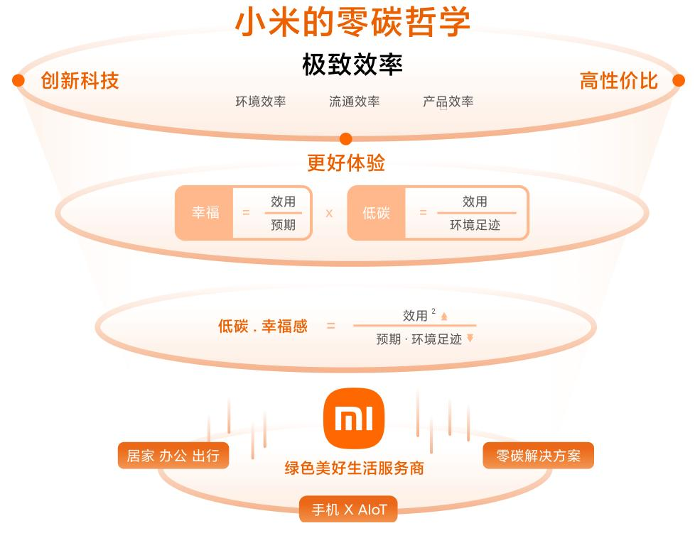

<--- Page Split --->

## 科技减少碳足迹  

## 碳盘查  

## 温室气体排放核算  

准确核算、评估和跟踪范围1、2和3的温室气体排放数据是实现温室气体减排目标的重要基石。目前，小米全价值链能源供应主要依赖于电网，由于全球不同区域发电能源组合不同，我们遵循《温室气体认定书：企业核算与报告准则》（The GHG Protocol: Corporate Accounting and  

Reporting Standard》（ISO 14064- 1:2018组织层面上温室气体排放与清除量化及报告规范》及国家、地方、行业相关标准，创建了符合运营地规范的碳数据标准与模型，并连续三年进行了严格的核算，核算结果与进度如下3。  

<table><tr><td>年份</td><td>范围1 (MT CO2e)</td><td>范围2 (MT CO2e)</td><td>范围3 (MT CO2e)</td></tr><tr><td>2020</td><td>8,402.12</td><td>58,079.17</td><td>—</td></tr><tr><td>2021</td><td>9,096.95</td><td>73,723.21</td><td>12,368,223.29</td></tr><tr><td>2022</td><td>7,122.60</td><td>78,620.01</td><td>本年度范围3排放正在核算过程中，预计于2023年7月披露</td></tr></table>  

3小米涉及的主要温室气体排放类型包括二氧化碳（CO2）、甲烷（CH4）、氧化亚氮（N2O）和氢氟碳化物（HFCs），温室气体排放总量核算按二氧化碳当量列。我们全面核算了小米拥有运营控制权的所有排放设施及价值链上下游温室气体排放，具体覆盖范围如下：  

1. 直接温室气体排放（范围1）：集团运营消耗天然气和汽油所产生的温室气体及制冷剂、灭火器使用和污水处理等过程产生的直接温室气体逸散排放；  

2. 间接温室气体排放（范围2）：集团运营所消耗的外购电力和外购热力所引致的温室气体排放；  

3. 价值链间接温室气体排放（范围3）：小米产品均为直接面向客户销售的产品，不涉及下游加工过程，且我们使用运营控制法进行温室气体数据核算，故核算价值链间接温室气体排放包括外购商品和服务、资本商品、燃料和能源相关活动（未包括在范围1和范围2中的部分）、上游运输和配送、运营中产生的废物、商务旅行、雇员通勤、下游运输和配送、售出产品的加工、售出产品的使用、处理寿命终止的售出产品、下游租赁资产与特许经营权。  

  

## 温室气体减排目标  

气候变化对世界带来的挑战越来越严峻。秉承着让全球每个人都能享受科技带来的美好生活的使命，我们感到有责任用我们的产品与技术助力解决这一挑战。作为一家全球化的创新型科技企业，小米善于通过技术创新和高效率模型提供解决方案。我们将气候意识纳入我们向用户交付“最  

## 温室气体减排目标检视  

2021年，我们首次设定了温室气体减排目标，即相较2020年，自有办公区人均温室气体排放于2026年下降4.5%。截至报告期末，相较于基准年，自有办公区人均温室气体排放下降 \(21.12\%\) 0  

通过更加深入的实践，我们清楚的了解温室气体的减排成果取决于我们业务的规模、能源供应的组合、供应商的选择，  

酷的产品”的全过程，并系统地思考如何将低碳特性与小米的战略与品牌进行结合，持续开发和优化环境友好的科技和产品，不断在推动世界向零碳过渡的道路上取得令人鼓舞的进展。  

以及核查标准和模型的演进等诸多复杂因素的影响，小米的温室气体排放量绝对值可能呈现出上升或下降的波动，但我们致力于将更美好、更清洁的科技应用于运营及产品中，并将不断检视温室气体排放指标与业务规模的关系，以及继续对我们的进展和实践保持透明。本年度，我们更新了温室气体减排目标，以更好地支持《巴黎协定》中的温升控制目标。

<--- Page Split --->

## 温室气体减排目标设定  

# 面向全球2050净零愿景，我们将持续降低范围1和2的温室气体排放  

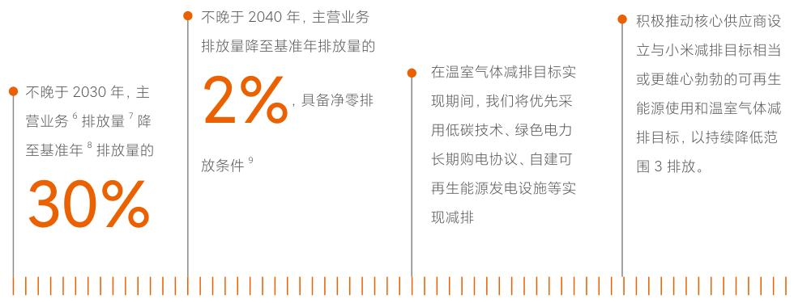
  

## 产品碳足迹计算  

本年度，我们开展了产品碳足迹核算项目，完成了三个典型产品（包括2款智能手机产品和1款智能空调产品）全生命周期的碳足迹测算。我们亦与独立的温室气体排放核算与认证机构合作，建立了完善的智能手机产品碳足迹  

评估流程及方法学模型，计算方法符合PAS2050国际碳足迹计算标准的要求。我们计划逐步建立包含智能手机、空调、智能电视、其他生态链产品等多品类产品碳足迹核算与管理体系。  

## 清洁技术研发与产品应用  

产品使用阶段能源消耗产生的碳排放是小米碳足迹的重要来源之一，产品能效亦会影响用户的产品使用体验。因此，我们在每项产品的设计之初便设立积极的能效目标，小米工程师在研发初期从软硬件的系统工程入手，全方位寻找能效提升机会。此外，我们持续针对全品类产品和包装在用料、制造、运输、使用和末端处理等环节减少碳排放，降低产品生命周期碳足迹。本年度，小米在清洁科技领域研  

## 高效能技术研发  

小米以“高效、快速、无损”为目标持续在提高产品能效方面投入研发资源。本年度，我们主要在以下方面取得了进展：  

## 5G与信息传输省电技术  

采用了多种5G节能技术，如自适应带宽技术与自适应功耗优化技术，针对5G不同场景，开发出可以在弱场环境、夜间无服务模式、无效卡注册等多场景下自适应优化的5G选网和搜网策略，提升手机省电效率；采用更先进的WLAN芯片，配合WLAN功率监测与动态发射技术，较上一代产品相比降低约30%的产品WLAN模块运行功耗。  

## 屏幕省电技术  

开发全局“深色模式”可使手机系统和应用的背景调整为深色，在部分程序使用场景中可节省约70%的屏幕能耗；采用节能屏幕并配置高效屏幕供电芯片，提高约7%的屏幕供电效率。

<--- Page Split --->

## 智能省电技术  

·开发手机屏幕自适应刷新率功能，当画面内容静止时，自动降低显示帧率，降低屏幕显示能耗；·采用智能音频省电技术，根据用户使用场景调整音量，进而减少播放音频产生的能耗。  

## 低耗能的人工智能（AI）  

·对人工智能语音助手“小爱同学”进行了自研算法优化，有效降低了约 \(37\%\) 的语音唤醒人工智能所需能耗。  

## 清洁科技应用  

## 新能源产品  

本年度，我们推出便携新能源产品米家太阳能板，应用金属穿孔卷绕（MetalWrapThrough，MWT）技术，实现较高的能量转换率，与米家户外电源1000Pro搭配使用，实现用户在户外进行能源取用及能源储备。  

## 充电技术  

小米始终专注于高效充电芯片的研发与应用。本年度，小米在智能手机产品中应用了自研澎湃双芯片电池管理系统，实现了电池管理全链路技术的自研，并实现有线快充、无线快充、无线反充的三重快充架构。2022年，小米的快充技术被用于超过约1亿部智能终端设备，与传统快充技术相比，每年可以节省电量消耗约0.57亿度，相当于减少二氧化碳排放24.852吨。  

  

每年可以节省电量消耗约0.57 亿度相当于减少二氧化碳排放 24,852 吨  

## 环境友好设计  

## 推动向循环经济转型  

电子设备生命周期的末期处置对环境具有显著影响，面对资源短缺，小米期望由从自然中获取材料、制造商品、最终直接废弃的传统经济模式，转变为优先回收利用的循环  

经济模式。我们始终将推进电子产品的回收利用作为小米循环经济相关工作的核心之一。我们亦在全球开展产品回收计划。详细内容请参考“循环经济与电子废弃物”章节。  

## 采用绿色包装  

采用更可持续的包装始终是我们努力的方向。近年来，我们持续探索包装绿色创新的方式，以不断减少包装中资源的使用。本年度，我们：  

  

实现蓝牙耳机Necklace系列外壳包装全纸化，替代原先塑料包装，包装纸均用竹浆与甘蔗浆制成，做到 \(100\%\) 可降解；  

将生态链产品包装由插底盒变更为平口箱，平均每款产品减少包装纸张使用面积约0.3平方米，同时新包装省去了塑料提手，单体约减少80克塑料使用。  

  

## 制造中的美亦效率极致  

我们积极通过优化产品结构设计与材料设计，与生产型供应商合作优化产品生产流程、简化生产步骤，在减少产品碳排放的同时协助供应商提升生产效率。以空调产品为例，我们有意将精致、极简的外观应用于更多产品中，因此用于生产空调外壳的模具可重复使用，进而减少因开模所需  

的能源与其他资源的消耗，平均每套模具减少能源消耗约48,500千瓦时。此外，本年度我们将部分空调产品室内机、室外机由分离式包装更改为一体化包装，有效减少了包装材料和生产步骤，提高了资源和制造效率。

<--- Page Split --->

## 绿色运营  

绿色运营小米持续采取在节能、节水、减少废弃物排放等方面采取措施，以提高资源使用效率和减少污染物排放。我们根据集团的运营情况，结合法律法规要求，不断完善运营环境相关管理制度。  

## 能源管理  

## 运营能耗管理  

运营能耗管理本年度，我们按照ISO50001建立了能源管理体系。通过更广泛的应用太阳能设施、能源分级管理手段、选用光感灯具、完善空调运行管理策略、调整制冷机房换热站及电梯机房温控策略等措施，减少自身运营的能耗和温室气体排放。2022年，我们通过变频、余热回收技术实施等措施共节省电力约263万千瓦时，热力3,086吉焦，相当于减少二氧化碳排放约1,839吨12。  

<table><tr><td colspan="2">2022年，我们通过变频、余热回收技术实施等措施共节省</td></tr><tr><td>电力约</td><td>热力</td></tr><tr><td>263</td><td>万千瓦时</td></tr><tr><td>3,086</td><td>吉焦</td></tr></table>  

## 提高建筑物的能源效率  

我们关注建筑物中的能源消耗，持续在现有建筑物中寻找提升能源效率的机会，并在新建建筑物的设计阶段纳入能效要求，根据当地条件和建筑用途设计更绿色的施工方案。  

我们以获得国际主流绿色建筑标准认证为目标，不断提高建筑物整体环境效益，并推动建筑能效提升项目的开展。北京小米科技园作为小米重要的办公园区，已获得LEED铂金奖和中国绿色建筑评价标识两星级证书。  

在新建建筑物方面，以集团在建的江苏南京园区为例，园区秉承与城市共融、提升社会价值的现代建筑的设计理念，广泛采用低能耗设备和高效技术，并配有可调节的新风设备和空调机组，有效提高了运营阶段的能源使用效率。同时，建筑外幕墙采用双银Low- e玻璃环保材料，使建筑外墙具有良好的隔热效果和透光性，彰显了整体生态绿色格调。  

## 水资源管理  

水资源管理水是贯穿于可持续发展各方面的重要资源之一，良好的水循环对人类社会和自然环境的完整性至关重要。小米致力于通过在运营中实施可持续的水管理，以保护、支持我们经营所在流域的水安全和生态系统，并持续通过创新科技令安全洁净的水资源经济、易得。对于运营中产生的废水，我们遵循运营地法律法规要求进行处理，以确保水安全。我们依据国际可持续水管理标准（AWS）建立了水管理体系，评估水相关风险及挑战，制定了目标及行动计划，并逐年检视结果，详见本报告“环境目标与目标检讨”小节。  

北京小米科技园依据绿色建筑标准进行设计、建设及运营管理，通过减少用水量、水的重复利用和循环利用确保水资源的高效利用。本年度，北京小米科技园推进了园区可持续水管理计划，努力实现国际可持续水管理标准五项成果（良好的水管理制度、可持续的水平衡、优良的水质、健康的相关重要水域、充足的安全饮用水和卫生设施），并持续将管理经验推广到其他小米运营园区。2022年，小米科技园新鲜水使用量较2021年下降 \(10.60\%\) ，超额完成本年度节水目标，在此基础上，我们设立了更完善的水资源管理目标，详见公司官网“可持续发展”页面（https://www.mi.com/csr)。  

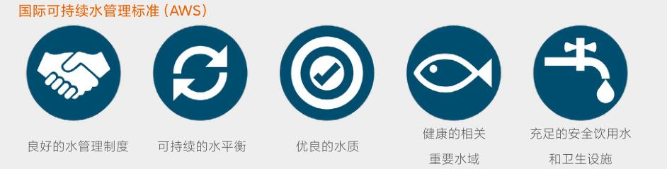
  

## 废弃物管理  

我们对运营产生的废弃物进行分类收集与再利用，通过有资质的第三方进行处置，确保废弃物得到妥善处理。同时，我们通过张贴环保标识与播放环保短片等方法，提高员工环保意识，减少日常运营中产生的废弃物。  

## 无害废弃物  

## 有害废弃物  

有害废弃物小米运营产生的无害废弃物包括办公室垃圾以及餐厅厨余垃圾。我们持续通过食堂配备的专业设备将所有厨余垃圾转化为符合国家标准的动物饲料或有机肥料。本年度，北京小米科技园食堂共处理约3,281吨厨余垃圾，并转化为334吨饲料和有机肥料。  

有害废弃物小米园区产生的有害废弃物主要包括打印设备使用所需的硒鼓及墨盒，以及研发活动产生的金属、废水、酒精纸、边角料等废料。我们将废旧硒鼓与废墨盒交由供货商统一处理；在实验室与亦庄智能工厂建立独立空间暂时存放有害废弃物，并交由有资质的废弃物管理公司进行回收处置。

<--- Page Split --->

## 绿色物流  

建立绿色高效的物流体系是连接并简化全价值链产品流通的重要环节，也是降低运营能源消耗和产品全生命周期碳排放的重要支柱之一。我们通过优化管理手段和智能物流系统的应用，提升运输车辆的满载率并整合优化了运输路径，在保证物流交付质量的同时，注重物流过程中的环境友好和资源节约。本年度，我们：  

·新增8条自有仓库到门店的直发路线，减少中间转运环节，减少运输产生的二氧化碳排放；  

·引入智能化运输管理技术，对于装载率低的情况进行实时调整与整合，使中小件产品运输满载率保持在 \(75\%\) 以上。智能电视类产品推行了体积更小的纸滑托盘替代木托盘的包装运输方式，使车辆满载率提升约 \(20\%\)  

·鼓励承运商使用新能源车辆，协助承运商研究新能源车辆替换方案，经调研，2022年中国大陆地区承运商使用新能源运输车辆占比达到约 \(8\%\)  

·对于海外产品物流运输模式进行了调整，包括将部分产品由碳排放较高的航空运输转为铁路或海路运输，共涉及约232万件产品的运输；  

·减少木质托盘使用，年度节约托盘13.700个，相当于减少木材资源消耗约200吨。  

  

## 科技扩大低碳影响力  

小米的极致效率模式使小米以及更多合作伙伴和更多场景拥有更快的交付、更快的反馈和更高的效率。在生产制造与流通领域，小米代表著一种创新且高效率的商业模式；在居家、办公、户外以及出行等场景中，小米代表著一种更健康、环境友好、普惠的消费思维和价值取向；在宏观经济社会视野中，小米代表著一种资源价值及效用更高的解决方案。我们通过输出实践、投资、战略伙伴关系和理念宣传，不断尝试在更恰当的位置上推动极致效率模式并带动更大的影响。  

## 从智能工厂到赋能智能制造  

小米通过实践、投资和合作的形式，参与到制造业转型升级，如参与智能工厂生态圈技术的研发，包括智能设备、智能工厂运营系统等。2020年，小米在北京亦庄投产了第一座智能工厂。该工厂作为小米先进技术和工艺的量产和落地试验场，实现了高度自动化生产，同时拥有出色的柔性生产能力。2021年，小米智能工厂二期项目启动。本年度，小米智能制造体系向制造行业不断输出、持续赋能，部分供应链合作企业已经启用了小米的整套产线设备和智能工厂系统，完成低能耗、高效益智慧工厂的全面升级。  

<--- Page Split --->

## 用AIoT打造高效生活空间  

AIoT是提高生活空间能源效率的入手点之一一物联网提供了供需系统的连接性和数字化，人工智能带来了对这些系统更平衡的管理，二者的结合可以促进系统稳定性和能源效率的提高。小米自2013年起开始打造小米生态链，复盖居家、办公、户外以及出行等各类场景，以居家场景为例，小米及米家智能家居产品已超过1000项，用户可通过米家APP对其进行管理，以实现能源效率优化。  

  

小米及米家智能家居产品已超过  

1,000 项  

## 中学校园“千台设备集中智慧管理”  

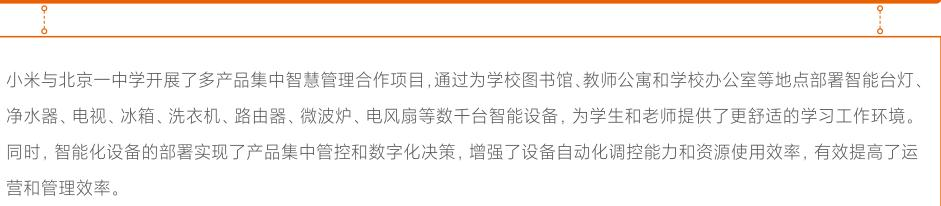
  

## 智能手机自然灾害预警功能  

建立健全自然灾害监测网络，联通自然灾害监测预警信息共享体系，是应对气候变化、建设自然灾害防治体系的关键环节。小米智能手机操作系统MIUI开发了“自然灾害预警”功能，预警信息来自中国国家预警中心，包含气象灾害、地质灾害、海洋灾害、森林灾害、生物灾害五种灾害预警类型，同时附有灾害相关防范指南，为应对自然灾害、有效避险提供更广泛的信息技术支持。本年度，我们通过自然灾害预警系统，共发布超11.90万次红色/橙色自然灾害预警，预警信息下发超过6,600万次。  

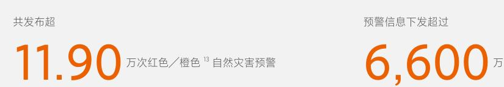
  

## 可持续投融资  

在投融资方面，我们坚持秉承小米可持续发展价值理念，通过投融资撬动高质量的绿色发展。我们持续将通过绿色债券募集的资金，依照《小米绿色金融框架》14投入到生态高效和循环经济型产品、生产技术与流程，能源效率，绿色建筑，清洁交通，污染防治，可再生能源等项目的开发。我们亦通过投资鼓励更多伙伴与小米同行，以利用我们的资源和影响力促进全球可持续发展目标的达成。  

我们开放地与全球金融机构合作。本年度，我们向金融机构的绿色存款计划提供了3,000万元人民币资金支持，存款资金专项用于绿色贷款的投放，包括节能环保、清洁生产、清洁能源、生态环境、基础设施绿色升级、绿色服务等方面符合条件的项目。我们相信使用专注于环境友好型项目的金融工具有利于小米和利益相关方的发展，同时是实现小米使命和长期创造价值的重要组成部分。  

## 投资的可持续影响力  

我们的投资策略重点之一是革新性技术，例如提升生产效率、降低能耗、减少资源消耗、清洁/无害环境等方面的技术或工业流程，以及提高对信息和通信技术的易得性、服务弱势/少数群体、专注科技普惠等方面的企业与项目。我们以投资行为为纽带，高效地输出小米可持续发展方法论，加深合作，共享成长，携手合作伙伴共同实现可持续发展目标。  

## 低碳技术投资  

  

小米参与投资的一家公司专注于氮化镓芯片的研发。相较硅芯片，氮化镓芯片从生产到出货流程可减少约 \(90\%\) 的碳足迹，每出货一颗氮化镓芯片较硅芯片可减少约4千克二氧化碳当量的排放，并在终端应用中可减少约 \(30\%\) 的二氧化碳排放。到2050年，氮化镓方案相较硅方案有望实现每年减少26亿吨的二氧化碳排放。2022年8月，该公司已实现其第一个10万吨二氧化碳减排里程碑。

<--- Page Split --->

02 

科技探索与科技普惠 

EXPLORATION AND ACCESSIBILITY OF TECHNOLOGY

<--- Page Split --->

小米将打磨产品与服务的创新科技内核作为企业可持续经营过程中的重要元素。小米的技术体系发展从集成式技术创新起步，快速进入自主式技术创新，并持续深入底层核心版式的技术创新，实现了对关键技术环节的掌握和主导。我们不断探索技术极限，追求技术与交互的最优解，围绕感知层、通信层、AI层、系统层、计算层、输出层6个层面建立了一个爱盖广、跨度大、深度深的整体技术架构。  

## 感知层  

光学技术体系、声学与语音识别、毫米波雷达技术和各类传感器技术等  

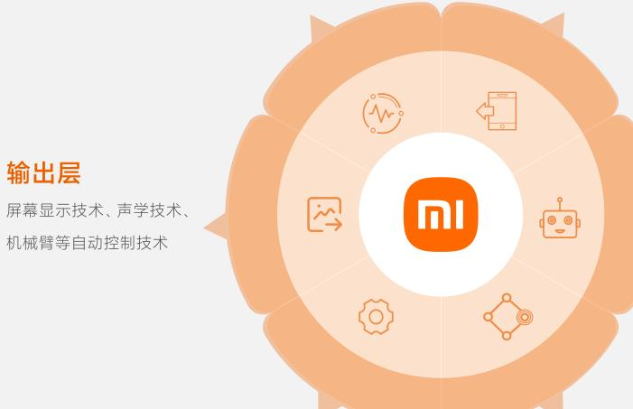
  

## 系统层  

芯片集群，包括我们的合作伙伴提供的芯片和自研芯片的技术能力  

## 通信层  

5G/6G通信技术、Wi- Fi7、蓝牙Mesh、NFC等及基于以上通信技术的互联互通通信协议  

## AI层  

形成统一的AI能力架构，为各业务在各场景下的AI算法、算力需求，提供支撑  

## 计算层  

手机、IoT设备、智能座舱与智能家庭的系统融合及云技术的紧密结合  

在完善技术架构的支撑下，我们致力于融合多方面技术能力，不断加大研发投入，为用户提供更便利、价格更公道、应用更广泛的产品与技术。截至2022年底，小米在全球建立了10个研发中心，400余间实验室，共拥有研发人员16,171名，较去年增加10.8%，研发投入达160亿元人民币。在过去5年中（2017年－2021年），小米研发投入年复合增长超40%，我们计划在五年内（2022－2026年）投入超1,000亿元人民币用于研发，其中包括互联互通、助力科技无障碍、强化数字包容并缩短数字鸿沟、加强未成年人保护并持续关注科技教育与普惠公平发展。  

同时，在社会数字化快速发展与转型的过程中，我们致力于与合作伙伴合作，通过广泛的技术研发与应用，提供面向更多人群的科技教育，推动数字包容，推进科技平等化建设。在过去十多年期间，小米凭借深度底层技术创新和全链路极致效率实现，持续向更广泛的用户群体交付领先的科技产品，用小米生态链打造了世界领先的消费级AIoT平台，在助力全球数字包容、科技平等发展等方面做出了独特的贡献。  

基于此，我们将推动小米科技生态的升级进化，不再仅是实现“万物互联”，而是进一步推动“以人为中心，实现人与万物的连接”。  

<--- Page Split --->

## 科技探索  

科技探索秉承着技术为本的理念，小米持续夯实技术研发体系，围绕科技领域开展各类应用场景的研究。本年度，我们与可持续发展相关的突破性科技研发成果包括：  

## 科技人文  

小米通过行业领先的软硬件一体化影像计算技术，构建了包括融合光学、色彩引擎、仿生感知、加速引擎、生态引擎、图像信号处理（Image Signal Process, ISP）等在内的全新架构，创造性地呈现出富有人文特色的移动影像；  

人工智能语音助手“小爱同学”的人机对话强化了人文共情和情绪支持功能，我们与权威高校心理学系合作，利用认知行为疗法（Cognitive Behavioral Therapy，CBT），搭建了新情绪分类体系，覆盖三大情绪类型共计88子类情绪，使“小爱同学”在与用户的对话回复中包含更加丰富的情感体验。  

## 人工智能  

人工智能小米人工智能研发涵盖视觉、声学、语音、自然语言处理（Natural Language Processing，NLP）、知识图谱与机器学习全体系技术。本年度，我们在阵列拾音、语音唤醒、语音识别技术（Automatic Speech Recognition，ASR）、语音合成  

和声纹识别等方面取得了重大的突破，在ICASSP2022中的基于多模态信息的语音处理（Multi- modal Information based Speech Processing，MISP）挑战赛中获得多模态语音唤醒技术冠军，多模态语音识别技术亚军。  

## 未来解决方案  

未来解决方案本年度，小米围绕智能制造等领域，联合上下游企业与高校院所，牵头组建了中国第一个由企业牵头的创新联合体一3C智能制造创新联合体，旨在围绕产业需求打造覆盖智能装备、智能机器人、智能工艺、智能制造系统、体系标准等方面的5个研究中心和1个成果转化中心；  

小米自动驾驶技术采用全栈自研算法的技术布局战略，覆盖感知预测、高精定位、决策规划等自动驾驶核心技术领域，自建全自研数据闭环系统，高效驱动核心算法及产品功能迭代。在小米自动驾驶测试中，测试车辆已实现无保护自动掉头，绕行事故车及自动泊车入位配合机械自动充电等行泊车场景。  

<--- Page Split --->

## 科技普惠  

小米承诺硬件综合净利润率永远不会超过 \(5\%\) ，降低了包括智能手机在内的诸多科技产品的价格门槛。同时，小米之家运营门店遍布全球70余个国家和地区，消弱了多个科技硬件领域的经济条件差异和地域发展差异。小米认可“多元、包容、平等”的包容性价值理念，秉承“让全球每个人都能享受科技带来的美好生活”的使命，我们尊重每一  

项个性化需求，力争使我们的产品尽可能地对所有人平等、包容、友善、易得，让每个人在小米产品的支持下，获得更美好生活。2022年，小米集团联合微软中国与上海有人公益基金会合作发布了《包容性设计原则手册》16，以共同推广科技包容性设计理念、推动无障碍技术的发展。  

## 互联互通、开放共享的科技生态  

我们凭借深度底层技术创新和全链路极致效率，持续向更广泛的用户群体交付领先、独特的科技产品。全球小米AIoT设备接入数已达到5.89亿，拥有5个及以上连接至小米AIoT平台上的设备的用户数达到1,160万17。  

小米在互联互通、开放共享的丰富场景中建立了开源开放的物联生态和全场景智控生态，2022年12月，小米人工智能语音助手“小爱同学”月活用户数达到1.15亿，交互次数累计达到2,158亿次，支持控制的产品覆盖5,312款。在多设备场景中，“小爱同学”通过协同唤醒，唯一应答与集中控制等功能，节省了冗余的计算、感知和硬件设备。  

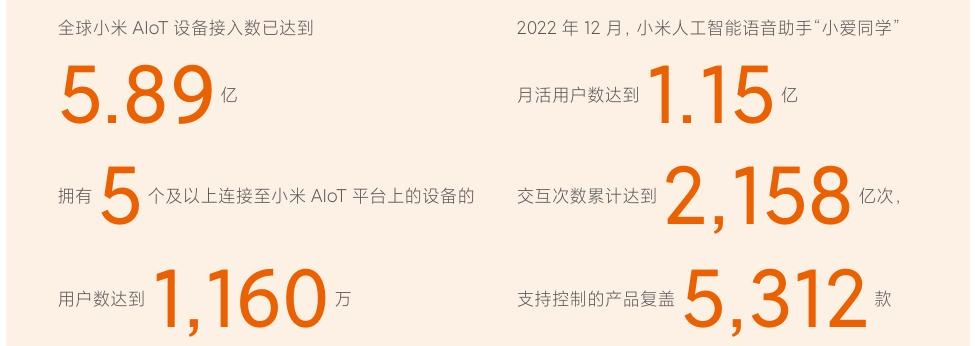
  

## 科技无障碍  

小米始终致力于通过技术开发与应用推广科技无障碍理念。我们不仅努力使障碍人群享受科技带来的美好生活，更为因认知、社会排斥、情景性障碍18等因素带来生活不便利的用户提供更加符合需求的科技体验与适合使用场景的工具。我们坚持构建以人为本的障碍支持体系，从更多元的角度理解各类障碍为生活带来的不便，不断更深入了解障碍人群与情景的需求。  

近年来，我们从开发产品基础无障碍功能出发，逐步做到扩展功能无障碍化。我们致力于打造便于每个人操作、获取信息、满足互联需求的手机以及便利的互联互通智能家居，为用户提供从基础功能到AI进阶功能的无障碍交互全面体验。本年度，小米“以人为本的障碍人士支持体系”项目获得了2022年向光奖年度商业向善TOP10，体现了小米对社会价值的创新以及对商业向善理念的积极践行。  

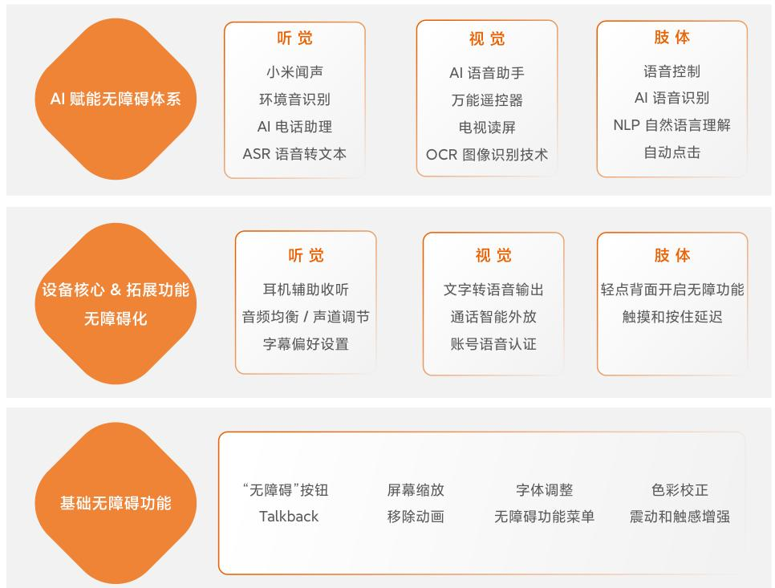

小米集团科技无障碍技术理念架构与主要功能

<--- Page Split --->

  

## 为语言障碍用户创建“自己的声音”  

2022年，我们将自研的声音适配算法和超级拟人语音合成技术应用于无障碍领域，为语言障碍用户“阿卷”开发了贴合其声音特点的独一无二的定制声音，实现“阿卷”用“自己的声音”进行沟通交流的愿望。在该项目的推动下，超200位小米员工在小米声音配型捐赠项目中进行了捐赠，亲身参与技术无障碍创新活动。该项目入选了2022年中国计算机大会（CNCC）《2022CCF技术公益案例集》。  

此外，为让大众对言语障碍伙伴需求有更加清晰的了解，我们制作了《OWN MY VOICE》项目纪录片，同时，在获取志愿者允许的前提下，带动超6,000位志愿者捐赠声音，组成丰富多元的声音捐赠库，增加了言语障碍伙伴获得更贴近其生理条件声音的可能性。  

## 未成年人保护  

小米重视对未成年人在使用产品时的保护。我们制定了《小米儿童信息保护规则》19，明确在收集、使用、转移、披露未成年人个人信息时，应当告知监护人并征得监护人的同意。该规则同时规定了在智能手机、智能电视和音响设备中收集的信息以及对于信息的使用情况。  

同时，我们不断通过系统与产品功能的开发，保护未成年人隐私。  

“米兔”儿童手表隐私保护功能——“米兔”儿童手表通过系统管理与数据加密等功能保护儿童信息安全。我们通过系统权限管理拒绝向未授权的第三方开放系统权限，从源头防范用户信息泄露风险。我们亦通过本地数据加密、数据传输加密以及小米云端数据加密技术，全方位保护儿童信息安全。  

## 数字包容  

小米重视人工智能技术应用时在性别、宗教、伦理道德等方面的包容性。我们设立了人工智能伦理委员会，保障小米在人工智能技术应用上遵从数字平等相关的伦理准则和监管规范。  

## 提升人工智能语音助手“小爱同学”中译英功能使用包容性用例的比例  

近年来，基于相貌、职业及性别平等提出的“包容性语言”20概念正逐步被推广并应用至机器翻译领域。本年度，我们通过调整翻译逻辑与针对性AI训练，让“小爱同学”中译英功能更加包容多元用户的翻译语境需求。

<--- Page Split --->

03 

负责任产品与用户体验 

RESPONSIBLE PRODUCT AND USER EXPERIENCE

<--- Page Split --->

在“口碑第一”的原则指引下，小米在追求“更佳的用户体验”的道路上不断前行。我们致力于将质量与效率相结合，为用户带来更高效、体验更好、更负担得起的消费与产品使用体验。我们亦在产品与服务的全生命周期中保护用户的隐私，不断通过制定更严格的规范，采用更先进的技术，为用户打造更安全放心的使用环境。同时，我们认为资源得到重复利用和进行有效回收是负责任制造的关键，并将继续努力构建更广泛的服务网络与更完善的回收机制，减少电子废弃物的产生，积极向循环经济转变。  

## 产品与服务质量  

我们倡导“以用户为中心、集产品质量、用户体验、服务品质为一体，全员参与、全周期闭环管理”的大质量观”，并始终贯彻“质量是小米的生命线”的管理理念，不断地追求为用户提供极致的产品与服务体验。小米集团质量委员会（以下简称“质量委”）统筹全集团质量管理工作，制定集团质量方针、目标以及质量管理机制和要求，各业务线在此基础上结合ISO9001质量管理体系标准不断完善质量管理办法和措施。我们颁布了《小米集团质量手册》并要求全部员工参与、遵守并持续改进产品与服务全生命周期质量管理流程。  

本年度，我们的智能手机、笔记本、智能电视、大家电、智能硬件、小米有品、中国区服务业务线获得或维护了ISO9001管理体系认证。  

## 产品质量管理  

小米始终坚持做“感动人心、价格厚道”的好产品。我们不断通过细化管理体系、改善管理流程、促进供应链质量等工作，提升产品品质与用户体验。  

## 产品质量管理体系优化  

本年度，我们建立了跨部门质量管理委员会，对产品审核、标准、可靠性、供应链等方面进行全方位管理，提升管理效率，促进产品质量提升。  

小米于2020年出台了《小米集团产品召回管理制度》并持续沿用了该制度。本年度，公司未发生因产品健康安全以及其他问题而导致的重大产品召回事件。  

本年度，我们与合作伙伴共同参评的三项成果分别获得第47届国际质量管理小组会议（ICQCC）一项“铂金奖”和两项“金奖”。  

## 质量改善措施  

  

用户体验提升  

- 本年度，小米手机部完成了9个大专项，以及118个小专项的体验提升相关工作，覆盖性能功耗、稳定性及信号与通讯、以及用户多媒体三大方向。其中，为改善用户在阳光下使用手机屏幕不清晰的问题，我们通过降低最大亮度触发门限、评估最大亮度保持时间、提升屏幕亮度上限的方式，有效解决了用户痛点问题。  

- 我们针对可穿戴产品容易导致用户过敏的问题进行了全面分析与改良。本年度，我们联合医学、环境学、生物学等领域专家开展了可穿戴设备致敏防护的材料研发。我们通过对产品中导致过敏的物质进行识别，并对产品进行全面拆解，充分了解产品中含过敏物质的部件与结构。在此基础上，我们通过材料替换、结构调整等方式减少致敏物质，其中可穿戴设备中使用的无影胶（UV胶）使用量减少了约 \(88\%\) 。我们亦根据研究结果建立了产品致敏致毒物质清单，并作为研发过程的重要考量之一。  

  

用户需求理解  

- 小米积极倾听用户声音，从用户需求角度出发持续提升产品质量水平。本年度，小米相关部门联合组织开展了“倾听计划”等系列活动，组织软、硬件工程师至门店，通过与用户面对面沟通了解用户实际需求，并将需求纳入新产品设计环节，各产品业务线共有400余位工程师参与了“倾听计划”。  

  

供应商质量管控  

- 为进一步向供应商宣贯小米的质量管理理念，在本年度“质量月”活动中，小米各产品业务线与相关部门联合各地供应商，组织开展了一系列“质量工厂行”活动，与供应商深入探讨用户遇到的质量相关问题，推动供应商的生产质量进步。小米已将产品质量融入供应商绩效管理，并对供应商开展月度质量评估。  

本年度，小米加大了对供应商关键信息变更的管理力度，更新了供应商质量协议。如供应商在人员、设备、物料、方法、环境、测量六个生产要素发生变更，需通过信息化系统提交到小米进行评审、验证与批覆，以此监控、管理并促进供应商保障供货质量。2022年，我们通过该渠道共审核了4,000余起变更条目。

<--- Page Split --->

## 质量意识提升  

我们高度重视员工质量意识的培养。本年度，我们开展了线上及线下的质量课程培训，包括集团质量制度、产品安全合规要求、质量管理体系、质量管理工具等内容，帮助员工了解小米质量核心价值观，提高员工质量意识和质量专业能力。集团学习发展部与质量委联合打造了“质量在线课程”，为全体小米员工提供了20多门质量专业课程，  

超20,000人次参与了学习。同时，我们开展了产品安全合规线下培训，共计25场，约6,000人次参加了学习。  

2022年，质量委联合20余业务部门，举办了第3届“小米质量月”。我们以“提升用户体验，落实质量责任”为主题，共策划了52场“质量月”活动，包括质量知识分享、倾听用户之声、质量工厂行、质量之星评选等内容。  

## 服务质量管理  

我们不断优化服务质量管理体系，为持续提升用户在零售、客户服务、售后等全场景的交互及用户服务体验。本年度，我们开展服务业务变革项目，通过零售与服务更紧密的结合，在上门服务网络管理、自建客服团队、销服一体项目、数字化能力建设四个维度实现用户服务体验全面提升。基于服务业务变革规划，我们对服务组织架构与职能进行调整，按“为用户体验负责、为服务交付质量负责、为服务门店/人员技术能力负责、为服务门店备件供应负责、为产品全生命周期服务政策及费用负责”五个目标维度，设立包含门店、上门、物流、客服、技术、备件、服务运营等关  

键执行模块，实行用户服务首问责任制，确保小米服务高质量交付。  

我们通过构建用户服务全链路数字化能力，从用户需求发起到服务结束，在用户端，实现了服务全流程价格、时效、进度、服务人员信息全部透明可视，客户净满意度较2021年提升 \(9.5\%^{22}\) ；在工程师端，受益于全新的数字化工具平台，服务工单全流程操作效率及体验大幅提升，工单操作效率提高 \(50\%\) ，工单履约时效提速 \(44\%\)  

## 关键服务质量管理成果  

## 门店服务  

我们持续增强线下门店的服务能力，扩展服务网络的覆盖地区，提升用户服务便利性。  

## 截至本报告期末，我们：  

·中国大陆地区具备销售、退换修、回收等全维度服务功能的销服一体店达到1,937家，较2021年增长 \(43.1\%\) 。线下门店常驻持有小米专业技术资格证书的工程师近5,000人；·用户服务便利性满意度调研显示，2022年年末相较年初服务便利性满意度提升 \(8.3\%\)  

  

## 上门（到家）服务  

我们通过增加上门（到家）服务点（提供产品安装、维修、回收服务等基础设施）的建设，扩大了上门服务的覆盖区域。  

## 截至本报告期末，我们：  

·中国大陆地区共建成上门服务点2,628家，较2021年增长 \(40.4\%\) 。上门（到家）服务点持有小米专业技术资格证书的工程师近16,000人；·上门服务能力已覆盖中国大陆全部城乡地区。  

## 配送服务  

  

我们通过优化产品仓储规划、减少产品配送周转次数、增加直发配送等方式，提升配送效率，保障配送服务质量。本年度，我们：  

在中国大陆地区，订单当日出库率达 \(99.99\%\) ，实现 \(85\%\) 的订单1天内送达。  

  

## 投诉管理  

我们以迅速有效解决用户痛点问题为目标，接诉即办，调动内部各方资源高效响应用户投诉，积极将与用户的每一次沟通转化为正向价值沉淀，确保用户的各类实际问题得到准确、迅速、合理的处理，并持续提升用户的过程体验。同时，我们基于多渠道、多维度的用户投诉分析管理，以改善专项、回访机制等方式进行反向效果验证，形成用户投诉闭环管理，助推用户体验持续提升。

<--- Page Split --->

## 境外服务管理  

境外服务管理小米已在超过100个国家和地区开展了业务活动。我们持续采用“总部要求 + 本地化执行”的策略，兼顾小米服务质量要求和本地用户文化习惯，在各区域网格式配备工程师级负责人。本年度，我们持续推广数字化服务系统的开发与应用、扩大售后服务覆盖范围、建设售后服务能力以提升海外服务质量。  

## 数据安全与隐私保护  

数据安全与隐私保护透明的数据管理是构建用户信任的基础，保护用户的数据隐私始终是小米的核心价值观之一。我们基于全球隐私框架（如经合组织、亚太经合组织发布的框架）和隐私法律（如《中华人民共和国个人信息保护法》、GDPR、LGPD、  

CCPA/CPRA）24中包含的核心原则制定和更新小米隐私政策，构建用户可信赖的隐私管理系统，并打造更安全与透明的人工智能。  

  

## 信息化系统更新  

  

## 产品交付  

信息化系统更新本年度，我们的一体化境外服务系统（Issue to Solution Platform, ISP）实现全球运营区域 \(100\%\) 覆盖。通过对系统中客服、售后与备件三个业务板块进行管理流程重构，将管理流程和管理责任细化至个人，有效提升服务管理精确程度。  

  

## 售后服务  

售后服务我们持续提升售后服务覆盖范围与服务能力。本年度，我们的海外售后服务网络覆盖范围新增11个国家，4种服务语言，以及3个联络中心。我们在海外已建设2,738家含售后服务的门店，较2021年增加343家，同时，我们的维修站点数量较2021年提升了 \(24.8\%\)  

我们亦针对境外客服解答效率进行改善，通过将人工客服“接起率”23作为员工考核目标，提升服务响应时效，并每遇对该指标复盘，讨论指标改进办法并对改进成效进行追踪。本年度，我们通过客服数量实时监控调整人力分布，应对客服高峰期人力不足的问题，并建设同种语言服务支持系统，在出现服务积压时进行跨区域支援。  

产品交付本年度，我们在部分海外区域设置了“海外仓储Hub”用于储存产品，通过货物先运输至仓储地再发至客户的模式，缩短海外产品到货时间。以西班牙Hub为例，相较原先由中国大陆地区直接向海外地区发货的模式，新模式使全流程交付时间缩减约 \(71\%\)  

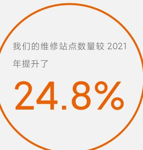
  

## 我们的隐私保护准则  

## 用户的数据，由用户控制  

用户的数据，由用户控制在小米，我们坚信用户对其隐私拥有知情权与控制权。用户始终对其数据拥有独立控制（包括获取、修正或删除用户与我们共享的个人数据）的权利。我们只会在用户授权同意的情况下收集用户数据，无论何时何地，用户都可以在“隐私支持”中请求获取、修正或删除我们所收集的信息。  

## 数据处理，公开透明  

我们坚持最大限度减少数据收集和保留，只会收集为实现具体、特定、明确及合法的目的所必需的信息，并且确保不会对这些信息进行与上述目的不相符的进一步处理。在没有得到用户许可的情况下，我们的AI算法不会上传任何用户数据。  

## 安全保障，全面覆盖  

安全保障，全面覆盖我们遵循公开透明政策，让用户全面了解我们收集的信息种类以及信息用途。《小米隐私政策》适用于所有小米设备、网站或应用程序，覆盖小米集团以及小米集团所有子公司，我们对特定小米产品或服务还制定了独立的数据安全与隐私保护政策。  

## 遵守全球法律规范  

遵守全球法律规范隐私和安全保护一直是我们产品设计的关键理念。我们致力于建立标准化、可持续的隐私影响评估程序，以确保我们的产品和服务始终符合个人信息保护相关的法律法规。我们不会将任何个人信息出售给第三方。我们保证仅出于正当、合法、必要、特定、明确的目的共享为用户提供服务所必要的个人信息。小米将在必要时对第三方服务提供商进行尽职调查并签订合同，以确保其遵守用户所属司法管辖区中适用的数据安全与隐私保护法律。

<--- Page Split --->

本年度，为进一步实现信息公开透明，我们发布或更新了MIUI 13安全白皮书（MIUI 13 Security White Paper），MIUI 13隐私白皮书（MIUI 13 Privacy White Paper），小米IoT 隐私白皮书（Xiaomi IoT Privacy White Paper）与透明度报告（Transparency Report）（2021）。有关小米数据安全与隐私保护的管理与实践，请参考：  

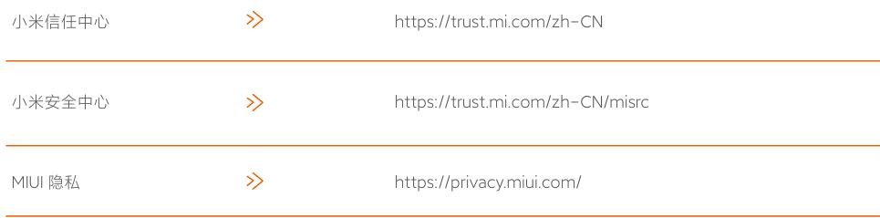
  

本年度我们持续在管理架构、产品测试流程、产品功能、隐私意识培训等方面进行完善。  

  

## 安全管理架构  

小米集团设立了数据安全与隐私委员会（以下简称“安全隐私委”）负责统筹管理数据安全与隐私保护工作，并商议、审批数据安全与隐私保护相关的制度和规范，参照相关制度对业务的数据安全与隐私保护风险进行评估并给予相应指导建议。董事会定期对数据安全与隐私保护相关风险、应对措施与措施成效进行审阅，并提出相应管理建议。安全隐私委每月向董事会进行一次关于集团安全隐私体系运营相关情况的汇报，协助董事会管理集团面临的安全隐私风险。2022年，我们经过ISO27001信息安全管理认证（ISMS）覆盖的技术运营活动场所比例为 \(100\%\)  

## 安全控制措施  

## 安全事件响应机制  

我们已建立数据安全与隐私事件响应工作机制，明确事件响应团队与上报规范，以规范数据安全与隐私保护事件分类、上报和通知流程，通过制定数据安全与隐私保护事件预案场景，并定期演练，以提升应对突发事件的应急能力。  

此外，我们设置了公开的隐私问题反馈通道（https://privacy.mi.com/support/?locale=zh- cn），面向包括用户、员工、合作伙伴、公众等全部人群。  

## 供应商及合作伙伴尽职调查  

我们十分重视对于供应商及合作伙伴数据安全与隐私保护的管理。对我们与之共享个人信息的合作伙伴，我们会对其数据安全环境进行合理审查，并与其签署严格的数据处理协议。我们亦要求第三方对用户的信息采取足够的保护措施，确保其遵守小米的数据安全与隐私保护原则。  

在供应商准入阶段，供应商须按照小米数据安全与隐私保护审查程序进行申报与测评，如未通过，我们将要求供应商进行整改，直至通过后方可与小米开展合作。在合作期间，我们定期开展对供应商数据安全与隐私保护保护实践情况的审核，如发现问题则要求供应商暂停合作进行整改，整改完成后方可继续进行业务合作。  

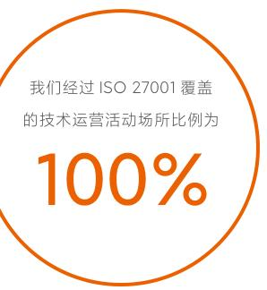

<--- Page Split --->

  

## 产品安全开发生命周期流程  

我们在产品设计开发阶段遵守隐私设计（Privacy by Design）和默认安全设计（Security by Default）原则。本年度，我们持续对产品安全开发生命周期（Security Development Lifecycle，SDL）流程进行升级，明确了产品设计关键节点的审查流程，包括：  

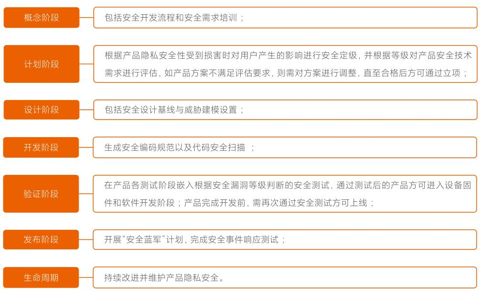
  

## 产品隐私功能提升  

2022年，MIUI14推出了多项功能，采用端侧隐私技术，让敏感数据尽可能在本地计算，提升产品隐私安全，主要包括：  

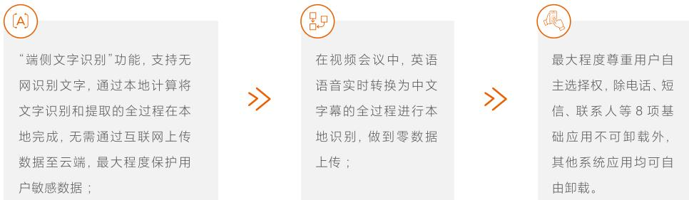
  

## IoT设备安全与隐私评审  

小米发布了《消费级物联网安全基线》25，包含对不同安全等级AIoT设备需要满足的安全要求，从设备硬件、软件、系统、通信、数据和业务逻辑六个安全领域提出安全要求，确保小米生态链厂商提供安全的产品与服务，遵守我们对用户隐私的承诺，并保护设备免受恶意软件的威胁。2022年，我们完成334轮次新品上线前安全测试，共拦截625个安全问题；完成109款产品固件迭代安全测试，拦截67个安全问题。

<--- Page Split --->

## 员工安全意识培训  

我们重视数据安全与隐私保护文化建设，每年定期组织安全与隐私宣传月、钓鱼演练、培训课程、在线考核等合规意识提升活动。本年度，我们举办的数据安全与隐私保护培训活动覆盖 \(100\%\) 的公司正式员工、实习生以及部分外  

包员工、供应商及合作伙伴。本年度，我们根据员工的身份属性提供定制化的培训材料和培训活动，主要包括：  

## 安全认证与获奖  

我们的隐私保护能力和措施不断通过业界权威的隐私保护认证和测试。本年度，我们新增获得SOC2 TypeI认证（第三方独立审计），并持续保持以下第三方审计认证的有效性26：  

  

  

  

安全意识培训在线课程，全体员工考核通过率为  

\(92\%\)  

  

安全意识培训在线课程，课时  

2.5 小时  

  

安全技术专项培训、隐私训练营10场，覆盖  

5,000 余人次  

此外，我们开展了针对供应商及合作伙伴的数据安全与隐私保护专项培训，覆盖56家供应商及合作伙伴企业，共467人参加。

<--- Page Split --->

## 循环经济与电子废弃物  

我们十分重视产品生命周期末端的管理，努力从产品设计与生产、再利用、产品寿命、回收与报废等环节入手，促进电子废弃物的减少以及循环经济的发展。我们遵循全球各运营所在地对于电子废弃物的法律法规与要求，努力了解适应当地的电子废弃物回收生态，从最佳解决方案的角度出发，持续引入更全面的电子废弃物管理渠道和方式，以履行小米在产品生命周期末端管理方面的  

承诺。我们遵守《巴塞尔公约》，承诺不向非OECD国家出口电子废弃物。  

本年度，我们在全球范围共回收智能手机等电子废弃物约4,500吨。我们计划在5年内（2022- 2026年）回收电子废弃物累计达到38,000吨，累计投入5,000吨循环材料用于产品制造。  

## 产品设计与生产  

我们在产品的设计阶段增加可再生材料的使用，以促进循环经济的发展。为提高产品的可回收性，我们不断探索将产品部件材料替换为生物基材料或回收材料的机会。本年度，我们：  

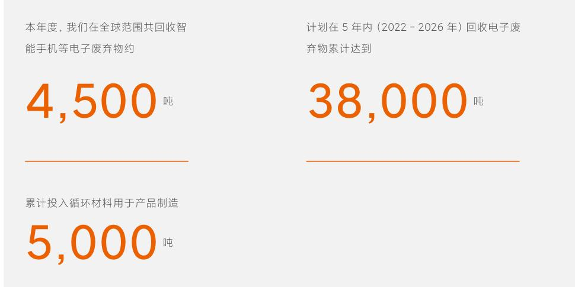
  

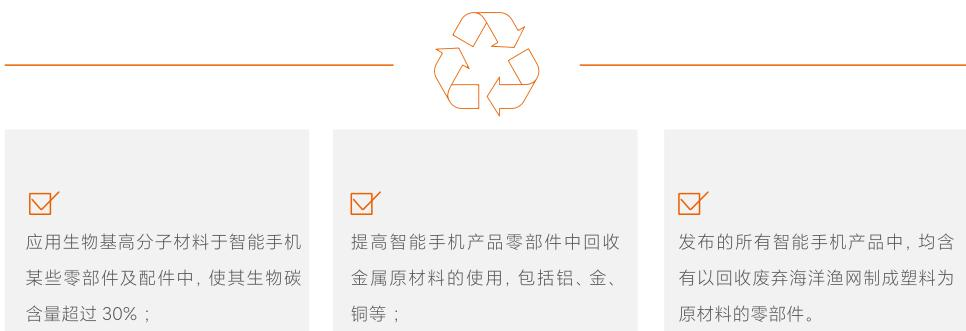
  

我们亦在保障产品质量的情况下，减少产品材料的使用量，以提升产品在处置环节的效率。本年度，我们：  

·降低部分智能手机产品后盖结构厚度，减少了后盖组件中约 \(40\%\) 的塑料使用量；  

·通过一体化设计，减少空调产品中螺钉、海绵、金属部件的使用数量与重量，单台机器相关原材料使用重量较上一代平均减少约620克；  

·从产品的回收利用、回收材料验证、高能效验证、耐用性、耐久性，以及产品和包材的有毒有害物质管控；等方面对米家电动牙刷产品进行了测试与评估，取得了SGS绿色产品认证。  

## 翻新与再利用  

我们持续通过开展旧机翻新项目，促进循环经济发展。本年度，我们的翻新工厂完成约94,000台智能手机产品、5,600部电动滑板车产品、6,200台智能电视产品的翻新，并以认证的翻新产品方式全部售出。

<--- Page Split --->

## 延长产品寿命  

## 增强耐久性  

增强耐久性我们在产品选材时即考虑材料的耐用性，例如我们开发了坚固耐磨的陶瓷材料与耐磨耐用、防污防霉、耐酸碱的有机硅素皮材料应用于多款智能手机产品中。在防尘、防水、跌落等测试中，我们的制定了高于国际标准的实验标准。本年度，小米发布了满充满放长寿命电池，采用了电池健康技术，较原先电池使用寿命延长约 \(25\%\) 。  

## 保修服务  

保修服务小米为用户提供便捷的维修服务（详细内容请参考“关键服务成果”章节）。我们以合理的价格稳定供应用于维修的零部件和材料，以提高产品的可维修性。此外，我们储备了不再售卖产品的零部件，以更好的满足用户维修需求。  

## 回收与报废  

我们在全部运营地区负责任地回收电子废弃物，通过自有设施和与第三方合作，确保电子废弃物和其他废弃物得到妥善处理。我们严格考察合作伙伴的认证资质，包括质量管理体系（ISO 9001）、环境管理体系（ISO 14001）、信息安全管理体系（ISO/IEC 27001）、零填埋认证与国际电子废弃物R227认证等。在合作过程中，我们就劳工权益和安全健康的工作环境、禁止非法废物出口等方面向合作伙伴做出具体约定，确保合作伙伴以合理、合法的方式进行废弃物翻新或报废处理。  

我们持续开展“以旧换新”业务，扩充可回收的产品类型和回收服务的覆盖范围，设立了包括门店回收、上门和邮寄三种途径的收集方式鼓励用户进行产品回收。本年度，我们新增欧洲部分运营地区官网“以旧换新”业务。我们亦通过有资质的第三方，对维修过程中产生的废弃物进行处理，如废弃电子元器件，2022年，此类废弃物 \(100\%\) 得到了妥善处理。  

## 减少有害物质  

减少有害物质小米严格管理产品及生产过程中可能产生的有害物质，在提升产品回收效率的同时，为消费大众提供安全有保障且环境友好的产品。我们严格遵守《关于限制在电子电气设备中使用某些有害成分的指令》（RoHS）《化学物质的注册、评估、授权和限制》（REACH）《包装和包装废弃物指令》（94/62/EC）等对于产品与其包装中有害成分和化学物质加以限制的境内外法律法规。  

我们根据国际标准28严格控制产品制造过程中涉及的有害物质，建立了有害物质预检和跟踪管理流程，自愿制定减少潜在有害物质使用的计划，包括聚氯乙烯（PVC）、溴化阻燃剂（BFRs）、铍和锑以及法律规定的其他物质，并携手供应链实现该目标。  

本年度，我们对于减少产品材料、生产流程和包装材料中包含的有害物质的措施包括：  

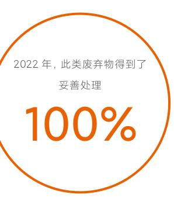
  

  

应用于智能手机产品中的有机硅素皮材料在生产过程中不使用DMF工业有机溶剂，有效降低使用者皮肤致敏风险，同时保障环境和工人健康安全；  

  

通过对产品包装膜的结构调整，不再使用黏合剂对产品进行包装，减少了黏合剂中有害物质的排放；  

部分区域产品已通过大豆油墨替代矿物质油墨打印包材内容， \(100\%\) 去除了包装中使用的矿物油饱和烃（MOSH）和矿物油芳烃（MOAH）物质，并将逐步推广该措施。

<--- Page Split --->

04
伙伴共赢
CREATING SHARED SUCCESS 

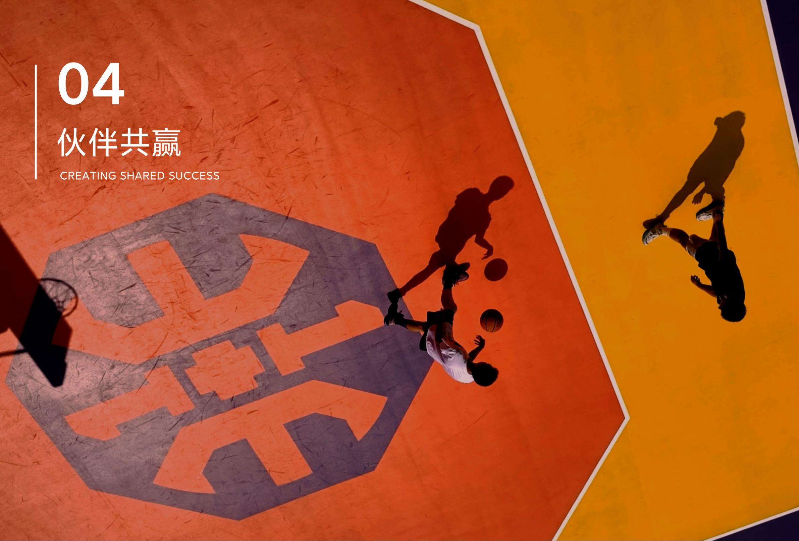

<--- Page Split --->

小米始终追求与各相关方共同成长，打造伙伴共赢的合作生态。作为一家全球化科技企业，我们拥有包括原材料开采、加工、组装、物流、销售、回收和处置等覆盖全产业链的供应链体系。我们通过与供应商建立广泛的合作，并通过协同管理与技术赋能助力供应商提升ESG表现，进而保持我们供应链的稳定性与业务的连续性。我们在探索高质量科技创新的道路上，致力于与员工共同进步，为员工提供公平公正、安全舒适的工作环境，制定具有竞争力的薪酬福利政策，并助力员工全方位成长。同时，我们始终秉承“真诚、热爱”的核心价值观，利用自身科技积累推动社会的科技教育与研发，并开展公益活动回馈社会。  

## 可持续供应链  

## 承诺与治理  

小米所追求的极致效率，离不开全球供应链合作伙伴的杰出表现，无论我们的供应商在哪里运营，我们都力求负责任地开展合作、达成共赢。我们在商业和技术合作全过程中积极支持全球供应商的商业和可持续发展目标的达成。我们关注供应链的社会和环境影响，尊重所在地的社区和生态系统。我们确保与供应商在保护环境、维护员工权益、促进员工健康和福祉、提升生产质量、遵守商业道德等方面达成共识，并协作解决原材料使用产生的社会与环境问题。  

小米积极在相互信任的基础上与表现优秀的供应商形成良好稳定的合作伙伴关系。截至本报告期末，小米供应链中，与硬件制造相关的供应商共1,025家，为小米保障了2,000余种智能手机与AIoT产品的大规模生产。我们持续调整并优化供应链商业策略和实践，督促供应商提升自身治理与风险管理，并采取监督、协助、沟通等方式与供应商开展合作，促进供应商实施有效的管理方案，以确保小米可持续供应链承诺的达成，并保证小米向用户交付的产品及服务符合公司ESG战略。  

  

## ESG风险管理升级  

## 管理体系  

小米集团采购委员会负责统筹管理集团供应链相关工作，并定期直接向董事会企业管治委员会汇报。我们制定了《小米集团供应商社会责任行为准则》29《小米供应商社会责任管理程序》等政策，对供应商在环境、健康福祉、劳工权益、  

商业道德管理体系方面提出要求。2022年，与小米直接交易的供应商， \(100\%\) 签订了《小米集团供应商社会责任行为准则》或等效文件。同时，我们亦要求集团采购人员必须遵守《采购行为准则》，并由集团职业道德委员会执行监督。  

## 供应链数字化管理系统  

2022年，我们升级了供应链数字化管理系统，集成需求计划、采购行为、库存管理、生产现场、合作伙伴管理、经营管理、研发生命周期管理，包含供应商评估、风险应对机制、合规和工作环境管理，实现了跨海全链路数据可视（覆盖全部生产要素）、及时预警（紧急故障应时间小于1分钟），成功引领供应链数据集成度和制造效率提升，有效降  

低小米供应链风险，最大化资源价值效率。截至本报告期末，我们已采用该系统对智能手机的生产型供应商进行管理，覆盖 \(100\%\) 的一级供应商与部分二级供应商。未来，该系统将应用于可穿戴设备、智能电视、笔记本电脑、大家电、智能硬件等设备的供应链管理中。  

## 数字化手段助推劳工权益等社会责任风险管理更加高效  

供应链数字化管理系统将逐步实现小米的供应链全生命周期数字化管理目标。小米以大数据风险控制的方式，更好地掌握供应链运营状态，使供应链各项风险得到系统性控制。例如，在劳工管理方面，该系统设置了完善的预警机制，警报一旦发出即要求相关责任人限时处理完成，结果由供应商和小米双方批准确认，如超时未处理，警报等级将向更高管理者升级，直至警报合理关闭。这一功能为预防童工使用、超时工作以及职业健康安全等问题提供了更加高效的解决方案。

<--- Page Split --->

## 风险管理流程  

我们基于分析产品与服务全生命周期供应商的参与过程，评估了各个环节的ESG影响，升级了供应链的风险管理体系，积极向供应链价值管理的方向提升，以打造一个更具承压韧性、更加稳定互信、更加可持续的供应链为目标。我们的风险管理流程如下：  

优化小米对于供应链的管理体系，从商业合作机制上引导供应商从战略和愿景上认可和纳入ESG价值。  

每年识别评估供应链中的ESG风险因素（例如冲突矿产、劳工管理、环境影响、气候物理影响、应急响应、信息安全、生产安全、业务连续性等风险），建立防范每项风险的工作程序。  

评估供应商是否符合《小米集团供应商社会责任行为准则》等政策与标准。根据供应商ESG风险评估结果和绩效完成情况，对供应商进行评级和动态的差别化管理，根据情况帮助其改进直至达到目标或暂停、终止合作；通过数字化手段和审核发现问题，并对问题的根因和影响进行评估，最终推动供应商增强自我管理和持续改进的能力，同时达到有效降低小米供应链风险的目的。  

促进供应链风险治理进步，引入更加全面的ESG指标以及更严格的绩效要求以强化供应商管理能力。通过能力提升项目、技术支持等措施提高供应商履行社会、环境责任的能力。  

## 目标管理  

在供应链“精准、柔性、生态、效率”宏观战略目标的指引下，我们在供应链管理的不同阶段推进了各类促进ESG目标达成的举措。本年度，因应对气候变化需要全球层面的广泛协调和共同努力，我们为气候行动制定了更加优先的目标、计划和任务。同时，供应链的目标、计划和任务的执行情况不断受到我们的密切监测。  

在手机供应链目标管理工作中，以对气候有关目标的检视为例，本年度，已设定碳减排目标的供应商占比与2021年相比提升 \(9.4\%\) ，已通过和正在进行第三方碳核查的供应商占比提升 \(7.9\%\)  

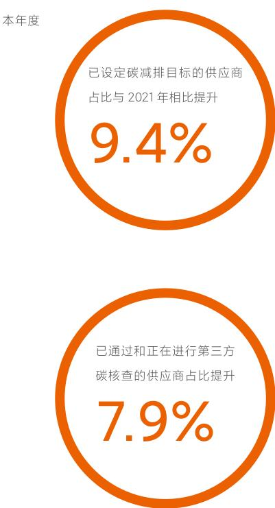
  

<--- Page Split --->

## 新供应商准入  

我们将可持续性指标与成本、质量和服务交付结合起来，在将业务给予供应商时做出更加全面、平衡、明智的决定。在供应商准入阶段，我们同时考虑以下三个维度的标准：  

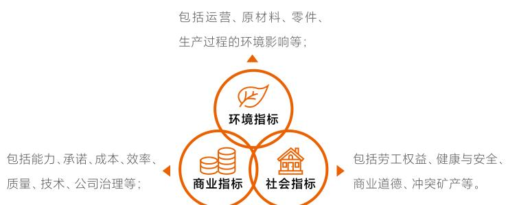
  

我们将持续ESG合规作为小米供应商准入与审核的重要考核标准之一。在供应商审核阶段，如供应商存在红线问题，小米将拒绝其进入供应商资源池直至其审核完成。我们要求新供应商在开展合作前签署《小米集团供应商社会责任行为准则》或《供应商社会责任协议》，其中包含遵守国际公认的劳工权益保护标准和劳动惯例等，以及工作场所安全标准和行为准则。  

本年度，小米共完成830家供应商准入评估，其中通过770家通过，60家因整改超时或不符合标准而被淘汰。其中，我们：  

通过第三方现场审核发现一起与商业道德相关的不符合情况，根据《小米集团供应商社会责任行为准则》拒绝其进入小米供应商资源池；  

通过第三方现场审核发现一起缺少消防备案、环评报告等文件的问题，因此审核结论为不通过；要求该供应商完成对仓库及车间的重新规划及相关环评备案后，方可向小米申请复审。  

30小米红线要求包括：禁止使用童工并有效保护未成年工、禁止强迫劳动和使用暴力、禁止非法的雇佣歧视、工作时间记录必须真实可信、不得低于当地法律规定的最低工资标准、保障工人的健康安全、有效控制消防风险、禁止非法排放有毒有害废弃物、及禁止任何形式的商业贿赂。  

  

## 审核与绩效  

在供应商审核方面，我们通过小米审核、小米认可的第三方审核与自审汇报的方式，对资源池内供应商进行ESG风险管理，我们亦对不同产品线供应商特点设立了有针对性地审核方案，并遵照集团制度对供应商ESG绩效进行审核。  

针对审核中识别的不符合项，我们要求供应商限期完成整改，如无法按时完成整改，我们将视情况暂停或终止与供应商的合作。  

下表列举了我们对供应商审核的关键绩效指标以及本年度目标达成情况。  

<table><tr><td>指标</td><td colspan="3">生产型供应商</td><td>非生产型供应商</td><td>2022 年目标检视</td></tr><tr><td rowspan="2"></td><td>一级 (组装工艺提供商)</td><td>二级 (零部件提供商)</td><td>三级 (主要为锡、钽、钨、金、钴、云母原材料提供商)</td><td></td><td></td></tr><tr><td>ESG 审核比例</td><td>100% 完成年小米审核与小米认可的第三方审核</td><td>100% 完成小米审核、小米认可的第三方审核或自审汇报</td><td>通过负责任矿产保证程序(RMAP)认证的冶炼厂/精炼厂数量占95%</td><td>准入审核达到100%</td></tr></table>

<--- Page Split --->

## 冲突矿产  

冲突矿产我们遵守经济合作与发展组织（OECD）“受冲突影响地区和高风险地区矿产供应链的尽职调查指导方针”及负责任矿产倡议（RMI），承诺产品中不使用直接或间接资助当地武装组织的冲突矿产。本年度，我们进一步识别了供应链中的冲突矿产风险，更新了《小米集团冲突矿产政策》31，明确了相关风险防范工作程序，主要包括：  

## 尽职调查程序  

## 行为准则  

建立、规划与制定冲突矿产政策、尽责调查程序与保障措施，并确认内部人员相关权责。  

鉴别供应链中有风险的区域，并设置回应所鉴别风险的相关程序。  

要求供应商进行冶炼厂与精炼厂的尽职调查，每年一次要求供应商使用小米冲突矿产管理模板或负责任矿产倡议（RMI）的冲突矿产报告范本/矿物报告扩展模板（CMRT/EMRT）提供冶炼厂或精炼厂信息，且必要时要求冶炼厂与精炼厂进行相关认证。  

依供应商回复以及其他形式的尽职调查结果进行确认与分析，确认矿产非来自冲突矿区。  

按照承诺披露尽责调查确认后的冶炼厂或精炼厂相关信息清单，并公开披露年度冶炼厂与精炼厂清单。  

持续与供应商沟通来改善回复率并提升冶炼厂信息的正确性。  

提供利益相关方冲突矿产沟通渠道。  

提供员工与供应商关于冲突矿产政策与尽责调查相关培训。  

认同责任商业联盟（RBA）的倡议、程序、标准。  

支持RBA负责任矿产倡议（RMI）计划和工作组的工作成果。  

使用参照了RBA冲突矿产报告模板/矿物报告扩展模板（CMRT/EMRT）和责任矿产保证流程设计的小米冲突矿产管理模板及程序。  

供应商有义务协助小米间接或直接与冲突矿物的冶炼厂或精炼厂进行外联。  

参考实施RBA行为准则，其中包括冲突矿产的尽职调查，参考RBA批准的第三方审计机构清单独立开展审计，并汇报纠正措施以确保符合规范。  

要求上游供应商参照RBA与其他国际协会联盟行为准则进行负责任矿产管理。  

确立政策以保证不直接或间接的支持金融犯罪以及人权侵害。

<--- Page Split --->

## 冲突矿产认证  

冲突矿产认证我们持续对产品中锡、钽、钨、金（“3TG”）、钴与云母的来源开展供应链端的全面溯源，以确保相关原材料来自于无争议矿产。本年度，我们共识别出来自全球58个国家与地区的436家上游冶炼厂／精炼厂。其中，通过负责任矿产保证程序（RMAP）认证的冶炼厂／精炼厂数量占 \(95\%\) ；对于尚未取得认证的冶炼厂／精炼厂，小米要求供应商通过  

委托第三方按照RMAP的要求对冶炼厂／精炼厂完成尽职调查并获得认证，或替换成已获得认证的冶炼厂／精炼厂。我们将逐步建立冶炼厂／精炼厂名单披露机制，并持续加强供应链在冲突矿产管理方面的合规与信息披露能力建设，保证供应链合规透明。  

2022年小米冶炼厂／精炼厂获得RMAP认证的数量与占比  

<table><tr><td>矿产</td><td>获得认证的冶炼厂／精炼厂占比</td><td>冶炼厂／精炼厂数量</td></tr><tr><td>锡</td><td>100%</td><td>80</td></tr><tr><td>钽</td><td>100%</td><td>38</td></tr><tr><td>钨</td><td>100%</td><td>53</td></tr><tr><td>金</td><td>100%</td><td>173</td></tr><tr><td>钴</td><td>76%</td><td>90</td></tr><tr><td>云母</td><td>100%</td><td>2</td></tr></table>  

  

## 供应商赋能  

## 供应链金融  

供应链金融小米供应链金融源自实体智造、服务实体智造，始终坚守技术立业的定位，保持行稳致远的节奏，发挥深耕产业的优势，运用数字科技手段，持续推动实体企业、中小企业、智能制造产业链和供应链的数字化升级，协同银行等金融机构精准响应供应链企业金融需求。截至报告期末，小米供应链金融已帮助超过14,000家实体企业获得了累计超过2,500亿元的资金。  

## 供应商培训  

供应商培训小米持续为供应商提供有关提升ESG治理与绩效方法的培训，以英语、中文以及其他当地语言通过组织现场培训与行业交流、专项咨询、改进评比等方式，促进供应商提升ESG表现。本年度，我们组织了涵盖劳工权益、职业健康、生产安全、产品质量、环境保护、商业道德、气候变化等议题的培训活动，覆盖 \(100\%\) 的生产型供应商。  

## 供应链碳盘查  

供应链碳盘查本年度，我们开展了针对关键性、战略性产品供应商的碳盘查工作，以促进供应商进一步低碳减排，推进集团价值链碳中和目标的实现。我们参考ISO14064以及温室气体议定书（GHG Protocol）建立了供应商排放核算标准要求，形成了小米供应商碳排放核算标准体系。  

以手机供应链为例  

共118家供应商设立了碳减排目标。  

  

64家供应商已通过或正在进行第三方温室气体排放数据核查。  

50家供应商使用了太阳能、风能和水能等可再生能源。

<--- Page Split --->

## 员工共同成长  

人才是小米实现高质量技术创新，并在行业激烈竞争中保持领先地位的关键。我们通过在全球范围内制定有竞争力的招聘、雇佣、福利和激励政策，提供安全舒适的工作环境、包容开放的文化氛围吸引多元化人才，设计与各类人才发展相匹配的培训，培养、激励与保留满足企业发展需  

求的专业人才。本年度，小米获得了多项该领域荣誉称号，包括入选福布斯“2022年全球最佳雇主”榜单、福布斯中国“2022年中国年度最佳雇主”“2022中国年度最具可持续发展力雇主”等。  

## 员工权益与多元化  

## 员工招聘与雇佣  

我们依照公平、公正、公开的原则制定了如《员工手册》等适用于全球运营范围的政策，明确了关于招聘、雇佣、解聘等内容。我们根据国际劳工组织（ILO）与经济合作与发展组织（OECD）等国际组织的相关要求以及运营地相关规定，在《员工手册》中制定了禁止雇佣童工、禁止非自愿劳动与强迫劳动的要求。同时，我们在《员工手册》中明确了禁止歧视、骚扰、虐待、暴力等内容，规定在招聘过程中杜绝任何带有歧视、偏见的言语、行为和决策，同时提供培训以支持员工更好的理解相关议题。本年度，  

## 员工薪酬与激励  

小米坚持“全面薪酬”与“以绩效为导向”的薪酬理念，通过制定完善的薪酬体系与奖励机制，为员工提供有竞争力的薪酬待遇。小米《员工手册》中明确提出员工薪酬与激励的设置机制，便于员工理解薪酬构成。  

## 绩效管理  

为保障绩效评定的合理性，小米制定了完善的绩效管理机制，每季度或半年邀请员工进行自我评价、主管评价、同事评价等多维度评价。同时，员工可以通过绩效申诉机制进行申诉与反馈，以保障员工的绩效评价公平客观，同时确保绩效薪酬的合理性。我们亦制定了严格的保密制度以保证申诉过程及申诉人信息及隐私的安全。  

## 员工股权激励  

小米重视人才的长期激励，积极推行股权激励机制。2022年，董事会合计授予9,457选定参与者3,663亿股奖励股份32  

## 员工沟通与员工关怀  

## 员工参与和沟通  

小米重视员工平等以及员工对公司运营提出的建议。我们设置了内外部在线平台、电话热线、邮箱等多元化沟通渠道，并通过召开员工会议为员工提供有关运营建议的反馈平台。本年度，我们通过线上与线下投票的形式，由职工代表会通过了《小米集团违规违纪行为处理办法》实施的决议。  

小米工会持续使用员工需求数字化平台作为员工反馈渠道。我们通过该平台支持员工进行匿名或实名意见反馈，并定期公布解决方案或直接进行问题解决追踪响应。本年度，反馈平台收到的所有反馈问题均已解决。  

## 员工满意度调查  

我们保持每半年通过问卷的方式收集员工对于公司组织管理状况和满意度的反馈，综合分析员工敬业度、投入度、忠诚度和认可度，并根据反馈情况对员工集中反馈的问题制定改善或提升计划以全面支持员工的职业生涯。  

在最近一次的满意度调研中，全部员工参与了调研，超87%的员工进行了有效反馈。结果显示，员工整体满意度得分相较年初提升约2.5%，计划在公司留任3年以上的员工占比相较年初提升约3.5%。  

## 育儿假  

我们为所有员工提供了育儿假，覆盖主要照顾者与非主要照顾者。本年度，共2,426名员工享受了育儿假，育儿假结束后返岗率达到100%。

<--- Page Split --->

## 多元化与平等  

小米始终致力于打造平等多元的职场。我们认为开放和包容的环境将加速创新的涌现，我们倡导接受不同和独特的观点，并以此为原则提供多种工具和资源以构建多元化的工作氛围，打造多元、包容、文化交流的职场。  

## 平等尊重  

我们为不同国籍、种族、年龄、性别、信仰和文化背景的员工提供包容、公平的发展和管理机会。我们成立了妇女工作委员会，专注于支持女性员工在职场、家庭方面的权益和健康福祉。我们每年为女性员工设置专项表彰活动，提高员工的平等意识，以防止可能损害平等文化的无意识偏见。  

## 小米印度办公室多元化与平等政策及措施  

小米印度制定了“Diversity- Equality- Inclusion”政策明确了建立更具包容性和多元化工作场所的愿景以及实施方法。本年度，小米印度女性员工占比提升了 \(4\%\)  

小米印度亦制定了性别中立的“Prevention of Sexual Harassment”政策，旨在确保小米印度为所有性别的员工提供安全的工作环境。小米印度亦设立了内部投诉委员会（Internal Complaints Committee）以保证政策顺利实施。  

## 技术文化  

我们努力构建一个极致效率和专注创新的工程师文化。我们接受差异，汇集不同员工的力量进行创新，提供多元的渠道和资源令所有员工自由创新和展示自我。我们通过举办“百万美金技术大奖”“小米技术嘉年华”“小米黑客马拉松”“数据挖掘比赛”等活动激发多元的技术碰撞，其中一场比赛共提交了16项专利申请；推出“技术圈”“我在小米做技术”系列专访等互动内容，进一步倡导自由和包容的文化氛围。  

## 2022年小米技术嘉年华  

本年度，我们以“探索未来”为主题举办了小米技术嘉年华，通过技术分享交流、展示体验、竞技游戏等方式，借助云游戏、web3.0等技术，全方位展示小米核心技术成果，分享前沿技术知识和实践，内容涵盖硬件、软件、人工智能、互联网技术等诸多领域。活动充分开放给所有小米员工进行平等自由地交流、探索、碰撞、展示的机会，超过44,000人次参与了该活动。  

<--- Page Split --->

## 人才培养与发展  

## 员工晋升  

小米为员工提供公平、开放和畅通的晋升机会。我们通过制定合理的考核标准，公平对待员工的常规晋升，同时也为做出重大贡献的员工提供激励机制和奖励晋升通道。  

## 员工培训  

我们为全球范围员工提供全方位的培训。我们成立了小米集团发展部，以全方位培养小米人才、高效率提升组织能力为使命，致力于全方位、体系化、高效率地培养小米人才。我们为各层级员工提供包括通识教育、企业文化、前沿科  

技、管理技能等方面的课程，通过提升员工的职业素养、专业能力和领导力，解决业务问题、提升组织能力，推动实现小米战略发展目标。  

## 培训体系  

为持续提供匹配员工发展特点的培训项目，本年度，我们建立了更完善的人才发展体系。我们设置了面向全体员工的公开课以及面向新进员工的“新人培训”体系；为满足不同职级、不同职责员工的发展需求，设置了通用力、领导力和专业力培训，全方位提升员工职业素养与专业技能。同时，我们注重提升课程培训质量，通过课程研发与讲师的培养提升课程覆盖面与专业度，并通过数字化平台建设提升培训效率。2022年，我们共认证了308位集团讲师，研发新课程超过100门。  

2022年，我们共认证了集团讲师  

308位  

2022年，研发新课程超过  

100门  

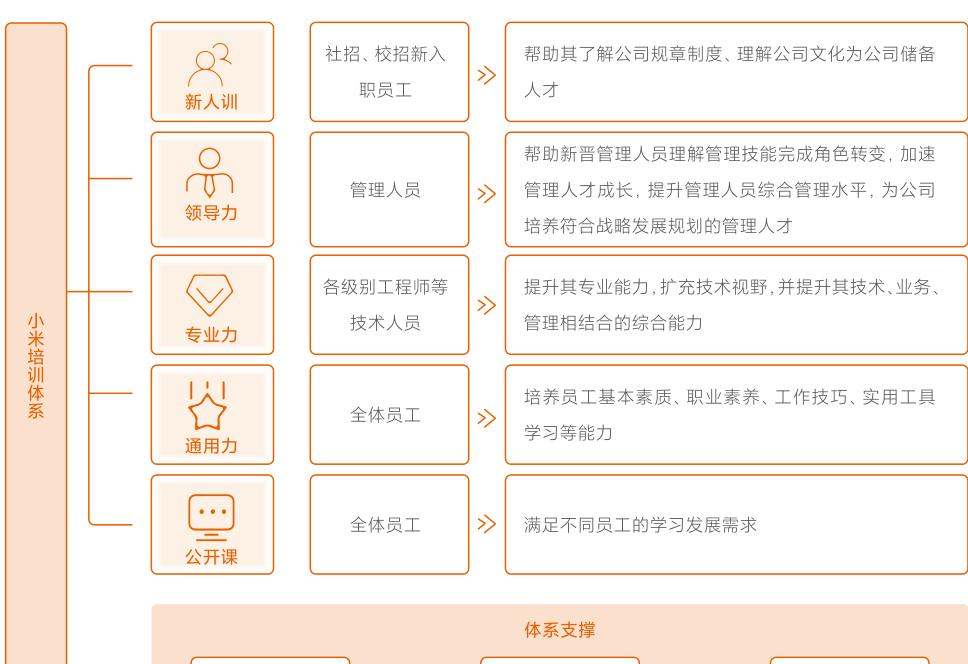
  

我们十分重视通过培训协助新员工融入公司，并迅速提升其职业与专业技能。本年度，我们持续开展针对全体新员工以及实习生的培训，共完成约60万小时的新人培训，新增141门课程。我们增设了覆盖全新员工的线上与线下课程，以帮助其更快地了解公司文化及规则制度，增强员工对公司文化的理解以及团队归属感，2022年共完成课时超1万小时。  

作为一家以科技为基础的公司，我们重视对科技人才领导能力的培养，不断推出面向中、高层管理、技术序列接班人培养课程，并组织内外部经验交流，助力其拓宽技术视野。本年度，我们共开展了20门课，总计课时达到87小时，覆盖约280名员工。  

本年度，我们积极与顶尖高等院校与研究院等机构合作，邀请专业人事为员工提供如人工智能、机器人、新材料、5G通信技术等方面的课程。我们持续为企业培养优秀接班人，开设了“冰凌计划”，为集团中高层技术员工提供技术战略规划能力、技术领导能力以及业务理解能力培训，共覆盖63人。  

我们亦提供了覆盖全体正式员工、实习生和兼职员工的职业能力认证体系，如项目管理专业人员（PMP）国际认证与国家专业技术职称评定等。本年度，小米共有458人获得中国科学院工程技术系列专业技术职称。  

我们亦对新入职外包员工进行与正式员工相同的培训，包括公司文化、制度、办公工具使用等课程内容。我们同时为外包员工建立了线上学习小组，实时为其解答相关问题。

<--- Page Split --->

## 员工健康福祉  

## 安全工作环境  

我们始终相信，人是小米最宝贵的财富，环保、健康和安全（EHS）是集团发展的重要基础和核心竞争力。我们满足运营地相关法律法规要求，持续努力创造良好的EHS管理文化氛围，致力于让每个员工都能在健康安全的环境中工作生活。我们严格按照ISO14001:2015与ISO45001:2018标准建立和实施EHS管理体系。  

  

## 健康安全管理架构  

我们设立了专职的EHS管理组织，建立了由最高管理层组成的安全委员会，该委员会负责持续实施、促进、监督和改进集团相关制度与管理措施。集团各级管理人员负责其业务范围内的EHS管理工作，通过对工作现场的风险源进  

  

## 风险评估与应对  

我们通过组织相关管理人员对可能具有EHS风险的因素进行识别，并利用LEC3法评估风险发生的可能性与严重性，根据评估结果，制定并实施有效的风险管理措施。我们  

行识别、管理与整改实现安全风险闭环管理。各运营部门对员工进行EHS培训，通过开展培训和文化活动，增强员工的安全环保意识。  

通过定期巡检、监测和评估，确保风险管理措施可以全面有效的运行，降低健康安全风险。  

## 年度实验室危险源识别和巡检  

每年，我们筛选出典型实验室进行深入调研，识别一、二类危险源，确定控制措施。本年度，开展实验室用电、消防等专项巡检工作，针对发现的隐患问题立即进行整改。  

本年度，我们组织了EHS专家培训项目，共有22位EHS内审员取得第三方认证的专业资格证书，有效提高了内部EHS审计的质量和能力。  

  

## 健康安全措施  

本年度，我们持续通过增加健康安全设备、增强危险区域管理、配置专业人员、保障员工身心健康：  

·设立医务室以及配置专业医疗人员，承接员工日常接诊、理疗和应急安全问题的处理工作；  

·在自有办公区大堂、员工服务中心、大型会议室等场所配置专业自动体外除颤器（AED），并组织AED急救演习训练；  

·在对员工健康可能造成潜在危险的区域（如实验室）设置警示牌，设置区域进入权限。  

我们持续对自有食堂安全进行了第三方飞行检查，确保食堂工作与用餐环境以及食品的安全。我们亦制定了《小米食堂员工行为规范》对食堂员工安全行为进行了指导与规范。我们通过向员工提供免费基础非处方药品与其他医疗卫生用品，保障员工生命安全。本年度，我们累计发放了相关药品、药包、试剂等医疗卫生用品共超24,000份。此外，我们共组织20余次健康防疫知识宣传，提升员工健康知识，并为员工设置了24小时服务热线解答健康相关问题。  

累计发放了相关药品、药包、试剂等医疗卫生用品共超  

24,000份

<--- Page Split --->

## 安全健康意识培训  

本年度，我们对员工开展了包括消防演习与实验室场景等方面的健康安全意识培训，增强员工健康安全防范保护意识，主要包括：  

- 对员工开展灭火相关内容的培训，以及消防应急救援技术检查和演练；- 开展了3次实验室安全培训，包括安全操作规程、应急处理、危险及有害物质管控等内容，共145人次参加了该培训，覆盖全部实验室相关部门。  

我们亦持续为员工提供健康安全相关的员工支持计划（Employee Assistance Program，EAP）项目，本年度，我们开展了线下心理咨询活动，共625人次参加，同时开展了线上心理直播课服务，共12场。  

## 健康保障  

小米关注员工身心健康，鼓励工作与生活的平衡，实施弹性工作制，为员工提供包括多元化体检、额外保险、特色活动、节日礼品等福利内容，覆盖全体正式员工、实习生及兼职员工。本年度，我们对园区图书馆、健身房的设备进行了升级改造，提升员工使用体验。  

我们持续为有不同需求的员工提供有针对性地体检，特别设置了可选择的女性体检项目。同时，我们为员工亲属提供了针对不同年龄、性别的体检折扣，鼓励员工关注家人身体健康。我们亦为员工提供每月一天的带薪病假，为员工提供健康便利。同时，我们为有不同需求的员工及员工家属配置了额外保险，包括：  

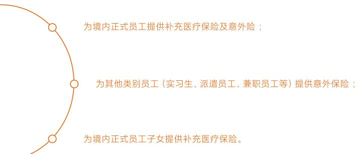
  

## 社会责任延伸  

我们始终相信世界因科技而变得更加美好的理念，秉承“以科技赋能公益发展，以公益推动科技创新”的使命。我们主动通过与用户、社区、政府、研究机构等相关方的沟通，识  

别社会不同需求，并将科技发展的理念融入支撑教育、科技推广等活动。我们亦积极参与志愿服务、紧急救灾、扶危济困等活动以回馈社会。  

## 支持教育  

推动科技教育是社会发展的重要基石之一。小米作为以科技为基础的创新型企业，希望通过主动发挥在科技、智能制造、人工智能等领域的积累，助力社会科技人才的成长。本年度，我们持续通过小米公益基金会设立的“小米奖助学金”项目以及新设立的“小米青年学者”项目支持科技人才教育与发展，我们：  

  

通过“小米奖助学金”项目资助了2,120名品学兼优或家境贫困的学生，共支出约1,500万元。截至2022年底，该项目已在全国20所高校落地；  

  

启动了“小米青年学者”项目资助高校青年教师与科研人员，鼓励在科技领域有创造力的年轻人潜心从事科研与教学工作，该项目计划捐赠5亿元，覆盖100所高校。截至本报告期末，该项目已覆盖30所高校；  

另外，我们启动了“Xiaomi Education”项目，旨在通过科技激励和帮助全球青年为世界创造价值。本年度，该项目通过与当地慈善机构合作，向菲律宾、越南、泰国与马来西亚的1,000余位学生与贫困儿童捐赠了小米液晶书写板。

<--- Page Split --->

## 灾害预警  

灾害预警本年度，我们对手机地震监测预警系统进行了升级，通过与中国和印度尼西亚防灾减灾机构共同合作，在印度尼西亚发布了产品地震预警功能，将该功能覆盖面扩充至海外地区。同时，国家知识产权局公布了我们与成都高新减灾研究所申请的的地震监测预警方法专利。截至本报告期末，通过小米平台自愿参与地震监测的用户达18万余人。2022年，我们在全球成功推送4级以上地震的预警近4,000万次。  

截至本报告期末，通过小米平台自愿参与地震监 2022年，我们在全球成功推送4级以上地震的预 测的用户达 18 万余人 警近 4,000 万次。  

## 紧急救灾  

紧急救灾本年度，我们通过小米公益基金会参与境内外自然灾害救援活动，如向四川地震救援、重庆山火扑救等自然灾害救援工作捐赠物资；小米印度向超1,000个受阿萨姆邦洪水灾害影响的家庭捐赠了4吨食物与卫生用品等物资。  

## 乡村振兴  

乡村振兴人才振兴是乡村振兴的基础。小米始终致力于利用自身科技实力助力科技人才的发展。2022年小米公益基金会用于乡村振兴的支出为594万元。  

自2018年以来，我们通过学业资助和技术课程支持，与地方院校合作培养管理与科技人才，助力人才振兴。截至本报告期末，该项目已惠及近600名学生。  

## 环境生态保护  

环境生态保护本年度，我们在小米公益平台上线了以生态保护为主题的公益项目，涵盖了野生动物保护、流浪动物救助、生态环境保护等领域，助力生物多样性、水资源、森林与自然生态的保护。其中，“守护栖息地任鸟飞”项目旨在通过知识普及、科学研究、政策倡导等方式推动中国候鸟及其栖息地的生态保护；“守三江水护万物源”项目旨在维繁三江源地区自然生态系统的原真性，实现三江源地区人与自然的和谐共存。  

## 志愿项目  

志愿项目小米持续鼓励员工参与公益活动。我们积极组织员工参加志愿服务、公益捐赠等活动，传递爱心与社会责任。本年度，我们：  

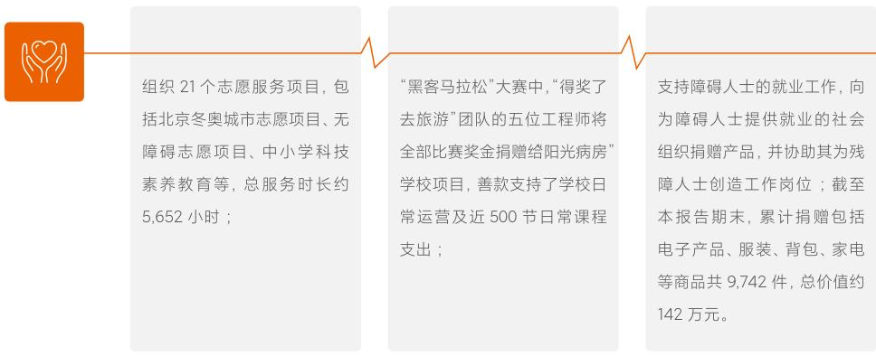
  

此外，感谢与我们一起参与公益项目的米粉志愿者们。本年度，小米公益基金会开展了“小米公益同行2022”项目，联合16家公益机构在中国9个城市举办了9场线下公益活动，吸引了超过300名“米粉”志愿者的参与，志愿服务时长超600小时。

<--- Page Split --->

05
管治与合规
GOVERNANCE AND COMPLIANCE 

<--- Page Split --->

## 董事会声明  

小米集团董事会相信，持续完善ESG管理体系，有利于小米集团的可持续发展。董事会已委任董事会企业管治委员会在集团可持续发展委员会的支持下监管小米集团的ESG事宜。董事会参与制定并推动公司的ESG战略发展，定期审阅公司ESG关键风险并提出应对建议。  

小米集团通过制定有效的策略，以保持集团对环境与社会的影响与业务目标实现平衡，推动集团的可持续发展。小米集团已经制定ESG战略，董事会每半年一次获取用于评估ESG风险所需数据，每半年一次讨论审阅该等策略及措施，以评估不同ESG情况会如何影响财务状况，检讨和确保与集团发展策略相一致。董事会参与了ESG风险与机遇的评估及厘定，其中重大风险包括供应链风险、产品与服务质量风险、数据安全与隐私保护风险等。小米集团董事会审核委员会协助董事会与管理层团队监督风险管理及内  

部控制体系的设计、执行及管理情况，具体情况在本年报企业管治报告”章节详述并由董事会审阅批准。  

本年度，董事会研讨了对业务影响较大的和小米利益相关方密切关注的ESG议题，例如气候变化、供应链管理等议题，具体评估过程结果在本报告“利益相关方沟通”及“实质性议题分析”小节详述。  

本年度，董事会检讨、审阅了小米集团碳减排目标，具体内容详见本报告“科技减少碳足迹”小节。董事会亦对小米集团设立的与业务运行相关的环境目标完成进度进行了审阅，并就该等目标的调整情况进行审阅、检讨并提出建议，目标审阅结果详见本报告“环境目标与目标检讨”小节。  

本报告已由董事会于二零二三年三月四日审阅批准。  

## ESG管理策略及管理架构  

我们已将ESG管理全面融入我们的业务运营及管理中，作为公司发展策略的一部分。本年度，我们完善了包含治理层、管理层和执行层的ESG管理架构。我们通过风险管理及控制识别ESG重大风险并主动应对，以指导运营及业务的可持续发展。我们亦在价值链推广ESG理念，以提升价值链的可持续发展。  

董事会通过工作汇报的形式听取相关ESG工作的进展，并监督ESG措施的实施情况。最高管理层有责任和权力确保以整体目标为方向，实施ESG战略和投资。集团总裁与其  

他高级管理者一起领导可持续发展委员会。该委员会由与ESG相关的管理人员组成，致力于识别与ESG相关的风险，制定与可持续发展相关的战略、目标、计划并审查实施结果。可持续发展委员会每半年向董事会企业管治委员会汇报集团ESG工作，检讨上一阶段目标完成情况和工作成果，并提出下一阶段工作计划与目标的建议。在执行层面，ESG工作组负责协调集团内外部资源，指导并支持职责部门落地行动计划，呈报绩效。同时，ESG工作组按照季度召开例会，分享和讨论与可持续发展相关议题的进展及对业务的影响。  

## ESG管理策略及管理架构  

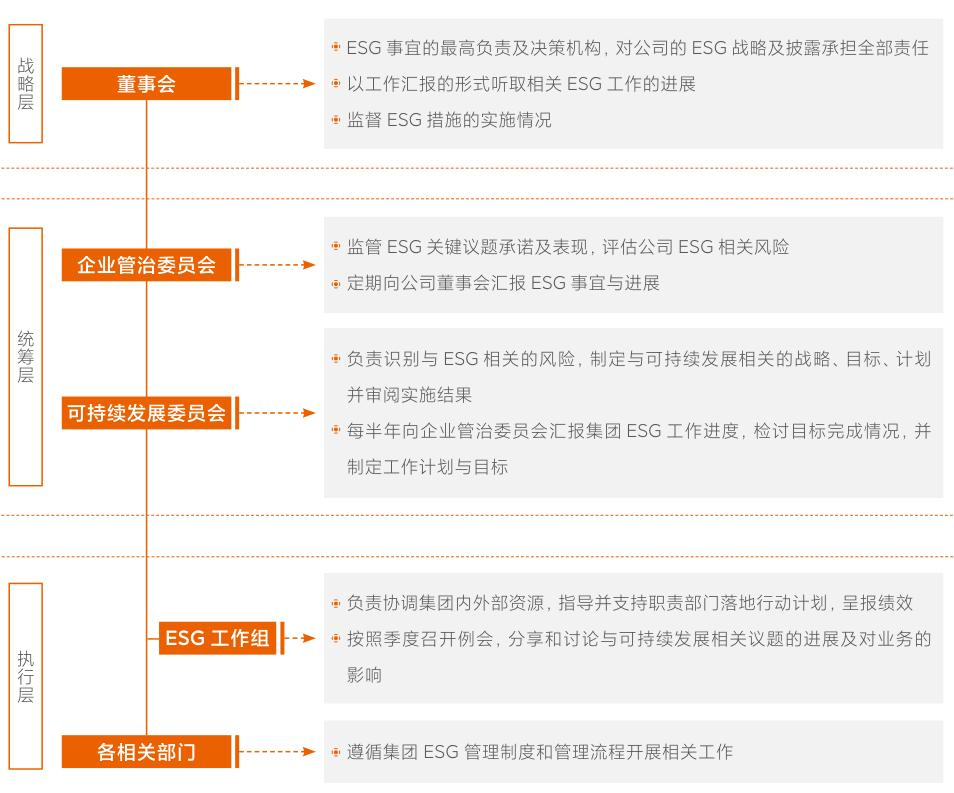
  

我们广泛地与利益相关方互动，以传递小米的可持续发展理念。我们重视产品与服务质量、科技探索与普惠、数据安全与隐私保护、可持续供应链、气候行动、员工、社会责任延伸等议题对公司的影响以及公司在相关议题上的贡献。

<--- Page Split --->

  

## 利益相关方沟通  

利益相关方沟通小米积极倾听并响应利益相关方的期望，根据实际业务及运营特点识别了下表所列利益相关方，建立了有效的沟通机制和多元的沟通渠道，努力确保在我们做决定时考虑利益相关方的意见和建议。  

## 实质性议题分析  

实质性议题分析为充分了解各利益相关方对于小米在ESG管理方面工作的评价和期望，并更好地响应利益相关方要求，我们通过以下四个步骤对ESG议题进行了识别、评估和排序。  

<table><tr><td>主要利益相关方</td><td>主要沟通渠道</td></tr><tr><td>用户</td><td>官方网站及应用软件、实时通讯软件、用户服务渠道、用户满意度调查、产品发布会、社交媒体、米粉活动</td></tr><tr><td>股东及投资者</td><td>股东周年大会、年报/中期报告、业绩公告、投资者会议和活动、新闻稿/公告、调研和问卷</td></tr><tr><td>员工</td><td>员工交流会、员工反馈邮箱、内部办公软件、工会、员工满意度调查、培训、内部公告</td></tr><tr><td>供应商</td><td>供应商会议、商务谈判、供应商审核、培训、调研、技术合作</td></tr><tr><td>运营商</td><td>高层对话、商务及技术会议、企业社会责任专题会议、商务谈判、调研及问卷回应</td></tr><tr><td>监管机构</td><td>常规问询、政策咨询、高层会面、报告程序、现场考察、政府机构会议交流</td></tr><tr><td>媒体与非政府组织</td><td>社交媒体、发布会、新闻稿/公告、媒体采访、项目合作、调研及问卷回应</td></tr><tr><td>社区</td><td>社区活动、发布会、公益活动、社交媒体</td></tr></table>  

## 步骤一：背景分析  

我们基于公司运营情况与未来发展方向，结合行业现状、主要运营地政策关注要点，对公司可持续发展内部及外部背景进行了分析。  

## 步骤三：实质性议题分析  

我们通过问卷调查的方式对实质性议题进行分析。本年度，我们面向各利益相关方，共收集5,069份有效问卷，与相关领域专家共同进行了实质性议题分析与讨论，对各利益相关方角色的意见和对实质性议题重要程度的排序进行了公允、平衡的分析，按“对小米集团运营对经济、环境与社会的影响”及“对利益相关方做出与小米有关决策时的影响”两方面生成最终的实质性议题矩阵图。  

## 步骤二：议题识别  

基于背景分析，我们共识别出16项实质性议题，包括4项环境类议题，8项社会类议题，1项管治与合规类议题以及3项包容性创新类议题。  

## 步骤四：参考专家、集团董事会与管理层建议  

集团董事会及管理层团队对实质性议题分析结果进行了审阅和批覆，并结合经营情况提供了可持续发展建议。我们亦参考了行业专家针对实质性议题评估结果的分析以及发展建议。

<--- Page Split --->

本年度，结合公司运营与发展特点以及为回应利益相关方关切，我们主要增加或调整了包括低碳影响力、科技探索与普惠、科技无障碍、伙伴共赢等利益相关方关注的议题。  

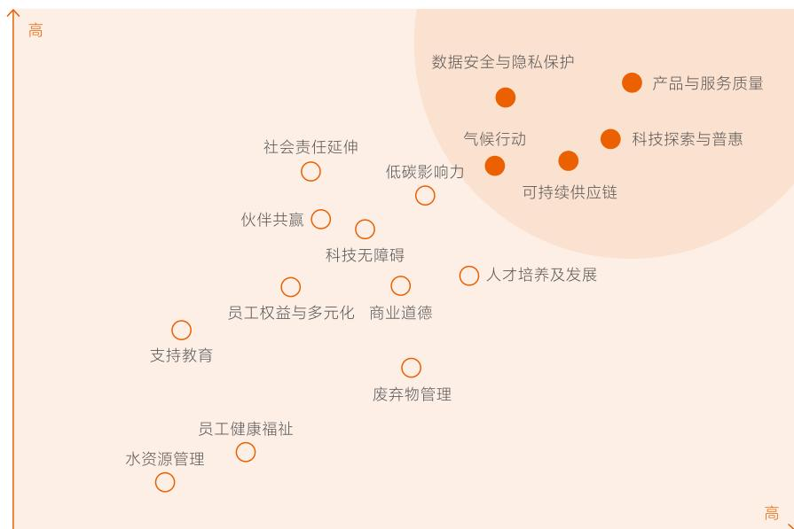

小米集团运营对经济、环境与社会的影响
  

<table><tr><td colspan="3">实质性议题重要性排序</td></tr><tr><td>高度重要议题</td><td></td><td></td></tr><tr><td>产品与服务质量</td><td>数据安全与隐私保护</td><td>气候行动</td></tr><tr><td>科技探索与普惠</td><td>可持续供应链</td><td></td></tr><tr><td>一般重要议题</td><td></td><td></td></tr><tr><td>低碳影响力</td><td>伙伴共赢</td><td>支持教育</td></tr><tr><td>人才培养及发展</td><td>商业道德</td><td>员工健康福祉</td></tr><tr><td>社会责任延伸</td><td>员工权益与多元化</td><td>水资源管理</td></tr><tr><td>科技无障碍</td><td>废弃物管理</td><td></td></tr></table>  

## 商业道德  

## 商业道德管理体系  

小米始终坚持合法、合规且符合道德规范的经营理念。2022年，我们成立了小米集团职业道德委员会，集团最高管理层直接听取该委员会相关工作汇报，负责对公司职业道德方面的工作进行规划、监督和开展员工教育。该委员会为公司违规违纪人员进行审查和问责的最高机构，并向董事会汇报公司关于反贪腐、反舞弊等商业道德的管理情况。同时，安全监察部负责集团商业道德监察和保障体系建设、制度完善、意识宣贯等工作。《小米集团员工手册》  

## 反贪腐  

我们始终倡导“阳光、公正、透明、廉洁”的职场文化，始终秉承对腐败“零容忍”，做到反贪腐管理“全覆盖、无禁区”。本年度，我们持续优化管理架构、完善管理政策并加大反贪腐预防教育，营造积极健康的阳光职场。我们持续更新优化对于公司员工、供应商、以及其他合作伙伴的反贪腐政策，如在《小米集团员工违规违纪行为处理办法》中，我们重新梳理了违规违纪的类型和种类，并进一步明确了员  

## 廉洁意识宣贯  

年度公司开展了有关反贪腐动态、法律法规、案例分享、举报投诉、利益报备等方面的培训。在董事会层面，公司于2022年3月对全体董事会成员进行了反贪污培训和廉洁监察工作汇报。在员工层面，我们通过线上、线下的方式，对全部类别员工（管理层、一线员工、应届生、实习生与兼职员工）开展了相关培训，覆盖100%的员工。在合作伙伴层面，我们对供应商等合作伙伴开展了包含上述内容的培训。2022年，我们总共开展反贪腐相关培训累计时长超55,000小时，超50,000人次参与。  

中包含相关准则和条例，明确要求员工的业务行为需遵守相关法律法规和道德规范，并为员工遵守相关规范提供指引。职业道德委员会负责与人力资源部等相关部门共同监督公司对《员工手册》《小米集团员工行为准则》《小米集团诚信廉洁守则》等管理办法的执行情况。有关小米集团商业道德内容请参考公司官网“可持续发展”页面（https://www.mi.com/csr）。  

工违规违纪行为问责流程。同时，我们于2022年发布了新版《商业廉洁协议》，并将该协议添加至与供应商等合作伙伴的合同文件中。  

2022年，公司涉及1宗前员工贪腐案件并已审结。涉案员工因违反《中华人民共和国刑法》第一百六十三条“非国家工作人员受贿罪”，被判处有期徒刑六个月，罚金人民币10,000元。  

2022年，我们总共开展反贪腐相关培训累计时长超  

55,000 小时，超50,000 人次参与。

<--- Page Split --->

  

## 举报机制  

公司持续沿用举报人管理体系，确保举报渠道安全、畅通、可靠、有效。在举报人保护方面，本年度，我们在《小米集团举报人奖励制度》的基础上，更新并发布了《小米集团举报人保护和奖励办法》，对举报人保护的保密管理与  

奖励获取渠道等方面的流程进行了明确，包括规定了由独立调查小组管理举报受理途径与受理举报时的场所保密性等内容。我们为举报资质行为提供公开渠道，举报途径包括：  

## 反洗钱  

我们严格遵守如《中华人民共和国反洗钱法》和中国人民银行《法人金融机构洗钱和恐怖融资风险自评估指引》以及其他运营所在地适用的法律法规与惯例，全面履行境内外反洗钱和反恐怖融资义务。我们持续实施《洗钱和恐怖融资风险自评估实施细则》，并通过数字化管理系统监测、评估有潜在风险的交易、用户、投融资等活动。我们设置了反洗钱与反恐怖融资小组，负责预防、监管和处理涉及反洗钱风险的相关业务。  

## 反垄断与反不正当竞争  

我们高度重视反垄断及反不正当竞争合规，建立了集团层面的反垄断与反不正当竞争合规体系。同时，我们将反垄断与反不正当竞争作为《小米集团员工行为准则》的要求之一。我们制定了《反垄断合规手册》，明确了垄断协议、滥用市场支配地位、经营者集中合规与反垄断调查程序等内容，指导业务合规开展。2022年，我们组织了境内外共17场反垄断培训，累计超900名员工参加。本年度，小米未发生有关垄断与不正当竞争的法律诉讼事件。  

## 知识产权保护  

创新驱动是小米的内生动力，我们建立了强有力的知识产权保护体系，以开放友好的方式在保护自身知识产权的同时，尊重他人的知识产权。我们建立了涵盖专利布局、商标与品牌、版权、开源、数据安全与隐私保护等多个领域的知识产权管理体系，由集团法务部负责统筹集团知识产权相关管理工作，由各业务线的知识产权专员推动管理工作落实。  

同时，我们积极参与行业交流，与业内合作伙伴共同探索多元、共赢、可持续的知识产权合作关系，以自身司法实践经历，为行业提供最佳实践案例，推动行业知识产权保护发展。本年度，我们正式发布了首部《小米知识产权与创新白皮书》，总结归纳了小米在知识产权保护方面的实践。  

## 广告合规  

我们遵守如《中华人民共和国广告法》《互联网广告管理暂行办法》以及其他运营所在地适用的法律法规与惯例。集团相关职责部门联合开展广告合规管理工作，对小米各项产品和服务的广告内容与质量、广告投放方资质等严格把控。我们遵循各发布平台的广告素材规范和投放审核要求，提供合法合规的广告素材内容，以及对应的合法资质和内容真实有效的相关证明材料，经平台审核通过后方可发布。我们亦建立了广告投诉处理流程，各部门针对相关投诉调查反馈，提升广告管理水平。  

## 商标及品牌权益  

我们严格遵守如《中华人民共和国商标法》以及其他运营所在地适用的法律法规与惯例。我们颁布了《小米集团品牌使用和管理制度（试行）》，规范了商标合规使用、商标确权和商标维权等管理制度。我们亦持续坚持打击品牌权力被冒用、滥用和盗用的维权活动，防止侵犯小米品牌和商标行为的发生。本年度，我们境内外平台线上治理项目全年累计下架侵权链接、侵权社交媒体账号等111万余个，关闭各类侵权链接22万余个，账号、域名、应用软件（APP）共计25个；协助海关防控假货进口，全年查扣超过15万件假货产品；协助相关机构处理刑事及打假案件，查处假货超89万件。  

<--- Page Split --->

## 2022年度TCFD特别报告  

## 治理  

小米的董事会在企业管治委员会的协助下全面监督公司气候相关议题的管理。可持续发展委员会是小米负责气候相关议题管理的最高层级委员会。可持续发展委员会下设ESG工作组，负责协调公司内外部资源，指导并支持各职责部门的落地行动计划。有关小米气候治理的更多信息，请参见“ESG管理策略及管理架构”一节。  

## 战略  

2022年，小米通过参照TCFD建议，回顾行业实践和气候出版物，以及与内部利益相关方进行接触，评估了公司在中国大陆地区的三大主营业务（智能手机、IoT和生活消费产品、互联网服务）以及既有设施的气候相关风险和机遇。  

遵循TCFD建议，我们对各情境下短期（2年内）、中期（2030年前）和长期（2040年前）气候相关风险与机遇做了情景分析，考虑了以下两个情景：  

表1.气候相关转型和物理风险分析  

<table><tr><td>转型风险</td><td>4°C以上情景</td><td>2°C以内情景</td></tr><tr><td>政策和法规风险</td><td>低影响</td><td>高影响</td></tr><tr><td>限制导致气候变化以及促进缓解气候变化的政策和法规</td><td>·缓和的制冷剂管控和淘汰政策 ·较为宽松的产品能效标准 ·无面向生产设施的强制性能效要求 ·碳市场覆盖范围较低，碳价水平较低 ·生产者责任延伸制度覆盖范围较低</td><td>·碳市场覆盖范围纳入工厂、数据中心等设施，碳价水平较高 ·面向生产设施强制且严格的能效要求 ·严格且范围更广的产品能效标准 ·更严格的制冷剂管控和淘汰政策，企业被给予严格的生产和消费配额 ·政府出台有关环境标签的声明指引 ·生产者责任延伸制度覆盖范围更广</td></tr><tr><td>技术风险</td><td>低影响</td><td>高影响</td></tr><tr><td>支持经济体系低碳转型的技术改良或创新</td><td>·产品最低限度地采用低碳技术 ·回收材料的投资和使用规模较小</td><td>·产品广泛采用低碳技术 ·工厂实现大比例电气化 ·数据中心PUE大幅降低 ·低效设施可能提前淘汰</td></tr></table>  

<table><tr><td>4°C以上情景</td><td>2°C以内情景</td></tr><tr><td>基于RCP8.5和IEA STEPS，即延续既有政策，2100年相比前工业化时期温升4°C以上；</td><td>基于RCP2.6和IEA NZE 2050，即按2050零碳转型路径，2100温升在2°C以内。</td></tr></table>

<--- Page Split --->

小米集团  

<table><tr><td>转型风险</td><td>4°C以上情景</td><td>2°C以内情景</td></tr><tr><td>市场风险</td><td>低影警</td><td>高影警</td></tr><tr><td>消费者倾向可持续的产品导致的供需变化</td><td>·绿色消费行为在少量群体中流行，市场对环保产品的需求有限，或无法接受绿色溢价 ·市场对智能制造系统解决方案的需求增长较慢 ·能源市场以化石能源为主导，可再生能源价格高于化石能源</td><td>·绿色消费行为在大量群体中流行，市场对环保产品的需求大幅提高，并广泛接受一定程度的绿色溢价 ·主要市场将智能性纳入制造系统解决方案采购的必要条件 ·能源市场以可再生能源为主导，化石能源价格高于可再生能源</td></tr><tr><td>声誉风险</td><td>低影响</td><td>中影响</td></tr><tr><td>外界对组织对低碳经济贡献的印象</td><td>·少量消费者运动导致投入损失和/或损失增长机会</td><td>·大量消费者关注可持续性导致投入损失和/或损失增长机会</td></tr></table>  

作为一家全球化的创新型科技企业，小米善于通过技术创新和高效率模型提供解决方案。我们将气候变化因素纳入我们向用户交付“最酷的产品”的全过程，系统地思考如何将低碳特性与小米的战略与品牌进行结合，持续开发和优化环境友好的科技和产品，将扩大正向环境影响作为助力全球零碳目标的主要路径。  

表2.2C以内情景气候相关机遇分析  

<table><tr><td></td><td>2°C以内情景将带来的新机遇</td><td>我们实现机遇的优势和举措</td></tr><tr><td>互联互通</td><td>·室内场景下，系统性资源管理的需求增高 ·居家和办公场景中，最大限度地节约资源（节能、节地、节水、节材）、保护环境和减少污染，为人们提供健康、适用和高效的使用空间的智能管理系统需求增高。</td><td>·小米在互联互通、开放共享的丰富场景中建立了开源开放的物联生态和全场景调控生态。 ·截至2022年12月31日，全球小米AIoT设备接入数达到5.89亿，拥有5个及以上连接至小米AIoT平台上的设备的用户数达到1,160万。 ·人工智能语音助手“小爱同学”通过协同唤醒，唯一应答与集中控制等功能，有效节省了冗余的计算、感知和硬件设备。</td></tr><tr><td>极致效率</td><td>·产品和服务的资源与能源效率将对消费者偏好产生更显著积极影响 ·再生材料可得性将显著增加</td><td>·小米长期以来追求极致效率，包括产品的材料利用效率、材料的环境效率、产品的能源利用效率、产品流通效率，在实现成本控制优势的基础上提升产品的低碳优势，提升消费者对产品可持续特性的感知。</td></tr><tr><td>绿色电力</td><td>·电力市场中平价绿色电力可获得性持续年提高 ·建筑和交通场景能源消费再电气化的趋势加强</td><td>·我们已经开始规划绿电采购方案，逐步提升主要业务的生产运营设施的电能占比和绿电占比，以实现2040年前近零碳排放目标。</td></tr></table>

<--- Page Split --->

<table><tr><td></td><td>2°C以内情景将带来的新机遇</td><td>我们实现机遇的优势和举措</td></tr><tr><td rowspan="3">清洁技术</td><td>·热泵式、空气能家电设备快速发展</td><td rowspan="3">·2022年，小米在清洁科技领域研发投入在整体研发投入的占比超50%，关注更智能、高效、绿色的生产工艺和AIoT产品解决方案开发，包括人工智能、物联网、智能制造、新型电气和电池管理、易回收再生材料等技术领域。</td></tr><tr><td>·AIoT和智能家居大范围取代传统家居市场</td></tr><tr><td>·IoT设备配备能源管理和监测功能成为主流</td></tr><tr><td rowspan="3">新市场机会</td><td>·公众应对气候变化带来的自然灾害需求将增加</td><td rowspan="3">·我们将扩展AIoT产品应用场景和种类，以支持居住和办公场景下用户参与建筑脱碳的行动。</td></tr><tr><td>·零碳转型路径中，办公建筑和居住建筑脱碳需要用户行为转变，AIoT设备将出现更多应用场景、需求持续增加</td></tr><tr><td>·小米智能手机操作系统MIUI开发了“自然灾害预警”功能，预警信息来自中国国家预警中心，为应对自然灾害、有效避险提供更广泛的信息技术支持。</td></tr></table>  

为了有效应对气候相关挑战并把握机遇，小米正在加速向低碳模式转变。我们将努力确保我们2040近零目标的实现。小米将以自身减碳为起点，通过供应商低碳能力培训、碳数据与目标管理、减碳项目推进等措施积极推进产品及价值链低碳转型，并致力于通过科技创新和技术变革加速构建零碳产品及零碳价值链，与上下游合作伙伴共同打造绿色生态圈。表3总结了我们应对气候相关风险的典型措施。  

表3.气候相关风险的典型应对措施  

<table><tr><td>转型风险</td><td>应对措施</td></tr><tr><td>政策和法规风险</td><td>·与第三方合作建立回收制度</td></tr><tr><td>利用领导力推动行业发展</td><td>·与第三方合作开发产品碳足迹评估流程和方法学模型</td></tr><tr><td>技术风险</td><td>·对现有建筑进行能效改造和将能效要求融入新建筑设计的设计阶段。</td></tr><tr><td>改变生产和运营的方式</td><td>·在新建工厂中采用高效的自动化技术</td></tr><tr><td>市场风险</td><td>·在产品设计阶段之初设立能效目标，从软件和硬件层面推动产品能效的最优化，持续推动产品使用阶段的能效提升。</td></tr><tr><td>拥抱可持续性满足市场需求</td><td>·在产品租和包装中使用生物基和回收材料，在全球开展产品回收计划，对二手产品进行以旧换新或废旧拆解。</td></tr><tr><td>·在部分市场供官翻版产品</td><td></td></tr><tr><td>·考虑投资或研发热泵式设备</td><td></td></tr><tr><td>·基于自建工厂经验开发智能工厂解决方案</td><td></td></tr><tr><td>声誉风险</td><td>·定期通过各种渠道披露公司可持续发展相关信息，每年度通过ESG报告、绿色债券报告等渠道向利益相关方披露企业环境行动。</td></tr><tr><td>确保环境绩效的透明可信</td><td></td></tr><tr><td>·每年度测算典型产品的生命周期碳足迹</td><td></td></tr></table>  

<table><tr><td>物理风险</td><td>应对措施</td></tr><tr><td>急性风险</td><td>·制定紧急事件解决方案 ·优化物流路径，缩短运输距离</td></tr><tr><td>长期风险</td><td>·对现有建筑进行能效改造和将能效要求融入新建筑设计的设计阶段 ·专注高质量和高能效产品的研发推广，树立小米品牌绿色美誉度</td></tr></table>

<--- Page Split --->

## 风险管理  

小米通过风险管理框架管理运营中的气候风险。该框架旨在确保小米面临的气候风险得到妥善管理，以减少负面风险的影响并抓住机遇。小米遵循“立即行动、切实可行、稳步推进、持续改进”的原则，分阶段实现自身运营及价值链层面的碳减排目标。在碳减排计划实施的过程中，小米将  

优先通过既有建筑节能改造、低碳建筑规划和设计、运营能效提升、可再生能源使用等自主减排措施最大程度减少自身运营碳排放，并通过购买政策及标准认可的碳汇产品实现最终的碳减排目标。  

## 小米的风险管理流程如下：  

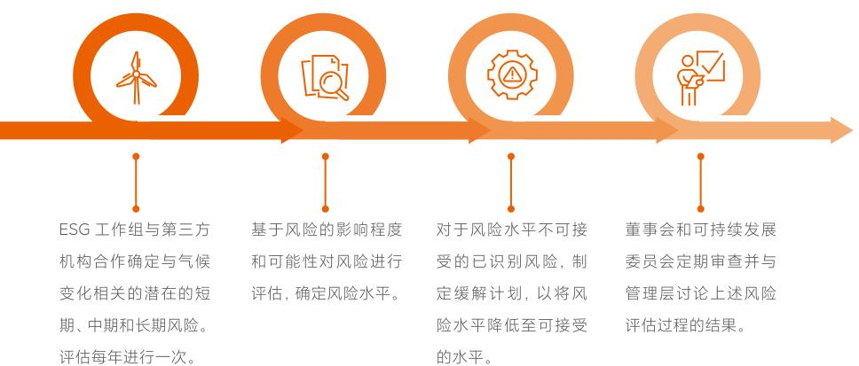
  

## 指标和目标  

小米遵照ISO Net zero guidelines (IWA 42:2022)相关要求，制定了2040年具备实现净零碳排放条件的目标，有关指标和目标的更多信息，请参见“碳盘查”一节。  

## 关键ESG绩效指标36  

## 关键环境绩效37  

基于小米现有的运营模式，2022年，小米关键环境绩效如下：  

<table><tr><td></td><td>2022</td><td>2021</td><td>2020</td></tr><tr><td colspan="4">使用量</td></tr><tr><td>综合能源消耗总量(兆瓦时)38</td><td>144,741.38</td><td>144,626.56</td><td>118,397.58</td></tr><tr><td>直接能源消耗量(兆瓦时)</td><td>5,190.84</td><td>8,691.42</td><td>5,586.69</td></tr><tr><td>间接能源消耗量(兆瓦时)</td><td>139,550.54</td><td>135,935.14</td><td>112,810.89</td></tr><tr><td>温室气体排放总量—范围1、范围2 (吨二氧化碳当量)</td><td>85,742.61</td><td>82,820.16</td><td>66,481.29</td></tr><tr><td>直接温室气体排放量—范围1 (吨二氧化碳当量)</td><td>7,122.60</td><td>9,096.95</td><td>8,402.12</td></tr><tr><td>输入能源间接温室气体排放量—范围2</td><td>78,620.01</td><td>73,723.21</td><td>58,079.17</td></tr><tr><td>范围3温室气体排放(吨二氧化碳当量)</td><td colspan="3">预计于 12,368,223.29 — 2023年7月披露</td></tr><tr><td>用水总量(吨)39</td><td>510,156.05</td><td>463,663.00</td><td>303,132.92</td></tr><tr><td>自来水用量(吨)</td><td>391,953.85</td><td>329,572.00</td><td>187,339.02</td></tr><tr><td>中水用量(吨)</td><td>118,202.20</td><td>134,091.00</td><td>115,793.90</td></tr><tr><td>无害废弃物(吨)</td><td>7,052.28</td><td>6,328.88</td><td>4,661.07</td></tr><tr><td>有害废弃物(吨)</td><td>1.43</td><td>2.50</td><td>0.37</td></tr><tr><td>产品包装材料使用总量(吨)40</td><td>5,065.08</td><td>—</td><td>—</td></tr></table>

<--- Page Split --->

<table><tr><td></td><td>2022</td><td>2021</td><td>2020</td></tr><tr><td>使用强度41</td><td></td><td></td><td></td></tr><tr><td>单位营收能源消耗 （兆瓦时/百万元人民币）</td><td>0.52</td><td>0.44</td><td>0.48</td></tr><tr><td>人均能源消耗（兆瓦时/人）</td><td>4.45</td><td>4.33</td><td>5.36</td></tr><tr><td>单位营收温室气体排放量 （吨二氧化碳当量/百万元人民币）</td><td>0.31</td><td>0.25</td><td>0.27</td></tr><tr><td>人均温室气体排放量（吨二氧化碳当量/人）</td><td>2.63</td><td>2.48</td><td>3.01</td></tr><tr><td>人均自来水用量（吨/人）</td><td>12.04</td><td>9.86</td><td>8.49</td></tr><tr><td>人均无害废弃物（吨/人）</td><td>0.22</td><td>0.19</td><td>0.21</td></tr><tr><td>人均有害废弃物（千克/人）</td><td>0.04</td><td>0.07</td><td>0.02</td></tr><tr><td>单位营收产品包装材料使用量 （吨/百万元人民币）</td><td>0.02</td><td>—</td><td>—</td></tr></table>

# 环境目标与目标检讨

本年度，我们对2021年制定的环境目标完成情况进行了检讨，并制定了更全面、覆盖更广泛价值链环节的环境目标：

<table><tr><td>领域</td><td>2021 目标</td><td>本年度目标完成情况</td><td>2022 目标</td></tr><tr><td>能源</td><td>相较2020 年，自有办公区人均能耗于2026 年下降5 ％。</td><td>完成，2022 年较2020 年自有办公区人均能耗下降19.18</td><td>至2026 年，将ISO 50001 认证场所的万元收入能源消耗较2021 年基线减少至少2 . 5 ％。</td></tr><tr><td>温室气体</td><td>相较2020 年，自有办公区人均温室气体排放于2026 年下降4 . 5 ％。</td><td>完成，2022 年较2020 年自有办公区人均温室气体排放下降21.12％</td><td>2022 年目标请见“科技减少碳足迹”章节。</td></tr><tr><td>水</td><td>自有办公区人均用水量不高于2020 年水平。</td><td>完成</td><td>每年自有办公区再生水使用率不低于30 %；年度 节水量不低于50,000 立方米。</td></tr><tr><td>废弃物</td><td>自有办公区的无害废弃物均实施垃圾分类；有害废弃物100 ％由有资质的供应商进行无害化处理。</td><td>完成</td><td>我们将继续保持原目标，并制定了与产品生命周期末端处理相关的电子废弃物回收目标，详情请见“循环经济与电子废弃物”章节。</td></tr></table>

董事会已审阅2021年制定的环境目标的检讨结果，并审阅批准了2022年制定的最新目标。

41本年度，为更全面的体现环境绩效数据，我们整合了环境绩效中有关强度的指标，并披露了近三年的数据。

# ·关键社会绩效

员工人数42

<table><tr><td></td><td>2022</td><td>2021</td><td>2020</td></tr><tr><td>员工总数</td><td>35,977</td><td>35,415</td><td>24,810</td></tr><tr><td>按雇佣类型划分</td><td></td><td></td><td></td></tr><tr><td>全职员工</td><td>32,543(90.46%)</td><td>33,427(94.39%)</td><td>22,074(88.97%)5.36</td></tr><tr><td>其他类型员工</td><td>3,434(9.54%)</td><td>1,988(5.61%)</td><td>2,736(11.03%)</td></tr><tr><td>以下分类按全职员工总人数进行细分</td><td></td><td></td><td></td></tr><tr><td>按性别划分</td><td></td><td></td><td></td></tr><tr><td>男性员工</td><td>21,961(67.48%)</td><td>22,222(66.48%)</td><td>14,539(65.86%)</td></tr><tr><td>女性员工</td><td>10,582(32.52%)</td><td>11,205(33.52%)</td><td>7,535(34.14%)</td></tr><tr><td>按年龄划分</td><td></td><td></td><td></td></tr><tr><td>30 岁以下员工</td><td>12,823(39.40%)</td><td>14,605(43.69%)</td><td>10,446(47.32%)</td></tr><tr><td>30-50 岁员工</td><td>19,440(59.74%)</td><td>18,556(55.51%)</td><td>11,510(52.14%)</td></tr><tr><td>50 岁以上员工</td><td>280(0.86%)</td><td>266(0.80%)</td><td>118(0.53%)</td></tr><tr><td>按岗位划分</td><td></td><td></td><td></td></tr><tr><td>技术人员</td><td>15,961(49.05%)</td><td>14,592(43.65%)</td><td>10,484(47.49%)</td></tr><tr><td>非技术人员</td><td>16,582(50.95%)</td><td>18,835(56.35%)</td><td>11,590(52.51%)</td></tr><tr><td>按职级划分43</td><td></td><td></td><td></td></tr><tr><td>高级管理层</td><td>322(0.99%)</td><td>306(0.92%)</td><td>250(1.13%)</td></tr><tr><td>高级管理层-男性</td><td>266(0.82%)</td><td>—</td><td>—</td></tr><tr><td>高级管理层-女性</td><td>56(0.17%)</td><td>—</td><td>—</td></tr><tr><td>中级管理层</td><td>13,223(40.63%)</td><td>12,183(36.45%)</td><td>7,385(33.46%)</td></tr><tr><td>中级管理层-男性</td><td>9,773(30.03%)</td><td>—</td><td>—</td></tr><tr><td>中级管理层-女性</td><td>3,450(10.60%)</td><td>—</td><td>—</td></tr><tr><td>基层员工</td><td>18,998(58.38%)</td><td>20,938(62.64%)</td><td>14,439(65.41%)</td></tr><tr><td>基层员工-男性</td><td>11,923(36.64%)</td><td>—</td><td>—</td></tr><tr><td>基层员按地区划分</td><td>7,075(21.74%)</td><td>—</td><td>—</td></tr></table>

42员工总数统计范围为小米集团全职员工以及其他与小米有直接雇佣关系的兼职员工和实习生。

43本年度小米持续完善集团员工数据统计口径，在职级划分的员工分类中增加按性别的员工分类。

<--- Page Split --->

员工流失率44   

<table><tr><td></td><td>2022</td><td>2021</td><td>2020</td></tr><tr><td>员工流失率</td><td>13.96%</td><td>12.82%</td><td>12.36%</td></tr><tr><td>按性别划分</td><td></td><td></td><td></td></tr><tr><td>男性员工</td><td>13.32%</td><td>12.07%</td><td>11.97%</td></tr><tr><td>女性员工</td><td>15.27%</td><td>14.30%</td><td>13.11%</td></tr><tr><td>按年龄划分</td><td></td><td></td><td></td></tr><tr><td>30岁以下员工</td><td>17.09%</td><td>15.11%</td><td>13.33%</td></tr><tr><td>30-50岁员工</td><td>12.05%</td><td>11.06%</td><td>11.21%</td></tr><tr><td>50岁以上员工</td><td>3.21%</td><td>9.40%</td><td>39.83%</td></tr><tr><td>按地区划分45</td><td></td><td></td><td></td></tr><tr><td>中国</td><td>12.98%</td><td>12.81%</td><td>12.27%</td></tr><tr><td>境外</td><td>25.80%</td><td>12.92%</td><td>13.51%</td></tr></table>  

工伤发生率  

<table><tr><td>年度</td><td>因工亡故人数</td><td>因工亡故率46</td><td>因工损失工作天数（天）47</td></tr><tr><td>2022</td><td>0</td><td>0.00%</td><td>816</td></tr><tr><td>2021</td><td>0</td><td>0.00%</td><td>500</td></tr><tr><td>2020</td><td>148</td><td>0.0045%</td><td>469</td></tr></table>  

44 流失率 = 汇报年度离职员工人数/汇报年度末期员工人数 \(\times 100\%\) 45 本年度，小米将按地区划分流失率的统计口径调整为中国与境外两部分，并对2021年与2020年的对应数据进行了重述。46 因工亡故比率 = 因工亡故人数/员工总人数 \(\times 100\%\) 47 经当地人力资源与社会保障局认定的工伤事件导致损失的工作天数。48 因交通事故导致身亡。  

培训及发展49   

<table><tr><td></td><td>2022</td><td>2021</td><td>2020</td></tr><tr><td>受训百分比</td><td></td><td></td><td></td></tr><tr><td>总体受训百分比</td><td>97.67%</td><td>97.42%</td><td>—</td></tr><tr><td>按性别划分</td><td></td><td></td><td></td></tr><tr><td>男性员工</td><td>97.05%</td><td>97.29%</td><td>—</td></tr><tr><td>女性员工</td><td>98.96%</td><td>97.68%</td><td>—</td></tr><tr><td>按职级划分</td><td></td><td></td><td></td></tr><tr><td>高级管理层</td><td>91.01%</td><td>87.84%</td><td>—</td></tr><tr><td>中级管理层</td><td>95.91%</td><td>96.82%</td><td>—</td></tr><tr><td>基层员工</td><td>99.01%</td><td>97.91%</td><td>—</td></tr><tr><td>受训平均小时数</td><td></td><td></td><td></td></tr><tr><td>总体受训平均小时数</td><td>35.57</td><td>25.76</td><td>—</td></tr><tr><td>按性别划分</td><td></td><td></td><td></td></tr><tr><td>男性员工</td><td>36.95</td><td>25.94</td><td>—</td></tr><tr><td>女性员工</td><td>32.72</td><td>25.39</td><td>—</td></tr><tr><td>按职级划分</td><td></td><td></td><td></td></tr><tr><td>高级管理层</td><td>19.30</td><td>15.31</td><td>—</td></tr><tr><td>中级管理层</td><td>25.91</td><td>18.85</td><td>—</td></tr><tr><td>基层员工</td><td>42.57</td><td>29.94</td><td>—</td></tr></table>  

专项培训  

<table><tr><td>培训内容</td><td>2022年累计课时（小时）</td><td>2022年累计受训人次（人）</td></tr><tr><td>数据安全与隐私保护意识</td><td>963,732</td><td>42,207</td></tr><tr><td>安全技术</td><td>29,799</td><td>19,866</td></tr><tr><td>反贪污</td><td>57,041</td><td>51,820</td></tr></table>

<--- Page Split --->

## 新人培训通识课程  

<table><tr><td>项目名称</td><td>2022年参加人数/课程门数/累计课时</td><td>2021年参加人数/课程门数/累计课时</td></tr><tr><td>繁星计划</td><td>3,839人/438门课程/累计课时236,671小时</td><td>3,571人/305门课程/累计课时359,802小时</td></tr><tr><td>启明星计划</td><td>106人/8门课程/累计课时742小时</td><td>85人/4门课程/</td></tr><tr><td>小米实习生</td><td>2,000人/9门课程/累计课时26,000小时</td><td>339人/8门课程/累计课时3,729小时</td></tr></table>  

## 管理人才培养项目  

<table><tr><td>项目名称</td><td>2022年累计课时(小时)</td><td>2022年累计受训人次(人)</td></tr><tr><td>星火计划</td><td>1,250</td><td>1,070</td></tr><tr><td>火炬计划</td><td>750</td><td>389</td></tr><tr><td>燃计划</td><td>105</td><td>84</td></tr><tr><td>焰计划</td><td>44</td><td>44</td></tr></table>  

## 产品及服务的投诉数目  

<table><tr><td>项目名称</td><td>全球范围有责客诉数量</td></tr><tr><td>2022</td><td>76,874</td></tr><tr><td>2021</td><td>88,336</td></tr></table>  

## 认证与覆盖范围  

<table><tr><td>项目名称</td><td>2022（范围）</td></tr><tr><td>ISO 37001</td><td>小米集团</td></tr><tr><td>ISO 27001</td><td>小米集团</td></tr><tr><td>ISO 14001</td><td>智能手机的研发、生产外包管理和销售</td></tr><tr><td>ISO 45001</td><td>智能手机的研发、生产外包管理和销售</td></tr></table>  

## 供应商地区分布  

<table><tr><td>地区</td><td>与硬件制造相关的供应商（个）</td></tr><tr><td>中国</td><td>989</td></tr><tr><td>境外</td><td>36</td></tr></table>

<--- Page Split --->

<--- Page Split --->
