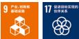
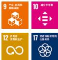
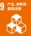
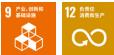
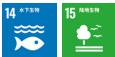
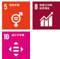
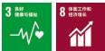
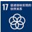
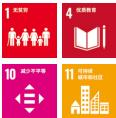
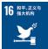

## 2024 小米集团 环境、社会及管治报告

## 目录

关于本报告 01 附录1：关键绩效 95    
董事长致辞 02 附录2：指标索引 102    
董事会声明 03 附录3：独立审验报告 108

## 01

## 智能向实，智能向善

硬核科技引领 05  
产品与服务质量安全 17  
信息安全与隐私保护 26  
科技普惠 29

## 03

## 人才向优，伙伴向荣

人才涵养 58  
可持续供应链 68  
社区共生 76

## 02

## 产链向绿，生态向衡

气候减缓与适应 34  
废弃物管理 45  
自然资源管理 52

## 04

## 治理向稳、合规向严

公司治理 81  
商业道德 83  
利益相关方沟通 87  
重要性议题分析 88

## 关于本报告

本报告为小米集团（以下简称「集团」或「我们」）发布的第七份环境、社会及管治（以下简称「ESG」）报告，本报告旨在客观、公允地反映小米集团及其列入年报范围的附属公司2024年在ESG方面的策略、管理和实践情况。

报告遵循香港联合交易所《上市规则》附录 C2《环境、社会及管治报告守则》要求编制。报告同时参考全球报告倡议组织（GRI）《可持续发展报告标准》、国际可持续准则理事会（ISSB）发布的《国际财务报告准则 S1 号——可持续相关财务信息披露一般要求》（IFRS S1）和《国际财务报告准则 S2 号——气候相关披露》（IFRS S2）、以及可持续发展会计准则委员会（SASB）标准等披露框架，并结合联合国可持续发展目标（SDGs）编写。

在本次报告编制过程中，依据「重要性」「量化」「平衡」及「一致性」的汇报原则，兼顾「准确性」「清晰性」「可比性」「完整性」「时效性」「可验证性」以及可持续发展背景，以界定报告的内容及信息的呈列方式。

本集团已委托莱茵技术（上海）有限公司对选定的ESG关键绩效指标依据国际鉴证业务准则《AA1000审验标准第三版》执行部分绩效指标高度（合理保证）鉴证和部分指标绩效中度（有限保证）鉴证，更详细的鉴证程序及鉴证报告结论请参考附件「独立保证鉴证声明」。

本报告的报告期为2024年1月1日至2024年12月31日（以下简称「2024年」「本年度」或「报告期内」）。为增强报告的可比性、完整性以及数据的连续性，部分披露内容亦覆盖至其他时间。

本报告的资料和案例主要来自于2024年度集团统计报告、正式文件及财务报告。如无特殊说明，本报告中所涉及货币种类及金额均以人民币为计量单位。

本集团承诺本报告不存在任何虚假记载及误导性陈述，并对内容的真实性准确性和完整性负责。

本报告建议与集团年报所载的「企业管治报告」章节以及载于集团官网「ESG与可持续发展」页面（https://www.mi.com/csr）和「小米集团2024年TCFD报告」一并阅读。

本报告于2025年4月以中文、英文两种语言发布，如文本存在差异，以中文版为准。

若对本报告有任何建议或意见，请通过以下方式与我们联系：

电子邮箱：mi-esg@xiaomi.com

## 董事长致辞

2024 年 11 月，在第二十九届联合国气候大会（COP29）上，集团发布了全新的「以硬核科技为驱动」的可持续发展战略。我们更加专注于产品普惠和科技平权，围绕「人车家全生态」战略，为消费者创造低碳、高效、智能的可持续生活方式。作为全球领先的消费电子及智能制造公司，我们始终坚信企业要想长远、稳健的发展，不仅需要关注短期的经济利益，更要在大家都关注的环境、社会及管治等重要议题上增强韧性，以风险管理的方式应对全球共同面临的各类复杂变化。

为实现更加绿色的未来，集团积极推动低碳转型发展。我们将能源管理贯穿于业务运营的全链条，覆盖职场办公、生产制造、物流运输、门店运营等多个环节。同时，我们亦从选用节能设备、改用绿色能源、优化能效管理等多个角度，探索更加低碳的运营模式。本年度，我们在小米汽车工厂投用16.2兆瓦分布式光伏发电站，总面积达到154,579平方米，预计年减少碳排放近万吨。此外，我们积极引领供应链合作伙伴迈向绿色转型。2024年，我们向智能手机供应商提出，到2030年，智能手机业务的供应商年均碳减排量（较2024年）不低于5%，绿电使用比例不低于25%；到2050年，智能手机业务的供应商绿电使用比例达到100%，以持续降低范围3碳排放。

我们高度重视循环经济议题，致力于通过产品设计、产品耐用性、翻新再利用、回收与报废等综合策略，促进电子废弃物的减少以及循环经济的发展。针对产品生命周期末端的处置，我们积极推动电子废弃物的回收与利用，并对全球电子废弃物合作伙伴进行严格的资质审查，包括ISO 9001、ISO 14001、ISO 27001以及零填埋认证与国际电子废弃物R2等国际认证，确保回收与处理过程的合规与环保。

社会责任方面，我们秉承「人才培养」「科技创新」与「社区共生」三个关键词，致力于让全球每个人都能享受科技带来的美好生活。人才培育方面，我们不断健全劳工权益保障机制，优化招聘与激励体系，赋能员工职业发展，吸引并保留全球优秀人才。科技创新方面，小米集团坚持将「技术创新」作为企业核心驱动力，大规模投入底层核心技术，逐步实现对关键技术环节的掌握与主导。同时我们助力科技创新与青年创新型人才培养，截至2024年末已规划捐赠超17亿元。社区共生方面，我们在全球化战略基础上，有效带动当地就业，积极推进当地基础设施建设，在环境保护、公益慈善、灾害援助等领域采取了多项举措，给运营地社区带来了显著务实的民生改善。

为持续推动各 ESG 重要性议题的管理提升，集团也一直坚持强化 ESG 治理。我们以高效的企业治理维护各相关方利益，并确保我们的运营活动符合最高的道德责任标准。同时，在企业治理实践中，我们坚守合法合规经营，在反腐败、反洗钱、反不正当竞争、利益冲突管理、知识产权保护等多个方面建立健全管理办法，对一切违反商业道德的不当行为零容忍，积极建设廉洁文化。坚持智能向实，智能向善是人工智能科技服务社会进步的核心要义，满足人们对美好科技生活的向往是创新的重点。今年恰逢小米集团成立 15 周年，我衷心感谢每一位合作伙伴和用户的支持与信任。我相信，这是一个新起点，我们会秉持初心，坚持带来更多令人振奋的创新和突破，并通过对可持续发展的追求，加速实现建设更美好未来的承诺。

创始人、董事长兼 CEO 雷军

## 董事会声明

小米集团确立以硬科技为驱动的 ESG 战略，将人工智能（以下简称 AI）普惠、全生态可持续发展与硬核科技责任作为目标，响应集团「人车家全生态」战略，致力于通过硬核科技和 AI 创新，为消费者提供可持续的智能生活方式。

董事会相信，建立健全ESG治理体系是小米集团持续深化并践行有效ESG策略的基石。董事会已任命董事会企业管治委员会，在集团可持续发展委员会的支持下，全面督导并推进集团ESG各项事务的有序实施。同时，集团不断完善ESG各重要性议题下的政策、制度、工作流程规范，以提供有效指导。随着全球法规、倡议、指引、标准文件的更新，董事会将定期审阅，保证集团各项ESG事务符合相关方要求。

小米集团已将关键 ESG 风险管理全面融入集团的整体风险管理体系，确保企业在长期发展中尽可能的规避风险，把握机遇。高级管理层和各运营部门负责人积极参与关键 ESG 风险的识别与评估，并基于风险的可能性、影响程度及发展趋势，制定切实可行的风险应对措施。董事会将持续定期审议 ESG 相关工作，回顾核心风险并提出针对性策略，深切把握 ESG 机遇，持续推动业务可持续增长。

报告期内，随着小米智能电动汽车业务的正式上线，集团「人车家全生态」战略形成闭环。董事会充分考量集团ESG各重要性议题的潜在影响，指导、督促新业务尽快树立ESG事务规范，确保其与集团整体可持续发展目标保持一致。同时，董事会全面评估集团全球业务线同步、高速发展需求，重点关注可持续供应链管理、产品与服务质量、AI发展、循环经济等关键ESG风险领域，每半年对ESG重点工作进行审议，讨论并审查ESG指标与数据表现，评估ESG战略对集团整体运营及财务表现的影响，并持续推动战略优化与调整改进。此外，董事会审查并评估了集团碳减排目标及本年度相关进展，详见本报告「气候指标与目标」章节。

董事会依据双重重要性原则，积极与各利益相关方保持沟通，了解其高度关注的ESG议题，从而为集团重要性议题订立优先次序，分配相适应的资源以保障有效管理，详见本报告「利益相关方沟通」及「重要性议题分析」章节。

本报告已由小米集团董事会于2025年3月18日正式审议并通过。

## 01

## 智能向实，智能向善

小米集团以技术创新为核心，推动前沿科技研发与产业化应用。我们聚焦质量安全、信息安全、科技普惠等关键领域，践行「智能向实」理念，通过技术创新驱动产业进步，实现「智能向善」的商业与社会价值双赢。

硬核科技引领

信息安全与隐私保护

产品与服务质量安全

科技普惠

全年研发达

241亿元

研发人员占比

48.5%

新品电商好评率达

98%

隐私数据泄露事故

## 硬核科技引领

「技术为本」是我们永不更改的铁律，工程师文化是我们基因里的底色。小米集团坚持将技术创新作为企业可持续发展的核心驱动力，快速迈向自主式技术创新，大规模投入底层核心技术，逐步实现对关键技术环节的掌握与主导。截至报告期末，小米集团全年研发投入达241亿元，全球专利储备已突破4.2万件，研发人员21,190名，占员工总数的48.5%。新十年的第一个五年，我们累计研发投入预计将超过1,000亿元，致力成为新一代全球硬核科技引领者。

我们成立小米集团技术委员会，负责整体牵头小米集团技术战略、组织、人才、合作、文化等技术体系建设，提升研发能力，促进技术创新，共识全员创新文化，推动集团技术能力持续提高。同时，集团技术委员会下设技术委办公室和规划部等团队，负责统筹各研发团队能力建设和新技术预研等全流程管理工作；设立大模型、小爱、AI实验室、基础技术平台部等团队，聚焦AI前沿技术、云端、大数据与安全的基建等公共技术平台的共建共享，牵引集团硬核科技能力建设，并实现在人车家全生态产品上落地。

小米技术体系的不断完善和扩展为产品创新注入了强劲动力。2024年，集团通过推出Xiaomi SU7系列（以下简称Xiaomi SU7）完成「人车家全生态」战略闭环，并发布了万物互联的公有底座「澎湃OS2」操作系统和AI智能助手「超级小爱」。凭借三项关键技术革新：HyperCore、HyperConnect和HyperAI，将用户体验提升至新高度。同时，我们的用户生态群持续扩张，截至报告期末，小米集团全球月活用户再创新高，达到702.3百万，同比增长9.5%，全球智能设备连接数（不含智能手机、平板电脑及笔记本电脑）突破904.6百万台，同比增长22.3%。

本年度，小米手机智能工厂 $ ^{1} $  和小米汽车工厂陆续落成投产。工厂实现制造设备深度自研、关键工艺 100% 自动化、工业生产 100% 数字化，展现了我们的深厚技术储备和强大技术创新能力。

小米集团持续推进产学研开放共创，并与全球合作伙伴协作，积极推动前沿技术探索与产业链稳健发展。我们与全国信息技术标准化技术委员会、大数据技术标准推进委员会、智能网联安全专业委员会、中国互联网网络安全治理联盟等机构紧密合作，广泛参与国家、行业标准制定。截至报告期末，小米集团累计参与国家标准计划48项、国家标准98项、行业标准75项。

小米全年研发投入达

241亿元

全球专利储备已突破

4.2万件

研发人员

21,190 名

占员工总数的

48.5%

小米全球月活用户再创新高，达到

702.3 百万

同比增长

904.6 百万台

全球智能设备连接数突破

9.5%

同比增长

22.3%

## AI 驱动「人车家全生态」共融

在「人车家全生态」战略的指引下，我们正加速构建AI驱动的智能生态体系，致力于实现人与设备、设备与设备之间的无缝协同。通过澎湃OS2的持续迭代，我们不仅为旗下智能手机、智能电动汽车及智能大家电等产品注入了前沿的AI能力，还强化了产品之间的跨场景联动，为全球用户提供更智能、更便捷的全生态服务体验。

## 万 物互联

「人车家全生态」让设备实时动态组网，所有设备协同如一个整体，带来划时代的互联体验。

## 公有底座「澎湃 OS 2」

小米澎湃 OS 2 是我们迈向 AI 全生态的坚实一步，是以人为中心，AI 全面赋能的「人车家全生态」操作系统。

在基础体验层面，小米澎湃 OS 2 打造了系统内核 HyperCore，并成立专项小组针对 25,000 多个场景进行分类甄别，重构高压测试模型并逐一攻克，重点提升了性能、图形、网络和安全四大核心领域。同时，小米澎湃 OS 2 配合全新的小米动态内存技术和小米焕新存储 2.0，实现调度器、内存管理和存储管理三大底层技术的全面升级，让搭载 HyperCore 的全新 Xiaomi 15 系列智能手机，实现启动应用最快，游戏单帧功耗最低、超重载复合场景最流畅的产品使用体验。

小米澎湃 OS 自研跨端互联框架 HyperConnect，构建了核心设备网络、多云网络和 IoT 网络三大网络连接能力，实现「人车家全生态」设备实时组网。在小米澎湃 OS 2 上，HyperConnect 能力更进一步，彻底将设备能力原子化，让单端能力成为生态能力，实现全生态设备间无感融合，支持跨设备调用能力。

此外，本年度我们全新升级的 HyperAI 将超级小爱与系统深度结合，实现了系统级智慧、感知、记忆及操作能力，极大的提升了搜索查询与操控的便捷性和主动智能能力。同时，HyperAI 通过 AI 大模型技术重塑系统应用，革新效率体验，实现了锁屏壁纸的「电影感」动态景深效果，及 AI 相册、AI 写作、AI 识音、AI 搜索、AI 字幕、AI 妙画、AI 手势特效等多样鲜活、好用的功能。

小米澎湃 OS 自发布以来，取得多项殊荣。本年度，小米澎湃 OS 在 2024 中国国际大数据产业博览会上被评为「优秀科技成果」，彰显了其卓越表现。

## AI 智能助手「超级小爱」

「超级小爱」是我们在澎湃 OS 2 中推出的全生态 AI 智能助手，也是小爱同学全面接入大模型后的升级版本，在 HyperAI 系统的支持下具备调动系统级大模型能力，为用户提供更主动、更拟人、更便捷的智能化服务。超级小爱整合了我们的端云大模型矩阵、多设备端侧感知能力及跨端执行功能，实现了全局多模态交互，能够感知屏幕内容与外界环境，为用户提供更加自然的交互方式。

在技术架构升级方面，超级小爱切换至大模型研发范式，基础功能实现跨越式提升。依托于自然语言处理（NLP）和文字识别（OCR）技术，尤其是AI大模型的应用，超级小爱具备丰富的语义理解能力和上下文推理能力，能够从海量的数据中学习用户习惯与偏好，从而提供个性化的响应和服务。同时，通过构建全新Action框架，超级小爱与澎湃OS操作系统深度融合，具备记忆功能和推理能力，实现更高效、便捷的全局任务操控。

在具体应用上，超级小爱可控制小米生态系统中的多个智能设备，包括智能手机、平板电脑、智能音箱、智能电视及智能电动汽车等。用户可以通过语音指令，快速完成从开关家电到查询信息等多项任务，极大提升了操作的便捷性与效率。此外，超级小爱已拓展至「小米商品助手」和「汽车问答助手」等垂直领域AI助手，不断为用户提供更精准的专业服务。

除了操作辅助，超级小爱亦可以为用户提供日常生活中的情感关怀。通过整合先进的情绪识别技术、优化算法和多模态交互能力，超级小爱升级了原有的单轮情感回复功能，构建多轮情感对话策略，显著提升情感交互的共情性和连续性，在AI角色闲聊、情绪疏导等多种场景展现了「以人为本」的智能化解决方案。

## 开源开发者平台「Xiaomi Vela」

我们持续通过开源合作，推动全球物联网生态的繁荣发展。我们基于开源实时操作系统 NuttX 打造了物联网嵌入式软件平台 Xiaomi Vela，并在 GitHub 及 Gitee 平台全面开源。Xiaomi Vela 具备高度的兼容性和灵活性，并面向全球的芯片厂商、设备厂商和应用开发者提供了一站式解决方案，帮助其实现低成本、高效率打造高体验的智能产品。截至 2024 年末，Xiaomi Vela 已成功在 10 大核心设备品类实现规模化应用、成功落地超千款产品，为 8,000 多万台智能设备注入强劲的澎湃动力。

我们连续八年活跃在 Apache NuttX 社区，截至 2024 年末，我们已经连续三年每年贡献超 50% 的代码修改量，并拥有 3 名项目管理委员会（PMC）委员和 4 名提交者（Committer），成为 NuttX 社区的最大贡献者和事实领导者。在 2024 年开源操作系统年度技术会议（OS2ATC）上，小米 Vela 荣获「最具影响力 IoT 操作系统」，彰显了我们在物联网开源共创领域的卓越贡献。此外，2024 年集团启动了全生态开发者激励计划，旨在通过提供资金资源、流量支持和技术赋能，助力全球开发者在全生态应用、全生态互联和全生态智能领域取得突破。

## AI 全生态

我们深耕底层技术，长期持续投入，推动软硬深度融合，提出公式（软件×硬件） $ ^{A} $ ，将智能科技深入到人们生活的每个场景中，坚实迈向AI全生态。

## 小米大模型「MiLM2」

我们自研大模型以「轻量化、本地部署」为突破点，专注于提升自身模型能力和「端」「云」协同的落地效果。本年度，我们大模型团队完成 MiLM2 的实力进阶，并基于最新一代的 MiLM2 模型构建了更加丰富的参数矩阵，充分适配「人车家全生态」多元化场景。

作为我们第二代大模型，MiLM2的技术能力和模型效果均超越前代。我们对MiLM2开展了全场景评估，涵盖生成、脑暴、对话、问答、改写、摘要、分类、提取、代码处理以及安全回复10个能力维度，共计170个细分测试项。MiLM2较第一代模型在上述10个能力上平均提升超过45%，其中在指令跟随、翻译和闲聊等关键能力上，模型效果处于行业前列。

基于 MiLM2 的深入探索，我们取得了多项技术创新成果。2024 年，我们发表了多篇大模型相关论文，包括 11 篇 AI 领域顶会（NeurIPS $ ^{2} $ ，ACL $ ^{3} $ ，EMNLP $ ^{4} $ ，COLING $ ^{5} $ ，ECAI $ ^{6} $ ）文章，涉及模型训练和应用等技术。

为适应多元化的业务场景、挖掘小米生态的更多落地可能，MiLM2模型矩阵在参数规模和模型结构两个方面提质升级。我们自研第二代大模型通过丰富模型矩阵，将端侧的参数规模向下扩展至0.3B，同时新增4B模型，实现轻量化模型部署，为边缘计算提供可能；将云端的参数规模向上扩展至30B，满足高性能计算需求，实现云边端结合。

此外，在模型结构优化上，MiLM2纳入两个MoE $ ^{7} $ 结构模型，MiLM2-0.7B×8和MiLM2-2B×8。以MiLM2-2B×8为例，根据评测结果，该模型在整体性能上与MiLM2-6B不相上下，而解码速度提升50%，有效提升了运行效率。

MiLM2 取得的进步和成果，已经开始渗透到真实的业务场景与用户需求中，不仅帮助集团内部解决了多样化的业务需求，实现工作提效，亦在「人车家全生态」各个场景中开始应用落地。

## 个人设备

我们持续深化高端化战略，通过技术革新和产品迭代，全面提升品牌竞争力。2024年，我们全面升级旗舰手机软硬件能力，借助深入底层的HyperAI技术，释放硬件的极致性能，提高用户交互体验。

## ▶ 案例: AI 赋能信号: 全场景无死角的网络连接保障

针对设备重载和弱信号情境下的流畅问题，我们自研「5G全链路感知预测引擎」。引擎内嵌Modem AI，结合5G信号覆盖地图和弱信号预测技术，提前预加载内容，大幅解决地铁等弱信号场景视频不流畅问题。同时，AI深度结合底层系统，基于网络质量和任务优先级的感知，在弱信号场景下实现信道智能无感调控和应用流量分级，提升用户全链信号体验。

## ▶ 案例：AI 赋能影像：真实有层次的计算摄影

我们将全球首个 AI 大模型计算摄影平台 Xiaomi AISP 全面接入澎湃 OS AI 子系统，实现移动影像处理领域的颠覆性技术创新。Xiaomi AISP 平台搭载融合光学大模型（Fusion LM），通过分析 RAW 图中每个像素的原始光强信息，生成数据量高达 21Bit 的 RAW 图像，超越传统算法的能力，使照片的色彩层次更加自然。

依托强劲的算力和先进的算法，Xiaomi AISP 带来三项领先行业的影像能力升级：

• Ultra RAW 超级底片：直接提取 Xiaomi AISP 管线中的海量原始数据，带来了迄今为止移动领域数据量最庞大的 RAW 格式照片，在后期处理过程中，即使原片欠曝、过曝两挡，也能拉回正确曝光。

• Ultra Snap 超级抓拍：得益于 Xiaomi AISP 的超强算力，可实现最高 150 张全算法、高画质连续抓拍。

• Ultra Zoom 超级变焦：行业首款运用 AI 大模型打造的超远变焦功能，在 30X 以上的超高倍拍摄时，调用 AI 大模型对原始光学数据进行高精度重绘，显著提升画面清晰度。

此外，Xiaomi 15 系列搭载的「大师人像」功能借助我们独有的人像大模型（Portrait LM），通过人像语义、人像虚化和高保真人像智能美颜三大核心技术，将人像摄影带入全新境界，实现了科技与艺术的完美结合。

## 出行设备

我们首款智能电动汽车产品——Xiaomi SU7于2024年正式交付，标志着我们在智能出行领域从探索迈向实践。我们在小米汽车上充分结合AI能力，致力于为用户带来更顺畅、更安全、更聪明的驾驶体验。

## 智能辅助驾驶「Xiaomi HAD」

「Xiaomi HAD」以全栈自研为核心，结合先进的AI技术和感知算法，整合了行车辅助、泊车辅助、安全辅助三大模块，致力于为用户打造全场景的智能辅助驾驶体验。

我们首创自适应变焦 BEV 技术，适配不同的环境精度要求，为复杂驾驶场景提供了动态调节的感知能力。同时，我们将大模型拓展至全域驾驶任务，通过动态生成多轨迹并择优选取行驶路线的方式，提升了驾驶决策的安全性和稳定性。随着视觉语言大模型（VLM）的引入，我们首发智驾新形态——车云协同架构，进一步增强「Xiaomi HAD」的场景理解能力。在行车过程中，VLM 赋予车辆更智能的路况识别能力，在遇到积雪、坑洼等路面时能够提前识别并语音提醒；泊车场景下，车辆可有效识别多种异形障碍，如消防栓、手推车等，并进行及时的语音提示。

## ▶ 案例：端到端机械库位泊车

小米汽车的「机械库位泊车」功能创新性地整合了感知与决策算法模块，通过端到端算法革新，实时处理11个摄像头的图像信息，动态调整车辆姿态，并保持1厘米的精确预警，避免碰撞与刮蹭，实现单侧仅5厘米边距的精准泊车。面对机械库位门口的工字钢立柱，我们的变焦BEV技术可通过动态调整算法分辨率，生成高精度的3D鸟瞰视图，给车辆提供全面、直观的环境理解，并结合超20万帧标注数据深度学习训练的「工字钢识别检测模型」，实现车辆识别精准度的大幅提升，出色完成立柱避障挑战。

## 智能座舱

2024 年，小米汽车智能座舱的研发在互联互通、交互体系、车载小爱和系统稳定性四个方向持续发力。

依托我们自研面向模型的跨域互联平台框架，小米汽车智能座舱实现了多设备间无缝协同的互联互控，全面实现手机控车、车控手机等场景，使车主顺畅体验手机与汽车之间妙享桌面、相机协同等高阶互联功能。同时，小米汽车率先在行业内推出多任务柔性框架，实现多桌面容器与多分屏的交互体验。用户可以在车机上自如切换不同应用，定制组合方式，满足多样化需求。此外，结合AI大模型技术和全车感知系统，车载小爱可提供如用车问答、前车识别、车外唤醒防御等场景化解决方案，并结合自研的五音区拾音算法，为每位乘客打造独立权限的语音空间，提供多人场景下的智能交互体验。

针对系统稳定性，我们采用澎湃 OS 深度优化底层内核，确保系统在各种复杂压力场景下运行流畅。从地图浏览到应用启动，小米汽车智能座舱均能提供快速响应和丝滑的跟手体验。同时，每台车机都经过严格的长时间压力测试，以确保用户获得稳定且安全的系统操作体验，用户全年无故障时间指标行业领先。

## ▶ 案例: Xiaomi SU7 哨兵模式

Xiaomi SU7哨兵模式，搭载我们自研哨兵算法。在车辆驻车后，通过六颗高清广角摄像头感知车周环境，结合自研多分支单阶段检测模型精准识别人体与危险距离，如感知到人体在危险范围内或有异常震动，则进入警报状态并第一时间告知车主。针对误报情况，我们自研优化设计了相似帧判断的后处理策略，优化后模式实现零误报率和高达90%的召回率。隐私方面，小米哨兵模式采用先进的脱敏算法，确保敏感数据如人脸和车牌在远程查看时模糊化处理，保障用户隐私安全。

## 家庭设备

AI 技术始终贯穿于我们智能大家电的核心功能与生态系统。我们基于 AI 算法搭建米家灵云智控引擎，实现家电产品运行过程动态调优，并基于 HyperConnect 跨端智联技术支持多个设备无缝连接，达到远程控制、远程智能诊断等目的，实现家居设备的智能联动与高效管理。

 $ ^{8} $ 该数据以中国能效等级（EEI）三级为基准。

## ▶ 案例：AI 赋能居家——个性化空调体验

我们通过自研 AI 算法与大模型技术赋能米家空调，为用户带来更加舒适、节能的使用体验。

## ·个性化舒适体验

米家灵云智控引擎通过深度学习算法，结合历史行为数据（如温度设置、活动时间段）和外部环境因素（如天气、地理位置等），精准预测用户的体感需求，生成个性化温控曲线，动态调整运行模式，在舒适性与节能性之间找到最佳平衡。

## • 节能高效运行

米家灵云智控引擎通过预校准膨胀阀和自研电控算法，大幅提高运行效率。尤其在变频控制中，米家空调实现了压缩机频率每秒10Hz的快速提升，仅需30秒即可快速制冷，60秒快速制热。同时，基于长短期记忆网络（LSTM）模型精准建模房间温度变化趋势，并通过深度确定性策略梯度（DDPG）算法优化空调系统的控制策略，实现在不同环境中始终保持最佳温控效果。借助AI节能算法，米家空调的整体节能率最高可达40%，每年可节省786度电 $ ^{8} $ ，成为用户环保和经济的双重优选。

## · 智能诊断与 OTA 升级

基于视觉大模型，米家空调不仅可以检测内机安装规范，还通过 AI 大数据模型识别滤网脏堵和制冷剂缺失等常见问题。基于 ResNet、Segment Anything Model (SAM)、Vision Transformer (ViT)、Transformer 等 AI 技术能够精准诊断空调问题，问题识别准确率超过 90%。此外，我们首创的全链路 OTA 技术赋予空调持续进化的能力，让用户在设备使用过程中也能享受最新技术与功能的迭代升级。

## 智能制造

我们积极推进智能制造的发展。我们自建工厂，通过精准的产品运营管理、先进的自动化技术和大数据驱动决策，在不断提升生产效率和产品质量的同时，降低资源消耗与运营风险。2024年，小米手机智能工厂和小米汽车工厂正式落成启用，小米智能家电工厂也正式动工。三家工厂均广泛应用工业互联网和AI技术，通过智能化的生产流程，实现高效、环保、可持续的生产模式。

此外，作为「中国新质生产力样板间」，我们也不断赋能产业链中的商业伙伴，持续为制造业提供全链条数字化管理体系的解决方案。

## 小米手机智能工厂

本年度，小米手机智能工厂正式投产，在自主研发、数字化、自动化以及智能化四个方面充分展现我们智能制造的卓越实力。

## 软硬件高度自研

小米手机智能工厂实现了硬件软件的高度自研。硬件方面，全厂共部署3,064台设备，除SMT $ ^{9} $ 工段外，其余工段的自研装备比例高达96.8%，覆盖从主板测试到整机组装、包装的全部核心环节。软件方面，小米手机智能工厂部署了100%自研的数字化管控平台——小米澎湃智能制造平台，在集团基础设施上搭建完整的技术平台和核心工厂级应用，完成与集团信息系统的集成对接。

## 数字化生产生态

小米手机智能工厂率先完成行业领先的「全链路工业大数据」底座建设。工厂所有装备均基于统一的通讯协议和 F5G $ ^{10} $  技术，在整合多源异构数据的同时，与工厂 IT 系统互联互通，形成完整的数字化生产生态。工厂建有 6.4 万个采集点，每天采集 17 亿条数据，并结合 AR 智能巡检，无需停工即可查看设备内部运转状况，实现全工序实时监测。

## 关键工艺自动化

在软硬件深度自研、数字化生产的基础上，小米手机智能工厂实现关键工艺全面自动化。通过应用柔性生产线、自动化物流和云边端自动化控制等技术，小米手机智能工厂的产线自动化率高达81%，远超行业平均水平。在物流的自动化管理上，小米手机智能工厂将物流设备与小米澎湃智能制造平台融合，实现了装备自动叫料、搬运任务自动分配、库存自动预警等自动化功能。

## 多场景智能化部署

智能化亦是小米手机智能工厂的核心竞争力，工厂依托小米澎湃智能制造平台，结合AI、数字孪生、大数据分析等技术，构建了多场景智能制造运营体系。我们的手机智能工厂实现了从智能精益运营、智能设备运维到智能动态调优等十大智能化场景的应用，支撑起全面的制造智能化升级。

## ▶ 案例：基于视觉大模型的 AOI $ ^{11} $  智能复判检测技术

为解决自动光学检测人工复检中存在的主观性强、复判精度一致性差、经验可移植性低等问题，小米手机智能工厂部署了基于AI视觉大模型的智能复判技术。该技术在AI视觉大模型复判算法的基础上，结合深度学习技术和传统机器视觉技术建立模型，对AOI的检测结果进行二次检验和判断，涵盖手机屏幕、摄像头等核心元器件外观检测、中框点胶、贴片机等工艺检测，实现复判精度达95%以上，平均复判时间缩短0.1秒，判别速度较人工提高17.56倍。同时，手机屏幕AOI高精度缺陷检测技术达到行业领先的检测精度，漏检率低至0.001%。

依托于先进的智能制造能力，小米手机智能工厂的生产效率显著提升。通过优化装备循环时间、提升线平衡率、减少停机时长等措施，我们的手机智能工厂的单位时间产能（UPH）较代工厂最高水平提升70%，提高了生产效率，缩短产品交付时间。此外，柔性工艺换线技术将换线时长大幅缩短至10小时，较代工厂最高水平提升86%，在实现灵活生产的同时使小米手机智能工厂的模块化生产能力达到全球领先水平。

小米手机智能工厂的技术成果与创新能力也得到了广泛认可。2024年，我们荣获智能工厂建设的最高荣誉——国家级智能制造标杆企业认证，并斩获DigiTwin 2024「数字孪生企业创新应用奖」、第五届金芦苇工业设计奖（GIDA）「优秀产品设计奖」和中国设计智造大奖（DIA）「佳作奖」等多项重量级奖项。

国家级智能制造标杆企业

DigiTwin 2024

「数字孪生企业创新应用奖」

第五届金芦苇工业设计奖(GIDA)「优秀产品设计奖」

我们结合自身智能工厂建设的经验，积极赋能产业链伙伴提升智能化生产能力，实现协同发展。2024年，小米手机智能工厂成功帮助埃及某代工厂部署用于电视整机生产的小米澎湃智能制造平台制造执行系统（Manufacturing Execution System，以下简称MES），用时仅4个月。小米澎湃智能制造平台MES充分展现了智能化优势，不仅全程留痕监控，还通过整理业务流程使生产标准化，帮助小米电视在埃及顺利实现量产。

## 小米汽车工厂

小米汽车工厂围绕智能制造理念，融合智能化生产和模块化布局，实现了大压铸、冲压、车身装配、涂装和总装等关键工艺的100%自动化。小米汽车工厂每76秒即可完成一台Xiaomi SU7车型的下线，展现了智能制造领域极致的效率与品质。2025年1月，小米汽车工厂入围首批工业和信息化部（以下简称「工信部」）卓越级智能工厂名单，持续引领行业智造标杆。

为打造工厂「智慧中枢」，我们自主研发了小米制造运营系统（Mi Manufacturing Operations System，以下简称 MiMOS），通过先进技术和算法，将业务流程、数据和用户需求紧密结合，形成「业务驱动模型迭代优化，模型反哺业务提升」的双飞轮机制，全面提升跨部门协同与运营效率，从而实现小米汽车量产能力的日益增长。此外，MiMOS 亦具备全量数据感知、规则模型与决策模型的灵活编排能力，并支持低代码高柔性的「企业级 + 工厂级」部署模式，能快速满足小米汽车智能化生产的多样需求。

在 MiMOS 的帮助下，小米汽车工厂实现了从数据采集到智能应用的全流程闭环管理，打造了多个行业领先的智能制造场景，树立了智能化转型的典范：

## • 超级大压铸压射节拍预警

通过对压铸机压射过程的实时自动计时和AI帮助下的X光检测，MiMOS能够智能分析并识别可疑制程，提前向质检人员发出预警并对指定压铸件重点检查，大幅节省质检工时，及时遏制质量风险。

## • 拧紧工艺曲线暗伤预警

通过自动收集、搭建模型并分析拧紧工艺曲线，小米汽车工厂的生产实现了拧紧暗伤显性化，能够及时向生产工艺人员发出预警，助力产品达到高品质要求。

## 智能计划排产系统优化

小米汽车工厂的智能计划排产系统继承了高级算法，通过自动化排程与数据分析预测，实现生产效率提升20%，显著提高了小米智能电动汽车的市场适应性，最大化经济效益。

此外，小米汽车工厂积极利用 AI 大模型能力，在多个制造环节赋能工业应用，进一步提升生产效率与质量标准，诠释了智能时代智能制造与创新科技的有效结合，成为高效能、高质量、绿色可持续工厂的典范。

## ▶ 案例：小米大模型在智能优化与工业生产的实践

在工业设计领域，我们基于 AutoML 技术构建多专家预测模型，针对刚度等耐久性能、模态等 NVH 性能进行精准预测，并基于降阶模型快速生成满足设计约束的最优方案，帮助工程师在整车性能与轻量化之间取得平衡。在 Xiaomi SU7 某阶段白车身设计中，借助大模型的多目标优化算法，我们在确保 Xiaomi SU7 刚度和模态性能稳定的前提下，实现了减重 14kg 的优化效果。

在工业质检中，小米利用视觉大模型技术完成毫米级工业缺陷检测，实现了从抽检到全检的转变。通过半监督微调提升模型泛化能力、全自动提示生成减少人工交互，以及精细分割结构优化解决边缘分割问题，小米大模型将缺陷检测准确率提升至99.9%，推动了工业质检的智能化发展，树立了小米质量标杆。

小米汽车白车身设计

小米汽车缺陷全检

## 小米智能家电工厂

2024 年，我们在智能制造领域的布局拓展至智能家电。报告期内，我们建设的首座智能家电工厂在武汉正式奠基。小米智能家电工厂遵循「大交付、大物流、小生产」的规划理念，在设计上坚持「以物流规划和运营为主线、以工厂有效运营为导向」，实现部装与总装的高效连接，打造畅通无阻的制造价值链。

## 技术创新文化

我们始终秉持工程师文化，在多个层面打造激励与赋能机制，通过内部技术赛事、跨界交流和人才培养等多元化活动不断驱动产品创新，满足行业与用户的需求，创造无限可能。

本年度，我们举办「2024 小米千万技术大奖」「2024 小米黑客马拉松」「2024 小米技术嘉年华」「第九届 AI 数据挖掘大赛」等多项赛事活动，激励工程师们通过协作与竞争不断突破技术边界，催生面向未来的解决方案。同时，我们通过内部分享平台和开放的技术沙龙，将创新文化融入技术团队日常工作，形成从灵感到落地的完整闭环，包括推出「我在小米做技术」人物系列专访，聚焦优秀青年工程师，探索我们的多元工程师文化；构建「技术圈」，为集团工程师们提供技术交流与前沿科技分享平台；举办「米粉技术沙龙」，为用户和工程师们提供共创空间，持续推动产品创新迭代。

## ▶ 案例：小米集团开展第五届黑客马拉松活动

2024 年，我们以「创想无界，生生不息」为主题，举办小米第五届黑客马拉松大赛，鼓励参赛者将 AI、5G、物联网等前沿技术与「人车家全生态」及公益场景深度结合，催生兼具创新与社会价值的解决方案。本次小米黑客马拉松大赛汇聚北京、武汉、南京、上海、深圳五大工区的 11 大部门，319 位小米工程师，产出了 63 个充满创意的新技术作品，并提交 37 项专利申请，涵盖智能电动汽车、智能手机及系统软件、智能硬件及 AIoT 等全生态领域。

北京小米科技园比赛现场

## ▶ 案例：技术嘉年华，与 AI 共澎湃

本年度，我们以「与 AI 共澎湃」为主题举办小米技术嘉年华，推出 5 大技术专场、40 余场技术分享活动。其中，我们增设自研大模型开放日与实践工作坊，为参会者提供了语言、图像、声音等领域的深度体验，全面展示大模型在多场景下的实际应用价值；举办第二届汽车模拟器挑战赛，通过高度还原的模拟驾驶环境，鼓励参赛者探索智能驾驶与人机协作的新可能；升级「2024 小米 AI 数据挖掘大赛」，引入前沿的 AI 大模型赛题，助力参赛者探索数据与模型的最大商业价值，共吸引超过千人报名，最终有 482 支队伍、901 人提交有效成绩，参与队伍数量较去年大幅增长 94.4%。

数字化专场：「技术改变业务」主题大会

## 产品与服务质量安全

优质的产品是赢得消费者信赖的基石。小米集团严格把控产品的设计和生产流程，确保产品的高质量生产和高标准交付。同时，我们不断优化全方位的服务体系，始终为消费者提供可信、贴心的服务体验，坚守「与用户交朋友」的初心。

## 质量管理体系

小米集团以全面质量管理为基础，以卓越绩效为目标，依据ISO 9001质量管理体系要求，结合自身业务建立起完善的质量管理体系，实现高质量和可持续发展。集团设立质量委员会（以下简称「质量委」）统筹全集团质量管理工作，制定集团质量战略、质量方针、质量管理机制和要求；各业务部门分别成立「业务质量委员会」落实集团要求，开展质量工作；同时设立独立的质量组织，以保障硬件产品端到端的质量。

我们的质量管理工作以《集团质量手册》为基础，在《集团业务质量管理白皮书》的指导下开展包括硬件互联网、销交服业务在内的质量管理工作，规范全体员工践行「质量第一」原则，确保产品高质量交付和用户体验持续提升。同时，各业务根据自身管理需要细化形成各部门的质量管理白皮书，有效指导质量管理落地。此外，依据不同业务属性和发展阶段，我们分别制定质量管理成熟度评价模型，定期组织部门自评，并每年接受集团质量委评审，在不断评估和改进中提升质量管理水平。

本年度，继智能手机、平板电脑、笔记本电脑、智能大家电、智能电视、IoT 产品业务后，我们的智能电动汽车业务也获得了 ISO 9001 质量管理体系认证。

硬件业务

100%

取得 ISO 9001 质量管理体系认证

## 全流程质量管理

我们倡导质量管理工作要「全员参与、全周期闭环管理」。硬件方面，我们导入集成产品开发（IPD）流程，构建适用小米的IPD管理体系Mi-IPD，在产品开发、测试、制造的多个环节进行质量管理；软件方面，我们依据能力成熟度模型集成（CMMI）和信息技术服务标准（ITSS），将质量管理工作融入软件全生命周期、应用开发者生态、服务端运维和系统集成过程；服务方面，我们采用了集成产品营销和销售（IPMS）流程，实现从需求规划到产品退市的全生命周期质量管理。

围绕「人车家全生态」发展战略，我们制定了质量变革规划三年目标及任务，致力于全面升级业务质量管理，建立行业领先的产品高质量交付体系和用户高体验保障体系。2024年，我们拆解并执行了多项关键任务，助力集团质量变革目标的落地。我们以客户为中心，打通从问题发现到问题解决（Issue to Resolved，以下简称ITR）的服务过程，在原有基础上持续推进ITR体系三期建设，发布了《MI-ITR体系指南V1.0》，实现了用户问题的线上化流转与处理，不断沉淀研发和服务知识库。我们还推动客户之声（Voice of the Customer，以下简称VOC）制定《VOC联动改善管理办法》，提升用户体验。我们持续升级质量管理体系，探索小米「人×车×家」生态融合的质量管理模式，提高集团质量管理水平。

我们高度重视质量事故的预防和拦截，致力于通过质量检查，识别质量问题、优化质量标准、完善质量管理流程。2024年，集团开展了安全合规大检查，质量异常持续下降。各部门基于发现的问题及时开展了异常原因分析，有效排除相关风险。

随着集团全流程质量管理工作的不断推进，我们产品的质量和认可度也不断提升。本年度，我们新品电商好评率达到98%以上。

小米新品电商好评率达到98%以上

## 质量文化建设

为落实「质量是小米的生命线」的管理理念，我们通过组织丰富的质量活动，在集团范围内积极推行质量文化建设。我们面向全员宣导质量方针、质量原则和质量行为准则等关键内容，并通过小米质量月、质量学习打卡、全员质量答题、倾听计划、负责人在线、米粉座谈会、质量之星及质量奖评选等方式提升全员质量意识。此外，我们与业务部门共创，持续挖掘和沉淀出可复制、可推广的优秀质量管理案例，并结合质量管理优秀理念及实践经验，落地符合集团质量管理的路径和方法，不断提升我们的质量管理水平。

本年度，我们积极开发并更新现有质量培训课程。其中，我们更新了《质量文化第一课》《全面质量管理》等系列课程，并新开发了《质量体系评审》《六西格玛系列课程》《ITSS课程》等课程，累计培训超4,000位质量相关岗位员工。2024年，集团新增121人获得中国质量协会认证的六西格玛黑带、绿带以及卓越绩效自评师等专业认证。

## ▶ 案例：小米集团质量月活动

2024 年，集团联合 10 个运营部门，联动南京、武汉、上海、保定 4 个职场，开展了主题为「深化质量变革，力争行业标杆」的质量月活动，通过培训赋能、知识竞赛、用户座谈、优秀案例交流及外部合作伙伴质量提升等百余场活动，打造人人重视质量、人人参与质量、人人守护质量的文化氛围。本年度，质量月系列活动吸引近 10 万余人、200 多家合作商伙伴参与其中。

小米质量月现场

## ▶ 案例：小米汽车工厂质量文化建设

促使员工将「质量第一」「零缺陷」意识内化于心、外化于行，小米汽车工厂定期组织各类质量培训、质量攻关及质量奖项评选等活动，全年累计达3,500人次参与。我们亦通过公众号发布质量小知识，助力员工全面了解质量工作。此外，我们每月在汽车工厂内组织质量之星评选，对各部门质量标杆人员进行激励，全年累计评选质量之星51人。

小米汽车工厂质量培训现场

## 产品质量和安全

围绕「人车家全生态」战略，小米集团各业务线不断提高产品质量标准，强化过程质量管控，始终坚持做「感动人心、价格厚道」的好产品，全方位提升用户生活品质。

## 个人设备

## 产品质量

基于《集团质量手册》纲领性要求和ISO 9001质量管理体系要求，小米手机从立项、计划、开发、验证、发布各个环节控制手机质量，稳步构建成熟、高效的质量管理体系。

本年度，我们部署了六西格玛改善专项行动，成功实施15项关键课题，导入263条针对性改善对策，有效促进了手机业务质量管理流程的优化与升级。同时，我们积极推行技术评审流程优化专项和指标优化专项，致力于构建更严谨、高效的评审体系，为及时发现并解决潜在质量问题奠定了坚实基础。

针对产品质量，我们从软硬件双管齐下开展管理行动。硬件方面，我们开展了中长期失效和可靠性等领域攻关专项，梳理沉淀质量数据库，固化质量管理和工程领域成功经验。此外，我们还设立了手机关键硬件质量改善目标，致力于持续提升手机产品的质量。软件方面，持续优化软件开发规范和标准，聚焦研发流程优化、容错技术革新、问题高效拦截与问题预警系统等关键领域，推进软件开发管理升级。

2024年，我们持续开展手机产品净推荐值（NPS）调研，综合评估结果较上一年度提升20%以上。此外，小米手机及非手机重点品类在海外表现良好，手机整体故障反馈比率（FFR）在2023年的基础上进一步降低，手表、手环、耳机等产品的月度FFR也逐年改善。

## 产品安全

集团高度重视产品的安全性与合规性。2024年，我们完成了国际电工委员会电工产品合格测试与认证组织（IECEE）的客户实验室（CTF）认证，确保实验室的管理和测试安全合规。我们通过系列的严格实验测试，守护消费者的健康与安全。

我们承诺严格遵守小米《产品环境有害物质管理规范》，自发减少锑、铍、钴及其化合物等对人体健康或环境有害物质的使用，同时从整机的角度管控材料成分，确保产品的安全与合规。本年度，我们在项目中已逐步使用新工艺，替换了含锑物质，并新增对全氟化合物（PFCAS）、法国矿物油、挥发性有机化合物（VOCs）三种物质的管控。截至报告期末，我们的智能手机、平板电脑、笔记本电脑、可穿戴设备和智能电视均已完成符合中国《GB/T 26572-2011 电子电气产品中限用物质的限量要求》（China RoHS）、欧盟《关于限制在电子电气设备中使用某些有害成分的指令》（EU RoHS）、《化学物质的注册、评估、授权和限制》（EU REACH）、《欧盟持久性有机污染物法规》（EU POPs）等国内外法规或标准的测试报告。

本年度，我们参与起草的电池国标《GB 31241-2022 便携式电子产品用锂离子电池和电池组安全技术规范》已于2024年1月1日正式实施。同时，我们积极参与China RoHS新国标——《电器电子产品有害物质限制使用要求》（征求意见稿）的起草制定工作，充分发挥自身在电器电子领域积累的多年经验，推动整个电子行业向更加安全、环保的方向发展。

## 出行设备

## 产品质量

小米汽车以 ISO 9001 质量管理体系和数字化质量为基础，建立了覆盖研产供销全价值链的质量管理业务，并依据《集团质量手册》，明确了智能电动汽车业务的质量体系框架、质量方针目标，实现质量管理业务的有效开展。

研发端，我们制定了《整车设计开发控制程序》《整车研发项目管理程序》等文件，通过 MIVDP 模型统一内部语言，从系统策划、标准建设、试验实施、结果确认等方面支持整车、零部件可靠性与耐久性开发目标达成。为确保质量目标的实现，我们策划了多层级的质量阀点，覆盖数据发布、样车试制和投产爬坡等关键阶段。同时，我们通过仿真分析、跨部门的数据评审和全面的试验测试，对每个关键部件及整车进行严格的安全、性能、耐久性和可靠性测试，确保问题在早期被发现和解决，避免后期的重大质量风险。

制造端，我们按照体系、过程、产品三位一体的管理目标，通过持续开展制造端管理成熟度提升活动，推动管理标准的落地执行。软件方面，我们凭借高强度的台架测试、整车测试以及泛化测试等多元化手段，全方位保障软件版本的卓越品质，使其稳定性、可靠性与功能性均得以显著提升；硬件方面，我们开展整车检验及全功能评审，凭借对千台车维修频次这一关键指标进行严密监控，全面实现内外饰、底盘架构、整车基础软件、先进动力、座舱、自驾六大核心系统之间的深度协同，达成整车质量的全方位、多层次提升。

供给端，我们引入零部件成熟度和制造成熟度等创新性管理方式，对其进行穿透式管理，提前发现生产过程中可能出现的问题，从源头把控质量。

## 产品安全

小米汽车从被动安全、主动安全和高压安全方面，不断创新、完善车辆安全保障技术，以用户人身安全为第一考虑，全面维护驾驶安全。

## · 被动安全

小米汽车所有车型被动安全同权。我们充分考虑高强度材料的应用和合理的车身设计，设计了铠甲笼式钢铝混合车身，确保在碰撞过程中乘客舱保持稳定。在此基础上，我们搭配含7个安全气囊及预紧结构的安全约束系统，旨在发生事故时，最大限度减轻车内人员受到的伤害。

## · 主动安全

小米汽车依托全栈自研的底层算法升级和多传感器融合感知技术，构建「Xiaomi HAD」，打造涵盖行车辅助功能（NOA/LCC/ACC）和泊车辅助功能（APA/AVP/RPA）在内的「端到端全场景」主动安全防护体系。本年度，我们拓展了行人横穿场景、极端场景和极端天气的主动安全提醒和全方位碰撞提醒功能，新增误踩油门抑制、「雪地模式」下冰雪路面环境的前向防碰撞辅助等功能，旨在进一步降低事故的发生率。

## · 高压安全

小米汽车在高压安全、碰撞安全、高压电池安全、高压安全预报警、热失控安全的设计成果上达到行业领先水平；在高压绝缘、高压互锁、防水密封、人员接触防护、充电高压安全、高压维修开关设计上做到业内标准以上的水平，实现高压安全设计措施上的全覆盖。

电池方面，小米汽车的电池采用14层硬核物理防护，拥有行业首发电芯倒置技术、行业最强主动冷却技术、全球最严苛热失效设计标准，全链路无死角保障电池热电安全。同时，我们应用车云协同安全预警系统，实现对电池状态的实时监控和全天候精确预警。截至报告期末，我们的电池已通过全球最严苛的电池安全测试，涵盖超过1,050项安全测试，远超国家标准测试要求。

同时，我们聚焦用户的健康驾乘，按照国家《汽车有害物质和可回收利用率管理要求》《汽车禁用物质要求》及欧盟《车辆设计循环要求和报废车辆管理》《电池和废电池法规》《全球汽车申报物质清单》、EU REACH、EU POPs等法规或标准要求，编制了企业标准——《汽车禁限用物质要求》，并将中国绿色汽车评价规程（C-GCAP）和中国汽车健康指数（C-AHI）五星健康要求的致敏物质指标纳入开发管控，确保整车用材达到全球领先的健康水平。针对座舱高频接触区域的软质材料，我们还开展OEKO-TEX $ ^{®} $ STANDARD 100认证，满足婴儿级接触健康水平。

我们实行整车 VOCs 控制，确保每一辆汽车拥有极低的 VOCs 排放水平，部分物质甚至低于国家标准百倍以下，为用户的健康出行保驾护航。在材料选择上，我们在全车内饰打造 100% 环保胶水应用体系，同时搭载超低散发 PP 聚丙烯、PVC/PU 面料以及 LASD 液态阻尼垫等低 VOCs 材料，有效降低车内 VOCs 排放。

针对整车电磁兼容性，我们严格按照《GB 34660-2017 道路车辆电磁兼容性要求和试验方法》《GB/T 18387-2017 电动车辆的电磁场发射强度的限值和测量方法》等国家标准执行，在整车、系统、零部件、芯片上实现多级联动管控，并制定人体磁场防护专项管控计划，严格控制整车电磁发射，提高整车抗干扰能力，确保整车电磁安全。

本年度，Xiaomi SU7 在产品质量、安全、健康等方面取得的第三方测试验证有：

2024 年中国新能源汽车行业用户满意度测评第一名。

2024 年中国十佳车身奖和车身最佳结构奖。

2024 年中国保险汽车安全指数（C-IASI）的安全性测试中获得全项优 + 的成绩。

2024 年中国汽车健康指数（C-AHI）5 星认证。

测评车型

车辆级别

基本安全配置车型型号

车内乘员

耐撞性与维修经济性

车外行人

小米

SU7

辅助安全

轿车

2024款标准版(BJ7000MBEVR2)

## 产品召回

我们根据《缺陷汽车产品召回管理条例》《缺陷汽车产品召回管理条例实施办法》等规定，制定《小米汽车产品召回管理办法》，并设立集团级产品质量安全委员会作为重大产品质量安全事宜召回决策与执行机构，旨在预防召回事件的发生，优化市场召回响应机制。我们每月收集和分析国内外产品召回案例，形成典型召回案例分析和召回月报，以便在项目研发与量产阶段采取规避措施。此外，我们多次邀请第三方专业机构就召回业务、召回制度、国内外召回案例等内容，开展线下专题培训，提升员工质量意识与业务能力，规避召回风险。

## 家庭设备

小米智能大家电始终坚持做「高品质科技家电」，不断提升用户体验，创家电生态第一口碑。我们成立智能大家电质量委员会，基于「高质量交付」目标，每月组织召开质量委员会，有序推进各产品质量指标表现提升。

我们持续升级优化研发、供应链和质量管理体系，强化「端到端」问题解决机制，并不断完善Mi-IPD、Mi-ITR、集成供应链（ISC）等管理体系建设。本年度，100%的大家电工厂通过ISO 9001质量管理体系认证，所有物料均满足EU RoHS、EU REACH、EU POPs的要求。我们亦建立了全面的测试与验证机制，包括实验室测试、环境测试和长期运行测试，以验证产品性能、稳定性和耐用性。同时，我们积极利用大数据和AI技术实时监控生产数据，强化对质量问题的前置性判断与纠偏，保障产品的高品质。2024年，小米洗衣机以专项改善为立足点，组成攻坚团队，对故障逐一击破，故障率和用户体验较同期大幅度改善。产品安全方面，小米大家电建立多重安全保护机制，包括小米空调的内部高温杀菌和冷凝水冲洗功能、小米洗衣机的漏电保护和健康洗涤功能等，全面保障用户的安全与健康。同时，我们众多家用产品采用了更加绿色健康的工业设计。例如，米家微蒸烤炸一体机P2摒弃传统的不连续镀膜技术（NCVM），采用了烫印工艺模拟金属质感，极大地减少了VOCs的排放及环境污染。此外，我们亦关注可穿戴产品材质的选用，尤其是儿童产品。例如，米兔儿童手表S1选用的食品级液态硅胶材料，不仅安全无害，还具有出色的抗致敏性能，保障了孩子们的健康。

## 服务质量

小米集团致力于「和用户交朋友，做用户心中最酷的公司」，为全球用户提供全方位、高品质的产品服务。从售前咨询到售后支持，我们不断优化服务流程，提升服务效率，并积极倾听客户反馈，持续改进服务品质，以真诚、专业的态度赢得客户的信赖。

## 负责任营销

小米集团严格遵守《中华人民共和国消费者权益保护法》《中华人民共和国产品质量法》《中华人民共和国广告法》等法律法规和规范性文件，通过负责任的沟通与服务，建立与消费者的信任桥梁。

为践行负责任的营销理念，我们制定了《新零售门店运营与管理规范》，从店铺运营标准、服务规范、诚实守信三大板块内容，明确各违规场景处罚规则，确保门店服务的专业性和诚信度。我们要求销售及服务人员如实向用户介绍产品信息、亮点和功能、售后权益、品牌文化等内容，避免任何虚假宣传或过度营销行为的发生。本年度，我们面向小米之家门店的全部店长和店员，开展了销售合规、运营合规、安全合规及产品知识培训，累计12,053人完成培训。此外，2024年我们以AI能力赋能销售场景，利用模型能力实时指导门店销售人员准确输出营销内容，提升服务质量。

此外，我们亦严格规范在新媒体平台发布的任何营销内容，致力于传递正确的价值观，塑造良好的品牌形象。依据《门店新媒体传播运营管理规范》《门店直播内容管理要求》等制度，我们要求各门店新媒体账号发布的内容总体调性须符合品牌一致性要求，严禁发布低俗、低质量、侵权、泄密素材。同时，我们还对推广素材的内容、使用的设备、出镜人员的着装等进行了规范和约束，确保品牌推广过程符合负责任原则。

为加强外部监督与合作，我们建立了完善的营销投诉处理流程以确保调查及时并有效反馈。2024年，小米集团未发生虚假宣传、过度营销相关的诉讼、处罚和舆情事件。

## XIAOMI Renova

## 客户服务

我们强调在服务过程中了解实际用户需求和期望。2024年，我们开展了系列下一线活动，过程中发现了包括服务政策和费用、服务流程、APP系统、服务交付、知识库等多个运营管理问题和用户体验问题。针对发现的问题，我们进行优先级分类，并对优先级较高的问题进行专项跟进解决。截至2024年末，我们完成超160个专项任务，有效提升用户体验。除常态的VOC分析运营外，我们还通过「倾听计划」帮助产品开发人员直接倾听用户声音，本年度「倾听计划」共组织了65场用户原声倾听活动。

为持续提升用户体验，本年度我们首创了「一单到底」服务模式，致力于打通从用户的需求发起到需求结束所涉及的物流、售后、客服、电商平台等多个系统，实现「一个用户、一个商品、一个问题、一个工单、一趟旅程」的目标。全年，我们的售后净满意度（NSS）稳步攀升，达到92.27%。

## ▶ 案例：大家电「送拆装」一体服务

用户需要对旧家电换新时，常常在拆机、送新机、安装环节面临不同服务人员的3次上门，整体服务周期长、体验差。2024年，我们面向空调、冰箱、洗衣机、电视、电热水器和燃气热水器等6类产品，开创性地上线「送拆装」一体服务，即1次上门完成送货、拆旧机、装新机3种服务，成为全面上线送拆装一体服务的品牌，获得米粉、行业、社会的一致好评。截至2024年末，我们累计为10.5万用户提供

送拆装一体服务，覆盖全国近80%区县。2024年，我们积极布局境外服务网络，通过不断增加和优化境外服务网点，为境外用户提供更加便捷、高效的服务，满足其多样化需求。本年度，我们境外新增10家独家服务中心（ESC），新建8家新零售自营店服务网点，服务渗透率达到85.4%，同比增长7.3%。2024年4月起，我们每月在全球21个市场通过电子邮件、电话回访、即时通讯等方式对用户进行满意度回访，全面获取全球用户的反馈。

2024 年 3 月，小米汽车正式上市。考虑到汽车产品服务的独特性，我们重塑销交服流程，以「提供真诚透明、智能高效、一站式服务」为服务宗旨，不断提升消费者体验。为确保汽车交付流程的顺畅与高效，我们在前置手续办理、预约到店提车及现场提车办理等各个环节中，均进行了周密的规划与安排。此外，在正式交付前，我们严格执行全车 389 项预售前检测（PDI），力求车辆状态达到最优标准。

## 维保服务

为增强一线维修能力，推动本地维修率及用户体验改善，我们通过人员培训与技能提升、维修设备与工具更新、维修标准化与管理力跃迁等举措，实现门店服务能力从手机品类为主的基础换件维修优化至全品类高阶维修。本年度，我们在中国大陆地区新增超过200家本地维修网点，并通过高阶维修能力的导入，实现高端机本地维修率超70%。

我们同样注重在国际市场高阶维修网络的布局与能力提升，截至2024年末，我们境外维保服务共覆盖82个市场。2024年，我们扩大Xiaomi Care服务的范围和内容，新增马来西亚、泰国等东南亚国家，服务范围扩大至6个国家和地区，实现碎屏、意外、盗抢、进水和延保等5个保险险种的组合。

我们要求每位维修工程师通过总部的培训和认证来保证服务质量。2024年，我们对境内外维修工程师开展等级认证 $ ^{12} $ 。截至报告期末，我们持证维修工程师比例达100%。

## 案例: 2024 年第二届小米「匠星杯」手机技能大赛

为不断提高服务技能水平，我们以赛促训，组织开展第二届「匠星杯」工程师技能大赛，并涵盖智能门锁技能和手机技能两个分赛场，采取理论知识考试和操作技能考核相结合的方式，通过知识竞赛、一站到底、时间挑战赛等环节，多维度考察选手对技能和知识的掌握情况。本次大赛共角逐出10个优秀个人奖和3个优秀团队奖，充分体现了一线工程师良好的职业素养和过硬的技术能力。

小米「匠星杯」手机技能大赛现场

## 汽车售后保障

随着智能电动汽车业务正式上线，我们亦建立了覆盖线上线下不同场景的小米汽车售后服务体系。我们通过移动终端APP，为用户提供包含了远程诊断、道路救援、移动服务、预约维保等多项内容的7×24H一站式专属服务，在解决用户维修保养问题的同时，保证维修项目及价格的公开透明。2024年，我们共建设了118个汽车服务中心，覆盖全国27个省69个城市，旨在为用户提供高效、便捷的维修服务。

我们为小米汽车搭建了多维度用户反馈渠道，通过400热线电话和APP专属服务群，聆听用户声音，确保用户的合理诉求得到及时满足。针对用户投诉，我们第一时间对事件进行响应，并将24小时响应率、72小时闭环率作为核心指标，不断优化客诉处理流程。2024年，小米汽车实现了客诉全闭环处理，处理率达100%，服务满意用户占比达99.7%。

为保障售后服务品质，我们建立起线上整车「预警平台」和「技术诊断团队」、线下「城市技术专家－区域技术支持－总部技术响应」的三级技术保障团队，实现从远程诊断到门店服务，多渠道、全场景、全天候的服务覆盖。2024年，我们对汽车维修质量严格把关，建立了「预警维修工程师自检－质量专家互检－技术主管终检」的三级质检机制，降低维保过程中的质量风险。

同时，我们积极构建服务中心技术内训管理机制，为不同级别和岗位人员提供定制化培训方案，并开展线上及线下岗位认证授课。2024年，智能电动汽车业务共组织服务培训课程154场，覆盖高电压、智能驾驶、电子电器、远程诊断、底盘及车身钣喷维修等汽车服务技能，参与培训人员共计1,173人次，培训总时长达46,920小时，实现维修人员从服务意识到专业能力的全覆盖。

除了用户主动反馈的维修保养外，我们亦结合重点节假日、天气变化等情况，开展车主关怀活动，为用户提供免费进店检测服务，开设社区有奖话题互动，分享暖心服务故事。2024年，我们共开展秋季、冬季两场大型用户关怀活动，累计关怀超过20,000人次。

## 信息安全与隐私保护

小米集团一直将用户的信息安全和隐私保护视为我们的生存之本，坚持「安全、隐私、合规、透明」的核心价值观，致力于建立全球领先的信息安全与隐私保护实践体系。

我们遵从全球隐私框架、信息及数据保护法律、ISO 国际标准以及区域性行业指南中包含的核心原则，通过建立全面的体系、严格的制度和高效的流程，在数据的采集、传输、存储、处理、交换和销毁的全生命周期中，构建了多层次的安全保障措施。

我们的隐私保护能力和措施已通过业界权威的隐私保护认证和测试，包括 ISO 27001 信息安全管理认证，覆盖 100% 的技术运营活动场所；ISO 27701 个人信息管理系统认证；中国网络安全审查技术与认证中心（CCRC）的数据安全管理认证等。

同时，我们每年发布安全白皮书，披露我们的电子产品在数据安全方面建立的流程、机制以及具体实践办法。2024年，集团发布了《消费级物联网安全白皮书》《消费级物联网隐私白皮书》和《消费级物联网安全基线5.0》。

有关集团信息安全与隐私保护的管理、实践、相关报告与政策，请参考：

小米信任中心

https://trust.mi.com/zh-CN

小米安全中心

https://trust.mi.com/zh-CN/misrc

小米隐私

https://privacy.miui.com/

## 管理体系与制度保障

为全面保护用户的隐私，我们建立了完善的信息安全与隐私保护管理体系。通过健全的治理架构与制度保障，我们实现信息安全与隐私保护的系统化、规范化和透明化管理，为用户提供可信的产品和服务。

## 治理体系

小米集团董事会对信息安全与隐私保护事宜承担最高责任，并授权信息安全与隐私委员会（以下简称安全隐私委员会）进行日常治理，负责建立、维护、持续改进集团信息安全与隐私管理体系和流程规范，制定年度战略规划及工作目标，对集团安全隐私相关工作成效及风险管理情况进行内部审核，并定期向董事会汇报，保障集团业务、产品和数据安全。同时，我们构建起「业务防线－管控防线－审计防线」三道防线，确保集团安全隐私相关工作的层级化部署和高效执行。

2024 年，安全隐私委员会完成换届重组以保持专业与活力，优化并达成年度考核目标，推动集团安全隐私成熟度评分提升，有效赋能数据安全、产品安全、办公安全、汽车安全等多个安全域能力提升。

## 制度体系

我们公开披露《小米隐私政策》，覆盖小米集团及其下属关联公司的所有业务线产品与服务；并以合规为基础，以风险管控为核心，打造了覆盖数据生成、存储、传输、使用及销毁的全生命周期高标准信息保护生态。本年度，我们针对数据安全、信息安全事件管理、开发安全、员工信息安全、操作安全以及隐私合规等多个维度更新并新增了一系列管理文件，包括《小米集团个人信息保护制度》《数据安全事件应急处理SOP》和《隐私政策管理制度》等核心规范，并将隐私政策要求嵌入集团整体风险管理中。

对于违反集团隐私要求的行为，我们采取零容忍态度。一旦发生信息安全及隐私泄露事件，将立即启动内部调查程序，并依据调查结果及处罚规则给予相应处罚。本年度，集团未发生经证实的数据安全与隐私保护相关投诉和数据泄露事故。

## 全业务场景的安全与隐私实践

2024 年，我们在全业务场景的信息安全与隐私保护实践中持续推进创新与优化，通过覆盖广泛安全域的能力建设和关键技术突破，构建了全流程、全生态的安全模式，全面保障用户数据与隐私安全。

我们建立了主动与被动相结合的数据泄露应对机制。主动方面，我们通过规划治理、建设与运营的协同方案，针对办公、生产、制造、云端服务、数据与产品等核心业务场景，开展专项安全提升计划，并至少每两年开展一次外部独立的信息安全系统审计，全面提升信息安全能力。同时，我们针对服务端、移动端、IoT产品、智能手机及智能电动汽车等重点领域，从设计、开发、上线等全流程推进安全检查，并开展多次攻防演练和漏洞扫描，全方位提升容灾能力。被动方面，我们建立了安全事件应急方案，保障集团在安全事件发生后，第一时间进行异常检测、风险隔离和漏洞修复，并开展取证分析，以减少损失并防止类似事件再次发生。

## ▶ 案例：可穿戴业务个人信息保护合规审计

2024 年，我们对可穿戴产品业务进行了个人信息保护合规审计，全面排查可穿戴产品个人信息保护的合规性。此次审计涵盖该业务下的个人信息处理活动及个人信息保护治理体系的建设情况，共计 89 项合规性审查内容。对审计过程中识别出的 4 项中风险问题和 1 项改进建议，我们迅速采取针对性整改措施。后续为巩固整改成果并提升员工的产品个人信息保护意识，集团面向可穿戴业务重点人员组织了专项合规培训，有效增强团队在用户隐私保护方面的专业素养。

隐私管理方面，我们始终验证所有人对数据的访问，并动态调整访问权限。同时，我们保证数据加密存储，并通过差分隐私、边缘计算以及自研的移动端深度学习框架 MACE $ ^{13} $  等技术，提升 AI 时代隐私本地化处理能力，降低数据泄露的风险。我们亦承诺不出租、出售用户数据，不向不以完成服务为目的的第三方提供个人数据。

2024 年，我们以构建最高等级的安全体系为目标，推出硬件芯片级安全技术，实现数据安全和端侧安全的双重突破。

## 数据安全：国内首发端到端加密技术

小米澎湃 OS 2 推出端到端加密技术，将密钥存储于用户设备本地端，从根本上改变了数据归属权，为用户数据提供业内最高级别的保护。这项技术覆盖 13 类云同步用户数据，通过可信执行环境（TEE）与云端加密架构的深度结合，为数据的全生命周期构建了坚实的安全屏障。同时，我们赋予用户灵活恢复数据的能力，允许用户通过锁屏密码、信任设备验证码或恢复密钥对数据进行解密，使安全与便捷达到平衡。

## 端侧安全：自研硬件级底层安全系统

我们自研的可信执行环境操作系统 MiTEE 通过独立运行环境，实现与主系统的隔离，为用户生物认证信息的存储和机密进程的执行提供了最高级别的安全保障，避免用户个人信息泄露风险。MiTEE 支持多种隔离架构，包括高性能设备的 Trustzone $ ^{14} $  与 Hypervisor $ ^{15} $  架构以及轻量设备的 Trustzone 架构，在实现灵活部署的同时，提升应用在身份认证和人脸支付场景的安全性，保障人脸信息采集安全。截至报告期末，MiTEE 系统已获得了 CCRC 颁发的国内首张 TEEOS 最高安全认证等级 EAL5+ 证书。

## ▶ 案例：超级小爱记忆隐私保护

基于 MITEE 技术，我们实现记忆数据的端侧数据加密存储，并承诺实际收集的个人信息与隐私政策一致。对于敏感的个人信息，我们采用分级加密措施，将生物信息摘要与身份信息分开存储，并对访问和修改权限进行严格控制。同时，我们承诺：1) 在用户首次运行应用或注册时，通过弹窗提醒等形式清晰告知用户隐私政策内容，并在用户明确同意后才会开始数据收集；2) 在与第三方合作的数据传输场景中，始终遵循数据保护附录（DPA）的要求，在用户授权同意后才会进行数据共享；3) 在数据存储期间，明确规定数据的最短必要存储期限，在限定的时间后删除数据，并为用户提供数据访问、修正和删除的权利。

## ▶ 案例：小米汽车的隐私保护实践

我们始终坚持用科技守护用户隐私，从物理断连到数据隔离构建起全场景隐私安全体系。Xiaomi SU7上搭载的「一键隐私模式」，可支持车主通过物理按键或中控屏开启车外感知断电，有效保证敏感区域的绝对隐私安全。本年度，我们凭借物理断连技术，受邀成为《网络安全标准实践指南——一键停止收集车外数据指引》（征求意见稿）的主要参编单位，贡献我们在一键隐私保护领域的先进经验。此外，为保护车主个人信息，我们推出「访客模式」，通过账号系统实现数据的独立管理，不同用车人的数据相互隔离，阻断车辆历史信息的共享，保障了不同生活场景下，个人隐私数据的有效隔离或隐藏。

## 安全与隐私文化建设

通过系统化的信息安全与隐私能力建设，我们构筑了覆盖全员、全业务的多维实践体系，并以内部培训和外部协作相结合的方式，持续推动安全隐私生态的全面发展。

基于「小米信息安全与隐私意识宣贯框架」，集团建立了层次分明、覆盖全面的培训体系。2024年，我们例行举办了年度「安全隐私宣传月」活动，要求所有员工参与安全意识培训并通过考核要求。同时，面向集团各部门安全隐私负责人及安全隐私委员会成员，我们开展了包含10门课程，涵盖8大专题的「安全隐私训练营」；针对产研及销交服等特殊岗位，我们亦设计了专门的定制化培训模块，并持续为新入职员工提供常规信息安全隐私培训。

此外，我们在全球信息安全与隐私保护领域始终秉持开放务实的理念，积极与行业伙伴开展深入合作，建立了覆盖全产品线和服务的「小米安全奖励计划」，接收并快速响应白帽子 $ ^{16} $ 发现的安全漏洞信息，持续完善产品安全性。

2024年，我们参与了包括CCS成都网络安全大会在内的多场行业交流盛会，分享前沿技术洞察与实践经验，并在天网杯智能网联汽车挑战赛等多项权威赛事中屡获殊荣。基于卓越的信息安全表现，本年度我们获得多项荣誉证书，包括移动互联网APP产品安全漏洞专业库（CAPPVD）评选的安全漏洞治理优秀案例等多项成就。

## 科技普惠

小米集团秉持「让全球每一个人都能享受科技带来的美好生活」的使命，以每一类用户需求为焦点，将真实声音转化为创新驱动的灵感，做科技普惠的实践者，为数字社会边缘化群体搭建起通往数字未来的桥梁。

## 技术向善的内生之力

我们构建了员工从「入职－进阶培训－业务探索」全流程的技术向善意识导入体系。从员工入职第一天起，我们便通过体系化的培训和实战项目，将技术向善理念嵌入小米人成长各个节点，培养每位工程师技术服务社会的使命感。

我们在校招员工「繁星计划」 $ ^{17} $  与新社招员工「熔计划」 $ ^{18} $  培训中，加入无障碍案例分享，旨在助力新进小米人深入理解数字包容；并在员工技术竞赛中，新增技术向善实战课程，推动技术骨干紧贴集团战略，不断探索科技在社会问题中的多元化应用。此外，我们坚持每季度在核心业务范围内开展用户互动交流、沉浸式场景模拟、启发性专题工作坊等多形式的无障碍及适老化专题活动，不断赋能小米工程师们以更加包容性的视角构建完善的技术框架。2024年，我们开展的技术向善活动受到广泛欢迎，各项活动满意度皆高于9.5分（满分10分）。

## ▶ 案例：南京无障碍工作坊「非视觉拼搭」体验活动

在 2024 年全国助残日之际，我们在南京小米科技园策划了一场无障碍工作坊，邀请视障引导师为我们无障碍业务的开发者们带来沉浸式体验，助力「科技的力量跨越障碍」的愿景。开发者们通过文字说明完成「非视觉拼搭」，尝试在缺乏视觉信息的情况下完成复杂任务，深刻理解视障用户在信息获取上的挑战，让技术革新的力量贴近视障群体的实际需求。

小米工程师与视障引导师体验「非视觉拼搭」

## 全方位的无障碍支持

我们致力于为每一位用户打造平等、包容的数字体验，使障碍人群也可以享受科技带来的美好生活。2024年，我们持续完善全方位的无障碍支持，并围绕视障、听障、肢体障碍等重点群体，推出文字提取、实时字幕、手势操作等无障碍技术解决方案，以满足不同障碍群体的多样化需求。

## 文字提取

我们借助小米澎湃 OS 系统中 AI 子系统的 OCR 能力，进一步赋能 Talkback 功能 $ ^{19} $ ，并简化操作路径，实现图片文字的精准识别与实时播报，为用户提供流畅的「阅读」体验。

## 实时字幕

我们在最新的小米澎湃 OS 中将小爱翻译的实时字幕功能与小米闻声完美融合，实现了语音与文字互转能力的全面自研。依托于澎湃 OS 系统的优化，我们的实时字幕功能实现了 93% 的高转录准确率，覆盖日常沟通、工作会议及在线通话全场景，成为听障用户无障碍交流的重要工具。为了增强听障用户的交流能力，我们还将实时字幕与 TTS $ ^{20} $  技术相结合，通过将用户输入的文字自动转换为语音，实现了「发声」功能。

## 手势操作

小米澎湃 OS 推出的「打个响指」功能，为肢体和语言障碍用户提供更加便捷的交互方式，操作唤醒准确率高达 96%。作为行业首创，这一技术通过用户动作的唤醒与触发机制，打破了传统语音唤醒的局限。本年度推出的 Xiaomi Watch S4 成为手势操作功能的全新载体，翻转手腕、晃动手腕、打响指等手势操作功能突破了语音交互的限制，为用户创造出除呼唤「小爱同学」外，控制小米智能家居的第二入口。此外，我们持续聚焦构音障碍人群的表达需求，通过开发个性化声学模型和语音合成功能，为用户赋予专属声音，助力他们跨越交流鸿沟。2024 年，小米 AI 实验室声学语言团队获得 IEEE SLT2024「低资源构音障碍语音唤醒挑战赛」冠军。

## 适老化生态

我们在坚持「打造以人为中心、主动服务于人的超级智能生态的同时，积极考虑银发群体的需求，不遗余力地推进适老化改造，以设备的深度互联及简易操作，消除数字鸿沟。2024年，我们联合多个机构发起《关爱老年人健康安全推进适老化改造》倡议，并建立了相关领域共同参与、产学研一体化的定期专业研讨机制，旨在持续探索和研发提升老年群体居住安全的新标准、新产品、新应用、新设计。

在智能手机端，极简模式以简洁的界面、增大的字体和图标为核心，为老年用户提供了直观且易用的操作体验。一键呼叫、大音量模式与随选朗读等功能，解决了听不清、看不清以及触控误操作的常见问题，结合电子诈骗防护和子女远程守护等功能，为老年用户增添安心保障。

在智能家居方面，我们通过高度联动的生态系统，以语音操控为核心，将便捷、安全与智能融入老年用户的每一个生活场景。从智能玄关的多模式开锁设计及电视长辈模式，到智能浴室中自动感应灯光与控温联动，再到智能卧室的夜灯感应和环境监测报警，支持超过200种智能设备的适老化联动场景，构筑了更符合老年需求的家居空间。

小米适老化智能生态

## ▶ 案例：老年友好的血压管家

小米血压手表将语音播报功能与精准传感技术相结合，通过智能传感技术实时感知手腕角度和移动状态，精准引导用户调整姿势，优化测量流程，实现了测量全流程的语音指引。依托小米运动健康APP，我们为用户提供血压测量提醒功能，并将血压数据以曲线图呈现，帮助老年用户及其家人直观掌握健康状态。用户还可以通过APP授权家人查看健康数据，当出现异常时，系统会及时发送提醒，为远程关怀提供技术支持。

家人健康数据共享功能

## 未成年人成长与保护

我们在各类产品和服务中高度重视未成年人的健康成长需求，不断完善产品功能、优化内容供给，伴随孩子持续成长。我们严格遵循《中华人民共和国未成年人保护法》《中华人民共和国网络安全法》《中华人民共和国个人信息保护法》等相关法律法规，并基于此制定了《小米儿童信息保护规则》，明确规范未成年人信息在收集、使用、转移和披露过程中的合规要求。在信息保护实践中，我们在智能手机、智能电视及音响设备等产品中嵌入信息保护功能，并要求任何涉及未成年人个人信息的操作必须事先征得其监护人的明确同意，清晰告知信息使用的具体方式和目的，以确保收集与处理过程透明可控。

我们深知优质的数字内容对未成年人的影响，针对小米电视、小米平板电脑、小爱音箱等终端设备上的儿童内容，建立了双重筛选机制，从培养目标和内容评级两个维度筛选，上线优质适宜的节目，并定期复查，以促进少年儿童全面发展。

## ▶ 案例：成长守护与健康管控

2024 年，小米平板电脑全新上线的「小米教育中心」致力于为未成年人量身打造一体化的「启蒙+教育」服务体系。在教学内容部分，我们为孩子准备了 2,000 多部 K12 阶段覆盖学前及小初高全学科的多版本校内同步课程、1,000 余部含拼音识字等重难点专项训练课程，还提供全类型益智成长内容如绘本、科普百科、音频故事、素质拓展节目等。同时，小米教育中心通过健康智能守护功能，实时关注使用者状态，主动提供护眼模式、坐姿监测等多重健康保护提醒。本年度，搭载小米教育中心的 Redmi Pad Pro 获得未成年人保护产品认证。

在安全管控方面，我们开发了「小米家长助手」小程序，通过微信与家庭电视等设备绑定，家长可以远程设置设备使用时长、管理可见内容、查看观看记录，突破空间限制，守护儿童健康。小程序的开发首次实现了我们儿童安全管控能力的跨端协同，截至2024年末累计绑定用户突破20万人。

儿童健康守护系统

智能移动终端未成年人保护产品认证证书

## 02

## 产链向绿，生态向衡

小米集团以科技创新驱动绿色发展，聚焦气候应对、废弃物与自然资源管理，探索「产链向绿」发展路径，践行「生态向衡」责任担当。

气候减缓与适应

自然资源管理

废弃物管理

累计完成碳足迹核查项目

18项

通过光伏发电年减少碳排放约9,905吨

累计完成公司废弃物回收目标

95.94%

小米自有工厂再生水使用率超

40%

## 气候减缓与适应

秉承着「让全球每个人都能享受科技带来的美好生活」的使命，我们于2022年首次提出了「零碳哲学」，承诺以科技创新增强用户的「低碳幸福感」。

2024 年 11 月 12 日，小米集团在第二十九届联合国气候大会（COP29）期间发布了以硬科技为驱动的可持续发展最新战略，展示了在人车家全生态碳管理方面的最新进展。我们依托「人车家全生态」体系，致力于通过硬核科技和 AI 创新，为消费者提供可持续的智能生活方式。

## 气候风险管理

我们始终坚持「立即行动、切实可行、稳步推进、持续改造」的原则，积极应对气候变化。本年度，我们在全面评估了气候相关风险和机遇的基础上，进一步加强财务影响分析，完善风险管理水平通过详细评估气候变化可能带来的成本压力、市场机会和资产价值波动，我们为制定更科学的减碳策略和资源配置提供了数据支持。有关集团应对气候战略及风险管理的更多信息，请参考「小米集团2024年TCFD报告」。

## 气候战略

我们的气候战略深入整合了多种情景评估工具，包括国际气候变化专门委员会（IPCC）和国际能源署（IEA）的气候情景分析模型，结合未来全球气候变化的多种可能性，制定了详细的可持续发展路线图。这一方法与气候相关财务信息披露工作组（TCFD）原则保持一致，确保集团的战略规划建立在最新气候科学和全球社会经济预测的基础上。

我们的物理气候风险评估基于对2030年、2050年和2080年三个不同时间基准线的战略和科学考量。

2030 年

2030 年与国际气候目标（如可持续发展目标和巴黎协定下的国家自主贡献目标）保持一致，旨在应对实际的气候影响并采取显著的适应措施。

2050年

2050年作为实现净零排放的重要基准，与全球减碳目标高度契合，推动我们及相关行业迈向碳中和。

2080 年

2080 年用于评估气候变化的累积效应和全球减缓努力的成效，帮助我们优化长期战略决策和可持续发展路径，进一步巩固其在绿色转型中的领导地位。

我们采用分阶段的方法评估转型风险，重点关注2030年、2040年和2050年三个时间基准点。

2030 年

2030 年作为短期节点，聚焦全球气候协议和政策设定的近期目标，如巴黎协定的国家自主贡献目标，以应对初步的政策变化和市场需求转型。

2040 年

2040 年作为中期节点，重点评估在实现集团运营碳中和目标时我们的技术、政策及市场之间的协同效应。

2050 年

2050年则致力于全球净零排放目标的达成，分析技术突破及市场调整对长远业务发展的深远影响。

## 气候风险管理

我们建立并持续完善全面且系统化的风险管理流程，旨在有效识别、评估并管理可能影响集团业务的风险。我们将气候风险管理视为集团风险管理的重要组成部分，并依据TCFD框架对风险进行分类与评估。为有效应对这些风险，我们制定了综合管理流程，通过定期内部控制评估，识别并量化潜在风险的影响。

我们注重通过财务效益评估完善气候风险管理策略。我们对气候风险的财务效益进行深入分析，从基线财务影响评估到缓解策略的成本效益分析，形成全面的气候风险管理体系。

## 气候指标与目标

## 温室气体 $ ^{21} $ 排放数据盘查

准确核算、评估和追踪范围 1、2 和 3 的温室气体排放数据，是实现减排目标的基础。我们依托《温室气体议定书：企业核算与报告准则》（The GHG Protocol: Corporate Accounting and Reporting Standard）《ISO 14064-1:2018 组织层面上温室气体排放与清除量化及报告规范》及国家、地方、行业相关法律与标准，建立了符合运营地要求的碳数据标准和模型，并连续四年严格开展温室气体排放盘查，具体结果如下：

<table border=1 style='margin: auto; width: max-content;'><tr><td rowspan="2">范围 (Mt CO₂e)</td><td colspan="3">2024年</td><td rowspan="2">2023年</td><td rowspan="2">2022年</td><td rowspan="2">2021年</td></tr><tr><td style='text-align: center;'>总量</td><td style='text-align: center;'>手机 x AIOT</td><td style='text-align: center;'>智能电动汽车等创新业务</td></tr><tr><td style='text-align: center;'>直接温室气体排放量 (范围 1) 22</td><td style='text-align: center;'>31,295.64</td><td style='text-align: center;'>11,804.78</td><td style='text-align: center;'>19,490.86</td><td style='text-align: center;'>12,252.52</td><td style='text-align: center;'>7,122.60</td><td style='text-align: center;'>9,096.95</td></tr><tr><td style='text-align: center;'>间接温室气体排放量 (范围 2) 23</td><td style='text-align: center;'>178,419.13</td><td style='text-align: center;'>100,022.36</td><td style='text-align: center;'>78,396.77</td><td style='text-align: center;'>104,470.04</td><td style='text-align: center;'>78,620.01</td><td style='text-align: center;'>73,723.21</td></tr><tr><td style='text-align: center;'>价值链间接温室气体排放量 (范围 3) 24</td><td style='text-align: center;'></td><td style='text-align: center;'>预计于 2025 年 9 月披露</td><td style='text-align: center;'></td><td style='text-align: center;'>9,888,747.85</td><td style='text-align: center;'>10,075,225.54</td><td style='text-align: center;'>12,368,223.29</td></tr></table>

## 温室气体减排目标

我们深刻认识到温室气体减排需要综合考虑业务规模、能源结构、供应链管理等多重因素的影响。我们始终致力于在运营与产品中推动清洁技术的应用，同时定期审视温室气体排放指标与业务增长的动态关系，确保减排工作的透明与可持续性。

## 我们承诺：

不晚于 2030 年，既有业务 $ ^{25} $  排放量 $ ^{26} $  降至基准年 $ ^{27} $  排放量的 30%。

到 2040 年，既有业务实现自身运营层面碳中和，自身运营层面使用 100% 清洁热力，并达到 100% 使用可再生能源。

2030

2035

2040

到 2035 年，实现自身运营层面使用 100% 可再生电力。

此外，我们积极引领供应链合作伙伴迈向绿色转型，要求核心供应商制定与我们目标一致或更具雄心的温室气体减排目标和可再生能源使用计划，以持续降低范围3排放。

## 我们要求：

到 2030 年，智能手机业务的供应商年均碳减排量 $ ^{28} $ 不低于 5%，绿电使用比例不低于 25%。

2030

2050

到 2050 年，智能手机业务的供应商绿电使用比例达到 100%。

## 产品碳足迹

我们建立起产品全生命周期碳中和 MARC 管理模式，从管理体系、碳足迹核算、抵扣减排和持续对外交流四个方面出发，进行产品碳足迹管理，助力产品绿色实践。

## 全生命周期碳中和 MARC 模式

## 管理 (Management)

建立企业全生命周期碳中和管理体系和能力

核算

(Accounting)

按标准核算企业和产品及供应链碳足迹

减排

(Reduction)

持续全过程协同创新和减排，最后抵扣

交流

(Communication)

持续的交流（审核认证、披露、采信）

产品名称

## 单位里程产品碳足迹数据 $ (gCO_{2}e/km) $ 

2024 款

Xiaomi SU7

175.54

2024 款

Xiaomi SU7 Pro

188.22

2024 款

Xiaomi SU7 Max

225.84

## 小米汽车 小米SU7 荣获2024年中国汽车低碳领跑者车型 C级纯电动轿车冠军

本年度，我们新增了多款不同品类新产品的碳足迹核算项目。截至2024年末，我们已完成18款典型产品（包括13款智能手机及平板产品、1款可穿戴产品和4款智能家电产品）全生命周期的碳足迹测算 $ ^{29} $ 。我们亦与独立的温室气体排放核算与认证机构合作，建立了完善的智能手机产品碳足迹评估流程及方法学模型，计算方法符合《产品温室气体排放和减排的良好行为准则》以及《PAS 2050：2011商品和服务在生命周期内的温室气体排放评价规范》要求。

作为「人车家全生态」战略的重要实践，我们对Xiaomi SU7产品开展全生命周期碳排核算。凭借卓越的低碳性能，Xiaomi SU7在2024汽车产业链低碳行动计划发展论坛上斩获「2024年中国汽车低碳领跑者车型——C级纯电动轿车冠军」，展现了行业领先的可持续发展实力。

本年度，我们作为主编单位的《基于人车家全生态的碳管理体系建设》团体标准正式发布，为企业提供了面向人车家全生态的创新碳管理解决方案。该标准聚焦全生命周期碳管理（包括碳排放、碳减排和碳交易等），帮助企业在碳管理中应用智慧AI技术、大数据等前沿科技，推动全价值链减碳，赋能企业绿色转型。此外，我们通过数字化平台构建碳排放核算与产品碳足迹分析工具，为打造绿色供应链提供技术支持；我们构建的「小米AIoT+数字原生绿色产品价值链」体系入选《2024「美丽中国，我是行动者」企业气候行动案例集》，通过整合多方资源，降低电子产品碳足迹并提出节能建议，为行业提供可持续发展模式。

## 气候应对措施

小米集团致力于绿色低碳发展，持续关注自身运营的能源管理和产品能效的不断提高。我们将能源管理融入业务发展的多个环节，不断增加可再生能源使用比例、提高能源使用效率、优化能源管理技术；通过技术创新和AI算法的应用提高产品能效，为用户提供畅享智能、高效、低碳的生活方式。同时，我们在储能领域持续加大投资，推动储能技术的突破与应用，助力绿色能源与智能技术的发展。

## 运营碳减排

我们秉承绿色低碳发展理念，持续推动能源管理体系的建立健全。我们将能源管理贯穿于业务运营的全链条，覆盖职场办公、生产制造、物流运输、门店运营、供应链等多个环节。截至报告期末，小米集团运营边界内，100%业务已获得ISO 50001能源管理体系认证，并顺利通过本年度的监督审核。

## 职场办公场景

在办公环节，我们通过智能化、精细化管理措施优化能源管理水平，降低自身运营能耗，树立绿色低碳办公典范。2024年，我们在延续既有节能措施的基础上，进一步提升智能设备的执行率，优化照明、空调等设备管理策略，显著减少不必要的能源消耗，包括：

智能化照明管理

· 提升绿米办公照明系统设备的在线率和完好率，提高人离灯关策略的执行率，优化照明回路和运行策略，累计节能2万度。

· 在地下车库安装智能感应照明系统，实现「感车灯亮、车走灯灭」，累计节能5万度。

· 在南京园区使用光伏发电，用于园区照明系统，全年累计发电约 15 万度。

·为饮水机与售卖机安装定时开关装置，夜间及节假日自动断电，累计节能1万度。

## 办公设备节能优化

· 动态调控空调供水温度，缩短冷热源设备开启时间，累计节能 2 万度。

· 在南京园区全面采用节能电梯。

办公楼宇方面，我们始终关注建筑物的能源效率，不断在现有建筑中挖掘节能潜力，同时在新建建筑设计阶段纳入能效要求，根据当地条件和建筑用途制定绿色施工方案。截至2024年末，我们的办公场所获得以下认证：

LEED 铂金认证

中国绿色建筑两星级绿色建筑认证

北京小米科技园

中国绿色建筑一星级绿色建筑认证  

武汉小米科技园

中国绿色建筑三星级绿色建筑认证  

南京小米科技园

CASBEE $ ^{30} $  不动产评价 S 级认证 日本东京办公室

## 生产制造场景

在工厂生产环节，我们积极推动绿色低碳转型，通过优化能源管理及使用可再生能源，实现工厂的高效化与低碳化运营。本年度，我们：

· 实施电容功率补偿技术，将功率因数控制在 0.99–1.0 之间，减少电能损耗。

·采用新型一级能效变压器，较常规变压器每台设备每年可节省4,300千瓦，全年共计节约3.8万千瓦。

· 利用中温冷机冷却水余热回收设备实现供暖，2024年供暖季该设备的运行负载达到60%以上，余热回收温度保持在32-36℃，冬季燃气总用量较2023年减少43.9%。

## 小米汽车工厂

· 安装 16.2 兆瓦分布式光伏发电站，总面积达到 154,579 平方米，年均发电量约 1,640 万度，年减少碳排放约 9,905 吨。

·绿色电力的使用量占比达到30%，处于国内行业领先水平。

·采用智能照明技术、薄膜工艺和大压铸工艺等节能措施，降低生产环节的能源消耗和碳排放。

随着小米智能家电工厂的奠基开工，我们亦将推动其能源管理体系的建设，并计划通过部署能源智能管控系统和光伏发电设施，进一步优化能源使用效率；以及通过在传统烘干工艺基础上引入真空脱脂工艺，以电能替代天然气，实现低碳生产及污染物零排放。

## 物流运输场景

建立绿色高效的物流体系是我们践行低碳发展的重要环节。我们依托引入先进自动化设备，推广绿色运输方案，升级环保包材，多角度优化物流阶段的碳足迹。本年度，我们在绿色物流方面取得以下成果：

## 仓储自动化设备的应用

2024 年，我们在北京亦庄、武汉和沈阳仓库引入料箱到人自动化设备以及智能分拣设备，优化了仓储操作效率。在塑封环节启用了自动化塑封机，优化缠绕膜使用量，减少塑料消耗，推动仓储过程的减塑目标。

## 物流包装的环保利用

本年度，我们持续推进物流箱的二次利用，将包装厂出货中转箱作为制造商整机出货的物流箱，并新增生态链产品和B端、C端物流的利旧箱使用，全年利旧箱使用率从7.74%提升至8.94%，共计节省526万个物流箱。我们还升级了送货到店订单配送箱的材质，减少一次性包装浪费。

## 低碳运输方式的选择

本年度，我们海外物流全链路落实减碳工作。对于长距离跨国运输，我们推广海运或铁路运输代替空运，2024年，约563万件产品完成了跨国运输方式转化，累计减碳约3,378吨。对于中距离城际运输，我们在比利时与西班牙仓至欧洲全境的派送中使用了Road-part Load模式，极大提高装载效率。截至2024年末，共计1,226吨货物受益于该模式，极大减少温室气体排放。对于城市内短程配送，我们在欧洲市场倡导使用电车和其他低碳运输方式，全年共计承运669吨包裹，持续提高低碳交通工具的使用比例。

## ▶ 案例：与 DHL 快递合作推动集团国际快件航空运输减排

2024 年 11 月，我们与 DHL 快递达成合作。通过 DHL 快递的「GoGreen Plus」服务，我们使用可持续航空燃料（SAF）解决方案，以「碳嵌入」的方式减少我们国际快件航空运输中的碳排放。与传统燃料相比，SAF 可在燃料生命周期内减少约 80% 的碳排放。

## 供应商管理场景

在供应商管理方面，我们通过综合考量供应商的采购额占比、碳排放总量以及减排目标设置情况，对供应商进行分级管理，优先推动高排放、高影响的供应商落实减碳措施，包括但不限于要求合作的供应商制定并实施逐步提高绿电使用比例的规划，从而加速供应链整体向低碳运营转型。

2024 年，智能手机产品方面，我们与近 300 家一级供应商 $ ^{31} $ 密切合作，为其温室气体排放数据核查、气候目标设定提供支持。其中，设置碳减排目标的供应商达 111 家，使用绿色电力的供应商达 83 家，并有 24 家供应商加入科学碳目标倡议组织（SBTi），45 家获得国家级或省级绿色供应链管理企业认证；智能电动汽车产品方面，我们已合作的一级供应商中，平均绿电使用比例已达到 43%，并承诺在 2025 年提升至 50% 以上。

2024 年，智能手机产品方面

其中

密切合作一级供应商 $ ^{31} $ 近

300家

设置碳减排目标的供应商达111家

使用绿色电力的供应商达83家

获得国家级或省级绿色供应链管理企业认证的供应商

45家

## 携手伙伴创新数字低碳解决方案

我们秉持「硬科技驱动可持续发展」理念，与战略合作伙伴金山云启动联合创新计划，围绕云计算、AI与物联网技术深度融合，探索构建开放型能碳协同管理平台。通过横向覆盖「人车家全生态」，纵向链接价值链上下游，我们整合了产品全生命周期信息流、物流和环境影响流，形成动态可视的低碳决策图谱。未来，我们将与包括金山云在内的各类合作伙伴聚焦可再生能源优化、AI数字孪生碳管理等前沿技术领域，持续探索行业低碳发展创新路径。

## 散热能力提升

## 产品碳减排

我们聚焦低碳技术实践，在个人设备、新能源汽车、家庭设备及储能产品等领域不断优化设计与性能，将节能减碳理念贯穿于产品研发、设计与制造的全生命周期，为用户提供绿色高效的智能体验。通过覆盖消费全场景，我们逐步实现能源的生产、消费、储存和调节的「四位一体」解决方案，推动经济社会构建美好的低碳未来。

## 智能终端设备

在智能手机、平板电脑等个人终端设备方面，我们凭借对用户使用场景的精准识别，从散热能力、屏幕功效、电池技术、智能算法出发，不断优化终端设备的能效，致力于实现设备节能和用户体验的双赢目的。

 $ ^{32} $  OCV: Open Circuit Voltage, 指开路电压, 是衡量电源电势差的重要指标, 通常用于评估电源的性能和状态。

 $ ^{33} $  SOC: State Of Charge, 指荷电状态, 是指电池的剩余可放电电量与电池完全充电状态电量的比值, 常用百分数表示。

我们为手机冷泵创新设计了「翼型」姿态，增加冷泵与手机框架之间的接触面积，并结合AI温控算法实时感知设备和环境温度，精确调节设备运行功率，显著减少设备因过度散热产生的能耗浪费，进而减少碳排放。

在新一代折叠屏手机 Mix Fold 4 系列中引入 Pol-less 等先进屏幕显示技术，通过改变屏幕亮度将屏幕功耗降低 52%。

## 屏幕功耗降低

调整多个机型的供电策略，进一步降低能耗，例如 Xiaomi 15 Pro 的屏幕通过优化供电效率将续航能力提升 3%；Xiaomi Mix Flip 通过改进屏幕电源管理集成电路(PMIC)电路布局及供电电压，将屏幕供电效率提升 3%，续航能力提升 1%。

通过引入新型电池材料和新技术方案，提升电池能量密度的同时电池寿命也得到了较大的提升，如「小米金沙江电池」，能量密度的提升使手机电池容量得到大幅提升，同时电池寿命相比之前提升一倍。

## 电池技术革新

多款产品采用小米澎湃电池管理系统，通过精准预测、智能控制，提高电池能量利用率，并延长电池使用寿命。

利用 AI 算法优化后台任务管理与功耗分配策略，如 Xiaomi 15 系列搭载游戏分辨率智能调节技术，优化游戏场景下的手机功耗，实现功耗降低 5%。

## 智能算法调优

采用天通卫星通讯功耗优化方案，在增强通讯性能的同时，将卫星通讯功耗降低5%。

▶ 引入 Smart 5G 智能省电策略，降低待机状态下的能耗，并延长续航时间。

## ▶ 案例：小米澎湃电池管理系统的节能降耗实践

小米澎湃电池管理系统以「一机一策」为核心，通过精准预测、智能控制和硬件优化，提高能源利用效率，最终实现延长智能终端设备的续航时间和使用寿命的目的。我们的系统搭载了行业首发自研硅负极电池 OCV $ ^{32} $  自更新技术，实现常温下 SOC $ ^{33} $  计算误差低于 3%、低温误差低于 7%，显著提升电池充放电的精准度；结合离线大数据和多种耦合模型，多场景个性化改善循环策略，电池最高可达到 1,600 次的循环寿命，20% 重度用户的电池健康度提高 5%；澎湃系统的自研低温 VIT 模型，在零下 20℃ 环境中通过自适应策略提升了 20% 的可用容量。

## 智能电动汽车

小米汽车通过优化汽车电池的充放电能力、三电系统的热管理能力以及整车设计与工艺，推动能源的高效利用，实现产品碳排放的进一步降低。

充放电方面，小米汽车搭载的 CTB 一体化电池技术凭借行业领先的快充能力和放电功率提高电动汽车的充电效率，减少充电时间和能量损耗。小米汽车全系列均具备快充能力，依托原子化充电技术使汽车的充电时间提速 9.8%；871V 碳化硅高压平台则实现了 15 分钟完成 510 公里的充电补能。此外，我们独有的低温高功率电池技术使零下 15℃ 环境的汽车电池放电功率提升 72%；Xiaomi SU7 Ultra 车型配备行业领先的赛道级高功率电池，最大放电功率高达 1,330kW，即便在电量降至 20% 时，仍可保持超过 800kW 的卓越功率输出能力。

基于整车循环铝的使用，

Xiaomi SU7 实现单车减碳约

925.5kg

热能管理方面，小米汽车具备高效的聚热、散热技术，在合理利用热能、保持高性能的同时，减少行驶中因过热导致的额外能耗。我们首创的三热源逐级聚能技术将电驱余热、压缩机热量和加热器热量逐级聚拢，传递给座舱，最大电池加热功率达到18kW；而高效双模热泵技术确保汽车热泵在零下20℃的条件下仍从冷空气中吸取热量，实现低温环境下小米汽车的续航保持率、空调升温速度较同级别电动汽车表现更优秀。此外，我们完善了Xiaomi SU7 Ultra车型的散热系统，使每分钟最大散热量达到 $ 2.7\times10^{6} $ J，支持连续高强度驾驶场景（如纽北测试两圈以上）电池和电机仍不过热，有效减少额外能耗。

设计与工艺方面，小米汽车采用前风挡、车身大溜背和无边框水滴后视镜等设计，将Xiaomi SU7的风阻系数降低至0.195，成为全球最低风阻的量产轿车，进一步降低我们的产品在高速行驶中的能耗与碳排。此外，Xiaomi SU7整车循环铝重量占比达19%，可实现单车减碳约925.5kg。

## 节能智慧家居

在家居领域，小米智能家电产品持续通过技术创新提升能效，为用户提供更节能环保的智能生活解决方案。

小米空调升级关键硬件配合 AI 算法「灵云智控引擎」，实现精准控温与高效节能，已成功应用于 17 款新品中，并在多款机型上达成了全年能源消耗效率（APF $ ^{34} $ ）5.65 的高效能目标。其中，我们的新一代米家双出风立式 3 匹空调在灵云算法的帮助下动态学习环境信息并优化运行参数，节能效果较同机型常规程序提升 25%。此外，我们的米家新风空调在控温精度上取得突破，配合蓝牙温湿度计，实现活动区域偏差 1.3℃ 内的靶向控温，省电 14% 以上。

小米冰箱多款机型本年度达成在一级能效基础上再降低5%的目标，实现了能效突破。2024年4月，我们新研发的高容平嵌平台搭载集成式散热和高循环比风道技术，结合自研节能算法，使冰箱的控温更精准、节能效果更显著。该技术已成功应用于9款新品中，如米家冰箱Pro双系统平嵌508L产品较准入能效产品节能40%。

2024 年，我们继续将拥有卓越节水节电效能的「精华洗」技术拓展应用至迷你机型，以及我们的年度明星单品——双区洗双洗烘洗衣机，大小筒均利用精华洗技术实现省水省电，全年省水0.55吨，省电32.85度，小筒可额外实现省水60%，省电32%。此外，通过将洗衣机电机的效率从40.5%提升至53.7%，我们实现在提供相同机械力的前提下，进一步降低洗烘与脱水环节的耗电量。

在家电产品设计及工艺上，我们同样践行节能降耗理念。基于免喷涂工艺的应用，我们减少了多款产品表面喷涂环节的油漆使用量，在减少VOCs排放的同时降低碳排放。2024年，我们在米家净水器主机前盖板采用免喷涂工艺，每台节约3.69kg碳排放量，亦在扫地机在研项目上应用金属色面喷涂工艺，实现单个产品减碳5.37kg。

## 投资与布局

我们在储能领域持续加大投资力度，覆盖储能全产业链，助力绿色能源与智能技术的发展。我们的投资方向包括新能源电池制造、电池材料生产、便携储能解决方案、电池安全与热管理技术、以及充电储能和储能系统关键零部件等领域。我们还与储能行业的初创企业合作，重点布局光储充一体化技术及便携储能设备，通过协同创新推动储能技术的突破与商业化应用。我们在储能领域的累计投资已覆盖多个关键环节，在新能源汽车产业领域，截至2024年末，我们已经投资了超过70家优质公司，合计投资金额超80亿元。

截至 2024 年末，我们已在新能源汽车领域投资优质公司超70家

合计投资金额超80亿元

## 废弃物管理

我们始终秉承「减量化(Reduce)、再利用(Reuse)、可循环(Recycle)」的3R原则，从产品设计到生命周期终端，通过多元化策略减少电子废弃物的产生，并在自身运营中推动资源的高效循环利用，确保废气、废水、固废及危废的合规处置和资源循环，打造卓越循环经济生态。

## 电子废弃物管理

我们从产品设计之初便积极融入可持续发展的理念，通过开发更加耐久的材料与技术，并广泛应用绿色循环材料，从源头减少电子废弃物的产生。在产品生命周期末端，我们在全球范围内遵循运营所在地电子废弃物管理相关法律法规，致力于打造更加完善的回收、循环与处置机制，积极推动本地化电子废弃物回收体系建设。我们严格遵守《巴塞尔公约》的要求，承诺不向非经济合作与发展组织（OECD）国家出口或转移电子废弃物，并为推动循环经济的发展提供支持。

## 产品寿命延长

我们坚持以技术创新与服务升级驱动产品耐久性及可维修性的全面提升，延长设备生命周期，减少资源浪费，为用户创造优质持久的使用体验。

## 提升产品耐用性

我们系统性优化硬件技术，显著增强设备的物理强度和耐久性。2024年，我们推出全新耐用机型Redmi Note 14系列，通过采用新一代金刚架构，提高外壳主板强度和关键组件缓震保护能力，将整机抗摔性能提高100%，实现了设备在多种极端环境的高适应性。针对折叠屏手机，我们专注于优化转轴结构，通过双面凸轮拉压弹簧扭力机构设计，显著提升抗磨损能力，并有效降低长期开合后的扭力衰减。

我们在电池技术领域不断突破，为设备提供更持久的使用寿命。我们在2024年推出的「小米金沙江电池」中融合了富无机质增韧弹性界面设计、仿生自修复界面设计和碳纳米管超长导电网络技术，创造出行业领先的硅碳负极电池，该电池在1,600次循环充放电后仍能保持80%以上的容量。我们的电池健康长循环技术在提升设备续航表现的同时，大幅减少电池更换的频率，从源头降低电子废弃物的产生，为用户和环境带来双重效益。

## 增强产品可维修性

在产品设计和服务流程中，我们始终围绕增强产品可维修性和提升维修能力展开系统性优化。在设计层面，我们的产品设计充分考虑了产品全生命周期内的维修需求，如 Xiaomi 15 系列引入了全新的 LIPO 屏幕封装 $ ^{35} $  方案，使屏幕的可拆性显著提高，为用户降低了维修复杂度，提高了维修效率。服务层面，我们持续提升工程师维修能力，以增加一线维修品类并保障维修质量。2024 年，小米中国区享受高阶维修服务的用户数量提升至 17.9 万人次。在国际市场，我们亦完成主板、芯片等高阶维修约 2 万件，有效控制电子废弃物的产生速度。

2024 年，小米中国区享受高阶维修服务人数提升至

17.9 万人次

## 循环材料利用

我们将循环材料的使用创新融入智能手机、智能电动汽车、智能大家电等多个产品设计及生产中，积极探索资源高效利用解决方案，减少新材料的消耗，加速废弃物的循环利用。

## 智能手机产品循环材料应用

2024 年，我们在八款智能手机产品的包装中使用纸托替代塑托，整体去塑化比例提升约 15%，覆盖 100% 国际市场及 70% 国内市场。此外，我们推出了多种创新材料回收与再利用方案，在提高产品绿色材料占比的同时，赋予用户「低碳幸福感」：

## 海洋废弃渔网回收制备尼龙（PA）卡托

我们在 Xiaomi 14 系列手机的卡托中使用了业内首款海洋垃圾回收材料——由废弃渔网回收制成的尼龙材料 (PA)。回收渔网经过清洗、破碎、去金属等多步处理后，生成回收比例高达 70% 的尼龙颗粒，用于小米手机卡托部件制造。每生产 10 万台手机，其中卡托部分的回收材料使用可促进回收约 140 公斤的废弃渔网。

## 弃水桶制备回收聚酯 (PC)

我们通过对饮水机废旧水桶的回收加工、改性处理，将其转化为含30%再生成分的PCR $ ^{36} $ 聚酯材料，并应用于手机的中框以及部分充电器外壳制造。

## 生物基材料应用

我们通过加工提取废弃木材和纸张中的成分，制备出新型生物基 PC 材料，较石化来源 PC 二氧化碳排放量减少 45%，应用于 Xiaomi 14T 手机的电源键、音量键、侧键支架、天线支架、前摄支架等多种结构件中。同时，Xiaomi 14T 手机后盖应用了以柠檬渣为基础的生物基材料，其中 50% 的聚氨酯材料来源于生物基原料；基布采用了 100% RPET $ ^{37} $  布料。

## 再生金属材料应用

我们在 Xiaomi 14T 手机的压铸中框中引入再生铝材料。相较原铝，每生产 1 吨再生铝所需能耗仅为原铝的 5%。此外，我们亦推动其他零部件中再生金属材料的使用，本年度已在手机声学器件中引入再生铝、再生金、再生铜的使用。

## 汽车绿色材料革新

我们通过绿色创新材料的研发与循环再利用，构建环保与性能兼备的汽车生产体系。2024年，我们对关键零部件提出了循环材料应用比例要求——循环钢≥10%、循环铝≥30%、循环塑料≥10%，实现每辆汽车减碳量高达1.13吨，成为新能源汽车绿色制造的标杆：

## 轻量化设计

我们突破关键热成型钢镀层专利薄铝硅镀层技术，提高汽车高强度钢组件寿命的同时，相对传统厚镀层减少了铝的使用。在 Xiaomi SU7 上我们使用了 2000MPa 超高强材料，综合减重约 10%。

## 循环金属应用

Xiaomi SU7 使用了包含 30% 循环铝的自研泰坦合金 1.0，同时，我们于本年度对材料进一步横向开发，升级为适配性更强的高强合金和高韧合金，满足不同场景如底盘、减振塔、大铸件上的需求，实现 19% 的整车循环铝重量占比。此外，我们在小米汽车的车身、开闭、底盘等钢制件上应用了 10% 到 20% 的循环钢，实现 12% 的整车循环钢重量占比。

## 循环塑料应用

我们在小米汽车的前后保支架、尾灯支架等部件及外观装饰件（如后视镜壳、保险杠等）上使用了高比例的循环塑料，实现在重点零部件上循环塑料应用≥10%的目标。

## 其他循环材料应用

沸石鞣真皮：小米汽车的内饰材料采用无铬鞣制工艺的沸石真皮，实现了超过90%的原料为生物基来源。相较于传统鞣制工艺，此材料可实现25%的节水效果和20%的节能效果。

绒面微纤维材质 (Dinamica): 我们在小米汽车的座椅和内饰装饰上应用了原料回收比例超过 45% 的 Dinamica 材料，生命周期内可完全回收。

环保 PVC：小米汽车的仪表板和车门装饰条选用了可回收的环保 PVC 材料，具有优异的抗老化性能，能够延长产品的使用寿命，减少频繁更换材料所致的资源浪费。

## 生态链产品包装环保改造

2024 年，小米生态链产品聚焦包装设计的轻量化与循环性，实现资源循环利用：

## 回收纸浆应用

我们对中大型家电（如电饭煲、空气净化器等）的包装设计实现了外层裱纸使用木

浆，芯纸与里纸使用 100% 回收浆。

## 包装轻量化设计

以米家大容量旅行箱的产品包装为例，我们通过修改外包装材质克重、优化包装箱底部结构，减少材料使用量，减少

## 15 %

用纸面积。

## 回收再利用

我们在全球范围内积极开展电子废弃物回收项目，并通过以旧换新、旧机翻新、整机与维修备件报废及工程机内购等形式，实现电子废弃物分级回收利用，推动简单废弃模式转向循环再生。

我们对全球电子废弃物合作伙伴进行严格的资质审查，包括 ISO 9001、ISO 14001、ISO 27001 以及零填埋认证与国际电子废弃物 R2 等国际认证，确保回收与处理过程的合规与环保。截至报告期末，我们合作服务运营的国家和地区包括：中国大陆、中国香港、中国台湾、印度尼西亚、马来西亚、泰国、日本、新加坡、英国、波兰、俄罗斯、越南，具体资质审查结果，请参考集团官网「ESG 与可持续发展」页面（https://www.mi.com/csr）。

2024 年，我们在全球范围共回收电子废弃物约 19,698 吨。根据我们的目标，计划在五年内（2022—2026）回收总量达到 38,000 吨的电子废弃物，截至报告期末，我们已累计完成该废弃物回收目标的 95.94%。

## 以旧换新

我们的「以旧换新」项目以「换出新价值」为核心理念，通过与有资质的回收机构及服务商合作，以寄送、上门回收、门店回收等方式收集小米和旗下品牌以及其他友商品牌的旧设备，促进电子废弃物以系统性的方式进入循环体系。在中国大陆地区，我们的「以旧换新」项目覆盖智能手机、平板电脑、笔记本电脑、大家电等多个品类，本年度共完成超过130万台旧设备的回收。「以旧换新」项目回收的旧设备通过与第三方回收商的合作，依据其状态进行二手转卖或报废拆解处理，其中100%的手机设备被成功转卖，有效延长了产品的使用寿命。

同时，我们紧密跟踪各运营地「以旧换新」政策，积极响应。2024年，我们在中国大陆地区对家电产品以旧换新给予相应补贴，以支持消费者汰换旧家电设备，享受新智能产品。

2024 年，基于前端市场需求和后端业务承载能力，我们持续推动「以旧换新」项目的国际化布局，截至报告期末，已在英国、德国、意大利、法国、西班牙、荷兰、波兰、马来西亚和中国香港9个国家和地区成功布局以旧换新能力，主要回收品类包括智能手机、笔记本电脑、平板电脑等主流电子产品，以及部分生态链产品（如电动滑板车），并计划于2025年推动包括拉美地区、中国台湾地区在内的以旧换新业务。此外，我们在西欧等地区的促销活动中，如 Xiaomi 14T 系列首销与「黑五」特别活动，共完成以旧换新订单23,353单，为全球用户提供了高效、便捷的换新体验。

本年度，小米在中国大陆共回收旧设备超

130万台

在港澳台及海外地区完成以旧换新订单

23,353 单

## 旧机翻新

我们通过旧机翻新项目赋予电子设备第二次生命，以高效、精细的翻新流程和严格的质量管控，最大程度延长产品的生命周期。我们的翻新工厂覆盖中国香港、波兰及印度尼西亚三大核心地区，翻新品类包括智能手机、电动滑板车、智能电视、智能手表、净化器、除湿机、扫地机器人、吸尘器等多个领域，并新增笔记本电脑、投影仪和显示器的翻新业务。全年累计翻新设备超13万件，较2023年翻新量增长4.7%。

2024 年 5 月，我们在欧洲新投产 1 座翻新工厂，专注于手机整机、笔记本电脑、投影仪及显示器的翻新工作。该工厂全面升级管理系统，实现了全品类、全流程的线上化管理，通过增加自动化校验管控工站，进一步提升翻新设备检测环节的效率与准确性。得益于高效的生产流程和严格的品控，该工厂翻新产品的销售率达到 100%，为更多用户提供了高品质、可持续的消费选择。

## 整车与电池的回收设计

我们将循环经济理念融入汽车全生命周期的设计与管理中，致力于实现整车硬件及动力电池的资源循环利用。我们明确「整车可再利用率达到≥85%，可回收利用率达到≥95%」的回收再利用目标，并将目标贯穿于小米汽车开发全流程，从设计到选材，确保车辆质量与安全的同时，全面考虑材料在报废后的回收利用潜力以及对环境的影响。以Xiaomi SU7为例，其整车材料的可再利用率达94.6%，可回收利用率达98.5%；整车循环金属材料使用量达163.7kg/车，循环塑料材料使用量达2.2kg/车。

针对废旧动力电池的回收与再利用，我们与动力电池回收梯次利用和再生利用白名单企业紧密合作，构建了覆盖全生命周期的电池回收体系。我们通过该网络对小米汽车的废旧电池进行专业回收和处理，实现废旧电池中有价值金属的再提取与循环利用。同时，我们在小米汽车官方网站披露这些回收服务网点 $ ^{38} $ 信息，为用户提供清晰的指引与便利的回收服务。

## 运营与生产废弃物管理

我们持续构建覆盖多元化运营场景的全链条废弃物管理体系，助力环境保护与企业生产运营的协调共生。截至报告期末，小米集团运营边界内100%业务已取得ISO 14001环境管理体系认证，并顺利完成年度监督审核。

## 小米手机智能工厂的零填埋实践

小米手机智能工厂通过建立零填埋管理体系，实行源头减量、资源化利用及高效处置的综合策略，最大限度减少填埋量，实现了废弃物的高效、循环处置。2024年，小米手机智能工厂以99.35%的废弃物填埋转移率（WDR）（含固废、危废、废水及废液等），通过了TÜV莱茵废弃物零填埋体系认证，获评全球最高等级三星。

## 废水管理与循环利用

小米手机智能工厂采用先进的废水处理技术，在除油、混凝、沉淀等预处理后，通过生物处理工艺实现水质优化。全年共计处置生产废液82.82吨，处理率达100%。

## 危废与固废系统管理

小米手机智能工厂建立《环境保护管理程序》《废弃物管理制度》等一般及危险废弃物处理规范，对固体废弃物收集、分类、存放和处置进行妥善管理，并确保对危险废弃物实行100%合规处理，全年共处理危废94.42吨。

 $ ^{39} $ 「零」重金属排放：指排放废水浓度低于北京市检测标准的最低识别限。

## 小米汽车工厂的绿色生产模式

小米汽车工厂建立了完善的环境保护管理体系，通过制定《水污染防治管理程序》《大气污染防治管理程序》《固体废物污染防治管理程序》等多项制度，明确水、气、声、渣等污染物的合规处置流程，并结合优质的原辅材料选择、绿色的涂装工艺与净化排放的环保设计，最终实现废水「零」重金属排放 $ ^{39} $ 。

## 废水闭环管理

小米汽车工厂通过源头控制和废水回用两方面管理废水的排放。从产线设计初始，我们就兼顾废水排放问题，通过重点车间的技术革新实现源头减废。回用方面，我们建立起生产废水预处理、混合污水处理、杂用水处理和中水处理四级废水处理系统，并在生产废水预处理阶段采用除油、混凝和沉淀等工艺，结合生物处理技术，将废水优先回用于涂装、清洗等生产环节及绿化、冲厕等场景，废水循环回用比例超过50%。外排废水中化学需氧量（COD）指标仅为70mg/L，出水水质远优于北京市水污染物地方标准。

在涂装前处理阶段，我们通过引入绿色锆化处理工艺，从源头杜绝镍、铬等重金属的产生，从工艺上控制废水重金属含量。

在喷漆工艺上，我们采用干式纸盒喷漆房取代传统湿式喷漆。通过阻燃牛皮纸纸盒吸附漆雾，避免漆渣废水的产生。

在电泳环节，小米汽车工厂应用了槽液质量控制技术、电泳超滤技术、逆流清洗技术等废水污染预防技术。槽液质量控制技术使脱脂废水经过油水分离后循环利用；电泳超滤技术将电泳槽液的浓缩部分回收用于生产，而透过液则替代纯水用于工件清洗，减少清洗新水用量达80%以上；逆流清洗技术采用逐级进出水模式，有效减少废水排放量30%。

## 废气创新管理

我们在压铸与涂装两大核心环节，通过技术创新、工艺优化及全流程排放处理，从源头控制废气污染，确保排放远优于行业和地方标准。

在压铸车间，我们针对不同种类的废气排放问题，设立了「三位一体」除尘系统，包括熔炉除尘、等离子除尘和铸机除尘等处理措施。废气处理效率达到99.99%，颗粒物排放浓度低于 $ 10mg/m^{3} $ 。

在涂装车间，我们设定了 $$ VOCs $$ 排放浓度不超过 $$ 12.5mg/m^{3} $$ 的严格目标，并建立VOCs物料管理台账。在涂装的原辅材料上，我们使用了超过80%的水性环保涂料，VOCs含量仅为10%到20%，远低于传统油性涂料60%的VOCs含量。同时，空腔注蜡环节采用了VOCs含量低于5%的高固体分蜡，取代传统含30%VOCs的溶剂蜡，大幅减少有害气体的产生。此外，80%干式喷漆房处理后的气体能够循环回喷房，剩余废气则采用超低氮燃烧技术，经过高循环比三室蓄热式焚烧系统（RTO）直燃处理技术处理后排放，废气处理效率可达99%以上，并有效降低了氮氧化物的排放。2024年，小米汽车工厂单位底涂面积的VOCs排放量低于1g/m $ ^{3} $ 。

## 危险废弃物安全管理

我们制定了小米汽车工厂的危险废物管理计划，建立起从产生到收集、转移和出入库、运输全流程的控制措施，并设置了专门的危险废物暂存间，对危险废物进行分类规范存储，避免发生危险废物泄露事件。此外，我们亦采取优化胶桶限位传感器拨片位置、集中同色喷车等十余项具体措施以减少危险废弃物的产生。

## 一 般废弃物合规管理

小米汽车工厂设有一般固体废物记录台账，记录每一批出厂废弃物的名称、种类、数量及去向，确保废弃物流向的可追溯性和透明性。同时，我们设立了专用的一般固体废物存储设施，对不同种类的废弃物进行分区存储，避免交叉污染，并保障所有一般固体废物（如废纸板、废木头等）均交由具备专业资质的回收单位处理，以实现工业回收利用。2024年，小米汽车工厂一般固体废物实现100%合规处置。

## 非生产场景下的废弃物管理

我们针对实验室、职场、食堂等非生产场景下的管理需求制定适应的废弃物管理制度和多样化的实践措施，明确固体废弃物的分类、收集和处理方法，确保运营废弃物能够安全有序地处置。针对实验室，我们特别制定了《实验室废弃物管理程序》，严格监测活动中产生的多种废弃物并分类后统一合规处置；针对办公区，我们持续推进垃圾分类回收工作，报告期内生活垃圾回收比例达16%；针对食堂厨余垃圾，我们引入生物转化技术，将压缩后的厨余垃圾转化为符合国家标准的动物饲料或有机肥料，全年共有382吨厨余垃圾被成功转化为饲料或有机肥料。此外，本年度，我们将约20%的一次性塑料打包餐盒更换为可降解材质餐盒，以减少塑料废弃物的产生。

## 自然资源管理

我们致力于积极降低我们对自然的影响和依赖，以生态友好的方式发展我们的业务。我们通过系统化管理，最大程度地减少淡水使用，努力消除自身及价值链运营过程中的资源浪费情况。同时，我们支持《昆明－蒙特利尔全球生物多样性框架》，承诺减少对自然的依赖和影响，实现生物多样性净积极影响。

## 可持续的水资源管理

我们严格遵守运营地法律法规，通过科学的水管理策略，优化用水效率，提升水质保障能力，推动水资源的高效利用与生态保护协同发展。

## 水资源管理理念

我们的可持续水资源管理策略：

1）遵循运营地法律法规要求处理运营中产生的废水；

2）实时监测水质，确保废水处理达标并减少对自然水体的污染；

3）积极推行再生水和中水利用，持续提升市政再生水使用率和园区内中水收集利用率。

设定用水总量和效率提升目标，精细化控制水资源消耗，持续提升用水效率。

积极参与流域水资源保护规划，与利益相关方协作，完善水资源保障计划，加强信息公开，推动流域生态保护。

依据国际可持续水管理标准 $ ^{40} $ （AWS）建立系统化水资源管理机制，优化管理流程，强化水管理水平和能力，提升员工节水意识。大力推行可持续水资源管理机制，为园区及工厂提供清洁、可靠的饮用水和卫生设施，保障员工的健康与安全。

## 水资源管理实践

小米集团在科技园、手机智能工厂和汽车工厂全面推进可持续水管理实践，通过闭环管理机制、节水技术改造、工艺优化和四级废水处理系统等方式实现水资源高效循环利用。本年度，我们的自有办公区再生水使用率超30%，自有工厂再生水使用率超40%，均完成年度节水目标。此外，我们积极帮助下游企业、下属工厂与部门开展节水活动，并定期下发节水要求，以在整个供应链中推动节水目标的实现。

## 办公场景

作为 AWS 黄金认证的持有者，我们通过引入并践行国际先进的可持续水管理理念，持续提升集团水管理的绩效指标。我们建立高效科学的管理机制，由园区负责人、企业社会责任中心、行政等多部门协作，针对园区内自来水、再生水、冷却水、污水和雨水的管理不断提出改善方案，并定期向集团最高管理者汇报，推动水管理方案的高效落实。自小米科技园运营以来，我们始终符合水相关法律法规要求，无违规记录。

我们的水管理流程实现了「评估－计划－实施－反馈」的闭环管理。

收集信息及识别水相关挑战

制定可持续水管理计划

落实可持续水管理措施

评价可持续水管理绩效

与利益相关方沟通及信息披露

小米集团遵循 AWS 标准和绿色建筑标准，开展了节水、生活污水达标排放、清洁饮水和卫生设施改善、减少径流等水资源管理系列实践。2024年，我们对雨水调蓄池进行年度清砂、对排水系统开展半年度测试与维保，并铺装 300 平方米透水材料，有效降低了雨水径流量，减少对周边水环境的潜在影响。同时，我们通过引入世界可持续发展工商理事会（WBCSD）开发的评估工具，全面评估工作场所的水、环境卫生和个人卫生条件（WASH），并对二次供水和饮水机水质定期检测，确保饮用水水质始终高于标准，保障员工健康。此外，我们面向员工提供线上线下结合的可持续水资源管理培训，介绍最新的水资源管理知识与技能，提高全员的节水意识与执行能力。

## 生产场景

在生产场景下，小米手机智能工厂和小米汽车工厂通过构建双轨制管理体系、提升生产工艺及设备等措施，实现水资源的高效利用。

小米手机智能工厂构建了「开源节流」双轨制管

理体系，实现了水资源利用效率的显著优化。

小米汽车工厂从工艺及设备提升、水资源回用等维度出发，开展系列节水举措：

自2024年8月中水系统正式投用以来，截至报告期末累计中水使用量达19,353吨，占非生产用水需求的23%。

·积极响应城市海绵工程，建设了容量为1,080立方米的雨水调蓄池，有效缓解市政管网的排水压力。

- 通过增加循环水系统滤芯更换频次，减少换水次数，年节水达150立方米；并在卫生间安装电磁阀动态调节水流大小，在保障日常使用需求的前提下降低用水量。

· 启动浓缩水二次回用技术改造项目以解决纯水系统 40% 的浓缩水排放问题，将浓缩水转化为中水水源，该项目可实现年节水 27 万立方米。

· 脱脂槽采用液位自动平衡法，利用水洗溢流水进行补充，降低纯水消耗量1吨/小时。

· 利用绿色薄膜前处理工艺减少杂离子载带，直接减少薄膜段纯水用量 1.5 吨 / 小时。

· 在前处理电泳工序中应用过渡段自循环保湿喷淋方法，节约纯水喷淋量2吨/小时。

· 将达标中水用于厂区绿化灌溉、道路清洗及卫生设施冲厕。

有关小米汽车工厂废水源头管理与回用的具体措施，请参考本报告「废弃物管理」章节。

## 生物多样性保护

我们坚持做自然的长期守护者，致力于减少运营对环境的影响，探索通过技术赋能生态保护，促进全社会对生物多样性价值的认知与关注。

## 我们承诺

☐ 确保业务遵守当地生物多样性相关法律。

避免场地的选址和建设对《世界自然保护联盟濒危物种红色名录》的相关濒危及保护物种栖息地和联合国教科文组织（UNESCO）的《世界遗产保护名录》中的世界自然与文化遗产造成侵占和不利影响。

鼓励供应商评估其经营场所的生物多样性风险，并在靠近关键生物多样性、生物多样性生态系统和濒危及保护物种栖息地的地区生产经营时采取必要的措施（如避免、减少、恢复和抵消）。

联合合作伙伴，寻求机会对生物多样性产生净积极影响。

作为「保护生物多样性」的积极倡导者和实践者，我们希望借助优质的产品与服务，唤醒更多人对生物多样性价值的认识。在小米通知音自然博物馆中，我们与全球自然录音师合作，从东非草原到南美雨林，记录下了120多种珍贵的物种声音可供设置为系统提示音，致力于将自然之美融入用户的日常生活，通过创新产品传递生物多样性保护的理念。

## 生态保护技术文化建设

生物多样性保护的核心在于行动，而行动的基础是认知。在小米集团，我们通过多元化的活动，增强小米人的生态保护意识。

在 2024 年国际珍稀动物保护日来临之际，我们与重庆江北飞地猫盟生态科普保护中心联合开展「探秘生物多样性：一日巡护冒险」活动。通过亲身体验动物保护工作中巡护员如何布设红外相机、追踪动物痕迹、巡山识别动物等动物保护活动，小米人了解了野生动物保护工作的复杂性与重要性，激励小米人思考如何通过技术优势赋能生物多样性保护工作：AI 图像识别算法在精准识别动物个体、处理红外图像上拥有巨大潜力；我们的自研声音识别算法能够帮助识别环境中的动物叫声，持续为保护珍稀动物、促进生物多样性贡献创新解决方案。

小米人学习使用红外相机

小米人在模拟地图上选择布设点

我们还通过一系列志愿活动宣传生态保护意识。2024年，小米青年志愿服务队积极响应环保理念，与自然之友野鸟会、全国鸟撞调查项目组等机构合作，发起了两次持续两个月的观鸟及防鸟撞调研，共有近30名志愿者参与，巡查次数达133人次。志愿服务队每月组织环境保护相关培训和实践活动，如「绿色发展户外实践活动」和「节水护水」等，通过持续的学习与实践，提升小米人对环境保护的责任感与参与度。本年度，我们继续与完成生物多样性认证的农场合作，通过种植和采购天然健康农产品，推进农耕土地的生态保护。此外，我们发布的生物多样性报告《华德福自然园植被与鸟类调查报告》亦提高了小米人和公众对鸟类保护工作的了解。

发起了两次观鸟及防鸟撞调研，参与志愿者近

30 名

巡查次数达

133 人次

## 生物多样性保护实践

湿地是生物多样性的重要载体，也是抵御气候变化、促进生态平衡的关键生态系统。依托小米公益平台，我们与合作伙伴共同发起「赤水河湿地守护星」项目和「守护湿地伴鸟同行」项目，致力于湿地的生态修复与生物多样性保护。

## 「赤水河湿地守护星」项目

「赤水河湿地守护星」项目：小米公益平台携手红树林基金会（MCF）发起「赤水河湿地守护星」项目，加强对赤水河 $ ^{41} $ 流域生态环境健康的保护。我们通过设立「小米有品赤水河湿地保护专项基金」，为项目的湿地修复与保护、生物多样性维护、自然教育与公众科普等工作提供资金支持。同时，项目研发了湿地教育通识培训课程和本地化的线下湿地导览路线，通过工作坊、公众宣传等形式，搭建合作网络，培养本地湿地守护者。

## 「守护湿地伴鸟同行」项目

面对气候变化对湿地功能的严重威胁，我们与红树林基金会合作开展「守护湿地伴鸟同行」项目，通过治理外来入侵物种、开展水鸟调查和湿地修复等工作，支持湿地及水鸟栖息地的保护，增强湿地对气候变化的适应能力。2024年，项目开展红树林湿地监测工作，守护了深圳湾10万只越冬候鸟的栖息环境，并通过组织深圳湾琵鹭节大型公众教育活动，引导公众认识湿地保护的重要性，推动湿地保护从专业领域向公众生活的延伸。

## ▶ 案例：小米印度海洋垃圾治理工作

我们将保护生物多样性的责任放眼全球，开展海洋垃圾和塑料污染治理工作，保护海洋生态环境。在印度，我们与SAAHAS非政府组织合作，于2023年开始了为期三年的「斯瓦奇－卡拉瓦利使命（Swachh Karavali Mission）」防治海洋污染和废物管理计划。2024年，我们通过源头垃圾分类、海滩及河道垃圾清理、安装垃圾屏障等方式防止塑料垃圾及碎屑流入海洋。全年，此计划从垃圾填埋场、海滩和河道共转移610.2公吨废物至物料回收设施 $ ^{42} $ 进行废物的集中可持续处理。此计划开展的废物分类赋能培训和环保宣贯亦触达40,000余人。

## 03

## 人才向优，伙伴向荣

小米集团坚持以人为本，凝聚员工、供应链与社区力量。通过构建包容职场、完善人才管理机制、提升员工福祉，强化供应商责任、助力社区发展，推动可持续发展生态建设。

人才涵养

社区共生

可持续供应链

小米集团新进员工

14,648 人

员工满意度达

9.1

全年共计完成供应商现场审核

611家

在科技创新和人才培养领域规划捐赠超

17亿元

## 人才涵养

我们始终将员工视为企业发展的核心资产，致力于营造平等包容、健康成长的职场环境。我们以领先、系统的人力管理实践为抓手，不断健全劳工权益保障机制，优化招聘与激励体系，赋能员工职业发展，保障员工健康与福祉，吸引并保留全球优秀人才。

## 平等包容职场

我们努力营造平等包容的工作氛围，保障劳工基本权益，并尊重不同背景与文化的员工需求，为妇女、少数民族、身体缺陷等特殊员工提供关怀支持。

## 劳工权益

我们坚决反对任何形式的非自愿劳动或强迫劳动。我们严格遵循运营所在地的法律法规，参照国际劳工组织（ILO）和OECD的相关规定，坚决反对任何形式的人口贩卖、奴役和强迫劳动，严厉禁止通过威胁、强迫、诱拐、欺诈或向控制者支付费用等手段，进行人员运输、藏匿、招聘、调动或接收。为防止雇用童工，我们参考ILO的《最低年龄公约》和《最恶劣童工形式公约》，定期审查招聘流程、员工档案以及供应商资质，识别、评估及最大程度降低雇用童工的风险。

我们始终致力于构建一个平等、健康的工作环境，在招聘过程中杜绝任何歧视性和带有偏见的语言、行为和决策，并确保雇佣合同清晰、准确地反映员工的工作条件、岗位职责、薪资及福利待遇等关键信息。我们还建立了完善的内部管理制度，明确禁止歧视、骚扰、虐待和暴力行为，鼓励员工举报任何口头、肢体、书面或其它任何形式的歧视、骚扰和不当行为，并提供包括工会、人力资源伙伴、投诉邮箱等多种举报渠道，保障每一位员工的合法权益。本年度，集团未发生任何与雇佣童工、强迫劳动、就业歧视、性别歧视和工作场所暴力有关的事件。

## 多元包容

我们充分尊重他人尊严和人格平等，维护集团所有员工乃至供应链劳工的权益，包括但不限于言论自由、平等待遇以及禁止歧视与骚扰等。我们坚持公平公正的原则，为不同国籍、民族、年龄、性别、信仰和文化背景的员工提供包容、平等的发展和晋升机会，尤其关注弱势员工的职业发展，禁止任何形式的歧视、压迫和虐待，努力促进多元平等、包容开放的职场环境。

我们成立的妇女工作委员会，专注于构建职场性骚扰防范体系，全方位保障女性员工在职场及家庭中的权益与健康福祉。我们在工作场所常规设置了母婴室，还策划了系列旨在关怀女性员工的文化娱乐活动，并于每年度举办专为女性员工设立的表彰活动。此外，为帮助员工平衡工作与家庭生活，我们为员工提供了包括婚假、产检假、产假、陪产假、流产假及哺乳假在内的休假安排，本年度共计3,530人享受育儿假。

我们重视本地人才的技能和资源对集团业务发展的价值，并通过聘用本地人才促进当地就业。截至报告期末，我们在海外地区共有2,045名员工，其中本地员工占比约89%。我们尊重不同信仰和文化背景的员工，为其提供平等包容的职业发展机会。

为丰富职场环境，我们充分考虑不同地区或民族的文化属性，定制化地布置办公空间，并提供符合当地习俗的礼品和饮食。我们针对三月三节、开斋节、古尔邦节等少数民族节日，制定了专属的假期政策，满足不同民族员工的休假需求。此外，小米食堂根据不同民族和地区的饮食习惯，提供多样化的食品选择，以满足不同文化背景员工的需求。

截至报告期末，

我们在海外地区共有员工

2,045 人

其中本地员工占比约

89%

## 平等沟通

我们通过多种渠道保障员工表达诉求的权力。为此，我们建立了包括工会、人力资源伙伴、小米举报投诉渠道在内的多元化沟通机制，旨在营造一个开放、平等的工作环境。本年度，我们积极组织能力调研、工会集体谈判等多种形式的活动，促进员工与管理层之间的有效沟通，确保员工心声能得到管理层的倾听和响应。

我们承诺，员工在表达诉求和行使权力时不会遭受歧视、报复、骚扰或任何不利待遇，并贯穿于集团所有层面的操作和决策中。在处理员工诉求和问题时，我们考虑到不同地区的劳动实践和文化差异，通过坦诚且建设性的对话，努力寻找解决问题的最佳方案。

## ▶ 案例：小米哥伦比亚劳工共存委员会

2023 年，我们在哥伦比亚成立了劳工共存委员会。该委员会由 4 名人员组成，2 名雇主代表，2 名员工代表，致力于改善工作环境，防止职场霸凌和骚扰，保护员工在工作期间免受可能危害其健康的风险。2024 年，小米哥伦比亚主体人数增长到 20 人，劳工共存委员会依法对公司内部条例进行宣贯与公示，截至 2024 年末，委员会未收到员工对职场霸凌和骚扰的投诉。

## 人才吸引与保留

我们坚持「以人为本」的发展理念，围绕人才招聘、薪酬激励、绩效评估、多元培训和平等沟通等关键环节，构建全面的人才管理体系。通过科学的机制和创新的实践，我们为员工创造公平发展的环境，激发潜能，实现个人与企业的持续成长与价值创造。

## 人才招聘

我们制定了《员工手册》《员工行为准则》《考勤与休假制度》等制度，在平等自愿、协商一致的基础上与员工签订《劳动合同书》，共同遵守关于员工招聘、录用和解聘的相关约定。2024年，我们在《员工手册》中进一步更新了公司简介、价值观诠释、考勤、行政管理、信息安全管理、员工行为准则等内容，持续鼓励员工「和用户交朋友」，培养「工程师思维」，拥抱「真诚，热爱」的价值观。

我们设置了人才策略组，负责为集团引进核心技术与战略岗位人才。我们建立了校园招聘、社会招聘和校企合作项目在内的多种招聘渠道，并开展「未来星」、博后工作站等顶尖人才招聘专项，旨在汇聚各方优秀人士、提高岗位与人才的匹配效率。本年度，我们设立部门级内推制度，对运营部门内推工作进行精细化管理，鼓励员工向集团推荐合格的外部候选人。同时，集团亦进一步升级《员工内部活水 $ ^{43} $ 管理制度》，上线活水平台，并启动跨界星专项活水计划。2024年，我们通过39期活水岗位推送，发布超过2,128个岗位，超800人通过活水计划进行岗位调整，成功激发组织活力，实现人才的留存与复合发展。

2024 年，通过活水计划实现内部转岗的员工超

800人

我们重视应届生招聘，坚持融入年轻血液。我们在南京和武汉落地了高校联合培养模式，通过实习培养以及入校培养（前置班）等形式，在12所高校共开办了22个班级。2024年，南京和武汉两地在小米讲师和导师的带领下累计有4,000多位优秀学子深度实战C++、Android、JAVA等技术课程，为未来职业生涯打下坚实基础。同时，随着小米智能电动汽车业务发展，我们启动了「小米全球校园招聘－科技体验展」SU7入校项目，在北京、上海、南京、武汉、西安、长春、杭州共举办八场活动，总参与人数达12,818人。在国际化区域，我们在新加坡、中国香港两地举办未来星技术沙龙，共吸引来自7所高等院校的255名应届优秀硕博同学到场，其中博士占比达65%。本年度，我们亦举办了6场校招直播，累计观看量达到近20万人次，有效增加了小米的影响力并提升招聘效率。

2024 年，小米集团新进员工 14,648 人 $ ^{44} $ ，并在全球人才吸引力、大学生喜爱度、员工欢迎度等多维度的雇主评选中均获得认可，接连揽获十余项雇主品牌荣誉。

## 福布斯 Forbes

· 中国年度最佳雇主

• 中国年度最受员工欢迎雇主

## Universum

• 工科学生心中最具吸引力雇主 TOP3

· 理科学生心中最具吸引力雇主 TOP6

• 商科学生心中最具吸引力雇主 TOP9

## 领英 LinkedIn

• Mostln 全球人才吸引力雇主

## 薪酬与激励

公平合理的薪酬是激发员工潜能的关键。我们坚持同工同酬，保障员工在同职级、同岗位的薪资公平、合理、有竞争力，不因民族、年龄、性别、信仰和文化背景等因素影响员工薪酬待遇。2024年，集团校招生男女薪资比例为1.18:1，有效体现了我们践行同工同酬的承诺。同时，我们在中国区及印度区调研员工薪酬满足生活需求的情况，以校招生人均薪酬为例，均超过亚洲基本工资联盟规定的生活工资基线 $ ^{45} $ ，保障了员工体面生活的需要。

我们致力于构建具有竞争力的薪酬体系，并保障员工薪酬得到公平、准确和及时的支付。我们每年在全球范围内进行薪资水平调研，并以此作为调整薪酬结构、确保薪酬公平性的重要依据。此外，集团高级管理层定期深入分析与公平性相关的薪酬指标，并在年度审查中，结合对市场竞争力及内部公平性的考量，对薪酬进行必要调整，确保我们的薪酬体系既能吸引并留住顶尖人才，又能充分体现每位员工的价值贡献。

我们亦重视人才的长期激励，积极推行股权激励机制。2024年，我们合计授予9,766位选定参与者约2.783亿股奖励股份，小米香港合计授予2,951位选定参与者5.103亿份香港购股权。

## 2024 年

公司授予奖励股份的选定参与者人数共计

9,766名

授予奖励股份约

2.783亿

## 绩效评估管理

我们制定了完善的绩效评估机制，以确保人才评定的公平性。围绕不同业务与岗位的工作特点，我们制定了不同的绩效考核周期和内容：工厂与销服体系员工的绩效考核，以关键绩效指标（KPI）为核心，实行月度/季度与年度相结合的考核方式；产研与职能类员工则接受定量与定性相结合的半年度考核。我们的考核流程包括员工自评、360度环评、上级评估、部门和集团校准、结果沟通与申诉处理等多个环节，通过多维度考核确保绩效评估的公平性。2024年，我们在绩效评估中新增对员工价值观、能力及潜力的评估，引导管理者以更全面、多元的视角对员工进行评价。

此外，我们设立了绩效申诉机制，保障员工的绩效评价公平客观、绩效薪酬合理可靠。我们亦制定了严格的保密制度确保申诉过程、申诉人信息及隐私的安全。

我们还通过目标与关键成果（OKR）机制确立清晰目标、持续性绩效管理（CFR）机制促进高质量沟通，激发员工活力与内在驱动力。在 OKR 机制的管理下，管理层依据部门年度战略规划与员工对齐个人的全年及季度 OKR，开展季度复盘会并规划下一季度目标；CFR 机制则鼓励管理层每月与员工进行高质量一对一沟通，以评估工作进展、讨论改进方向及驱动绩效提升。

## 培训与发展

我们坚持全方位、系统化地培养组织人才。我们充分整合内外部优质教育资源，以业务整体及员工个人发展的需求为根本，开发了多元化的培训项目，打造了覆盖不同业务、不同层级、不同地区的人才培养体系，包括面向应届生的繁星计划、面向社招员工的熔计划、面向实习生的小米实习生计划 $ ^{46} $ ，以及面向基层管理者的星火计划 $ ^{47} $ 和面向中层管理者的燃计划 $ ^{48} $ ；同时以业务为中心，搭建组织赋能体系，助推集团组织发展与战略落地。2024年全年培训达1,416,603人次。

## ▶ 案例：开展维修及售后人员技能培训

为提高一线维修人员的高阶维修能力，我们提供了线上课程、技术分享、模拟训练等系列培训，并借助以考促学的形式，推动一线维修工程师考取技能等级认证，涵盖理论知识考核、实际操作评估、故障案例分析等多个维度；还通过发放额外津贴福利鼓励维修人员不断提高自身技能水平。本年度，我们共开展3,887次维修培训，覆盖93.56%的维修工程师；持证维修工程师比例达100%。

手机工程师维修培训

## ▶ 案例：支持员工获取资格证书或更高学位

我们鼓励员工在工作中不断进取，进一步获得专业证书或更高学位。我们与特许公认会计师公会（ACCA）开展合作，借助全球领先的专业资格和资源，了解行业发展动态并与业内优秀企业交流，帮助员工打造卓越的财务技能。此外，我们支持员工在自己的专业领域申请在职博士，并为其提供高级管理层或技术负责人的推荐信，以助力员工勇攀学术高峰，增强个人与团队的竞争力，本年度共有2名AI架构工程师在集团支持下开启博士生涯。

ACCA 认可雇主证书

在人才梯队建设上，我们精心打造了「小米人才培养三级火箭」计划，构建从应届生、高潜中层到高层的三级内生培养体系。第一阶段，我们在应届生入职前的18个月到入职后的36个月，实施招聘和培养一体化模式，通过实习生计划、校企联合培养前置班等方式提前锁定优质人才，并在员工入职后通过繁星计划、青蓝导师计划等加速应届生融入和成长；第二阶段，我们致力于培养高潜中高层干部，提升中高层及关键岗位的胜任率和后备率，锻造集团战略实现的中流砥柱；第三阶段，我们计划用10年时间，将应届生内生培养成为总经理或领域内专家，持续领航集团及行业发展方向。

## ▶ 案例：青蓝导师计划

我们设置青蓝导师计划，为每位应届生分配了时长6个月的「职场导师」，从文化倡导、思想引导、技能辅导三个方面，帮助应届生适应职场，成为合格的小米人。青蓝导师需要依据应届生的岗位要求和绩效目标，对其因材施教，使其快速提高岗位技能、创造价值。本年度，我们共有2,687位青蓝导师参与计划，帮助2024届应届生完成从「校园人」到「职场人」的转变。

为支持员工实现个人职业目标，我们构建了「双通道」的职业发展体系，涵盖专家、管理两个职业发展方向，以便员工可以根据个人兴趣、专长以及个人发展规划选择更适合自己发展的道路。同时，我们为不同职级的员工提供匹配的晋升机会，并确保晋升机制的灵活与公正，助力员工突破自我，实现人生成就。2024年，我们共实现66名高级管理者的晋升。

## 员工健康与福祉

我们以长期守护员工身心健康为目标，致力于通过全方位的保障措施，为不同业务的员工提供安全、健康、舒适的办公环境，让每个员工都能在充满关怀的环境中工作与生活。

## 安全工作环境

我们始终把员工的生命安全放在第一位，采取多种措施消除潜在的安全隐患，营造健康、安全的生产和职场环境。

我们建立起完善的环境、健康和安全（EHS）管理体系，运营边界内100%业务完成了ISO 45001和ISO 14001双体系认证。在集团安全生产委员会（以下简称安委会）的指导下，我们持续实施、推广、监督和改进EHS政策和管理措施，并通过每月召开安委会的形式确保我们的EHS工作有序推进。本年度，我们新增了面向安委会和管理层的EHS奖惩制度，将重大事故数、亡人事故数等多项安全责任指标纳入考核；并在各个运营部门下增设EHS管理机构。

我们识别潜在EHS风险，利用LEC方法 $ ^{49} $ 评估风险发生的可能性与严重性，制定并实施有效的风险管理措施。本年度，我们按计划开展了EHS内审和巡检工作，覆盖集团所管辖范围内的各个生产和业务运行领域，确保风险管理措施全面有效运行。我们首次对销交服和行政部进行审核，首次开展多部门多地区联合互查，首次对互联网数据中心（IDC）机房等高危场所开展物理安全检查，逐步增强EHS风险管理能力。2024年，集团共开展专项检查127次，针对发现的2,435个隐患问题立即整改，按期整改完成率100%。

我们设定了明确的职业健康与安全管理目标，2024年，集团各项目标均达成，未发生重大EHS责任事故、亡人事故等，亦未受到安全相关行政处罚。

2024 年，我们组织了面向各部门及重点职场的目视化培训、安全标准化培训和应急体系管理培训，覆盖 6,535 人次；并针对 EHS 专职岗位提供 EHS 专家培训项目，新增 43 位取得专业资格证书的 EHS 内审员。截至报告期末，集团累计有 85 位 EHS 内审员获得第三方认证，有效提高了内部 EHS 审计的质量和能力。

## 研发 EHS 管理

我们重视研发过程的安全与健康，制定了《实验室安全和人员健康防护程序》《实验室5S管理制度》《手机/PAD拆机电池冒烟着火安全管理》等制度文件，对实验室安全操作流程及事故处置程序进行明确规范。同时，我们建立了实验室管理委员会，设有15名EHS管理人员。

我们的实验室 EHS 管理工作从每日安全警示入手，通过季度剂量笔检测、职业健康安全体检、以及 709 次周例行检查、节前安全检查、专项检查等方式，识别安全隐患，确保产品研发过程的操作安全和人身安全。我们还开发了「5S+EHS」管理平台，自动生成并推送管理周报和月报，实现问题整改跟踪线上化。同时，我们为涉及化学品使用及其他职业危害作业岗位的研发人员配备个人防护用具，通过日常检查确保其正确使用防护用具，并及时更换或报废不合格防护用具。

2024 年，我们共计组织 7 场安全教育培训和 8 次事故演习，重点对实验室手机和平板电脑电池冒烟着火场景开展针对性培训，有效提升员工的应急处理能力。

## ▶ 案例：汽车实验室安全保障措施

为测试极端情况下的汽车质量状况，小米汽车实验室测试项目涵盖常规路测、夏季试验、冬季试验和高原试验等。为保障检测人员的健康安全，我们为相关人员购买高危岗位人身意外险，配备车辆安全设备，提供灭火毯、防寒服和相关药品，以防范极端环境导致的安全风险。

## 生产 EHS 管理

我们致力于建立健全生产环节的 EHS 管理体系，通过制度化管控和责任到人机制，持续提升安全与健康管理水平。我们在手机智能工厂和汽车工厂均设置了厂级安委会作为工厂安全事务的最高决策和管理机构，并下设 EHS 小组和专、兼职人员负责具体工作的执行。我们编制了包含《安全生产责任制》《事故隐患排查治理制度》《特种设备安全管理制度》在内的 46 份工厂级管理制度和 720 余份车间级安全操作规程指导一线员工安全作业；采用了安全风险分级管控与隐患排查治理双控机制；还要求相关责任人签署安全目标责任书，明确属地管理与直线管理的责任。我们通过职业病体检、EHS 风险告知书、配置专业人员和健康安全设备等形式确保工厂员工的职业健康安全：

实施年度职业病危害因素检测，对所有存在职业健康风险的场景开展自行检测和第三方检测，并针对辐射等重点场所开展季度检测，密切关注职业病危害因素变化。

建立《劳保防护用品管理制度》及各岗位劳动防护用品的配备标准，对员工穿戴工作服、安全鞋、安全帽等劳保用品的情况进行日常化管理和检查，并在各车间保存完备的发放记录，确保标准的严格执行。

在新员工入职合同中增加 EHS 风险告知的相关条款，要求所有面临潜在职业风险的一线员工签署《职业风险告知书》，确保工厂的所有一线员工对所面临的职业病风险有所了解。为面临职业健康风险的员工提供高于法律要求 $ ^{50} $ 的全类别职业健康体检，尤其针对所有接害岗位的员工进行了岗前、岗中和离岗的职业健康体检，并基于一人一档原则建立了职业健康档案。

设立医务室并配置专业医疗人员，承接员工日常问诊、心理咨询和应急健康安全问题的处理工作，并开展职业健康科普宣传。

设置健康小屋并配备急救包，确保在紧急情况下，医疗人员和医疗物资能够及时到位，并积极开展急救员培训以提高工厂员工的急救能力，累计42人获得急救员证。

设置安全信箱，鼓励员工扫码反馈安全建议，由工厂 EHS 工作组接收反馈并调查核实情况，促进工厂 EHS 工作水平提升。

安全风险防护方面，我们通过日常检查、专项检查和节前联合安全检查，对小米手机智能工厂的生产环境和风险区域进行安全防控，全年共排查出624条隐患，并针对排查出的安全联锁、防护装置及标识等问题，100%完成整改。在小米汽车工厂，我们落地了安全治本攻坚方案，通过人机工程排查、重大隐患治理、专家诊断优化、安全现状评价，强化重点风险管控，并通过开展ISO 45001审核、安全培训赋能等方式，持续优化EHS管理体系运行效率和安全标准化作业水平。此外，2024年，我们首次开展了集团特种设备盘查和全国房屋安全隐患排查，针对发现的171个问题，各责任方积极采取应对方案，已按计划全部整改完成。

我们亦建立了完善的安全事故应急管理和分级响应机制，并通过应急演练持续提升全体员工的应急响应能力。本年度，小米手机智能工厂开展了消防演练、化学品泄漏演练、有限空间演练和「一警六员」演练，通过模拟不同的紧急情况，帮助相关部门和人员熟悉应急预案、掌握应急技能，并在实践中检验应急预案的有效性和协调性。小米汽车工厂开展公司级，工厂与部门级，班组级等各类应急演练超150余次，覆盖消防、机械、电气、特种设备、自然灾害等多类关键风险，确保员工在不同紧急情况下采取正确的应对措施。

## 销交服 EHS 管理

我们制定了包括《销交服终端工作 EHS 指导书》《高风险设备作业指导书》在内的多项管理制度、设立了销交服 EHS 管理专门办公室，建立起完善的销交服 EHS 管理体系。尤其在小米汽车试驾环节，为确保员工和顾客的人身安全，我们采取多种措施避免人车交叉，包括：

指派专员负责带看、时刻关注顾客动线，避免员工顾客和试驾车辆发生交流交叉

在试驾前主动告知客户安全注意事项。

根据场地图选择最安全的试乘试驾路线

对试乘试驾车辆提前进行安全设定，并通过标准化流程记录试乘试驾车辆从出库到入库的整个行驶轨迹。

我们建立起「集团－部门－门店」三级安全教育培训体系，涵盖门店风险管理、应急处置、安全驾驶、防汛防台等内容，全年累计培训2,500余人次，人均受训时长达24小时。本年度，我们销交服各门店组织218次应急演练，涵盖消防疏散、触电事故、防暑降温、电池火灾等场景，并为所有交付中心配备了微型消防站，以确保各门店具备小型火情处置能力。

## 全年累计培训

## 2 ,500余人次

人均受训时长达24小时

## 良好员工福祉

## 守护身心健康

我们用心守护员工的身心健康，提供包括商业保险计划、家庭支持计划、年度体检和健康咨询在内的全面健康福利方案。2024年，我们的意外保险覆盖全职员工、兼职员工和实习生，补充医疗保险惠及全职员工及其子女，截至报告期末，在保人数达55,449人。本年度，我们还新增对心理健康及精神疾病的投保，强化对管理层员工心理健康的关注。

我们为中国大陆地区全体员工提供免费的年度体检，帮助员工更好地预防和治疗疾病。本年度，我们在原有体检套餐的基础上升级，新增甲状腺功能3项、幽门螺旋杆菌检测、癌抗原242（CA242）三个检查项，并督促员工每年进行规律体检，关注异常指标，提高健康意识。我们亦为员工及其家人提供全方位的健康关怀，通过构建一个包含员工、家属、资深家庭医生及健康管家的沟通群，实现「一站式」专业医疗问诊、日常用药指导、挂号和陪诊服务、补充医疗费用理赔和健康档案管理的全流程闭环服务。

## ▶ 案例：「小米养生局」守护员工健康

为全面提升员工健康意识，全年，我们持续性开展社区医院巡诊、流感科普讲座等健康服务，累计达28场次；并联合北京有机农夫市集举办近10场食品健康科普手工活动，覆盖近2,000人。

2024 年 10 月，我们在全国 8 个职场园区开展「小米养生局」活动，旨在为员工提供全面、实用的养生活动和健康检测，传递中西医养生理念和方法，呼吁员工关注自身健康。我们通过发放健康水果和药包、开展口腔检查、视力检查、线下养生操、中医健康直播课等系列活动，改善员工亚健康状态，共计近 9,000 人参与。

小米养生局活动北京职场现场

我们通过员工帮助计划（EAP）持续关注员工心理健康，提供多种心理健康管理资源供有需要的员工使用。我们提供心理咨询服务，惠及600人次；心理平台使用人数达2,568人，成为员工心理健康的重要支撑。本年度，我们开通心灵驿站，组织多场心理活动，如关爱自我活动、塔罗牌心理辅导、压力沟通、 $$ 5·25心理健康周 $$ 系列活动，并通过线上直播课和线下专题讲座的方式，宣传心理知识，以多样化形式帮助员工纾解情绪和压力、增强心理韧性。

## 关爱员工生活

我们通过改进职场配套设施、组织文娱活动、发放节日礼品等方式，展现我们的人文关怀。

本年度，我们新增40台电动汽车充电桩、3个健身房等多样化设施，以保障全体员工可以享受到出行与生活的便利性。我们运营小米食堂，可以容纳4,000多人同时用餐。我们以给自家人做饭的标准要求食品健康与安全，并保证价格实惠，三餐平均价格不到13元/人，为小米人在「吃」这件人生大事上提供了充分的福利。

我们在全国多个职场组织了丰富的文娱活动，如「仲夏夜FUN开玩」小米好声音选拔赛、「南京大派档国潮夜」活动、免费专场游泳活动等，鼓励员工积极探索和展示自身的兴趣爱好，在交流互动中共享工作之外的美好。我们亦关注员工在节假日的幸福感，将公司特色和传统民俗文化融合，为大陆员工定制新春礼盒、端午礼盒和中秋礼盒，以及在土耳其、埃及、阿联酋、印度尼西亚、菲律宾、马来西亚等地职场开展万圣节、开斋节、排灯节等节日庆祝活动，并为员工准备关怀礼品。此外，我们在妇女工作委员会下设立了巾帼虹计划、巾帼惠计划和萱草计划，为女性员工提供创新创业、家庭家教家风建设、助学公益及其他关爱活动，支持女性在职场和家庭中焕发光彩。

我们亦关心员工的家庭生活，守护下一代的健康成长。我们为员工子女举办了2期暑期研学营，教授摄影技巧、非遗手艺、天文知识、古诗词等传统文化，在探索自然的同时，帮助孩子树立正确价值观，增进员工与自己孩子之间的感情。我们建立多维度员工满意度评价体系，系统收集员工诉求、意愿、感受，不断完善行政服务和管理。本年度，我们开展1次员工总体满意度调研与1次员工幸福感座谈会，员工满意度分数均值从8.8提升至9.1，其中高满意度（9分以上）员工占比73.3%。此外，2024年，小米集团荣获《经济观察报》与FESCO联合颁发的「幸福企业综合十强」奖项，以表彰我们在企业文化建设、员工福利、工作环境等方面的卓越表现。

员工满意度分数均值从8.8提升至

### 9.1 

其中高满意度（9分以上）员工占比

### 73.3 %

## 可持续供应链

我们坚持构建高效、透明、负责任供应链，在保障稳定供应的同时，积极将可持续发展理念融入供应商管理，赋能供应商伙伴在劳工权益、低碳环保、安全健康及商业道德方面的表现，增强供应链韧性。2024年，集团入围工信部确定的国家「绿色供应链管理企业」名单及SGS颁发的「年度ESG价值链引领奖」，彰显了我们在绿色供应链领域的突出表现。

## 供应链管理体系

我们建立了清晰的供应链治理架构。智能手机业务方面，我们成立采购委员会，负责直接监督供应链管理事务，并成立成本中心、交付中心和运营中心分别负责供应商开发、交付保障、成本优化、运营管理及企业社会责任（CSR）绩效管理等工作。智能电动汽车业务方面，我们设立定点委员会和产销委员会，并搭配汽车质量部共同实现高质量的供应商筛选、生产爬坡、保供、质量评审、日常审核等任务，帮助小米汽车赢得极高产品力，实现自2024年4月至12月完成月交付量7,000辆至25,000辆的爬坡奇迹。

为实现供应链全生命周期管理，我们建立健全各环节管理制度，以确保供应链的合规、稳健运营。集团通过制定《采购协议》《保密协议》《质量协议》等一系列制度，明确供应商行为规范及交付要求，并基于《管理评审程序》《风险管理程序》等程序文件，持续优化供应链实践，确保供应链风险可控。

为确保全球供应链管理工作高度合规，我们持续监控国内外供应链相关法律法规及行业标准的变化，并积极响应。2024年，我们识别并遵循中国《制造业企业供应链管理水平提升指南（试行）》、欧盟《企业可持续发展报告指令》（CSRD）、欧盟《企业可持续发展尽职调查指令》（CSDDD）等国内外法规，以及IATF 16949、ISO 14001、ISO 45001等标准，依据相关要求开展可持续供应链管理工作。本年度，我们还依据欧盟《电池和废电池法规》的要求更新了供应商尽职调查管理体系，新增对电池可持续性、安全性、标签和信息等合规性问题的调查。

## 供应商分级分类管理

我们根据供应商所供物料品类、质量与技术、采购量与成本、交付保障、业务规划等指标，通过建立可量化的绩效考核制度，将供应商划分为关键供应商 $ ^{51} $ 、一般供应商和拟退供应商，开展针对性、差异化管理。我们尤其重视与关键供应商的深度协作，以带动其他类别的供应链伙伴有序改进，不断提升供应链整体效率与韧性。

## 集团供应商分类管理内容

<table border=1 style='margin: auto; width: max-content;'><tr><td style='text-align: center;'>供应商等级</td><td style='text-align: center;'>管理方法</td></tr><tr><td style='text-align: center;'>关键供应商</td><td style='text-align: center;'>• 每年制定采购规划和技术规划沟通方案• 开展技术规划沟通• 加强策略合作与协同发展• 月度或季度绩效考核并改进问题点• 月度输出合作报告，分析竞情• 季度业务审查会议• 日常业务交流与问题处理</td></tr><tr><td style='text-align: center;'>一般供应商</td><td style='text-align: center;'>• 每年制定采购规划• 月度或季度绩效考核并改进问题点• 日常业务交流与问题处理</td></tr><tr><td style='text-align: center;'>拟退供应商</td><td style='text-align: center;'>• 日常业务交流与问题处理• 评估风险并制定淘汰计划</td></tr></table>

## 供应链数字化管理系统

我们深入一级供应商的管理，并逐步影响、管理二级及更上游的原材料供应商。除上述管理内容外，我们面向不同级别供应商建立并实施CSR分级管理和碳管理分级制度。我们采取的CSR管理措施见下表。有关我们的供应商碳管理分级制度，请参考本报告「气候减缓与适应」章节。我们充分发挥自身在消费电子行业的规模及技术优势，不断提升自身供应链的运营效率。基于此，我们联合高校研发了「端到端」供应链数字化管理系统，打通供应链各个节点，结合智能条码技术「一码到底」，实现从供应端到消费端全流程的数字化管理。运营层面，我们的供应链数字化管理系统搭载先进的AI技术，为仓网规划、库存与仓储管理、运输与配送管理等业务提供高效方案。此外，我们打造了独立的「供应商CSR管理」模块，支持温室气体核查、废水和废弃物处理调查、原材料溯源管理及劳工管理等核心管理要素，有效提升了供应链全生命周期的社会责任风险管理效率。

<table border=1 style='margin: auto; width: max-content;'><tr><td rowspan="2"></td><td rowspan="2">一级供应商</td><td colspan="2">二级供应商52</td></tr><tr><td style='text-align: center;'>关键二级供应商</td><td style='text-align: center;'>一般二级供应商</td></tr><tr><td style='text-align: center;'>准入时签署《小米集团供应商社会责任协议》</td><td style='text-align: center;'>√</td><td style='text-align: center;'>√</td><td style='text-align: center;'>√</td></tr><tr><td style='text-align: center;'>必须接受年度CSR风险评估</td><td style='text-align: center;'>√</td><td style='text-align: center;'>√</td><td style='text-align: center;'>×</td></tr><tr><td style='text-align: center;'>依据CSR风险评估结果进行现场审核</td><td style='text-align: center;'>√</td><td style='text-align: center;'>√</td><td style='text-align: center;'>×</td></tr></table>

## 供应链风险管理

为保障供应链的稳定性和可持续性，我们构建了系统化的供应链风险管理体系，通过供应商筛选、书面及现场审核、问题整改、冻结与退出的全方位管理流程，最大程度避免或减少风险带来的负面影响。同时，基于完善的奖惩机制与申诉举报渠道，我们鼓励供应商发现潜在风险并推动解决，共建高质量供应链。

## 供应商行为准则

我们始终致力于构建负责任、可持续的供应链，并积极与国际标准接轨。2025年3月，小米集团正式加入负责任商业联盟 $ ^{53} $ （Responsible Business Alliance, RBA）。作为RBA的成员，我们全力支持RBA的愿景和目标，并致力于将「RBA行为准则」中的负责任商业标准付诸实践。

依据「RBA 行为准则」和国际电信联合审核合作组织（Joint Audit Cooperation，JAC）的《电信行业供应链可持续指南》，并参照 OECD《跨国企业准则》、联合国《世界人权宣言》《工商业与人权指导原则》《国际劳工组织关于工作中基本原则和权利宣言》《儿童权利公约》，我们发布《小米集团供应商社会责任行为准则》 $ ^{54} $ ，在劳工管理与人权保护、健康与安全、环境标准及商业道德等方面明确管理制度，要求供应商签署并遵守准则，并将此作为与我们合作的前提条件。

## 供应商筛选与准入

我们建立了全面、严格的供应商筛选与准入标准。在筛选供应商时，我们综合考虑供应商的资质、质量能力、技术能力、潜在风险和 CSR 表现等因素的影响，确保新供应商符合集团的战略目标与可持续发展要求。

集团供应商筛选标准 $ ^{55} $ 

<table border=1 style='margin: auto; width: max-content;'><tr><td style='text-align: center;'>基本信息</td><td style='text-align: center;'>核心能力</td><td style='text-align: center;'>无潜在风险</td><td style='text-align: center;'>CSR表现</td></tr><tr><td style='text-align: center;'>·企业资质与信誉·业务范围与业务地区·主要客户·供应链上下游企业</td><td style='text-align: center;'>·技术实力·竞争力·质量能力·制程能力·成本优势·持续的交付保障能力</td><td style='text-align: center;'>·国别风险：如地缘政治因素、监管环境的稳定性·特定行业风险：如技术门槛或市场波动性·特定商品风险：如原材料稀缺性或供应不稳定性·财务风险：如供应商的财务健康状况，包括流动资金、负债率等·经营风险：如法务相关问题及企业治理问题</td><td style='text-align: center;'>·遵守《小米集团供应商社会责任行为准则》·签署《小米集团供应商社会责任协议》·遵守国家及国际法规·建立并执行管理体系：制定、定期审核、维护并有效执行环境、职业健康安全、商业道德、有害物质控制等体系文件·供应链透明度：供应商需确保供应链透明，并提交相关报告·遵守《小米集团冲突矿产政策》·供应商产品中不使用冲突矿产地区出产的锡、钽、钨、金（3TG）、钴、云母·供应商应协助小米对冶炼厂和精炼厂进行监管·供应商应协助小米对冶炼厂和精炼厂进行尽职调查·供应商应对冶炼厂和精炼厂进行独立的第三方审计，汇报纠正措施并持续跟踪直到关闭·供应商应对其上游供应商提出负责任矿产管理要求，确保矿产的透明度和可追溯性</td></tr></table>

供应商准入时，我们要求新供应商通过我们的供应链数字化管理系统提交相关材料、签署《采购协议》《保密协议》《廉洁协议》《质量协议》《供应商社会责任协议》等文件，并接受我们的现场审核或完成 RBA VAP $ ^{56} $  审核。对准入审核时发现的关键问题（如 RBA VAP 的 DPF $ ^{57} $  或小米 CSR 红线问题 $ ^{58} $ ），我们要求供应商完成整改，否则不予准入。

## 供应链审核

我们采取多种形式对供应商开展审查，包括全面书面审核、定期的年度审核与不定期的飞行检查，确保其行为与集团各项采购要求保持一致。审核结束后，我们还督促供应商根据评审结果立即开展整改，未能在规定时间内达到集团要求的供应商，我们将触发退出机制。

## 审核范围及形式

我们的供应链审核范围覆盖所有一级供应商、关键二级供应商及部分三级原材料供应商，力求通过全面的供应链审核推动供应商共同实现可持续发展目标。

我们的供应商审核分为书面审核和现场审核两类。其中，书面审核覆盖所有一级及关键二级供应商，供应商须在我们供应链数字化系统中上传相关资质证明，以保证基础合规性。基于书面审核结果，我们对其中判定为高风险的供应商，以及新准入供应商和业务/品类拓展的合格供应商等开展现场审核，由包括业务、质量、研发在内

的多部门协作推进，对供应商基本资质、生产品质、研发能力、工艺水准以及 CSR 管理体系等多方面逐项考核，以保证产出全面严谨的审查结论。

对于关键供应商和重点工艺，我们还设置了飞行检查机制，对供应商的问题解决能力、工艺执行情况、产线运行状态以及其他专项进行不定期突击检查，确保生产过程的稳定性。

## ▶ 案例：供应链 CSR 审核

针对供应链 CSR 审核，我们遵从集团书面审核与现场审核的相关要求推进管理工作。

针对书面审核，我们研发了一套基于《小米集团供应商社会责任行为准则》的供应商 CSR 评估工具，覆盖了社会责任管理、环境风险、健康与安全风险、商业道德等多个维度，每个维度从合规性与体系完善度两个角度对供应商进行打分，分数越高则代表风险越高，达到相应阈值从而被判定为高 / 中 / 低风险等级。

针对现场审核，我们联合独立认证的第三方机构对供应商进行合规审核和 CSR 审核，通过审阅合规及体系文件、实地走访生产现场、与员工及管理层交流访谈等方式，审查供应商的环保与安全等认证取得情况、劳工权益与福祉保障情况、商业道德管理体系完善度等 CSR 表现。

## 审核结果及整改

2024 年，我们共完成 611 家供应商现场审核，其中针对智能手机、智能电动汽车、智能大家电业务分别完成 299、149、137 家审核，审核发现的问题点均已整改完成。

我们建立起完善的整改机制，并通过远程和现场支持协助供应商实施改进措施。我们要求供应商对供应链审核时发现的问题及时整改，并实施连带监管责任。若二级供应商出现问题，我们要求其一级供应商与该二级供应商共同商讨整改措施。

## 即时纠正

对现场审核中发现的可以立即改进的问题，我们提供现场指导，确保问题当场解决并形成闭环。

## 整改计划

对于无法及时改进的问题，我们将出具正式审核报告并提供整改建议。供应商需使用我们的模板制定整改计划。对红线问题和其他问题，我们分别给予供应商1个月和4个月的整改窗口，要求供应商每周反馈整改进度并提交证明资料。

## 内部同步

审核报告及整改计划同步至供应链相关部门，确保整改进展透明，必要时协调资源推动改进。

## 针对性支持

我们为整改困难的供应商提供定期沟通和技术支持，帮助其解决问题并提升管理能力。

## 终止合作

对未在规定时间内完成整改的供应商，我们给予1次额外整改机会。若仍未完成，我们将考虑终止与供应商的合作。

## 案例：供应商环境问题整改实践

2024 年，我们在供应商 A 的 CSR 现场审核中发现其未按照环评要求安装废气处理设施，触发了环境维度的红线问题。我们立即向供应商指出问题的严重性并指导其按照法规要求设置污染物收集处理设施，包括设施安装位置、处理工艺及废气检测要求等。审核结束后，供应商迅速联系环保设备公司进行采买与安装，并提供整改证明资料。在我们的复审中，该红线问题已得到纠正。

## ▶ 案例：供应商劳工问题整改实践

本年度，我们在供应商 B 的 CSR 现场审核中发现其涉及未成年工 $ ^{59} $ 加班问题，触发了集团劳工维度的红线问题。我们向供应商说明红线政策，详细讲解我国相关法规及我们对人权保护的重视，要求该供应商制定并执行禁止未成年人加班的规定，并承诺杜绝此类事件。整改期间，供应商持续向集团提交员工信息供核验。我们在复审中确认该问题已完成整改。

## 供应商考核及退出

我们对所有供应商实施全方位绩效考核机制，涵盖物料品质、交货期、价格竞争力、研发能力、日常沟通协作顺畅度及CSR表现等多个关键维度。考核工作由集团内部多部门协同推进，依据各维度对供应链稳定与发展的不同重要性，精准设定不同的评分权重。我们将供应链绩效考核的结果划分为优秀、良好、需改善和不合格四个等级，并依据绩效结果，采取差异化管理策略，建立起「红黄灯」管理模式：

## 黄灯触发规则

连续三次绩效结果被评为「需改善」。

· 单次绩效被评为「不合格」。

· 集团各部门认定需进行黄灯管理的其他特殊情况。

## 红灯触发规则

• 供应商发生保密、廉洁、质量或 CSR 等小米规定的相关红线问题。

• 黄灯供应商在整改期（三个月）内绩效再次被评为「需改善」或「不合格」。

依托严格的供应商审核体系，我们对绩效考核多次未达标的供应商实施冻结与退出机制。针对红灯供应商，我们给予三个月整改期，若在此期间再次出现「需改善」及「不合格」评价或触犯其他红线问题，将考虑取消其合格供应商资格并终止合作。对在CSR风险评估、CSR现场审核时出现问题但拒绝/未按期整改的供应商，我们亦考虑终止与其合作，维护供应链的可持续发展。

2024 年，在手机供应链审核中，因 2 家供应商未整改环境、健康安全、消防等多项红线问题及 RBA VAP 的 DPF 问题，被终止了合作。

## 申诉与举报渠道

我们积极倾听供应商意见与建议，致力于构建更高效的供应商管理体系。我们在「小米集团诚信合规平台」上设立了公开的申诉与举报窗口，扩大了供应链的申诉渠道，并提供了供应商员工保护措施。针对行业或行业外部的供应链申诉，我们在《小米集团供应商社会责任行为准则》中明确了联系方式，并要求所有相关方签订合同以确保合规性和透明度。

## 供应商激励机制

我们每年开展供应商全面绩效评估，筛选出为集团业务发展做出突出贡献的供应商，并在供应商大会上予以表彰和奖励。2024年1月，共有7家供应商因其在ESG领域的卓越实践荣获小米「最佳可持续发展伙伴」奖。在本年度举行的「千万现金质量大奖」活动中，我们表彰了Xiaomi SU7质量开发阶段表现突出的供应商，激励供应商共同追求卓越质量，共计185家供应商受邀参与。

## 负责任矿产

我们始终负责任地采购原材料，将尊重和保护人权视为首要责任，避免为冲突地区提供资金。我们对因矿产开采及加工产生的人权侵犯行为采取零容忍态度，并确保与我们产品相关的3TG、钴与云母等矿产的采购符合《小米集团冲突矿产政策》，避免为刚果民主共和国（DRC）及其邻国的武装团体提供资助，保障采矿工人的基本健康与安全。

## 冲突矿产尽职调查

我们承诺产品中不使用来自受冲突影响或高风险地区（CAHRAs）的矿产，确保供应链严格遵守OECD的「受冲突影响和高风险地区矿产负责任供应链尽职调查指导方针」、无冲突矿产采购计划组织（CFSI）的冶炼厂审计标准，以及RBA与全球电子可持续倡议组织（GeSI）共同发起的「负责任矿产倡议（RMI）」。

根据《小米集团冲突矿产政策》，我们开展年度尽职调查，持续对智能手机、平板电池及其他电子产品中3TG、钴与云母的来源开展供应链端的全面溯源，跟踪并监测供应商的矿产使用情况，确保供应链不涉及来自CAHRAs的矿产；要求供应商制定冲突矿产政策，开展原产地调查，与上游供应链积极合作，并在必要时提供补充证据或接受专项审计。集团现已覆盖对3TG、钴和云母六种矿产的来源监控，并计划自2025年起增加监控的矿产种类，强化冲突矿产管理。

## 尽职调查范围

小米集团的冲突矿产尽职调查范围涵盖所有一级和二级供应商，调查的内容包括但不限于：

使用集团冲突矿产管理模板、冲突矿物报告模板（CMRT）或扩展矿物报告模板（EMRT）填报的冶炼厂或精炼厂信息。

负责任矿产保证程序（RMAP）合规的冶炼厂或精炼厂数量。

供应商为集团供应的器件类别。

供应商产品中是否含有3TG、钴和云母。

供应商产品中原材料是否来自受冲突影响或高风险地区。

供应商的供应链中已进行冲突矿产信息披露的供应商占比。

供应商是否制定负责任矿产采购政策。

供应商的负责任矿产采购政策是否公开披露。

## 尽职调查程序

政策与程序制定：建立并完善冲突矿产政策、尽职调查程序及保障措施，明确内部责任与权责，动态调整以适应法律和行业要求。

风险识别与应对：识别供应链中高风险区域，设置补救计划，确保受影响的利益相关方获得合法补救。

供应商尽职调查：要求供应商每年提交符合CMRT/EMRT或相关报告，并在必要时对冶炼厂和精炼厂进行认证。

结果分析与信息披露：分析供应商回复的尽职调查结果，确认矿产来源合规，并披露冶炼厂和精炼厂清单，提升信息透明度。

监督与评估：持续监控供应商风险承受能力及风险缓解措施的执行情况。

沟通与培训：为员工和供应商提供冲突矿产政策及尽职调查相关培训，并开放利益相关方沟通渠道。

## 尽职调查结果

本年度，我们对一级和部分二级供应商开展了冲突矿产尽职调查，供应商反馈率达到100%，充分掌握各类别零部件的冲突矿产使用情况。2024年，在手机供应链的尽职调查中，我们共识别出来自全球52个国家与地区的402家上游冶炼厂或精炼厂，RMAP认证情况如下表所示。对于未获得认证的冶炼厂/精炼厂，我们采取原产地溯源措施，要求供应商通过其上游进行尽职调查，并协助推动相关冶炼厂/精炼厂完成认证，必要时禁用不符合要求的冶炼厂/精炼厂，确保我们产品中不含有来自受冲突影响或高风险地区（CAHRAs）的矿产。此外，手机供应链中62.17%的供应商公开披露了自己的冲突矿产采购政策。

2024 年集团冶炼厂 / 精炼厂获得 RMAP 认证情况

<table border=1 style='margin: auto; width: max-content;'><tr><td style='text-align: center;'>金属</td><td style='text-align: center;'>冶炼厂/精炼厂数量</td><td style='text-align: center;'>获得 RMAP Conformant 认证的冶炼厂/精炼厂比例</td><td style='text-align: center;'>获得 RMAP Conformant 认证或位于非受冲突影响/高风险地区的冶炼厂/精炼厂比例</td></tr><tr><td style='text-align: center;'>锡</td><td style='text-align: center;'>84</td><td style='text-align: center;'>82.14%</td><td style='text-align: center;'>98.81%</td></tr><tr><td style='text-align: center;'>钽</td><td style='text-align: center;'>35</td><td style='text-align: center;'>97.14%</td><td style='text-align: center;'>100%</td></tr><tr><td style='text-align: center;'>钨</td><td style='text-align: center;'>49</td><td style='text-align: center;'>67.35%</td><td style='text-align: center;'>100%</td></tr><tr><td style='text-align: center;'>金</td><td style='text-align: center;'>168</td><td style='text-align: center;'>54.17%</td><td style='text-align: center;'>100%</td></tr><tr><td style='text-align: center;'>钴</td><td style='text-align: center;'>65</td><td style='text-align: center;'>66.15%</td><td style='text-align: center;'>96.92%</td></tr><tr><td style='text-align: center;'>云母</td><td style='text-align: center;'>1</td><td style='text-align: center;'>100%</td><td style='text-align: center;'>100%</td></tr></table>

## 供应链赋能

2024 年，我们持续深化与供应商的协作，围绕可持续发展议题开展供应商 ESG 能力建设工作，与关键供应商就碳减排管理、职业健康与安全、劳工权益、商业道德及供应链管理等议题进行沟通、赋能与项目合作。同时，我们亦定期组织供应链关键岗位员工培训，提升其在支持供应链开展 ESG 赋能方面的能力。

## 质量能力建设

我们定期为国内外供应商提供质量能力建设专项培训，内容包括质量知识讲解、技能比拼及提升研讨会等。2024年，智能手机供应链团队为印度某供应商开展质量专项培训，以支持其提升质量人员管理能力，确保产品质量始终如一，共有2,253人次参与培训。

## 社会责任管理能力提升

我们在供应链管理系统中设立「供应商CSR管理」模块，上线培训课程和资料，旨在为供应商提供可随时取用的知识库，增强供应商的社会责任管理能力。同时，对审核中发现的社会责任问题，我们借助供应链管理系统与供应商保持持续、紧密的线上沟通，提供定期指导，帮助供应商改善问题并提升管理水平。

## EHS 与碳管理培训

本年度，我们举办了面向智能手机、智能电视、汽车电子等业务线的价值链赋能培训，为供应商讲解 EHS 管理与碳管理路径相关知识，部分关键一级供应商参与了本次培训，并有超 70% 的培训者反馈，通过培训加深了其对 EHS、碳减排管理等议题的理解。

## 年度供应商大会

我们每年召开供应商大会，并将大会作为集团展示ESG成果、开展供应商培训、传达供应商审核新要求的重要渠道。本年度，我们以「新起点」为主题召开全球核心供应商大会，并在大会上向供应商提出了设立自身碳减排目标的倡议，共有近300家供应商参与。

## 社区共生

小米集团的使命是做出「感动人心，价格厚道的好产品」，在公益领域我们依旧保持以厚道回馈社会、感动社会、引领社会向善发展。我们洞察社会需求，通过培育科技创新人才、促进当地社区发展、帮扶弱势群体教育等措施，努力弥补社会薄弱环节，愿每一个人都平等的享受教育、感受科技带来的美好。

## 科创人才支持

我们秉承「以科技赋能公益发展，以公益推动科技创新」的使命，着力在培养高校学子和青年创新型人才上提供源源不断的动力，助力科技创新并推动产业变革，五年以来，已规划捐赠超17亿元。截至2024年末，我们累计支持了全国65所高校，资助了13,541名学生和805名青年学者。同时，我们与135家公益机构携手，进一步推动教育资源的共享与公益事业的普及。

## 赋能科技创新研究

「国家自然科学基金青年学生基础研究」项目：2024年，我们通过小米公益基金会向国家自然科学基金委员会捐赠1亿元，用于开展「国家自然科学基金青年学生基础研究」项目，支持本科生开展基础研究。该项目旨在将资助端口前移，及早选拔和培养科研人才，从源头激励创新精神。本年度，该项目共资助了141位优秀青年学生。

「北京市自然科学基金－小米创新联合基金」项目：为支持人工智能、电子信息、智能制造等领域的基础研究，我们于2022年向北京市自然科学基金委员会办公室共计捐赠5亿元用于设立「北京市自然科学基金－小米创新联合基金」。截至2024年末，该项目已资助111个科研项目，课题总经费超过1.6亿元，申请人中，国家级人才近百位。

·「清华大学小米创新未来专项基金」和「北京大学小米创新发展基金」项目：我们通过小米公益基金会捐赠设立「清华大学小米创新未来专项基金」，旨在支持人工智能产业、医疗健康等领域前沿科学研究与人才培养创新发展。2024年，该基金共计开展6项课题，涉及电子、软件、自动化等多个学科领域。同时，我们设立的「北京大学小米创新发展基金」全年共计开展14项科研课题，举办1场学术研讨和4场大型学生活动，在前沿研究和科技创新方面提供了有效支持。

## 助力专业人才培养

「小米奖助学金」项目：我们于2020年启动「小米奖助学金」项目，旨在助力本科生和硕士研究生顺利完成学业，为中国高校建设和科技人才培养提供支持。截至2024年末，该项目已覆盖60所高校，累计资助1.2万名学生。本年度，我们邀请来自全国60所高校的60位「小米奖助学金」获得者参加小米公益基金会五周年学生发展分论坛，与技术大咖面对面交流。

·「小米青年学者」项目：我们规划5亿元设立的「小米青年学者」项目用于支持计算机、电子、通信等领域的青年教师和科研人员，旨在稳定支持在科学领域取得突出成绩且具有明显创新潜力的青年人才。截至2024年末，该项目已累计资助超过800名青年学者，覆盖30所高校。本年度，我们共举办了7场「小米青年学者沙龙」活动，分别在北京小米手机部、南京大家电部、上海手机研发部、武汉区域、西安区域落地。

## 社区志愿活动

我们通过构建多元化的公益平台与志愿团队，以员工和「米粉」用户为重要载体，汇聚来自各界的力量，推动志愿服务和公益事业的深远影响。本年度，我们组织开展了39次员工志愿活动，共计171名志愿服务者参与其中，累计志愿服务时长达7,783小时。

此外，小米公益平台每年度举办「米粉公益月」活动，截至2024年末：线上通过配捐、盲盒游戏、摄影比赛等多种形式，共计吸引58万用户的广泛参与；线下在25座城市组织了70场活动，涵盖心智障碍人群关爱、环境保护、应急培训等多个领域，累计吸引超过2,000名米粉志愿者参与。

## 助农：乡村振兴新模式

作为乡村经济的创新推动者，我们在全国多点规划布局乡村振兴志愿项目，聚焦于带动多地村落的经济和社会发展，不断探索乡村治理的新模式。

## 好好吃工社：助力农村经济发展

我们积极投身助农惠农事业，推动天然健康农产品的种植和销售。自成立以来，小米助农吃货团已成功上架34款农产品，其中，2024年我们上架了26款新产品，有效解决农村地区部分农产品滞销的问题，帮助村民拓展市场渠道。本年度，我们进一步创新推出了「好好吃工社旗舰版」，联合其他4所好好吃工社，开展农场游玩与研学活动，带动农场经济发展，全年吸引近千人次参与。

## 村里有亲戚：推动城乡融合发展

2024 年，我们持续深化「影像南屏」志愿项目，积极支持南屏村落的乡村文化发展，并将其独特的古建筑文化和农产品资源作为推动新型农业经济的载体，助力青年返乡创业与乡村振兴。截至 2024 年末，我们通过举办「影像南屏·南山集」「影像南屏·2024 插秧节」等活动，吸引游客突破 30 万人次，村集体经营性收入达 79.32 万元，同比增长 27%，同时培育乡村振兴后备人才及「乡村经纪人」40 人。此外，我们逐步将「影像南屏」迭代升级为「村里有亲戚」，并持续向北京怀柔、宁夏、新疆与内蒙古等地的村落扩展。在北京怀柔区二台子村，我们深挖村落特色并提出「泉水湾」IP，开展两场「泉水湾手艺人驻留计划」，有效提升当地旅游产业附加值，并拉动二台子三乡人（新乡人、返乡人、原乡人）之间的交流合作，持续探索村落生态共同体的可能性；怀柔区琉璃庙镇向小米集团颁发「乡村振兴特殊贡献奖」。

## 助学：青少年发展新使命

围绕「助学」主题，我们推出了一系列培养青少年综合素质和职业认知的项目，旨在为青少年提供全方位的成长支持，启蒙职业发展，提升学术能力。

## 科技启蒙教育实践课程：拓宽科技视野

本年度，我们的青年志愿服务队推出了「科技类职业启蒙教育实践课程」，通过实地学习、企业参访、专家讲座等多元方式，有效提高中小学生对新一代科学技术的认识，进一步激发青少年对从事科技领域的兴趣。全年，我们在全国多地开展科技启蒙课程近20次，吸引千余名学生参加，累计课时达210小时。

全年，我们在全国多地开展科技启蒙课程，累计课时达210小时

## 小米印度高等教育项目：助力残障青年突破教育瓶颈

2024 年，小米印度与萨玛坦南残障信托（Samarthanam Trust for the Disabled）合作，推出了高等教育项目（HEP），旨在为残障及贫困青少年提供变革性的教育机会，深化教育在推动社会变革、赋能边缘群体方面的作用。该项目为 138 名项目参与者提供经济资助，助力家庭贫困的残障青年顺利进入知名院校，接受无障碍、具有包容性的高等教育，消除因经济或身体障碍所带来的教育瓶颈。

## 小米欧洲国际信息通信年轻女性日活动：激励 STEM $ ^{60} $  领域女性发展信心

为庆祝国际信息通信年轻女性日，2024年4月-5月，我们在意大利、德国和西班牙分别举行开放日，向超过30名女高中学生介绍了包括小米智能产品、信息与通信领域工作体验、生成式AI和物联网技术在内的多项内容，以激励她们不断获取在STEM领域追求职业发展的技能与信心，促进信息与通信领域人才的多元、平等发展。

## 公益慈善捐助

我们积极投身社会公益事业，不断扩展在教育资助、灾后重建等方面的慈善捐助项目，以多样化的捐助形式将关爱与支持延伸至全国各地，为更多困难群体提供帮助。

## 「小米图书馆」公益项目

自2019年起，小米公益基金会已连续6年支持小米图书馆项目，为教育资源匮乏地区提供资金与物资支持。2024年，该项目共计捐赠物资款项近90万元，其中我们向本年度新增的新疆和田地区「小米图书馆」项目捐赠了35万元的图书采购及教学设备升级善款、以及笔记本电脑、书法用具、衣物等物资，覆盖当地4所小学，惠及1.4万名小学生。截至报告期末，我们的「小米图书馆」项目已在新疆、西藏、云南、贵州、北京等地搭建了43座「小米图书馆」、23间「小米书法教室」、3间「小米音乐课堂」，累计投入资金及物资价值近600万元。

2024 年，该项目共计捐赠物资款项近

## 90 万元

累计投入资金及物资价值近

600万元

## 紧急灾后援助

小米公益基金会成立五年以来，已积累了丰富的灾后救援经验和应急响应能力，能够迅速启动应急小组，联合多方资源，及时响应紧急情况。截至2024年末，我们的公益行动已覆盖全国26个省份，累计捐赠超过1.6亿元，用于支持地震、洪灾等领域的救援及灾后重建工作。同时，集团服务团队建立了自然灾害特殊关怀政策。面对2024年7月持续强降雨引发的洪涝灾害以及9月台风「摩羯」的影响，我们为受损的手机、电视、空调、冰箱、洗衣机和门锁等设备，提供免费检测和维修服务，帮助灾区居民尽快恢复正常生活，减轻其灾后生活压力。

同时，我们在国际地区也积极参与灾后援助。2024年，菲律宾Bula国立高中教学设施因极端气候灾害受损，影响师生学习。我们迅速响应，共捐赠价值7,660美元的小米智能生态产品，包括平板电脑、智能电视、空气净化器、智能灯泡等，并投入19,130美元用于灾后教室修缮和计算机教室设备配置，确保及时复课复学，惠及2,311名学生。

## 04

## 治理向稳、合规向严

小米集团在长期的企业治理实践中，坚守合法合规经营，践行商业道德与反腐败，始终选择对人类文明有长远价值的技术领域，并坚持长期持续投入。同时，我们关注利益相关方诉求，积极识别对集团具有双重重要性的议题，以作为我们可持续管理及披露的重点，持续提高治理透明度与履责能力。

公司治理

利益相关方沟通

商业道德

重要性议题分析

## 阳光小米 Do The Right Thing 第五届向陈而生 廉洁合规主题日 The 5th Integrity Compliance Event

董事出席率达

100%

反腐败专项培训覆盖

分子公司达

27家

全年反垄断与反不正当竞争培训超

50次

利益冲突、洗钱活动、重大垄断诉讼

## 公司治理

小米集团遵守相关国家法律法规和香港联合交易所《上市规则》等监管要求，以高效的企业治理维护集团各相关方利益，并确保管理层的运营符合最高的道德责任标准。董事会作为核心治理机构，对集团各项重大性议题的管理结果承担最高治理责任，并监督CEO及高级管理团队的工作推进情况，定期检讨并调整治理实践，指导集团实现长期可持续发展。

## 董事会治理

小米集团董事会是集团的常设决策机构，下设审核委员会、企业管治委员会、提名委员会及薪酬委员会四个专门委员会。董事会的成员构成充分考虑其独立性、多元化背景和专业能力，确保各董事具备全面履行监督和决策职责的能力。报告期内，我们新晋任命一位女性独立董事和两位女性高管，进一步提升了集团治理层的多元化表现。更多有关集团企业治理原则、常规及表现的信息，请参考年报所载的「企业管治报告」章节。

## · 董事会有效性

小米集团定期召开董事会会议，确保董事会能够高效运作，并在公司治理与战略方向等关键事项上发挥指导和决策作用。根据香港联合交易所《企业管治守则》及相关内部治理文件的要求，我们每年至少举行四次董事会会议，董事会会议的召开遵循明确的规范，包括合适的通知时间、议程设置及出席要求，以确保会议的有效性和透明度。2024年，小米集团共召开四次董事会会议，董事出席率达到100%。

为保障董事会适时更新及有效运作，依据香港联合交易所《上市规则》和小米集团《第十八次经修订和重述的组织章程大纲及细则》对董事任期的要求，每位董事至少每三年轮流退任一次。同时，我们制定小米集团《提名政策》以规范董事会成员甄选程序，确保委任具备履责能力和符合股东利益的优秀候选人。

## · 董事会独立性

小米集团遵循董事会独立性原则，报告期内，董事会始终遵守香港联合交易所《上市规则》中的相关规定，确保至少委聘三名独立非执行董事（占董事会成员的至少三分之一），且至少一名独立非执行董事具备合适专业资格或会计相关财务管理专业知识。同时，董事会始终保持对投资者的透明度，各董事成员间无关联。我们在所有载有董事姓名的集团通讯中，已明确说明独立非执行董事的身份。有关小米集团董事会成员名单、履历、角色及职能相关的详细信息，请参考年报所载的「董事会报告」章节，及小米集团官网的「董事会成员」页面（https://ir.mi.com/zh-hans/corporate-information/board-of-directors）。

## · 董事会多元化

我们深知董事会多元化的重要性，认为这是推动企业多元包容发展、保持竞争优势的关键因素。我们制定并实施「董事会多元化政策」，要求提名委员会审查和评估董事会构成时，综合考量董事会成员的性别、年龄、文化教育背景、专业资质、技能、知识及行业经验等多方面因素，并定期审查董事会多元化政策的落实情况。

2024 年初，蔡金青女士获任为独立非执行董事，进一步丰富了集团董事会成员的性别多元化。同时，我们现任的董事来自不同年龄段，拥有均衡的知识和技能组合，包括计算机科学、工程、工商管理、人力资源、财务及企业管治等，亦保障了董事会治理能力的多元化。

## ESG 治理体系

我们坚持以完善的 ESG 治理体系推动企业的可持续发展，通过高效的风险管理机制识别并应对 ESG 风险。

董事会及企业管治委员会负责检讨集团 ESG 各项工作表现及工作方案，为 ESG 工作提供指引和监督，并对 ESG 报告披露内容进行审核；可持续发展委员会由 ESG 专业管理人员组成，负责识别与 ESG 相关的风险，制定可持续发展的战略、目标、计划并审查实施结果，每半年向董事会企业管治委员会汇报集团 ESG 工作；ESG 工作组负责联动各相关运营部门落实行动计划，定期讨论可持续发展议题的相关进展及对业务的影响，助力企业行稳致远。

## ESG 管理策略及架构

ESG 事宜的最高负责及决策机构，对公司的 ESG 战略及披露承担全部责任

## 董事会

对所识别的重要 ESG 议题及优先级次序进行指导和确认

战略层

以工作汇报的形式听取相关 ESG 工作的进展

• 监督 ESG 措施的实施情况

● 监管 ESG 关键议题承诺及表现，评估公司 ESG 相关风险

## 企业管治委员会

定期向公司董事会汇报 ESG 事宜与进展

● 检讨本集团遵守 ESG 报告指引的情况并于环境、社会及管治报告中予以披露

检讨 ESG 团队的工作表现及工作方案，为 ESG 团队提供指引和监督

统筹层

## 可持续发展委员会

● 负责识别与 ESG 相关的风险，制定与可持续发展相关的战略、目标、计划并审阅实施结果

每半年向企业管治委员会汇报集团 ESG 工作进度，检讨目标完成情况，并制定工作计划与目标

执行层

● 负责协调集团内外部资源，指导并支持业务分部落地行动计划，呈现绩效

## ESG 工作组

按照季度召开例会，分享和讨论与可持续发展相关议题的进展及对业务的影响

## 各相关部门

• 遵循集团 ESG 管理制度和管理流程开展相关工作

## 商业道德

小米集团坚持合规、诚信的经营理念，不断强化自身及合作伙伴的商业道德管理，在反腐败、反洗钱、反不正当竞争、利益冲突管理、知识产权保护等多个方面遵守相关法律法规，建立健全管理办法，对一切违反商业道德的不当行为零容忍，积极建设廉洁文化。

我们建立了「董事会－职业道德委员会－安全监察部」三级商业道德治理架构，由董事会承担商业道德最高治理责任，由职业道德委员会负责商业道德相关工作的规划、监督和培训，以及违规违纪事件的审查和问责，并定期向董事会汇报反贪腐、反舞弊等工作的管理情况。在执行层面，由安全监察部开展日常工作。本年度，我们不仅积极履责职业道德建设、制度完善、意识宣贯、利益冲突评估、违规违纪问责、投诉举报管理等工作，还增加集团商业秘密管理职责，进一步完善了集团的商业道德管理体系。更多小米集团商业道德内容请参考集团官网「ESG与可持续发展」页面（https://www.mi.com/csr）。

## 反贪腐与反贿赂

小米集团严格遵守《中华人民共和国公司法》《中华人民共和国刑法》《联合国反腐败公约》及其他运营所在地适用的法律法规与惯例，明确「严禁行贿受贿，严惩职务侵占，禁止人事腐败，避免利益冲突」4条高压线，制定《员工行为准则》《反贿赂管理指南》《小米集团诚信廉洁守则》等管理制度以及《商业伙伴行为准则》《商业廉洁协议》和《商业廉洁承诺书》等商业伙伴合规要求，以「零容忍、全覆盖、无禁区」的反腐败态度，同步管控员工和商业伙伴的腐败行为，确保企业合法合规经营。

本年度，集团开展「入职廉洁合规管理」专项活动，要求新入职员工签署《廉洁承诺书》，观看廉洁提示视频，贯彻反贪腐和反贿赂理念。同时，为加强集团廉洁教育工作，小米集团针对管理层、各部门和关键岗位员工、新入职员工等制定了个性化课程。2024年，集团面向管理层开展了反腐败专项培训，面向中国区27个省分公司开展了业务风险总结和典型案例分享，明确全方位反腐败教育培训的重要性。此外，根据《小米集团员

工违规违纪行为处理办法》，我们开发员工违规违纪线上看板，及时更新处分人员信息，作为绩效考核、评优、晋升等关键节点的参考依据，以确保人人践行商业道德合规要求。

2024 年，集团通过 ISO 37001 反贿赂管理体系复审，完善了反贪腐管理工作框架，预防并减少了贿赂与腐败风险。小米集团严肃处理廉洁合规问题，报告期内，小米集团查处、审结贪腐案件 36 起，其中移送司法 8 起。

## ▶ 案例：「阳光小米，向阳而生」廉洁合规活动

为进一步完善集团职业道德体系建设工作，打造风清气正的职场环境，2024年度，小米集团职业道德委员会举办「阳光小米，向阳而生」廉洁合规活动，覆盖大陆区域总部及海外的印度、拉美、欧洲等重点国家和地区。本次活动由5大板块构成，其中，集团自制的廉洁微电影《向阳而生》用典型场景，介绍了各类业务实践中潜在的风险点，引导小米员工诚信廉洁工作；并通过盲盒答题、投飞镖、小桌乒乓球等趣味形式，宣贯集团规章制度，传播阳光职场文化。

①「阳光小米，向阳而生」廉洁合规活动现场 ②上海金桥5G未来中心 ③北京科技园 ④清风影院

## 利益冲突管理

小米集团要求员工及商业伙伴尽力避免个人利益与集团利益发生冲突的情况，制定了《小米集团利益冲突管理制度》，并将利益冲突融入廉洁教育培训。本年度，集团面向供应链岗位开展了利益冲突专项培训，以强化关键岗位的利益冲突管理意识。

小米集团每年4月到6月组织利益冲突专项报备，报备类别包括礼品礼金、招待娱乐、持有其他公司股权等权益、与小米集团发生关联交易、外部雇佣关系和员工亲属在小米集团任职等情况。个人利益和集团利益有冲突或潜在冲突的员工（包括全职员工、兼职员工和实习生）可以通过集团利益报备系统进行报备。2024年，集团未发生利益冲突负面事件。

## 反洗钱

小米集团严格遵守《中华人民共和国反洗钱法》《法人金融机构洗钱和恐怖融资风险自评估指引》以及运营所在地适用的法律法规与惯例，制定集团《反洗钱基本管理制度》，成立反洗钱和反恐怖融资领导小组，持续开展反洗钱管理，全面做好客户的身份识别、大额和可疑交易识别、可疑交易上报，及反洗钱培训和宣传工作。

借助数字化信息管理系统，我们持续监测、评估有潜在风险的交易、用户活动和投融资活动等。我们采用系统审核与人工审查两种方式开展内部反洗钱审核工作，极大地提高了审核的效率和准确性。2024年，针对支付业务，我们开展了1次反洗钱专项审计工作，审计未发现存在洗钱活动以及洗钱隐患。此外，本年度集团面向高级管理层和重点岗位员工开展了4次培训，培训总时长13小时。培训内容涵盖了银行业和支付机构反洗钱履职存在的问题、受益所有人法规要求，以及董事会、监事会和高级管理层反洗钱履职要求等，提高了管理层及重点岗位人员的反洗钱意识。

## 反垄断与反不正当竞争

小米集团严格遵守《中华人民共和国反垄断法》《经营者竞争合规指南》及运营地相关法律法规，坚持凭借创新的产品和优质的服务参与公平、开放的市场竞争。集团授权法务部建立反垄断合规评估、调查和培训机制，全面管控国内外反垄断合规风险。

针对国内业务，我们制定《小米集团反垄断合规行为规范》，对横向垄断行为、纵向垄断行为和滥用市场支配地位行为进行约束，全年开展反垄断与反不正当竞争培训30余场，培训人员1,000余人。针对国际业务，我们发布《小米集团国际反垄断合规工作指引》，并于报告期内结合越南、泰国、印度尼西亚三国法律要求，在集团内部发布针对性的竞争法合规指南，进一步规范了海外业务的合规性。2024年，我们在欧洲、东南亚、印度、拉美、中东等海外地区共开展反垄断与反不正当竞争培训22次，培训人员达678人。

本年度，我们在总部层面开展了约40个项目的反垄断风险内审工作，在东北欧地区推进了反垄断合规访谈及合规机制优化项目，并结合欧盟《数字服务法案》（DSA）开展了合规审计工作，全年未识别出新的反垄断潜在风险。2024年，小米集团未发生重大垄断和不正当竞争相关诉讼和处罚。

## 针对国内业务

全年开展反垄断与反不正当竞争培训

30余场

针对海外地区

在欧洲、东南亚、印度、拉美、中东等地开展培训

22 次

## 知识产权保护

我们致力于以创新驱动发展，坚持创新与品质并举，通过知识产权实践将技术创新成果大众化、普惠化。得益于知识产权实践，我们的创新更有动力和保障。为加强知识产权保护，集团建立了完善的知识产权制度与体系，在保护自身知识产权的同时，尊重他人的知识产权。小米集团重视行业交流与合作，积极分享自身在全球知识产权领域的经验，以优秀实践案例，助力全球知识产权相关政策和法律的完善。

截至报告期末，我们在全球范围累计获得专利授权42,000余项；小米汽车凭借其领先技术在电机、电控、电池等领域获得超1,000项专利授权。

此外，我们致力于品牌权利的全面保护，以防止品牌、域名等被冒用、滥用和盗用。2024年，小米集团在国内平台的线上治理中，成功下架了逾50万条侵权链接；协同海关部门，高效防控假冒商品的进出口，共计查扣27万余件假货；协助执法机构，处理了一系列行政与刑事打假案件，查处假货超过64万件。

## 截至报告期末

我们在全球范围累计获得

专利授权

42,000余项

小米汽车凭借其领先技术在电机、电控、电池等领域获得专利授权超

1,000 项

## 申诉及举报人保护

小米集团建设了自上而下的廉洁举报管理机制。董事会及集团管理层负责举报工作的领导、授权和监督，安全监察部作为全球举报调查工作的归口部门拥有独立调查权，人力资源法务信息技术、公关和财务等部门负责支持举报调查工作的各个环节，各运营部门负责配合调查、提供资料、协助访谈、落实惩处和改进缺陷。通过建立举报调查全流程管理体系和反舞弊政策体系，集团强化了总部指令和约束，并实现国内海外一体化管控。

为规范举报管理流程，小米集团制定了《举报管理制度》《举报人保护和奖励办法》等制度规范，设立举报人奖励基金，并严格保护举报人的合法权益。同时，集团还设置了违规违纪行为处罚线上审批流程，以及小米廉洁举报平台 $ ^{61} $ 和「阳光小米」内部网站等，对小米集团的员工和商业伙伴的行为进行约束和管理。

小米集团的举报途径有：

· 举报邮箱 (tousu@xiaomi.com)

· 小米廉洁举报平台

(https://www.mi.com/integrity)

## 科技伦理

小米集团坚守科技伦理底线，在推进 AI 技术应用时，认同欧盟《可信人工智能伦理指南》中国国际公认的价值观，充分尊重不同地区的社会伦理、文化和社会规范，同时高度重视性别、信仰、年龄等多维度的包容性，并以此为基础构建以用户为中心的产品与服务体系。

集团成立 AI 伦理委员会，确立我们「安全、隐私、合规、透明」的可信赖 AI 原则，并将其贯穿于技术开发的整个生命周期。同时，我们建立了 AI 内部监督机制，要求所有 AI 研究只能用于改善消费电子产品的用户体验。为了将风险发生率降到最低，伦理委员会成员协助业务部门共同识别潜在风险并制定应对措施，并在 AI 技术研究、开发和应用的各个阶段监督措施的执行情况。

我们依据国家及地区相关法律法规，建立多项 AI 实践要求，以保障接入大模型算法产品的安全与

向善发展：

采取多元安全保护措施和监督机制，对流程进行控制和测试，定期评估安全风险，不断提高AI技术的成熟度、鲁棒性和抗干扰能力，确保AI系统能够及时被人类接管。

在 AI 系统的整个生命周期内按照高标准保护用户的隐私，尽力避免用户数据传输过程中可能出现的风险，并使用多种加密技术确保用户数据的安全。

## 合规

所有训练数据 $ ^{62} $ 均来自合法来源，并经过合规性审查。同时，保证根据国际与国家法律法规要求进行算法备案，对训练数据来源、规模、类型等进行说明。

对 AI 系统整个生命周期的所有过程进行记录，确保 AI 决策的逻辑能够被更好地理解，从而提高输出的可解释性。

从不同的来源和场景中收集数据，增加数据多样性，并进行数据清洗，确保数据的无歧视、无偏见；保证 AI 技术经过适当的校准，提高决策的公平性或更公平地分配资源，努力避免可能存在的算法偏见。

此外，为确保小米可信赖 AI 原则的落实，我们建立了完善的可信赖管理体系，包括数据保护技术、标准化流程和规范、评估和审查机制等，为用户提供符合法律法规和行业标准的产品和服务。截至报告期末，搭载小米可信 AI 服务的操作系统及其内置应用，已通过全球领先的数据隐私管理公司 TrustArc 的审查和验证。同时，集团还建立了用户参与、内部审计和持续评估等保证机制，以确保我们的算法和操作流程在各种情况下的安全性、隐私性、公平性和可解释性。更多可信赖 AI 的内容，请参考《小米集团可信赖的 AI 白皮书》。

## 利益相关方沟通

我们积极倾听并响应利益相关方的期望，以透明的方式披露信息，并在我们的集团官网「ESG与可持续发展」页面（https://www.mi.com/csr）上不断更新相关内容。我们就重要性议题与利益相关方建立了高效的沟通机制和多元的沟通渠道，确保在做出决策时充分考虑利益相关方的意见和建议。我们坚持与利益相关方构建稳固且良好的合作关系，力争在可持续发展议题上实现互利共赢。

<table border=1 style='margin: auto; width: max-content;'><tr><td style='text-align: center;'>主要利益相关方</td><td style='text-align: center;'>用户</td><td style='text-align: center;'>股东及投资者</td><td style='text-align: center;'>员工</td><td style='text-align: center;'>供应商</td><td style='text-align: center;'>运营商</td><td style='text-align: center;'>监管机构</td><td style='text-align: center;'>社区</td><td style='text-align: center;'>国际组织和非营利性机构、协会</td><td style='text-align: center;'>媒体</td></tr><tr><td style='text-align: center;'>主要关注议题</td><td style='text-align: center;'>·产品与服务质量·科技探索与普惠·数据安全与隐私保护·循环经济</td><td style='text-align: center;'>·可持续财务绩效·ESG风险管理·公司治理·利益相关方参与</td><td style='text-align: center;'>·人才关爱与培育·人才管理</td><td style='text-align: center;'>·可持续供应链·产品与服务质量·科技探索与普惠</td><td style='text-align: center;'>·产品与服务质量·数据安全与隐私保护·可持续供应链</td><td style='text-align: center;'>·商业道德·废弃物管理·气候减缓与适应·可持续AI</td><td style='text-align: center;'>·社会公益与社区共建·利益相关方参与·生物多样性</td><td style='text-align: center;'>·气候减缓与适应·社会公益与社区共建·生物多样性·自然资源</td><td style='text-align: center;'>·产品与服务质量·科技探索与普惠·社会公益与社区共建</td></tr><tr><td style='text-align: center;'>主要沟通渠道</td><td style='text-align: center;'>·小米之家·产品发布会·社交媒体·米粉活动·官方网站及应用软件·产品信息公开·用户服务渠道·投诉与建议渠道</td><td style='text-align: center;'>·股东周年大会·投资者会议和活动·年报/中期报告·业绩公告·官方网站·新闻稿/公告·调研和问卷</td><td style='text-align: center;'>·培训·内部办公软件·内部公告·员工满意度调研·工作交流会·工会·员工服务渠道·举报与反馈邮箱</td><td style='text-align: center;'>·供应商大会·供应商审核·赋能与培训·调研·对话与举报机制·商务及技术合作</td><td style='text-align: center;'>·协同与合作·高层对话·可持续发展专题会议·调研及问卷响应·第三方审查</td><td style='text-align: center;'>·常规问询·政策咨询·高层对话·报告程序·现场考察·意见参与·政府机构会议交流</td><td style='text-align: center;'>·社区影响力活动·产品发布会·本地招聘·公益活动·社交媒体</td><td style='text-align: center;'>·行业会议·论坛与工作组·研讨会·项目合作·社交媒体·调研及问卷回应</td><td style='text-align: center;'>·产品发布会·新闻稿/公告·官方网站·社交媒体·媒体采访·产品试用体验邀请·媒体电话会议</td></tr></table>

## 重要性议题分析

## 定义和范围

为了应对快速变化的可持续发展需求，我们构建了动态的重要性议题评估机制，确保集团能够及时适应新兴议题，并为长期战略规划提供支持。这一机制的核心是定期审查和分析关键议题，以确保决策的相关性和前瞻性。

在议题的审查及分析中，我们采取「双重重要性」原则，即如果一个可持续发展议题对环境或社会有显著影响，同时对集团的战略目标、价值驱动力、竞争地位和长期股东价值创造有重大影响，则被视为具有高度重要性的议题。

我们每年进行一次重要性议题审查及分析，本次重要性评估结果的主要利益相关方包括投资人、董事会、高级管理者、合作伙伴、员工以及其他关键的内外部角色代表和团体。

## 组织范围和边界：

- 我们的重要性议题审查及分析覆盖集团全球范围的运营全景，同时深入聚焦特定地区的运营细节。

• 审查及分析程序在集团层面进行，涵盖包括智能手机、IoT与生活消费产品、互联网服务、智能电动汽车等各个业务分部。

- 议题范围涵盖整个价值链，包括自身运营、价值链上游（如可持续供应链）和价值链下游（如废弃物管理与循环经济）等。

## 识别潜在议题

重要性议题的识别由 ESG 团队、风险管理团队和高级管理层共同参与，通过全面信源审查，以创建一个广泛的潜在重要议题清单。过程中，我们考虑了以下因素：

从集团层面到业务运营地的风险和机遇。

● 自身表现与行业最佳实践的差距。

● 能够反映本年度业务运营和可持续性影响的内部关键指标与案例。

国际公约、准则和主要监管方的要求，包括《巴黎协定》《工商企业与人权指导原则》《二十国集团/经合组织公司治理原则》等。

国际倡议或行业倡议，包括负责任商业联盟（RBA）、联合国全球契约（UNGC）和联合国可持续发展目标（SDGs）等。

全球公认的有影响力的可持续发展标准，包括全球报告倡议组织（GRI）《可持续发展报告标准》、《欧洲可持续发展报告标准》(ESRS)、国际可持续准则理事会（ISSB）发布的《国际财务报告准则S1号——可持续相关财务信息披露一般要求》(IFRS S1)和《国际财务报告准则S2号——气候相关披露》(IFRS S2)、以及可持续发展会计准则委员会（SASB）标准等。

● 有影响力的企业可持续发展表现评价指标，如明晟 ESG 指数（MSCI ESG）、标普全球企业可持续发展评估（S&P CSA）、EcoVadis，以及可持续发展披露框架和评分方法学，如全球环境信息研究中心（CDP）。

全球正在面临和可能面临的、更广泛、更深远的可持续发展趋势及挑战。

与小米业务领域相关的媒体报道和舆情分析。

## 调查、整理、确定议题和重要性分析

为更加全面地了解重要议题，我们结合内部资源和外部反馈，设计了一套系统化的调查、整理、确定和分析流程，确保重要议题的识别具有广度和深度。在本次重要性议题评估中，我们重点识别了对集团有重大影响的利益相关方，特别关注投资人、用户、供应链伙伴及媒体等核心群体的意见，并通过问卷调查、现场走访、重要会议、电话问询、网络平台沟通、专家审查及分析等多种方式展开。

小米本次设计了两份问卷，分别针对影响重要性和财务重要性进行调查。通过定义并详细解释每个议题的含义，我们确保利益相关方能够准确理解，并为议题重要性的评估提供宝贵意见。

影响重要性问卷主要收集外部利益相关方对相关议题的关注度。根据11,191份有效问卷结果，我们整理并分析了各利益相关方对相关议题的关注重点，确定利益相关方最关注的三大议题分别为「产品与服务质量」、「科技探索与普惠」和「可持续AI」。

财务重要性问卷则参考了 IFRS S1 和 ESRS 定义，收集内部利益相关方和财务报告主要使用者的意见。根据多位高管和部门负责人的调查结果分析，「科技探索与普惠」、「产品与服务质量」以及「可持续供应链」三个议题被认为具有显著财务重要性。

通过重要性议题审查及分析程序，我们准确把握运营过程中的潜在的系统性风险和机遇，并从全局的角度审视每个重要议题如何与其他因素相互作用，致力于对集团业务实现增长目标和利益相关者的福祉产生积极影响。这个过程包括：

财务重要性

■ 论证每个议题与相关业务职能的联系，设计并应用了一种量化审查及分析机制。

识别每个议题的利益相关方，并评估其影响的重要性，重点关注对集团价值创造的影响。

评估每个议题在执行策略、应对当前和未来风险、识别市场机遇和业务发展方面的战略重要性。

■ 努力量化每个议题的实质和潜在的可持续性影响，及与集团的重大风险的相关性。

由此，我们确定了重要性议题矩阵并得到了其优先次序：

## 管理层参与及获得关键反馈

报告期内，集团董事会及高级管理层团队通过问卷调查、会议等方式对重要性议题审查与分析的过程进行了回顾，对结果进行了充分的讨论，并在审阅后批复，结合更广泛的业务战略提供了可持续发展行动建议。我们亦参考了关键利益相关方、行业专家针对重要性议题审查和分析结果的反馈，形成了持续的沟通机制，以确保我们的重要性议题审查和分析过程持续稳健。

## 重要性议题管理

我们通过系统化的机制对关键环境、社会与治理议题进行管理，确保这些议题的治理、战略、风险管理与具体行动相互协调，并披露我们是如何管理这些议题的。

<table border=1 style='margin: auto; width: max-content;'><tr><td style='text-align: center;'>2024重要性议题</td><td style='text-align: center;'>UN SDGs</td><td style='text-align: center;'>治理</td><td style='text-align: center;'>战略</td><td style='text-align: center;'>风险管理</td><td style='text-align: center;'>行动</td></tr><tr><td style='text-align: center;'>科技探索与普惠</td><td style='text-align: center;'></td><td rowspan="2">小米集团技术委员会负责整体牵头小米集团技术战略、组织结构、人才、合作、文化等技术体系建设，提升研发能力，促进技术创新，共识全员创新文化，推动集团技术能力持续提高。</td><td style='text-align: center;'>通过持续研发和技术创新，将核心科技应用于高性价比的产品中，推动智能生活解决方案的普及化，使更多用户能够享受技术带来的便利与改变。</td><td style='text-align: center;'>评估技术研发周期延迟、知识产权纠纷以及市场接受度不足的风险，确保科技创新成果能够高效转化为市场竞争力。</td><td style='text-align: center;'>■加强对前沿科技的投入，推进AI、物联网和5G等核心技术自主研发。■基于小米「人车家全生态」战略打造产品生态，为全球用户提供更智能、更便捷的全生态服务体验。■通过开放合作与技术授权，促进技术生态的构建与创新价值的共享。</td></tr><tr><td style='text-align: center;'>可持续AI</td><td style='text-align: center;'></td><td style='text-align: center;'>通过优化AI算法和提升计算资源效率，降低能源消耗，减少碳排放，推动AI技术在向实、向善方面的应用，并确保AI技术安全、无偏见。</td><td style='text-align: center;'>识别AI开发中的数据隐私风险、算法偏见及高能耗问题，制定治理规则以降低技术风险对社会责任和环境目标的影响。</td><td style='text-align: center;'>■组建AI治理团队，规范AI技术的开发和应用，确保技术开发遵循伦理标准与法规要求，避免数据滥用和潜在偏见。■持续优化AI算法和模型，提升生产运营及产品使用阶段的能效，实现碳排放降低目标。■支持AI在环境保护、无障碍设计和社会服务中的实际应用，提升AI技术社会价值。</td></tr></table>

<table border=1 style='margin: auto; width: max-content;'><tr><td style='text-align: center;'>2024重要性议题</td><td style='text-align: center;'>UN SDGs</td><td style='text-align: center;'>治理</td><td style='text-align: center;'>战略</td><td style='text-align: center;'>风险管理</td><td style='text-align: center;'>行动</td></tr><tr><td style='text-align: center;'>产品与服务质量</td><td style='text-align: center;'></td><td style='text-align: center;'>12</td><td style='text-align: center;'>小米集团质量委员会统筹全集团质量管理工作，制定质量方针与目标，确保产品与服务质量符合行业标准及用户期望。</td><td style='text-align: center;'>以提升用户体验为核心，构建覆盖设计、生产到售后服务的全流程质量管理体系，确保产品和服务满足用户的期望和市场标准。</td><td style='text-align: center;'>▪强化全生命周期质量管理，确保产品设计、制造和交付的高水准。
▪与用户交朋友，建立常态化用户反馈机制，及时优化产品功能和服务模式。</td></tr><tr><td style='text-align: center;'>数据安全与隐私保护</td><td style='text-align: center;'></td><td style='text-align: center;'>13</td><td style='text-align: center;'>小米集团信息安全与隐私委员会，负责制定和落实隐私保护及信息安全的规章制度，指导、监督各项管理举措，全面管控安全隐患。</td><td style='text-align: center;'>以提升数据隐私与安全技术能力为核心，建立健全信息安全管理体系，确保用户及价值链上各相关方的隐私安全，并推动信息安全实践融入业务全流程。</td><td style='text-align: center;'>▪开发和部署数据加密、用户认证等核心隐私保护技术，确保信息存储和传输的安全性。
▪建立数据隐私应急响应机制，快速应对潜在的安全事件，并强化数据管理文化建设。
▪提供用户透明化隐私管理工具，增强用户对数据处理的掌控能力。</td></tr><tr><td style='text-align: center;'>气候减缓与适应</td><td style='text-align: center;'>7</td><td style='text-align: center;'>13</td><td style='text-align: center;'>可持续发展委员会负责监督环境战略的规划和实施，确保环境相关管理的全面性与合规性，包括气候变化应对、能源及水资源的高效利用、废弃物处理流程的合规性和有效性，以及生物多样性保护项目的规划与执行。</td><td style='text-align: center;'>推进温室气体减排计划，通过清洁能源使用及能源精益管理，推动业务运营减碳；积极探索高效节能产品，助力社会碳中和。</td><td style='text-align: center;'>▪增加可再生能源使用比例，优化供应链碳足迹管理。
▪开展能源使用优化计划，提升能效并降低碳排放。
▪研发低碳节能产品，以硬核科技引领低碳未来。</td></tr><tr><td style='text-align: center;'>循环经济</td><td style='text-align: center;'>12</td><td style='text-align: center;'>13</td><td style='text-align: center;'>合规性和有效性，以及生物多样性保护项目的规划与执行。</td><td style='text-align: center;'>优化废旧电子产品的回收与处理效率，同时在新产品中增加可回收材料的使用比例。</td><td style='text-align: center;'>▪在产品设计中增加模块化和可拆解特性。
▪提升产品中循环金属、循环塑料、生物基材料的使用。
▪对电子废弃物第三方合作商准入资质进行严格核查，并促进电子废弃物处理供应链的完善。</td></tr></table>

<table border=1 style='margin: auto; width: max-content;'><tr><td style='text-align: center;'>2024重要性议题</td><td style='text-align: center;'>UN SDGs</td><td style='text-align: center;'>治理</td><td style='text-align: center;'>战略</td><td style='text-align: center;'>风险管理</td><td style='text-align: center;'>行动</td></tr><tr><td style='text-align: center;'>废弃物管理</td><td style='text-align: center;'>12</td><td style='text-align: center;'>可持续发展委员会负责监督环境战略的规划和实施，确保环境相关管理的全面性与合规性，包括气候变化应对、能源及水资源的高效利用、废弃物处理流程的合规性和有效性，以及生物多样性保护项目的规划与执行。</td><td style='text-align: center;'>建立零填埋管理体系，实行源头减量、资源化利用及高效处置的综合策略，最大限度减少填埋量。</td><td style='text-align: center;'>识别废弃物处理的潜在法律合规和环境风险，推动供应链全流程对废弃物的责任管理。</td><td style='text-align: center;'>■明确水、气、声、渣等污染物的处理要求和流程，确保环境管理100%合规。
■实施电子废弃物分类和集中回收计划。</td></tr><tr><td style='text-align: center;'>自然资源</td><td style='text-align: center;'>6</td><td style='text-align: center;'>6</td><td style='text-align: center;'>提高水资源管理效率，推行节水和高效用地政策，保护关键自然资源的长期可持续性。</td><td style='text-align: center;'>评估工厂重点车间、环节对水资源的使用及排放处理情况，提升用水效率，避免废水不合规处置。</td><td style='text-align: center;'>■实施水资源监测系统，优化生产过程中的用水效率。
■通过工艺优化及智能化生产技术，从源头降低废水产生。</td></tr><tr><td style='text-align: center;'>生物多样性</td><td style='text-align: center;'></td><td style='text-align: center;'></td><td style='text-align: center;'>加强生态系统保护和物种多样性恢复，通过产品及项目合作，敦促自身与社会对生物多样性产生净积极影响。</td><td style='text-align: center;'>避免在生物多样性高风险区域内开展运营活动，定期评估其对生物多样性的影响并制定缓解计划。</td><td style='text-align: center;'>■实施区域生物多样性监测计划。
■推动员工参与植树造林和生态恢复活动，增强生物多样性保护意识。</td></tr><tr><td style='text-align: center;'>人才管理</td><td style='text-align: center;'></td><td style='text-align: center;'>人力资源团队负责推动员工招募、公平晋升、绩效评估和员工职业发展计划，确保多元化与包容性全面融入各项流程。</td><td style='text-align: center;'>打造多元、包容、公平的工作环境，通过人才引进、技能提升和公平分配资源，为企业未来发展储备和培养高潜力人才。</td><td style='text-align: center;'>评估集团人才结构，避免人才缺失、稳定性不足等风险，并通过绩效管理、内部沟通、晋升计划等方式缓解风险。</td><td style='text-align: center;'>■引入智能化人力资源管理工具，优化招聘效率和员工体验。
■开展员工敬业度调查，并根据反馈持续调整支持措施。</td></tr><tr><td style='text-align: center;'>人才关爱与培育</td><td style='text-align: center;'></td><td style='text-align: center;'>安全管理委员会负责采取措施消除潜在的安全隐患，营造健康、安全的生产和职场环境。
行政团队通过设计全面的员工福利体系，提升员工工作与生活的幸福感。</td><td style='text-align: center;'>提供健康保障计划、福利政策及广泛的职业培训、兴趣项目，提升员工满意度和归属感，推动小米长期可持续发展。</td><td style='text-align: center;'>评估员工福祉及员工职业发展对企业未来运营的影响，通过优化福利政策、心理健康和系统化培训支持措施来控制影响。</td><td style='text-align: center;'>■推出全面的健康保障计划，包括年度体检和在线健康咨询服务。
■推出覆盖所有层级的职业发展培训项目，加强领导力和专业技能的培养。</td></tr></table>

<table border=1 style='margin: auto; width: max-content;'><tr><td style='text-align: center;'>2024重要性议题</td><td style='text-align: center;'>UN SDGs</td><td style='text-align: center;'>治理</td><td style='text-align: center;'>战略</td><td style='text-align: center;'>风险管理</td><td style='text-align: center;'>行动</td></tr><tr><td style='text-align: center;'>可持续供应链</td><td style='text-align: center;'></td><td style='text-align: center;'>采购委员会负责监督供应链治理，对供应链的ESG问题进行直接监督，确保供应链管理符合可持续发展目标与合规要求。</td><td style='text-align: center;'>推动供应链绿色转型，支持供应商提升可持续能力。推动供应链CSR审核的深入，并要求关键供应商与小米共同支持RBA使命与愿景。提升供应链透明度，加强对电池及冲突矿产的溯源能力。</td><td style='text-align: center;'>建立供应商定期审查机制，评估供应链中的ESG风险，包括质量、环保及碳排放、劳工权益、原材料可持续性等议题，以减少合规性问题和供应链中断风险，增强供应链的稳定性和业务连续性，优化整体效率。</td><td style='text-align: center;'>■制定供应链碳排放目标，推动关键供应商实施绿色转型计划。■建立各业务线供应商定期沟通与ESG表现评估机制，并提供相关改进支持。■针对冲突矿产及电池议题，开展供应链溯源及尽职调查。</td></tr><tr><td style='text-align: center;'>社会公益与社区共建</td><td style='text-align: center;'></td><td style='text-align: center;'>通过小米公益基金会及公益平台监督公益项目的规划和执行，并定期评估其社会影响力。</td><td style='text-align: center;'>将科技优势与社会需求相结合，聚焦教育支持、科技普及、环境保护和乡村振兴等领域，推动公益活动的创新与规模化发展，全面提升社会影响力与社区福祉。</td><td style='text-align: center;'>评估公益活动与社区合作中潜在的资源分配不均或未能满足社会需求的问题，并制定透明化的资源分配机制并加强利益相关方沟通。</td><td style='text-align: center;'>■推动社区教育与数字化普及项目，支持农村及弱势地区、或弱势群体的教育发展。■持续加强与用户、社区、政府和社会组织的合作，推动公益实践的多元化和长期化。</td></tr><tr><td style='text-align: center;'>商业道德</td><td style='text-align: center;'></td><td style='text-align: center;'>小米集团职业道德委员会，全面负责职业道德管理工作，持续完善职业道德制度体系，推动内部商业道德审计与文化贯彻，并定期向董事会汇报重大项目进展。</td><td style='text-align: center;'>通过建立健全的职业道德政策体系，推动合规文化建设，确保所有员工和合作伙伴在日常运营中践行道德规范，进一步增强集团在市场中的诚信形象。</td><td style='text-align: center;'>识别商业贿赂、利益冲突及反垄断违规等潜在风险，并通过定期审计、举报渠道建设和道德风险评估，确保风险得到有效监控和处置。</td><td style='text-align: center;'>■制定并推广涵盖反贿赂、反腐败、反垄断和利益冲突的商业道德政策。■开展全员道德培训，提升员工在合规与商业道德方面的意识与能力。■定期开展商业道德审计，确保道德政策在各部门和业务流程中的有效执行。</td></tr></table>

在系统管理重要性议题的过程中，小米集团特别关注新兴风险的识别与评估。

<table border=1 style='margin: auto; width: max-content;'><tr><td style='text-align: center;'>重要性议题</td><td style='text-align: center;'>新兴风险识别</td><td style='text-align: center;'>风险描述</td><td style='text-align: center;'>风险影响</td><td style='text-align: center;'>风险管理措施</td></tr><tr><td style='text-align: center;'>气候减缓与适应可持续供应链</td><td style='text-align: center;'>■欧盟CSRD，中国《碳排放权交易管理办法（试行）》等政策法令趋严，或导致供应链管理需额外承担合规成本。■极端天气事件加剧，可能导致全球供应链中断及材料短缺。</td><td style='text-align: center;'>■气候变化带来的政策和法规变化可能增加碳排放成本，直接影响集团运营。此外，频发的极端天气事件可能中断供应链，导致原材料短缺和运输延误。</td><td style='text-align: center;'>■增加的运营成本可能导致利润率下降。■供应链中断可能影响交付能力和市场竞争力。</td><td style='text-align: center;'>■制定供应链碳减排目标，并建立供应链CSR审核机制，提升供应链管理透明度与韧性。■建立供应链风险管理与常态化沟通机制，避免或降低供应商中断风险。</td></tr><tr><td style='text-align: center;'>废弃物管理循环经济</td><td style='text-align: center;'>■欧盟《电池和废电池法规》等新规增加对电池生命周期的监管要求；及欧盟CSRD对电子废弃物管理要求趋严，对处理流程提出更高要求。■新兴市场的电子废弃物处置能力不足，增加合规风险。</td><td style='text-align: center;'>■电池法案对电池生产、销售、回收提出高标准要求，增加企业合规成本。同时，新兴市场缺乏完善的废弃物处置设施和政策支持，可能导致集团面临供应链管理难度大和负面声誉风险。</td><td style='text-align: center;'>■为满足合规要求而产生的供应链溯源、尽职调查成本增加，可能压缩产品盈利空间。■不符合废弃物管理要求可能影响集团产品上市资格。</td><td style='text-align: center;'>■关注法规动态，并启动电池溯源及废电池处置的合规管理流程。■投资研发可循环材料，提高产品可回收率。■建立全球电子废弃物回收合作伙伴网络。</td></tr><tr><td style='text-align: center;'>可持续AI</td><td style='text-align: center;'>■AI算法能耗优化不足，导致碳足迹增长。■数据隐私和算法偏见问题带来的合规风险。</td><td style='text-align: center;'>■AI系统的高能耗可能导致碳排放增加，与企业的可持续发展目标相冲突。此外，算法偏见可能导致隐私泄露和社会信任下降。</td><td style='text-align: center;'>■能耗增加导致运营成本上升。■数据隐私问题可能引发监管和法律风险。</td><td style='text-align: center;'>■优化AI算法能耗，研发高效算力技术。■加强AI伦理委员会的管理，监督算法偏见和隐私保护工作。</td></tr></table>

## 附录 1: 关键绩效

## 关键环境绩效

<table border=1 style='margin: auto; width: max-content;'><tr><td rowspan="2">使用量</td><td rowspan="2">单位</td><td colspan="3">2024</td><td rowspan="2">2023</td><td rowspan="2">2022</td></tr><tr><td style='text-align: center;'>总量</td><td style='text-align: center;'>手机×AIOT63</td><td style='text-align: center;'>智能电动汽车等创新业务</td></tr><tr><td rowspan="9">能源</td><td style='text-align: center;'>综合能源消耗总量</td><td style='text-align: center;'>兆瓦时</td><td style='text-align: center;'>444,774.36</td><td style='text-align: center;'>210,187.12</td><td style='text-align: center;'>234,587.24</td><td style='text-align: center;'>211,171.84</td></tr><tr><td style='text-align: center;'>直接能源消耗量</td><td style='text-align: center;'>兆瓦时</td><td style='text-align: center;'>89,591.53</td><td style='text-align: center;'>14,622.47</td><td style='text-align: center;'>74,969.06</td><td style='text-align: center;'>19,418.57</td></tr><tr><td style='text-align: center;'>天然气</td><td style='text-align: center;'>兆瓦时</td><td style='text-align: center;'>89,574.65</td><td style='text-align: center;'>14,617.83</td><td style='text-align: center;'>74,956.82</td><td style='text-align: center;'>19,385.80</td></tr><tr><td style='text-align: center;'>汽油</td><td style='text-align: center;'>兆瓦时</td><td style='text-align: center;'>4.64</td><td style='text-align: center;'>4.64</td><td style='text-align: center;'>0.00</td><td style='text-align: center;'>6.26</td></tr><tr><td style='text-align: center;'>柴油</td><td style='text-align: center;'>兆瓦时</td><td style='text-align: center;'>12.24</td><td style='text-align: center;'>0.00</td><td style='text-align: center;'>12.24</td><td style='text-align: center;'>26.51</td></tr><tr><td style='text-align: center;'>间接能源消耗量</td><td style='text-align: center;'>兆瓦时</td><td style='text-align: center;'>355,182.83</td><td style='text-align: center;'>195,564.65</td><td style='text-align: center;'>159,618.18</td><td style='text-align: center;'>191,753.27</td></tr><tr><td style='text-align: center;'>外购电力</td><td style='text-align: center;'>兆瓦时</td><td style='text-align: center;'>249,945.11</td><td style='text-align: center;'>142,003.15</td><td style='text-align: center;'>107,941.96</td><td style='text-align: center;'>121,764.81</td></tr><tr><td style='text-align: center;'>其中:可再生能源使用</td><td style='text-align: center;'>兆瓦时</td><td style='text-align: center;'>3,662.83</td><td style='text-align: center;'>3662.83</td><td style='text-align: center;'>0.00</td><td style='text-align: center;'>372.00</td></tr><tr><td style='text-align: center;'>外购热力</td><td style='text-align: center;'>兆瓦时</td><td style='text-align: center;'>105,237.72</td><td style='text-align: center;'>53,561.50</td><td style='text-align: center;'>51,676.21</td><td style='text-align: center;'>69,988.46</td></tr><tr><td rowspan="4">温室气体</td><td style='text-align: center;'>GHG排放总量</td><td style='text-align: center;'>吨二氧化碳当量</td><td style='text-align: center;'>209,714.77</td><td style='text-align: center;'>111,827.14</td><td style='text-align: center;'>97,887.63</td><td style='text-align: center;'>116,722.56</td></tr><tr><td style='text-align: center;'>GHG范围1排放量</td><td style='text-align: center;'>吨二氧化碳当量</td><td style='text-align: center;'>31,295.64</td><td style='text-align: center;'>11,804.78</td><td style='text-align: center;'>19,490.86</td><td style='text-align: center;'>12,252.52</td></tr><tr><td style='text-align: center;'>CO2</td><td style='text-align: center;'>吨二氧化碳当量</td><td style='text-align: center;'>18,081.48</td><td style='text-align: center;'>2,950.57</td><td style='text-align: center;'>15,130.91</td><td style='text-align: center;'>3,921.26</td></tr><tr><td style='text-align: center;'>CH4</td><td style='text-align: center;'>吨二氧化碳当量</td><td style='text-align: center;'>2,506.52</td><td style='text-align: center;'>1,982.04</td><td style='text-align: center;'>524.48</td><td style='text-align: center;'>1,900.75</td></tr></table>

 $ ^{63} $  小米手机智能工厂于 2024 年中正式投产，因此，手机 × AIOT 业务板块统计口径自本年度起有所增加。

<table border=1 style='margin: auto; width: max-content;'><tr><td rowspan="2"></td><td rowspan="2">使用量</td><td rowspan="2">单位</td><td colspan="3">2024</td><td rowspan="2">2023</td><td rowspan="2">2022</td></tr><tr><td style='text-align: center;'>总量</td><td style='text-align: center;'>手机×AIOT</td><td style='text-align: center;'>智能电动汽车等创新业务</td></tr><tr><td rowspan="4">温室气体</td><td style='text-align: center;'>N2O</td><td style='text-align: center;'>吨二氧化碳当量</td><td style='text-align: center;'>8.84</td><td style='text-align: center;'>1.47</td><td style='text-align: center;'>7.37</td><td style='text-align: center;'>1.97</td><td style='text-align: center;'>0.55</td></tr><tr><td style='text-align: center;'>HFCs</td><td style='text-align: center;'>吨二氧化碳当量</td><td style='text-align: center;'>10,698.80</td><td style='text-align: center;'>6,870.70</td><td style='text-align: center;'>3,828.10</td><td style='text-align: center;'>6,428.54</td><td style='text-align: center;'>4,213.19</td></tr><tr><td style='text-align: center;'>GHG范围2排放量</td><td style='text-align: center;'>吨二氧化碳当量</td><td style='text-align: center;'>178,419.13</td><td style='text-align: center;'>100,022.36</td><td style='text-align: center;'>78,396.77</td><td style='text-align: center;'>104,470.04</td><td style='text-align: center;'>78,620.01</td></tr><tr><td style='text-align: center;'>GHG范围3排放量</td><td style='text-align: center;'>吨二氧化碳当量</td><td style='text-align: center;'></td><td style='text-align: center;'>预计于2025年9月披露</td><td style='text-align: center;'></td><td style='text-align: center;'>9,888,747.85</td><td style='text-align: center;'>10,075,225.54</td></tr><tr><td rowspan="5">资源</td><td style='text-align: center;'>取水量</td><td style='text-align: center;'>吨</td><td style='text-align: center;'>1,260,854.62</td><td style='text-align: center;'>854,339.03</td><td style='text-align: center;'>406,515.59</td><td style='text-align: center;'>683,906.94</td><td style='text-align: center;'>510,156.05</td></tr><tr><td style='text-align: center;'>自来水用量</td><td style='text-align: center;'>吨</td><td style='text-align: center;'>1,045,853.62</td><td style='text-align: center;'>639,338.03</td><td style='text-align: center;'>406,515.59</td><td style='text-align: center;'>523,100.75</td><td style='text-align: center;'>391,953.85</td></tr><tr><td style='text-align: center;'>中水用量</td><td style='text-align: center;'>吨</td><td style='text-align: center;'>215,001.00</td><td style='text-align: center;'>215,001.00</td><td style='text-align: center;'>0.00</td><td style='text-align: center;'>164,353.00</td><td style='text-align: center;'>118,202.20</td></tr><tr><td style='text-align: center;'>排水量</td><td style='text-align: center;'>吨</td><td style='text-align: center;'>926,432.49</td><td style='text-align: center;'>683,471.23</td><td style='text-align: center;'>242,961.27</td><td style='text-align: center;'>562,194.62</td><td style='text-align: center;'>/</td></tr><tr><td style='text-align: center;'>产品包装材料使用总量</td><td style='text-align: center;'>吨</td><td style='text-align: center;'>7,424.76</td><td style='text-align: center;'>5,730.06</td><td style='text-align: center;'>1,694.70</td><td style='text-align: center;'>4,254.86</td><td style='text-align: center;'>5,065.08</td></tr><tr><td rowspan="2">废弃物</td><td style='text-align: center;'>无害废弃物</td><td style='text-align: center;'>吨</td><td style='text-align: center;'>21,858.51</td><td style='text-align: center;'>11,020.01</td><td style='text-align: center;'>10,838.51</td><td style='text-align: center;'>7,174.83</td><td style='text-align: center;'>7,052.28</td></tr><tr><td style='text-align: center;'>有害废弃物</td><td style='text-align: center;'>吨</td><td style='text-align: center;'>1,750.52</td><td style='text-align: center;'>94.74</td><td style='text-align: center;'>1,655.78</td><td style='text-align: center;'>95.78</td><td style='text-align: center;'>1.43</td></tr><tr><td rowspan="6">环境排放</td><td style='text-align: center;'>直接NOx排放量</td><td style='text-align: center;'>吨</td><td style='text-align: center;'>1.202</td><td style='text-align: center;'>0.131</td><td style='text-align: center;'>1.071</td><td style='text-align: center;'>0.336</td><td style='text-align: center;'>/</td></tr><tr><td style='text-align: center;'>直接VOCs排放量</td><td style='text-align: center;'>吨</td><td style='text-align: center;'>8.756</td><td style='text-align: center;'>0.073</td><td style='text-align: center;'>8.683</td><td style='text-align: center;'>0.214</td><td style='text-align: center;'>/</td></tr><tr><td style='text-align: center;'>硫氧化物(SOx)排放</td><td style='text-align: center;'>吨</td><td style='text-align: center;'>0.008</td><td style='text-align: center;'>0.008</td><td style='text-align: center;'>0.000</td><td style='text-align: center;'>/</td><td style='text-align: center;'>/</td></tr><tr><td style='text-align: center;'>COD排放量</td><td style='text-align: center;'>吨</td><td style='text-align: center;'>45.742</td><td style='text-align: center;'>35.055</td><td style='text-align: center;'>10.687</td><td style='text-align: center;'>/</td><td style='text-align: center;'>/</td></tr><tr><td style='text-align: center;'>BOD排放量</td><td style='text-align: center;'>吨</td><td style='text-align: center;'>11.599</td><td style='text-align: center;'>11.599</td><td style='text-align: center;'>0.000</td><td style='text-align: center;'>/</td><td style='text-align: center;'>/</td></tr><tr><td style='text-align: center;'>NH3-N排放量</td><td style='text-align: center;'>吨</td><td style='text-align: center;'>4.023</td><td style='text-align: center;'>3.224</td><td style='text-align: center;'>0.800</td><td style='text-align: center;'>/</td><td style='text-align: center;'>/</td></tr></table>

<table border=1 style='margin: auto; width: max-content;'><tr><td style='text-align: center;'>使用强度</td><td style='text-align: center;'>单位</td><td style='text-align: center;'>2024</td><td style='text-align: center;'>2023</td><td style='text-align: center;'>2022</td></tr><tr><td style='text-align: center;'>单位营收能源消耗</td><td style='text-align: center;'>兆瓦时/百万元人民币</td><td style='text-align: center;'>1.22</td><td style='text-align: center;'>0.78</td><td style='text-align: center;'>0.52</td></tr><tr><td style='text-align: center;'>人均能源消耗</td><td style='text-align: center;'>兆瓦时/人</td><td style='text-align: center;'>10.18</td><td style='text-align: center;'>6.28</td><td style='text-align: center;'>4.45</td></tr><tr><td style='text-align: center;'>单位营收温室气体排放量</td><td style='text-align: center;'>吨二氧化碳当量/百万元人民币</td><td style='text-align: center;'>0.57</td><td style='text-align: center;'>0.43</td><td style='text-align: center;'>0.31</td></tr><tr><td style='text-align: center;'>人均温室气体排放量</td><td style='text-align: center;'>吨二氧化碳当量/人</td><td style='text-align: center;'>4.80</td><td style='text-align: center;'>3.47</td><td style='text-align: center;'>2.63</td></tr><tr><td style='text-align: center;'>人均自来水用量</td><td style='text-align: center;'>吨/人</td><td style='text-align: center;'>23.94</td><td style='text-align: center;'>15.56</td><td style='text-align: center;'>12.04</td></tr><tr><td style='text-align: center;'>人均无害废弃物</td><td style='text-align: center;'>吨/人</td><td style='text-align: center;'>0.50</td><td style='text-align: center;'>0.21</td><td style='text-align: center;'>0.22</td></tr><tr><td style='text-align: center;'>人均有害废弃物</td><td style='text-align: center;'>千克/人</td><td style='text-align: center;'>40.07</td><td style='text-align: center;'>2.85</td><td style='text-align: center;'>0.04</td></tr><tr><td style='text-align: center;'>单位营收产品包装材料使用量</td><td style='text-align: center;'>吨/百万元人民币</td><td style='text-align: center;'>0.02</td><td style='text-align: center;'>0.02</td><td style='text-align: center;'>0.02</td></tr></table>

## 环境目标设定与检讨

我们设定了一系列环境目标，并每年对目标进展情况及完成度进行检讨。董事会已审阅2024年环境目标的检讨结果，并审阅批准了2025年的环境目标。

<table border=1 style='margin: auto; width: max-content;'><tr><td style='text-align: center;'>领域</td><td style='text-align: center;'>2024年目标</td><td style='text-align: center;'>本年度目标完成情况</td><td style='text-align: center;'>2025年目标</td></tr><tr><td style='text-align: center;'>能源</td><td style='text-align: center;'>·至2026年，将ISO 50001认证场所的万元收入能源消耗较2021年基线减少至少2.5%。</td><td style='text-align: center;'>面向2026年目标，节能降耗措施持续推进中。截至报告期末，ISO 50001认证场所的万元收入能源消耗较2021年基线减少0.16%。</td><td style='text-align: center;'>面向2026年目标持续推进</td></tr><tr><td style='text-align: center;'>自身运营</td><td style='text-align: center;'>·不晚于2030年，主营业务排放量降至基准年（2021年）排放量的30%。·到2035年，实现自身运营层面使用100%可再生电力。·到2040年，既有业务实现自身运营层面碳中和，自身运营层面使用100%清洁热力，并达到100%使用可再生能源。</td><td style='text-align: center;'>面向2030年及2040年目标，温室气体减排工作持续推进中。更多详细内容请参考「气候减缓与适应」章节以及2024年小米集团TCFD报告。</td><td style='text-align: center;'>面向2030年目标持续推进</td></tr><tr><td style='text-align: center;'>温室气体</td><td style='text-align: center;'>·到2030年，智能手机业务的供应商年均碳减排量（基准年2024年）不低于5%，绿电使用比例不低于25%。·到2050年，智能手机业务的供应商绿电使用比例达到100%。</td><td style='text-align: center;'>面向2030年及2040年目标，温室气体减排工作持续推进中。本年度，我们面向智能手机近300家一级供应商开展温室气体排放数据核查，并为其设定气候目标提供支持。其中，设置碳减排目标的供应商达111家，使用绿色电力的供应商达83家，并有24家供应商加入科学碳目标倡议组织（SBTi）。</td><td style='text-align: center;'>面向2030年目标持续推进</td></tr><tr><td style='text-align: center;'>供应链</td><td style='text-align: center;'>·2024年自有办公区再生水使用率不低于30%；年度节水量不低于50,000立方米。</td><td style='text-align: center;'>本年度，我们的自有办公区再生水使用率超30%，自有工厂再生水使用率超40%，均完成年度节水目标。</td><td style='text-align: center;'>保持自有办公区再生水使用率不低于30%；年度节水量不低于50,000立方米。</td></tr><tr><td style='text-align: center;'>水</td><td rowspan="2">·在5年内（2022-2026年）回收电子废弃物累计达到38,000吨，累计5,000吨回收材料用于产品制造。</td><td rowspan="2">2024年，我们在全球范围共回收电子废弃物约19,698吨。截至报告期末，我们已累计完成该废弃物回收目标的95.94%。</td><td rowspan="2">面向2026年目标持续推进</td></tr><tr><td style='text-align: center;'>废弃物</td></tr></table>

## 关键社会绩效

<table border=1 style='margin: auto; width: max-content;'><tr><td colspan="3">领域及指标</td><td style='text-align: center;'>单位</td><td style='text-align: center;'>2024</td><td style='text-align: center;'>2023</td><td style='text-align: center;'>2022</td></tr><tr><td rowspan="14">雇佣员工情况</td><td colspan="2">员工总数 64</td><td style='text-align: center;'>人</td><td style='text-align: center;'>46,426</td><td style='text-align: center;'>35,116</td><td style='text-align: center;'>35,977</td></tr><tr><td colspan="2">新进员工数</td><td style='text-align: center;'>人</td><td style='text-align: center;'>14,648</td><td style='text-align: center;'>7,257</td><td style='text-align: center;'>9,643</td></tr><tr><td rowspan="2">按雇佣类型划分</td><td style='text-align: center;'>全职员工</td><td style='text-align: center;'>人</td><td style='text-align: center;'>43,688</td><td style='text-align: center;'>33,627</td><td style='text-align: center;'>32,543</td></tr><tr><td style='text-align: center;'>兼职员工及实习生</td><td style='text-align: center;'>人</td><td style='text-align: center;'>2,738</td><td style='text-align: center;'>1,489</td><td style='text-align: center;'>3,434</td></tr><tr><td rowspan="2">按性别划分</td><td style='text-align: center;'>男性员工</td><td style='text-align: center;'>人</td><td style='text-align: center;'>30,666</td><td style='text-align: center;'>23,285</td><td style='text-align: center;'>21,961</td></tr><tr><td style='text-align: center;'>女性员工</td><td style='text-align: center;'>人</td><td style='text-align: center;'>13,022</td><td style='text-align: center;'>10,342</td><td style='text-align: center;'>10,582</td></tr><tr><td rowspan="3">按年龄划分</td><td style='text-align: center;'>年龄30岁以下的员工</td><td style='text-align: center;'>人</td><td style='text-align: center;'>13,396</td><td style='text-align: center;'>12,025</td><td style='text-align: center;'>12,823</td></tr><tr><td style='text-align: center;'>年龄30岁至50岁员工</td><td style='text-align: center;'>人</td><td style='text-align: center;'>29,946</td><td style='text-align: center;'>21,356</td><td style='text-align: center;'>19,440</td></tr><tr><td style='text-align: center;'>年龄50岁以上员工</td><td style='text-align: center;'>人</td><td style='text-align: center;'>346</td><td style='text-align: center;'>246</td><td style='text-align: center;'>280</td></tr><tr><td rowspan="5">按地区划分</td><td style='text-align: center;'>中国大陆及港澳台</td><td style='text-align: center;'>人</td><td style='text-align: center;'>41,643</td><td style='text-align: center;'>31,671</td><td style='text-align: center;'>30,066</td></tr><tr><td style='text-align: center;'>其他亚洲国家和地区</td><td style='text-align: center;'>人</td><td style='text-align: center;'>1,401</td><td style='text-align: center;'>1,361</td><td style='text-align: center;'>1,802</td></tr><tr><td style='text-align: center;'>欧洲</td><td style='text-align: center;'>人</td><td style='text-align: center;'>531</td><td style='text-align: center;'>534</td><td style='text-align: center;'>623</td></tr><tr><td style='text-align: center;'>北美洲</td><td style='text-align: center;'>人</td><td style='text-align: center;'>54</td><td style='text-align: center;'>47</td><td style='text-align: center;'>52</td></tr><tr><td style='text-align: center;'>南美洲</td><td style='text-align: center;'>人</td><td style='text-align: center;'>59</td><td style='text-align: center;'>14</td><td style='text-align: center;'>0</td></tr></table>

<table border=1 style='margin: auto; width: max-content;'><tr><td colspan="3">领域及指标</td><td style='text-align: center;'>单位</td><td style='text-align: center;'>2024</td><td style='text-align: center;'>2023</td><td style='text-align: center;'>2022</td></tr><tr><td rowspan="15">雇佣员工情况</td><td rowspan="2">按地区划分</td><td style='text-align: center;'>非洲</td><td style='text-align: center;'>人</td><td style='text-align: center;'>0</td><td style='text-align: center;'>0</td><td style='text-align: center;'>0</td></tr><tr><td style='text-align: center;'>大洋洲</td><td style='text-align: center;'>人</td><td style='text-align: center;'>0</td><td style='text-align: center;'>0</td><td style='text-align: center;'>0</td></tr><tr><td rowspan="4">按岗位划分</td><td style='text-align: center;'>研发人员</td><td style='text-align: center;'>人</td><td style='text-align: center;'>21,190</td><td style='text-align: center;'>17,800</td><td style='text-align: center;'>16,171</td></tr><tr><td style='text-align: center;'>销售及营销人员</td><td style='text-align: center;'>人</td><td style='text-align: center;'>15,540</td><td style='text-align: center;'>/</td><td style='text-align: center;'>/</td></tr><tr><td style='text-align: center;'>生产制造人员</td><td style='text-align: center;'>人</td><td style='text-align: center;'>1,853</td><td style='text-align: center;'>/</td><td style='text-align: center;'>/</td></tr><tr><td style='text-align: center;'>行政服务管理及其他人员</td><td style='text-align: center;'>人</td><td style='text-align: center;'>5,105</td><td style='text-align: center;'>/</td><td style='text-align: center;'>/</td></tr><tr><td rowspan="6">按职级划分</td><td rowspan="2">高级管理层</td><td style='text-align: center;'>男性</td><td style='text-align: center;'>335</td><td style='text-align: center;'>293</td><td style='text-align: center;'>266</td></tr><tr><td style='text-align: center;'>女性</td><td style='text-align: center;'>70</td><td style='text-align: center;'>59</td><td style='text-align: center;'>56</td></tr><tr><td rowspan="2">中层管理层</td><td style='text-align: center;'>男性</td><td style='text-align: center;'>14,786</td><td style='text-align: center;'>11,699</td><td style='text-align: center;'>9,773</td></tr><tr><td style='text-align: center;'>女性</td><td style='text-align: center;'>5,069</td><td style='text-align: center;'>4,100</td><td style='text-align: center;'>3,450</td></tr><tr><td rowspan="2">基层员工</td><td style='text-align: center;'>男性</td><td style='text-align: center;'>15,545</td><td style='text-align: center;'>11,294</td><td style='text-align: center;'>11,923</td></tr><tr><td style='text-align: center;'>女性</td><td style='text-align: center;'>7,883</td><td style='text-align: center;'>6,182</td><td style='text-align: center;'>7,075</td></tr><tr><td rowspan="3">按民族划分</td><td style='text-align: center;'>汉族</td><td style='text-align: center;'>人</td><td style='text-align: center;'>39,030</td><td style='text-align: center;'>29,508</td><td style='text-align: center;'>27,977</td></tr><tr><td style='text-align: center;'>少数民族</td><td style='text-align: center;'>人</td><td style='text-align: center;'>2,125</td><td style='text-align: center;'>1,637</td><td style='text-align: center;'>1,516</td></tr><tr><td style='text-align: center;'>其他 $ ^{65} $</td><td style='text-align: center;'>人</td><td style='text-align: center;'>2,533</td><td style='text-align: center;'>2,482</td><td style='text-align: center;'>3,050</td></tr></table>

<table border=1 style='margin: auto; width: max-content;'><tr><td colspan="3">领域及指标</td><td style='text-align: center;'>单位</td><td style='text-align: center;'>2024</td><td style='text-align: center;'>2023</td><td style='text-align: center;'>2022</td></tr><tr><td rowspan="2">雇佣员工情况</td><td style='text-align: center;'>按特殊人群划分</td><td style='text-align: center;'>残障人士</td><td style='text-align: center;'>人</td><td style='text-align: center;'>512</td><td style='text-align: center;'>347</td><td style='text-align: center;'>/</td></tr><tr><td style='text-align: center;'>女性员工</td><td style='text-align: center;'>女性在 STEM 相关职位中所占比例</td><td style='text-align: center;'>%</td><td style='text-align: center;'>21.68</td><td style='text-align: center;'>/</td><td style='text-align: center;'>/</td></tr><tr><td rowspan="8">员工流失情况 $ ^{66} $</td><td style='text-align: center;'>员工流失率</td><td style='text-align: center;'></td><td style='text-align: center;'>%</td><td style='text-align: center;'>10.75</td><td style='text-align: center;'>11.98</td><td style='text-align: center;'>13.96</td></tr><tr><td rowspan="2">按性别划分</td><td style='text-align: center;'>男性员工</td><td style='text-align: center;'>%</td><td style='text-align: center;'>10.50</td><td style='text-align: center;'>11.20</td><td style='text-align: center;'>13.32</td></tr><tr><td style='text-align: center;'>女性员工</td><td style='text-align: center;'>%</td><td style='text-align: center;'>11.33</td><td style='text-align: center;'>13.71</td><td style='text-align: center;'>15.27</td></tr><tr><td rowspan="3">按年龄划分</td><td style='text-align: center;'>年龄 30 岁以下的员工</td><td style='text-align: center;'>%</td><td style='text-align: center;'>14.97</td><td style='text-align: center;'>16.10</td><td style='text-align: center;'>17.09</td></tr><tr><td style='text-align: center;'>年龄 30 岁至 50 岁员工</td><td style='text-align: center;'>%</td><td style='text-align: center;'>8.73</td><td style='text-align: center;'>9.57</td><td style='text-align: center;'>12.05</td></tr><tr><td style='text-align: center;'>年龄 50 岁以上员工</td><td style='text-align: center;'>%</td><td style='text-align: center;'>21.68</td><td style='text-align: center;'>19.91</td><td style='text-align: center;'>3.21</td></tr><tr><td rowspan="2">按地区划分</td><td style='text-align: center;'>中国大陆地区</td><td style='text-align: center;'>%</td><td style='text-align: center;'>10.08</td><td style='text-align: center;'>10.44</td><td style='text-align: center;'>12.98</td></tr><tr><td style='text-align: center;'>中国大陆以外地区</td><td style='text-align: center;'>%</td><td style='text-align: center;'>23.36</td><td style='text-align: center;'>19.42</td><td style='text-align: center;'>25.80</td></tr><tr><td rowspan="5">健康与安全</td><td style='text-align: center;'>因公亡故人数</td><td style='text-align: center;'></td><td style='text-align: center;'>人</td><td style='text-align: center;'>0</td><td style='text-align: center;'>0</td><td style='text-align: center;'>0</td></tr><tr><td style='text-align: center;'>因公亡故率</td><td style='text-align: center;'></td><td style='text-align: center;'>%</td><td style='text-align: center;'>0.00</td><td style='text-align: center;'>0.00</td><td style='text-align: center;'>0.00</td></tr><tr><td style='text-align: center;'>因公损失工作天数</td><td style='text-align: center;'></td><td style='text-align: center;'>天</td><td style='text-align: center;'>694</td><td style='text-align: center;'>1,190</td><td style='text-align: center;'>816</td></tr><tr><td style='text-align: center;'>工伤事故数</td><td style='text-align: center;'></td><td style='text-align: center;'>次</td><td style='text-align: center;'>40</td><td style='text-align: center;'>34</td><td style='text-align: center;'>/</td></tr><tr><td style='text-align: center;'>缺勤率</td><td style='text-align: center;'></td><td style='text-align: center;'>%</td><td style='text-align: center;'>1.8</td><td style='text-align: center;'>/</td><td style='text-align: center;'>/</td></tr></table>

 $ ^{66} $ 员工流失情况统计口径为主动流失率。

<table border=1 style='margin: auto; width: max-content;'><tr><td colspan="3">领域及指标</td><td style='text-align: center;'>单位</td><td style='text-align: center;'>2024</td><td style='text-align: center;'>2023</td><td style='text-align: center;'>2022</td></tr><tr><td rowspan="15">培训与发展</td><td colspan="2">总体受训百分比</td><td style='text-align: center;'>%</td><td style='text-align: center;'>98.74</td><td style='text-align: center;'>98.13</td><td style='text-align: center;'>97.67</td></tr><tr><td rowspan="2">按性别划分</td><td style='text-align: center;'>男性员工</td><td style='text-align: center;'>%</td><td style='text-align: center;'>98.82</td><td style='text-align: center;'>98.20</td><td style='text-align: center;'>97.05</td></tr><tr><td style='text-align: center;'>女性员工</td><td style='text-align: center;'>%</td><td style='text-align: center;'>98.55</td><td style='text-align: center;'>98.00</td><td style='text-align: center;'>98.96</td></tr><tr><td rowspan="3">按职级划分</td><td style='text-align: center;'>高级管理层</td><td style='text-align: center;'>%</td><td style='text-align: center;'>98.24</td><td style='text-align: center;'>98.10</td><td style='text-align: center;'>91.01</td></tr><tr><td style='text-align: center;'>中级管理层</td><td style='text-align: center;'>%</td><td style='text-align: center;'>98.96</td><td style='text-align: center;'>98.25</td><td style='text-align: center;'>95.91</td></tr><tr><td style='text-align: center;'>基层员工</td><td style='text-align: center;'>%</td><td style='text-align: center;'>98.56</td><td style='text-align: center;'>98.00</td><td style='text-align: center;'>99.01</td></tr><tr><td colspan="2">总体受训平均小时数</td><td style='text-align: center;'>小时</td><td style='text-align: center;'>38.20</td><td style='text-align: center;'>30.17</td><td style='text-align: center;'>35.57</td></tr><tr><td rowspan="2">按性别划分</td><td style='text-align: center;'>男性员工</td><td style='text-align: center;'>小时</td><td style='text-align: center;'>38.05</td><td style='text-align: center;'>30.68</td><td style='text-align: center;'>36.95</td></tr><tr><td style='text-align: center;'>女性员工</td><td style='text-align: center;'>小时</td><td style='text-align: center;'>38.55</td><td style='text-align: center;'>29.10</td><td style='text-align: center;'>32.72</td></tr><tr><td rowspan="3">按职级划分</td><td style='text-align: center;'>高级管理层</td><td style='text-align: center;'>小时</td><td style='text-align: center;'>28.32</td><td style='text-align: center;'>22.99</td><td style='text-align: center;'>19.30</td></tr><tr><td style='text-align: center;'>中级管理层</td><td style='text-align: center;'>小时</td><td style='text-align: center;'>36.81</td><td style='text-align: center;'>35.27</td><td style='text-align: center;'>25.91</td></tr><tr><td style='text-align: center;'>基层员工</td><td style='text-align: center;'>小时</td><td style='text-align: center;'>39.55</td><td style='text-align: center;'>30.48</td><td style='text-align: center;'>42.57</td></tr><tr><td rowspan="3">按培训类型划分</td><td style='text-align: center;'>通识力培训</td><td style='text-align: center;'>小时</td><td style='text-align: center;'>13.29</td><td style='text-align: center;'>17.66</td><td style='text-align: center;'>29.99</td></tr><tr><td style='text-align: center;'>专业力培训</td><td style='text-align: center;'>小时</td><td style='text-align: center;'>3.78</td><td style='text-align: center;'>1.41</td><td style='text-align: center;'>1.89</td></tr><tr><td style='text-align: center;'>领导力培训</td><td style='text-align: center;'>小时</td><td style='text-align: center;'>36.72</td><td style='text-align: center;'>22.38</td><td style='text-align: center;'>29.52</td></tr></table>

<table border=1 style='margin: auto; width: max-content;'><tr><td colspan="2">领域及指标</td><td style='text-align: center;'>单位</td><td style='text-align: center;'>2024</td><td style='text-align: center;'>2023</td><td style='text-align: center;'>2022</td></tr><tr><td rowspan="10">供应商分布</td><td style='text-align: center;'>一级供应商总数</td><td style='text-align: center;'>家</td><td style='text-align: center;'>1,148</td><td style='text-align: center;'>1,112</td><td style='text-align: center;'>1,025</td></tr><tr><td style='text-align: center;'>东北</td><td style='text-align: center;'>家</td><td style='text-align: center;'>12</td><td style='text-align: center;'>/</td><td style='text-align: center;'>/</td></tr><tr><td style='text-align: center;'>华北</td><td style='text-align: center;'>家</td><td style='text-align: center;'>112</td><td style='text-align: center;'>/</td><td style='text-align: center;'>/</td></tr><tr><td style='text-align: center;'>西北</td><td style='text-align: center;'>家</td><td style='text-align: center;'>5</td><td style='text-align: center;'>/</td><td style='text-align: center;'>/</td></tr><tr><td style='text-align: center;'>西南</td><td style='text-align: center;'>家</td><td style='text-align: center;'>41</td><td style='text-align: center;'>/</td><td style='text-align: center;'>/</td></tr><tr><td style='text-align: center;'>华中</td><td style='text-align: center;'>家</td><td style='text-align: center;'>72</td><td style='text-align: center;'>/</td><td style='text-align: center;'>/</td></tr><tr><td style='text-align: center;'>华东</td><td style='text-align: center;'>家</td><td style='text-align: center;'>408</td><td style='text-align: center;'>/</td><td style='text-align: center;'>/</td></tr><tr><td style='text-align: center;'>华南</td><td style='text-align: center;'>家</td><td style='text-align: center;'>392</td><td style='text-align: center;'>/</td><td style='text-align: center;'>/</td></tr><tr><td style='text-align: center;'>境外地区(港澳台及海外)</td><td style='text-align: center;'>家</td><td style='text-align: center;'>106</td><td style='text-align: center;'>/</td><td style='text-align: center;'>/</td></tr><tr><td style='text-align: center;'>一级关键供应商</td><td style='text-align: center;'>家</td><td style='text-align: center;'>291</td><td style='text-align: center;'>/</td><td style='text-align: center;'>/</td></tr><tr><td rowspan="6">产品及服务</td><td style='text-align: center;'>研发总额</td><td style='text-align: center;'>亿元</td><td style='text-align: center;'>241</td><td style='text-align: center;'>191</td><td style='text-align: center;'>160</td></tr><tr><td rowspan="2">专利数</td><td style='text-align: center;'>专利授权数</td><td style='text-align: center;'>个</td><td style='text-align: center;'>42,000+</td><td style='text-align: center;'>37,000+</td></tr><tr><td style='text-align: center;'>商标注册数</td><td style='text-align: center;'>个</td><td style='text-align: center;'>49,000+</td><td style='text-align: center;'>/</td></tr><tr><td style='text-align: center;'>全球有责客诉数量</td><td style='text-align: center;'>个</td><td style='text-align: center;'>78,053</td><td style='text-align: center;'>71,682</td><td style='text-align: center;'>76,874</td></tr><tr><td style='text-align: center;'>72小时有责客诉解决率</td><td style='text-align: center;'>%</td><td style='text-align: center;'>95.04</td><td style='text-align: center;'>99.95</td><td style='text-align: center;'>99.92</td></tr><tr><td style='text-align: center;'>因安全与健康理由而发生产品召回的比例</td><td style='text-align: center;'>%</td><td style='text-align: center;'>0.00</td><td style='text-align: center;'>0.00</td><td style='text-align: center;'>0.00</td></tr></table>

<table border=1 style='margin: auto; width: max-content;'><tr><td colspan="3">领域及指标</td><td style='text-align: center;'>单位</td><td style='text-align: center;'>2024</td><td style='text-align: center;'>2023</td><td style='text-align: center;'>2022</td></tr><tr><td style='text-align: center;'>产品及服务</td><td colspan="2">电子废弃物回收处理总量</td><td style='text-align: center;'>吨</td><td style='text-align: center;'>19,698.15</td><td style='text-align: center;'>12260</td><td style='text-align: center;'>4500</td></tr><tr><td rowspan="12">可持续性原材料</td><td rowspan="2">铝</td><td style='text-align: center;'>用量</td><td style='text-align: center;'>吨</td><td style='text-align: center;'>56,871.95</td><td style='text-align: center;'>/</td><td style='text-align: center;'>/</td></tr><tr><td style='text-align: center;'>回收料占比</td><td style='text-align: center;'>%</td><td style='text-align: center;'>19.04</td><td style='text-align: center;'>/</td><td style='text-align: center;'>/</td></tr><tr><td rowspan="2">钢/铁</td><td style='text-align: center;'>用量</td><td style='text-align: center;'>吨</td><td style='text-align: center;'>104,052.68</td><td style='text-align: center;'>/</td><td style='text-align: center;'>/</td></tr><tr><td style='text-align: center;'>回收料占比</td><td style='text-align: center;'>%</td><td style='text-align: center;'>12.00</td><td style='text-align: center;'>/</td><td style='text-align: center;'>/</td></tr><tr><td rowspan="2">金属使用量67</td><td rowspan="2">铜</td><td style='text-align: center;'>吨</td><td style='text-align: center;'>666.67</td><td style='text-align: center;'>/</td><td style='text-align: center;'>/</td></tr><tr><td style='text-align: center;'>%</td><td style='text-align: center;'>0.00</td><td style='text-align: center;'>/</td><td style='text-align: center;'>/</td></tr><tr><td rowspan="2">其他金属</td><td style='text-align: center;'>用量</td><td style='text-align: center;'>吨</td><td style='text-align: center;'>8,080.44</td><td style='text-align: center;'>/</td><td style='text-align: center;'>/</td></tr><tr><td style='text-align: center;'>回收料占比</td><td style='text-align: center;'>%</td><td style='text-align: center;'>0.00</td><td style='text-align: center;'>/</td><td style='text-align: center;'>/</td></tr><tr><td rowspan="2">总量</td><td style='text-align: center;'>用量</td><td style='text-align: center;'>吨</td><td style='text-align: center;'>169,005.07</td><td style='text-align: center;'>/</td><td style='text-align: center;'>/</td></tr><tr><td style='text-align: center;'>回收料占比</td><td style='text-align: center;'>%</td><td style='text-align: center;'>13.79</td><td style='text-align: center;'>/</td><td style='text-align: center;'>/</td></tr><tr><td rowspan="2">塑料使用量</td><td style='text-align: center;'>用量</td><td style='text-align: center;'>吨</td><td style='text-align: center;'>31,537.73</td><td style='text-align: center;'>/</td><td style='text-align: center;'>/</td></tr><tr><td style='text-align: center;'>回收料占比</td><td style='text-align: center;'>%</td><td style='text-align: center;'>1.04</td><td style='text-align: center;'>/</td><td style='text-align: center;'>/</td></tr></table>

## 附录 2：指标索引

## 联交所指引 $ ^{68} $ 

## 环境

<table border=1 style='margin: auto; width: max-content;'><tr><td style='text-align: center;'></td><td style='text-align: center;'>环境、社会及管治指标</td><td style='text-align: center;'>披露位置</td></tr><tr><td rowspan="6">A1排放物</td><td style='text-align: center;'>一般披露：有关废气及温室气体排放，向水及土地的排污、有害及无害废弃物的产生等的：
(a)政策；及
(b)遵守发行人有重大影响的相关法律及规例的资料</td><td style='text-align: center;'>气候减缓与适应废弃物管理</td></tr><tr><td style='text-align: center;'>A1.1排放物种类及相关排放数据</td><td style='text-align: center;'>气候减缓与适应关键环境绩效</td></tr><tr><td style='text-align: center;'>A1.3所产生有害废弃物总量（以吨计算）及（如适用）密度（如以每产量单位、每项设施计算）</td><td style='text-align: center;'>关键环境绩效</td></tr><tr><td style='text-align: center;'>A1.4所产生无害废弃物总量（以吨计算）及（如适用）密度（如以每产量单位、每项设施计算）</td><td style='text-align: center;'>关键环境绩效</td></tr><tr><td style='text-align: center;'>A1.5描述所订立的排放量目标及为达到这些目标所采取的步骤</td><td style='text-align: center;'>气候减缓与适应废弃物管理</td></tr><tr><td style='text-align: center;'>A1.6描述处理有害及无害废弃物的方法，及描述所订立的减废目标及为达到这些目标所采取的步骤</td><td style='text-align: center;'>废弃物管理</td></tr></table>

68 有关联交所附录 C2 新增“D 部分：气候相关披露”的指引，请参考《小米集团 2024 年 TCFD 报告》。

<table border=1 style='margin: auto; width: max-content;'><tr><td style='text-align: center;'></td><td style='text-align: center;'>环境、社会及管治指标</td><td style='text-align: center;'>披露位置</td></tr><tr><td rowspan="6">A2资源使用</td><td style='text-align: center;'>一般披露:有效使用资源(包括能源、水及其他原材料)的政策</td><td style='text-align: center;'>气候减缓与适应废弃物管理自然资源管理</td></tr><tr><td style='text-align: center;'>A2.1按类型划分的直接及/或间接能源(如电、气或油)总耗量(以千个千瓦时计算)及密度(如以每产量单位、每项设施计算)</td><td style='text-align: center;'>关键环境绩效</td></tr><tr><td style='text-align: center;'>A2.2总耗水量及密度(如以每产量单位、每项设施计算)</td><td style='text-align: center;'>关键环境绩效</td></tr><tr><td style='text-align: center;'>A2.3描述所订立的能源使用效益目标及为达到这些目标所采取的步骤</td><td style='text-align: center;'>气候减缓与适应关键环境绩效</td></tr><tr><td style='text-align: center;'>A2.4描述求取适用水源上可有任何问题,以及所订立的用水效益目标及为达到这些目标所采取的步骤</td><td style='text-align: center;'>自然资源管理关键环境绩效</td></tr><tr><td style='text-align: center;'>A2.5制成品所用包装材料的总量(以吨计算)及(如适用)每生产单位占量</td><td style='text-align: center;'>关键环境绩效</td></tr><tr><td rowspan="2">A3环境及天然资源</td><td style='text-align: center;'>一般披露:减低发行人对环境及天然资源造成重大影响的政策</td><td style='text-align: center;'>废弃物管理自然资源管理</td></tr><tr><td style='text-align: center;'>A3.1描述业务活动对环境及天然资源的重大影响及已采取管理有关影响的行动</td><td style='text-align: center;'>废弃物管理自然资源管理</td></tr></table>

## 社会

<table border=1 style='margin: auto; width: max-content;'><tr><td style='text-align: center;'></td><td style='text-align: center;'>环境、社会及管治指标</td><td style='text-align: center;'>披露位置</td></tr><tr><td rowspan="3">B1 雇佣</td><td style='text-align: center;'>一般披露：有关薪酬及解雇、招聘及晋升、工作时数、假期、平等机会多元化、反歧视以及其他待遇及福利的
(a)政策；及
(b)遵守对发行人有重大影响的相关法律及规例的资料</td><td style='text-align: center;'>人才涵养</td></tr><tr><td style='text-align: center;'>B1.1 按性别、雇佣类型、年龄组别及地区划分的雇员总数</td><td style='text-align: center;'>关键社会绩效</td></tr><tr><td style='text-align: center;'>B1.2 按性别、年龄组别及地区划分的雇员流失比率</td><td style='text-align: center;'>关键社会绩效</td></tr><tr><td rowspan="4">B2 健康与安全</td><td style='text-align: center;'>一般披露：有关提供安全工作环境及保障雇员避免职业性危害的：
(a)政策；及
(b)遵守对发行人有重大影响的相关法律及规例的资料</td><td style='text-align: center;'>人才涵养</td></tr><tr><td style='text-align: center;'>B2.1 过去三年（包括汇报年度）每年因工亡故的人数及比率</td><td style='text-align: center;'>关键社会绩效</td></tr><tr><td style='text-align: center;'>B2.2 因工伤损失工作日数</td><td style='text-align: center;'>关键社会绩效</td></tr><tr><td style='text-align: center;'>B2.3 描述所采纳的职业健康与安全措施，以及相关执行和监察方法</td><td style='text-align: center;'>人才涵养</td></tr><tr><td rowspan="2">B3 发展及培训</td><td style='text-align: center;'>一般披露：有关提升雇员履行工作职责的知识及技能的政策。描述培训活动</td><td style='text-align: center;'>产品与服务质量安全信息安全与隐私保护科技普惠
人才涵养
可持续供应链</td></tr><tr><td style='text-align: center;'>B3.1 按性别及雇员类别（如高级管理层、中级管理层等）划分的受训雇员百分比</td><td style='text-align: center;'>关键社会绩效</td></tr></table>

<table border=1 style='margin: auto; width: max-content;'><tr><td style='text-align: center;'></td><td style='text-align: center;'>环境、社会及管治指标</td><td style='text-align: center;'>披露位置</td></tr><tr><td style='text-align: center;'>B3发展及培训</td><td style='text-align: center;'>B3.2 按性别及雇员类别划分，每名雇员完成受训的平均时数</td><td style='text-align: center;'>关键社会绩效</td></tr><tr><td rowspan="3">B4劳工准则</td><td style='text-align: center;'>一般披露：有关防止童工或强制劳工的：(a)政策；及(b)遵守对发行人有重大影响的相关法律及规例的资料</td><td style='text-align: center;'>人才涵养</td></tr><tr><td style='text-align: center;'>B4.1 描述检讨招聘惯例的措施以避免童工及强制劳工</td><td style='text-align: center;'>人才涵养</td></tr><tr><td style='text-align: center;'>B4.2 描述在发现违规情况时消除有关情况所采取的步骤</td><td style='text-align: center;'>人才涵养可持续供应链</td></tr><tr><td rowspan="5">B5供应链管理</td><td style='text-align: center;'>一般披露：管理供应链的环境及社会风险政策</td><td style='text-align: center;'>气候减缓与适应可持续供应链</td></tr><tr><td style='text-align: center;'>B5.1 按地区划分的供货商数目</td><td style='text-align: center;'>关键社会绩效</td></tr><tr><td style='text-align: center;'>B5.2 描述有关聘用供应商的惯例，向其执行有关惯例的供应商数目，以及相关执行及监察方法</td><td style='text-align: center;'>气候减缓与适应可持续供应链</td></tr><tr><td style='text-align: center;'>B5.3 描述有关识别供应链每个环节的环境及社会风险的惯例，以及相关执行及监察方法</td><td style='text-align: center;'>可持续供应链</td></tr><tr><td style='text-align: center;'>B5.4 描述在挑选供应商时促使多用环保产品及服务的惯例，以及相关执行及监察方法</td><td style='text-align: center;'>气候减缓与适应可持续供应链</td></tr><tr><td style='text-align: center;'>B6产品责任</td><td style='text-align: center;'>一般披露：有关所提供产品和服务的健康与安全、广告、标签及私隐事宜以及补救方法的：(a)政策；及(b)遵守对发行人有重大影响的相关法律及规例的资料</td><td style='text-align: center;'>产品与服务质量安全信息安全与隐私保护废弃物管理</td></tr></table>

<table border=1 style='margin: auto; width: max-content;'><tr><td style='text-align: center;'></td><td style='text-align: center;'>环境、社会及管治指标</td><td style='text-align: center;'>披露位置</td></tr><tr><td rowspan="5">B6 产品责任</td><td style='text-align: center;'>B6.1 已售或已运送产品总数中因安全与健康理由而须回收的百分比</td><td style='text-align: center;'>关键社会绩效</td></tr><tr><td style='text-align: center;'>B6.2 接获关于产品及服务的投诉数目以及应对方法</td><td style='text-align: center;'>产品与服务质量安全关键社会绩效</td></tr><tr><td style='text-align: center;'>B6.3 描述与维护及保障知识产权有关的惯例</td><td style='text-align: center;'>商业道德</td></tr><tr><td style='text-align: center;'>B6.4 描述质量检定过程及产品回收程序</td><td style='text-align: center;'>产品与服务质量安全废弃物管理</td></tr><tr><td style='text-align: center;'>B6.5 描述消费者数据保障及私隐政策，以及相关执行及监察方法</td><td style='text-align: center;'>信息安全与隐私保护</td></tr><tr><td rowspan="4">B7 反贪污</td><td style='text-align: center;'>一般披露：有关防止贿赂、勒索、欺诈及洗黑钱的：
(a) 政策；及
(b) 遵守对发行人有重大影响的相关法律及规例的资料</td><td style='text-align: center;'>商业道德</td></tr><tr><td style='text-align: center;'>B7.1 于汇报期内对发行人或其雇员提出并已审结的贪污诉讼案件的数目及诉讼结果</td><td style='text-align: center;'>商业道德</td></tr><tr><td style='text-align: center;'>B7.2 描述防范措施及举报程序、以及相关执行及监察方法</td><td style='text-align: center;'>商业道德</td></tr><tr><td style='text-align: center;'>B7.3 描述向董事及员工提供的反贪污培训</td><td style='text-align: center;'>商业道德</td></tr><tr><td rowspan="3">B8 社区投资</td><td style='text-align: center;'>一般披露：有关以社区参与来了解营运所在社区需要和确保其业务活动会考虑社区利益的政策</td><td style='text-align: center;'>科技普惠社区共生利益相关方沟通</td></tr><tr><td style='text-align: center;'>B8.1 专注贡献范畴(如教育、环境事宜、劳工需求、健康、文化、体育)</td><td style='text-align: center;'>社区共生</td></tr><tr><td style='text-align: center;'>B8.2 在专注范畴所动用资源（如金钱或时间）</td><td style='text-align: center;'>社区共生</td></tr></table>

## GRI 指引

<table border=1 style='margin: auto; width: max-content;'><tr><td style='text-align: center;'>指标</td><td style='text-align: center;'>指标说明</td><td style='text-align: center;'>披露位置</td></tr><tr><td rowspan="19">GRI 2: 一般披露</td><td style='text-align: center;'>2-1 组织详细情况</td><td style='text-align: center;'>董事会声明</td></tr><tr><td style='text-align: center;'>2-2 纳入组织可持续发展报告的实体</td><td style='text-align: center;'>关于本报告</td></tr><tr><td style='text-align: center;'>2-3 报告期、报告频率和联系人</td><td style='text-align: center;'>关于本报告</td></tr><tr><td style='text-align: center;'>2-4 信息重述</td><td style='text-align: center;'>关键社会绩效</td></tr><tr><td style='text-align: center;'>2-5 外部鉴证</td><td style='text-align: center;'>关于本报告</td></tr><tr><td style='text-align: center;'>2-6 活动、价值链和其他业务关系</td><td style='text-align: center;'>可持续供应链利益相关方沟通</td></tr><tr><td style='text-align: center;'>2-7 员工</td><td style='text-align: center;'>人才涵养利益相关方沟通</td></tr><tr><td style='text-align: center;'>2-8 员工之外的工作者</td><td style='text-align: center;'>人才涵养利益相关方沟通</td></tr><tr><td style='text-align: center;'>2-9 管治架构和组成</td><td style='text-align: center;'>公司治理</td></tr><tr><td style='text-align: center;'>2-10 最高管治机构的提名和遴选</td><td style='text-align: center;'>公司治理</td></tr><tr><td style='text-align: center;'>2-11 最高管治机构的主席</td><td style='text-align: center;'>—</td></tr><tr><td style='text-align: center;'>2-12 在管理影响方面，最高管治机构的监督作用</td><td style='text-align: center;'>公司治理</td></tr><tr><td style='text-align: center;'>2-13 为管理影响的责任授权</td><td style='text-align: center;'>公司治理</td></tr><tr><td style='text-align: center;'>2-14 最高管治机构在可持续发展报告中的作用</td><td style='text-align: center;'>公司治理</td></tr><tr><td style='text-align: center;'>2-15 利益冲突</td><td style='text-align: center;'>商业道德</td></tr><tr><td style='text-align: center;'>2-16 重要关切问题的沟通</td><td style='text-align: center;'>公司治理重要性议题分析</td></tr><tr><td style='text-align: center;'>2-17 最高管治机构的共同知识</td><td style='text-align: center;'>公司治理</td></tr><tr><td style='text-align: center;'>2-18 对最高管治机构的绩效评估</td><td style='text-align: center;'>公司治理</td></tr><tr><td style='text-align: center;'>2-19 薪酬政策</td><td style='text-align: center;'>公司治理</td></tr></table>

<table border=1 style='margin: auto; width: max-content;'><tr><td style='text-align: center;'>指标</td><td style='text-align: center;'>指标说明</td><td style='text-align: center;'>披露位置</td></tr><tr><td rowspan="11">GRI 2: 一般披露</td><td style='text-align: center;'>2-20 确定薪酬的程序</td><td style='text-align: center;'>公司治理</td></tr><tr><td style='text-align: center;'>2-21 年度总薪酬比率</td><td style='text-align: center;'>—</td></tr><tr><td style='text-align: center;'>2-22 关于可持续发展战略的声明</td><td style='text-align: center;'>董事会声明 气候减缓与适应</td></tr><tr><td style='text-align: center;'>2-23 政策承诺</td><td style='text-align: center;'>董事会声明 气候减缓与适应 废弃物管理</td></tr><tr><td style='text-align: center;'>2-24 融合政策承诺</td><td style='text-align: center;'>董事会声明 气候减缓与适应 废弃物管理</td></tr><tr><td style='text-align: center;'>2-25 补救负面影响的程序</td><td style='text-align: center;'>公司治理</td></tr><tr><td style='text-align: center;'>2-26 寻求建议和提出关切的机制</td><td style='text-align: center;'>人才涵养 公司治理 利益相关方沟通</td></tr><tr><td style='text-align: center;'>2-27 遵守法律法规</td><td style='text-align: center;'>产品与服务质量安全 信息安全与隐私保护 商业道德</td></tr><tr><td style='text-align: center;'>2-28 协会的成员资格</td><td style='text-align: center;'>硬核科技引领 信息安全与隐私保护 可持续供应链</td></tr><tr><td style='text-align: center;'>2-29 利益相关方参与的方法</td><td style='text-align: center;'>利益相关方沟通 重要性议题分析</td></tr><tr><td style='text-align: center;'>2-30 集体谈判协议</td><td style='text-align: center;'>—</td></tr><tr><td rowspan="3">GRI 3: 实质性议题</td><td style='text-align: center;'>3-1 确定实质性议题的过程</td><td style='text-align: center;'>重要性议题分析</td></tr><tr><td style='text-align: center;'>3-2 实质性议题清单</td><td style='text-align: center;'>重要性议题分析</td></tr><tr><td style='text-align: center;'>3-3 实质性议题的管理</td><td style='text-align: center;'>重要性议题分析</td></tr></table>

<table border=1 style='margin: auto; width: max-content;'><tr><td style='text-align: center;'>指标</td><td style='text-align: center;'>指标说明</td><td style='text-align: center;'>披露位置</td></tr><tr><td rowspan="4">GRI 201:经济绩效</td><td style='text-align: center;'>201-1 直接产生和分配的经济价值</td><td style='text-align: center;'>—</td></tr><tr><td style='text-align: center;'>201-2 气候变化带来的财务影响以及其他风险和机遇</td><td style='text-align: center;'>气候减缓与适应重要性议题分析</td></tr><tr><td style='text-align: center;'>201-3 固定福利计划义务和其他退休计划</td><td style='text-align: center;'>人才涵养</td></tr><tr><td style='text-align: center;'>201-4 政府给予的财政补贴</td><td style='text-align: center;'>—</td></tr><tr><td rowspan="2">GRI 202:市场占有率</td><td style='text-align: center;'>202-1 按性别的标准起薪水平工资与当地最低工资之比</td><td style='text-align: center;'>人才涵养</td></tr><tr><td style='text-align: center;'>202-2 从当地社区雇用高管的比例</td><td style='text-align: center;'>人才涵养</td></tr><tr><td rowspan="2">GRI 203:间接经济影响</td><td style='text-align: center;'>203-1 基础设施投资和支持性服务</td><td style='text-align: center;'>社区共生</td></tr><tr><td style='text-align: center;'>203-2 重大间接经济影响</td><td style='text-align: center;'>社区共生</td></tr><tr><td style='text-align: center;'>GRI 204:实践采购</td><td style='text-align: center;'>204-1 向当地供应商采购的支出比例</td><td style='text-align: center;'>—</td></tr><tr><td rowspan="3">GRI 205:反腐败</td><td style='text-align: center;'>205-1 已进行腐败风险评估的运营点</td><td style='text-align: center;'>—</td></tr><tr><td style='text-align: center;'>205-2 反腐败政策和程序的传达及培训</td><td style='text-align: center;'>商业道德</td></tr><tr><td style='text-align: center;'>205-3 经确认的腐败事件和采取的行动</td><td style='text-align: center;'>商业道德</td></tr><tr><td style='text-align: center;'>GRI 206:反竞争行为</td><td style='text-align: center;'>206-1 针对反竞争行为、反托拉斯和反垄断实践的法律诉讼</td><td style='text-align: center;'>商业道德</td></tr><tr><td rowspan="3">GRI 301:物料</td><td style='text-align: center;'>301-1 所用物料的重量或体积</td><td style='text-align: center;'>废弃物管理</td></tr><tr><td style='text-align: center;'>301-2 所用循环利用的进料</td><td style='text-align: center;'>废弃物管理</td></tr><tr><td style='text-align: center;'>301-3 再生产品及其包装材料</td><td style='text-align: center;'>废弃物管理</td></tr><tr><td rowspan="4">GRI 302:能源</td><td style='text-align: center;'>302-1 组织内部的能源消耗量</td><td style='text-align: center;'>关键环境绩效</td></tr><tr><td style='text-align: center;'>302-2 组织外部的能源消耗量</td><td style='text-align: center;'>关键环境绩效</td></tr><tr><td style='text-align: center;'>302-3 能源强度</td><td style='text-align: center;'>关键环境绩效</td></tr><tr><td style='text-align: center;'>302-4 减少能源消耗</td><td style='text-align: center;'>气候减缓与适应</td></tr></table>

<table border=1 style='margin: auto; width: max-content;'><tr><td style='text-align: center;'>指标</td><td style='text-align: center;'>指标说明</td><td style='text-align: center;'>披露位置</td></tr><tr><td style='text-align: center;'>GRI 302: 能源</td><td style='text-align: center;'>302-5 产品和服务的能源需求下降</td><td style='text-align: center;'>气候减缓与适应</td></tr><tr><td rowspan="5">GRI 303: 水资源和污水</td><td style='text-align: center;'>303-1 组织与水作为共有资源的相互影响</td><td style='text-align: center;'>废弃物管理自然资源管理</td></tr><tr><td style='text-align: center;'>303-2 管理与排水相关的影响</td><td style='text-align: center;'>自然资源管理</td></tr><tr><td style='text-align: center;'>303-3 取水</td><td style='text-align: center;'>关键环境绩效</td></tr><tr><td style='text-align: center;'>303-4 排水</td><td style='text-align: center;'>关键环境绩效</td></tr><tr><td style='text-align: center;'>303-5 耗水</td><td style='text-align: center;'>关键环境绩效</td></tr><tr><td rowspan="4">GRI 304: 生物多样性</td><td style='text-align: center;'>304-1 组织在位于或邻近保护区和保护区外的生物多样性丰富区域拥有、租赁、管理的运营点</td><td style='text-align: center;'>—</td></tr><tr><td style='text-align: center;'>304-2 活动、产品和服务对生物多样性的重大影响</td><td style='text-align: center;'>—</td></tr><tr><td style='text-align: center;'>304-3 受保护或经修复的栖息地</td><td style='text-align: center;'>自然资源管理</td></tr><tr><td style='text-align: center;'>304-4 受运营影响的栖息地中已被列入世界自然保护联盟（IUCN）红色名录及国家保护名册的物种</td><td style='text-align: center;'>—</td></tr><tr><td rowspan="7">GRI 305: 排放</td><td style='text-align: center;'>305-1 直接（范围 1）温室气体排放</td><td style='text-align: center;'>气候减缓与适应关键环境绩效</td></tr><tr><td style='text-align: center;'>305-2 能源间接（范围 2）温室气体排放</td><td style='text-align: center;'>气候减缓与适应关键环境绩效</td></tr><tr><td style='text-align: center;'>305-3 其他间接（范围 3）温室气体排放</td><td style='text-align: center;'>气候减缓与适应关键环境绩效</td></tr><tr><td style='text-align: center;'>305-4 温室气体排放强度</td><td style='text-align: center;'>关键环境绩效</td></tr><tr><td style='text-align: center;'>305-5 温室气体减排量</td><td style='text-align: center;'>气候减缓与适应废弃物管理关键环境绩效</td></tr><tr><td style='text-align: center;'>305-6 臭氧消耗物质（ODS）的排放</td><td style='text-align: center;'>—</td></tr><tr><td style='text-align: center;'>305-7 氮氧化物（NOx）、硫氧化物（SOx）和其他重大气体排放</td><td style='text-align: center;'>关键环境绩效</td></tr></table>

<table border=1 style='margin: auto; width: max-content;'><tr><td style='text-align: center;'>指标</td><td style='text-align: center;'>指标说明</td><td style='text-align: center;'>披露位置</td></tr><tr><td rowspan="5">GRI 306:
废弃物</td><td style='text-align: center;'>306-1 废弃物的产生及废弃物相关重大影响</td><td style='text-align: center;'>废弃物管理</td></tr><tr><td style='text-align: center;'>306-2 废弃物相关重大影响的管理</td><td style='text-align: center;'>废弃物管理</td></tr><tr><td style='text-align: center;'>306-3 产生的废弃物</td><td style='text-align: center;'>关键环境绩效</td></tr><tr><td style='text-align: center;'>306-4 从处置中转移的废弃物</td><td style='text-align: center;'>废弃物管理</td></tr><tr><td style='text-align: center;'>306-5 进入处置的废弃物</td><td style='text-align: center;'>废弃物管理</td></tr><tr><td rowspan="2">GRI 308:
供应商环境评估</td><td style='text-align: center;'>308-1 使用环境评价维度筛选的新供应商</td><td style='text-align: center;'>可持续供应链</td></tr><tr><td style='text-align: center;'>308-2 供应链的负面环境影响以及采取的行动</td><td style='text-align: center;'>可持续供应链</td></tr><tr><td rowspan="3">GRI 401: 雇佣</td><td style='text-align: center;'>401-1 新进员工雇佣率和员工流动率</td><td style='text-align: center;'>关键社会绩效</td></tr><tr><td style='text-align: center;'>401-2 提供给全职员工（不包括临时或兼职员工）
的福利</td><td style='text-align: center;'>人才涵养</td></tr><tr><td style='text-align: center;'>401-3 育儿假</td><td style='text-align: center;'>人才涵养</td></tr><tr><td style='text-align: center;'>GRI 402:
劳资关系</td><td style='text-align: center;'>402-1 有关运营变更的最短通知期</td><td style='text-align: center;'>—</td></tr><tr><td rowspan="9">GRI 403:
职业健康与安全</td><td style='text-align: center;'>403-1 职业健康安全管理体系</td><td style='text-align: center;'>人才涵养</td></tr><tr><td style='text-align: center;'>403-2 危害识别、风险评估和事故调查</td><td style='text-align: center;'>人才涵养</td></tr><tr><td style='text-align: center;'>403-3 职业健康服务</td><td style='text-align: center;'>人才涵养</td></tr><tr><td style='text-align: center;'>403-4 职业健康安全事务：工作者的参与、意见征
询和沟通</td><td style='text-align: center;'>人才涵养</td></tr><tr><td style='text-align: center;'>403-5 工作者职业健康安全培训</td><td style='text-align: center;'>人才涵养</td></tr><tr><td style='text-align: center;'>403-6 促进工作者健康</td><td style='text-align: center;'>人才涵养</td></tr><tr><td style='text-align: center;'>403-7 预防和减缓与业务关系直接相关的职业健康
安全影响</td><td style='text-align: center;'>人才涵养</td></tr><tr><td style='text-align: center;'>403-8 职业健康安全管理体系覆盖的工作者</td><td style='text-align: center;'>人才涵养</td></tr><tr><td style='text-align: center;'>403-9 工伤</td><td style='text-align: center;'>人才涵养
关键社会绩效</td></tr></table>

<table border=1 style='margin: auto; width: max-content;'><tr><td style='text-align: center;'>指标</td><td style='text-align: center;'>指标说明</td><td style='text-align: center;'>披露位置</td></tr><tr><td style='text-align: center;'>GRI 403: 职业健康与安全</td><td style='text-align: center;'>403-10 工作相关的健康问题</td><td style='text-align: center;'>人才涵养
关键社会绩效</td></tr><tr><td rowspan="3">GRI 404: 培训与教育</td><td style='text-align: center;'>404-1 每名员工每年接受培训的平均小时数</td><td style='text-align: center;'>关键社会绩效</td></tr><tr><td style='text-align: center;'>404-2 员工技能提升方案和过渡援助方案</td><td style='text-align: center;'>人才涵养</td></tr><tr><td style='text-align: center;'>404-3 定期接受绩效和职业发展考核的员工百分比</td><td style='text-align: center;'>人才涵养</td></tr><tr><td rowspan="2">GRI 405: 多元化与平等机会</td><td style='text-align: center;'>405-1 管治机构与员工的多元化</td><td style='text-align: center;'>关键社会绩效</td></tr><tr><td style='text-align: center;'>405-2 男女基本工资和报酬的比例</td><td style='text-align: center;'>人才涵养</td></tr><tr><td style='text-align: center;'>GRI 406: 反歧视</td><td style='text-align: center;'>406-1 歧视事件及采取的纠正行动</td><td style='text-align: center;'>人才涵养</td></tr><tr><td style='text-align: center;'>GRI 407: 结社自由与集体谈判</td><td style='text-align: center;'>407-1 结社自由与集体谈判权利可能面临风险的运营点和供应商</td><td style='text-align: center;'>可持续供应链</td></tr><tr><td style='text-align: center;'>GRI 408: 童工</td><td style='text-align: center;'>408-1 具有重大童工事件风险的运营点和供应商</td><td style='text-align: center;'>可持续供应链</td></tr><tr><td style='text-align: center;'>GRI 409: 强迫或强制劳动</td><td style='text-align: center;'>409-1 具有强迫或强制劳动事件重大风险的运营点和供应商</td><td style='text-align: center;'>可持续供应链</td></tr><tr><td style='text-align: center;'>GRI 411: 原住民权利</td><td style='text-align: center;'>411-1 涉及侵犯原住民权利的事件</td><td style='text-align: center;'>—</td></tr><tr><td rowspan="2">GRI 413: 当地社区</td><td style='text-align: center;'>413-1 有当地社区参与、影响评估和发展计划的运营点</td><td style='text-align: center;'>社区共生</td></tr><tr><td style='text-align: center;'>413-2 对当地社区有实际或潜在重大负面影响的运营点</td><td style='text-align: center;'>—</td></tr><tr><td rowspan="2">GRI 414: 供应商社会评估</td><td style='text-align: center;'>414-1 使用社会评价维度筛选的新供应商</td><td style='text-align: center;'>可持续供应链</td></tr><tr><td style='text-align: center;'>414-2 供应链的负面社会影响以及采取的行动</td><td style='text-align: center;'>可持续供应链</td></tr></table>

<table border=1 style='margin: auto; width: max-content;'><tr><td style='text-align: center;'>指标</td><td style='text-align: center;'>指标说明</td><td style='text-align: center;'>披露位置</td></tr><tr><td style='text-align: center;'>GRI 415: 公共政策</td><td style='text-align: center;'>415-1 政治捐助</td><td style='text-align: center;'>—</td></tr><tr><td rowspan="2">GRI 416: 客户健康与安全</td><td style='text-align: center;'>416-1 评估产品和服务类别的健康与安全影响</td><td style='text-align: center;'>产品与服务质量安全</td></tr><tr><td style='text-align: center;'>416-2 涉及产品和服务的健康与安全影响的违规事件</td><td style='text-align: center;'>产品与服务质量安全</td></tr><tr><td rowspan="3">GRI 417: 营销与标识</td><td style='text-align: center;'>417-1 对产品和服务信息与标识的要求</td><td style='text-align: center;'>产品与服务质量安全</td></tr><tr><td style='text-align: center;'>417-2 涉及产品和服务信息与标识的违规事件</td><td style='text-align: center;'>产品与服务质量安全</td></tr><tr><td style='text-align: center;'>417-3 涉及营销传播的违规事件</td><td style='text-align: center;'>产品与服务质量安全</td></tr><tr><td style='text-align: center;'>GRI 418: 客户隐私</td><td style='text-align: center;'>418-1 涉及侵犯客户隐私和丢失客户资料的经证实的投诉</td><td style='text-align: center;'>信息安全与隐私保护</td></tr></table>

## 附录 3

## 独立审验声明

## 介绍

莱茵技术（上海）有限公司，是德国莱茵TÜV集团成员之一（简称“莱茵”或“我们”）受小米集团（简称“小米”或“公司”）的委托针对小米集团2024年环境、社会及管治报告（简称“ESG报告”）做独立第三方审验。报告披露小米集团在2024财年内（2024年1月1日至2024年12月31日）的可持续发展信息。

## 职责

小米集团的职责是不仅负责 ESG 报告的准备以及符合适用报告准则的可持续发展信息收集与提报，而且有义务落实和维护有效的信息和数据的内控以支持报告编撰流程。

TÜV莱茵是一家世界性的服务供应商，在超过65个国家提供企业社会责任和可持续发展服务，并拥有在环境、企业社会责任、可持续发展和利益相关方参与等领域具有丰富的审核和验证经验与专业技术能力的资深专家。莱茵审验团队遵循TÜV莱茵全球商业道德合规政策和程序，涵盖诚信合规和利益冲突原则。因此，我们的审验服务遵循独立性和公正性原则，并不参与小米集团的报告编制和准备。莱茵的职责是依据审验协议以及约定的审验工作范畴执行独立审验工作，并对ESG报告做出独立和公正的判断。

## 审验标准

TÜV莱茵依据AccountAbility AA1000 审验标准 v3（AA1000AS v3），针对小米集团报告披露的 ESG 相关信息和数据，包括选择的特定可持续发展信息（具体信息可参见本声明附录）分别按类型-2 的高度和中度审验要求进行审验。

## 审验目的

审验旨在为小米集团管理层和关注公司可持续发展信息与绩效的利益相关方提供独立的审验观点，具体包括：评估报告内容是否遵循 AA1000AP（2018）审验原则（包括包容性、实质性、回应性和影响性）以及针对选择的特定可持续发展信息高度和中度审验的公允汇报。

## 审验准则

下列评估准则用于审验工作：

香港联合交易所《上市规则》附录 C2《环境、社会及管治报告守则》  

• 香港联合交易所《上市规则》附录 C2《环境、社会及管治报告守则》

全球报告倡议组织（GRI）可持续发展报告标准

- ISO 14064-1:2018，以及《组织层次上对温室气体排放和清除的量化和报告的规范及指南》、《世界资源研究所（WRI）/世界可持续发展工商理事会（WBCSD）温室气体核算体系——企业核算与报告标准（范围一和范围二）》、《WRI/WBCSD 温室气体核算体系——企业价值链（范围三）核算与报告标准》

联合国可持续发展目标（UN SDGs）

遵循 AA1000 AP 审验原则，即，包容性、实质性、回应性和影响性

## 审验方法

我们的审验活动和程序包括：

- 问询管理层和负责 ESG 绩效数据收集与汇总的人员，以理解和评估 ESG 信息与数据的关键管理流程、系统和内部控制。

基于抽样方法和应用分析程序，测试和评估特定绩效信息和数据的衡量、采集、整合和报告的流程。

- 基于抽样方法和应用分析程序，测试和评估特定绩效信息和数据的衡量、采集、整合和报告的流程。

基于抽样原则，现场观察和检查公司下属的位于北京的工厂运营和 ESG 信息与数据的管理。

• 评估·ESG 报告中与审验范围有关的信息呈现的一致性和可靠性。

汇报审验观察项或建议给公司管理层以给予在审验过程完成之前修正错误的机会。

- 汇报审验观察项或建议给公司管理层以给予在审验过程完成之前修正错误的机会。

检查收集的支持性证据，以评估相关证据和信息提报支持和遵循 AA1000AP 审验原则的程度。

## 局限性

TÜV莱茵依据审验协议规定的审验范围策划和执行审验工作，以获得所有信息证据和必要的解释，为按照AA1000AS v3高度和中度审验的审验结论提供依据。

中度审验的程序在本质上与高度审验是有区别的，且低于高度审验的保证程度。

与审验有关的信息和绩效数据包括选择的特定绩效信息会局限于本报告的内容披露。我们的审验不包括超出本次审验工作范围的其他可持续发展主题或事项。

## 审验结论

基于执行的高度审验程序和获得的证据，我们认为高度审验范围内的可持续发展主题事项是按照本声明前文所述的准则准备的，且未有实质性错报。

基于执行的中度审验程序和获得的证据，我们的结论是没有任何证据表明中度审验范围内的可持续发展主题事项是未按照本声明前文所述的准则准备的。

小米集团2024年ESG报告及其内容遵循了AA1000AP审验原则。

- 小米集团 2024 年 ESG 报告及其内容遵循了 AA1000AP 审验原则。

小米集团已实施相关流程和系统，用于收集和汇总在报告边界内与重要性议题有关的绩效信息和数据，同时，管理实践也表明该公司对议题进行双重重要性分析和评估。

- 小米集团已实施相关流程和系统，用于收集和汇总在报告边界内与重要性议题有关的绩效信息和数据，同时，管理实践也表明该公司对议题进行双重重要性分析和评估。

报告披露的 ESG 有关信息和绩效指标已经过评估，且获得书面证据的支持，能真实地反映小米集团在 ESG 领域的管理实践。

针对任何第三方依据此份审验声明来对小米集团做出的评论和相关决定，TÜV莱茵将不承担任何责任。

## 对 AA1000AP 审验原则的遵循程度

包容性：小米集团识别的主要利益相关方包括用户、股东及投资者、员工、供应商、运营商、监管机构、国际组织和非营利机构、协会、和媒体等，还有受到温室气体排放较大影响的社区。证据表明，2024年，小米集团已开展内外部利益相关方问卷调研，其内容涵盖产品与服务质量、可持续供应链、气候减缓与适应、循环经济等议题，且调研分析结果和反馈为公司ESG战略优化和调整提供了重要依据。

实质性：证据表明，2024年，小米集团已落实双重重要性评估流程。公司基于行业最佳实践、国际标准和倡议、评级要求、以及舆情分析等，识别了重要性ESG议题，并结合利益相关方问卷调查分析结果，从影响重要性和财务重要性两个维度去评估ESG议题的重要性，其中包括应用了可量化的审查和分析机制，以及行业专家的反馈意见。重要性议题矩阵图显示了当年度的关键议题，包括同时具有财务重要性与影响重要性的议题（如科技探索与普惠、产品与服务质量、可持续供应链、可持续AI等）。董事会审议并批准了这个双重重要性议题评估的结果。

回应性：证据表明，小米集团与其关键利益相关方的沟通渠道是多元化的、常态化的，包括但不限于客户服务与满意度回访、投资者会议和活动、员工培训、供应商审核与赋能培训、运营商协作与对话、申诉与举报、政策咨询、社区公益、行业合作与研讨会、参与标准制定等。证据表明，2024年，小米集团发布了以硬科技为驱动的可持续发展最新战略，并更新了温室气体减排目标。

报告披露了关键绩效指标（如能源、温室气体排放（包括范围一、范围二排放量）、资源、废弃物、环境排放、员工雇佣、员工流失率、健康与安全、供应商、产品与服务等）的相关数据。同时，报告还披露了相关ESG目标（如温室气体减排、回收再利用、职业健康与安全管理等），以适当地回应利益相关方的重大关切。

影响性：2024 年，小米集团不仅重点关注可持续供应链管理、产品与服务质量、人工智能发展、循环经济等关键 ESG 风险领域，而且识别和评估新兴风险（如气候减缓与适应），并将 ESG 风险管理纳入集团整体风险管理流程之中。证据表明，小米集团结合运营管理、合规管理、风险管理，以及内部控制系统来评估和管控企业运营和价值链上下游的相关风险，并积极落实整改闭环。公司开展供应商尽职调查，涵盖电池合规性和冲突矿产领域。

报告披露了小米集团关于重要性议题的治理、战略、风险管理和行动，以及对标联合国可持续发展目标（SDGs）。证据表明，2024年，小米集团开展气候情景分析和气候风险的财务效益分析与评估，并采取应对举措减少对自身运营和供应链的影响。这些举措包括但不限于产品碳减排和节能降耗项目（如电池技术革新、智能算法调优等），以及推动核心供应商碳减排和可再生能源使用计划。

## 特定绩效信息披露

TÜV莱茵关于报告披露的特定绩效信息和数据（参见本声明附录）的验证结论如下：

我们观察到小米集团已实施 ESG 信息的控制流程，并有适当的措施来提供与选择的关键绩效指标相关的可靠源数据。

在审验过程中识别的微小数据错误已获得纠正。我们认为审验范围内呈现的最终数据是准确的。我们建议小米集团运用集团层面和运营层面的信息化和自动化系统以提高 ESG 信息披露的完整性和精确性。

完整的管理报告已递交给小米集团管理层以作考虑，其中具体阐述了审验发现和ESG报告持续改进的建议。

## 潘敏

企业可持续发展服务技术经理

莱茵技术（上海）有限公司

中国上海. 2025 年 4 月 10 日

## 附录：

高度审验的特定绩效（如下）：

<table border=1 style='margin: auto; width: max-content;'><tr><td colspan="2">高度审验</td></tr><tr><td style='text-align: center;'>指标</td><td style='text-align: center;'>单位</td></tr><tr><td colspan="2">能源</td></tr><tr><td style='text-align: center;'>综合能源消耗总量</td><td style='text-align: center;'>兆瓦时</td></tr><tr><td style='text-align: center;'>直接能源消耗量</td><td style='text-align: center;'>兆瓦时</td></tr><tr><td style='text-align: center;'>— 天然气</td><td style='text-align: center;'>兆瓦时</td></tr><tr><td style='text-align: center;'>— 汽油</td><td style='text-align: center;'>兆瓦时</td></tr><tr><td style='text-align: center;'>— 柴油</td><td style='text-align: center;'>兆瓦时</td></tr><tr><td style='text-align: center;'>间接能源消耗量</td><td style='text-align: center;'>兆瓦时</td></tr><tr><td style='text-align: center;'>— 外购电力</td><td style='text-align: center;'>兆瓦时</td></tr><tr><td style='text-align: center;'>— 其中：可再生能源使用</td><td style='text-align: center;'>兆瓦时</td></tr><tr><td style='text-align: center;'>— 外购热力</td><td style='text-align: center;'>兆瓦时</td></tr><tr><td colspan="2">温室气体</td></tr><tr><td style='text-align: center;'>GHG排放总量</td><td style='text-align: center;'>吨二氧化碳当量</td></tr><tr><td style='text-align: center;'>GHG范围1排放量</td><td style='text-align: center;'>吨二氧化碳当量</td></tr><tr><td style='text-align: center;'>— CO₂</td><td style='text-align: center;'>吨二氧化碳当量</td></tr><tr><td style='text-align: center;'>— CH₄</td><td style='text-align: center;'>吨二氧化碳当量</td></tr><tr><td style='text-align: center;'>— N₂O</td><td style='text-align: center;'>吨二氧化碳当量</td></tr><tr><td style='text-align: center;'>— HFCs</td><td style='text-align: center;'>吨二氧化碳当量</td></tr><tr><td style='text-align: center;'>GHG范围2排放量</td><td style='text-align: center;'>吨二氧化碳当量</td></tr><tr><td colspan="2">资源</td></tr><tr><td style='text-align: center;'>取水量</td><td style='text-align: center;'>吨</td></tr><tr><td style='text-align: center;'>自来水用量</td><td style='text-align: center;'>吨</td></tr><tr><td style='text-align: center;'>中水用量</td><td style='text-align: center;'>吨</td></tr><tr><td style='text-align: center;'>排水量</td><td style='text-align: center;'>吨</td></tr><tr><td style='text-align: center;'>产品包装材料使用总量</td><td style='text-align: center;'>吨</td></tr><tr><td colspan="2">废弃物</td></tr><tr><td style='text-align: center;'>无害废弃物</td><td style='text-align: center;'>吨</td></tr><tr><td style='text-align: center;'>有害废弃物</td><td style='text-align: center;'>吨</td></tr><tr><td colspan="2">环境排放</td></tr><tr><td style='text-align: center;'>直接NOx排放量</td><td style='text-align: center;'>吨</td></tr><tr><td style='text-align: center;'>直接VOCs排放量</td><td style='text-align: center;'>吨</td></tr><tr><td style='text-align: center;'>硫氧化物（SOₓ）排放</td><td style='text-align: center;'>吨</td></tr><tr><td style='text-align: center;'>COD排放量</td><td style='text-align: center;'>吨</td></tr><tr><td style='text-align: center;'>BOD排放量</td><td style='text-align: center;'>吨</td></tr><tr><td style='text-align: center;'>NH₃-N排放量</td><td style='text-align: center;'>吨</td></tr><tr><td colspan="2">使用强度</td></tr><tr><td style='text-align: center;'>单位营收能源消耗</td><td style='text-align: center;'>兆瓦时/百万元人民币</td></tr><tr><td style='text-align: center;'>人均能源消耗</td><td style='text-align: center;'>兆瓦时/人</td></tr><tr><td style='text-align: center;'>单位营收温室气体排放量</td><td style='text-align: center;'>吨二氧化碳当量/百万元人民币</td></tr></table>

<table border=1 style='margin: auto; width: max-content;'><tr><td style='text-align: center;'>人均温室气体排放量</td><td style='text-align: center;'>吨二氧化碳当量/人</td></tr><tr><td style='text-align: center;'>人均自来水用量</td><td style='text-align: center;'>吨/人</td></tr><tr><td style='text-align: center;'>人均无害废弃物</td><td style='text-align: center;'>吨/人</td></tr><tr><td style='text-align: center;'>人均有害废弃物</td><td style='text-align: center;'>千克/人</td></tr><tr><td style='text-align: center;'>单位营收产品包装材料使用量</td><td style='text-align: center;'>吨/百万元人民币</td></tr><tr><td colspan="2">雇佣员工情况</td></tr><tr><td style='text-align: center;'>研发人员</td><td style='text-align: center;'>人</td></tr><tr><td style='text-align: center;'>女性在 STEM 相关职位中所占比例</td><td style='text-align: center;'>%</td></tr><tr><td colspan="2">健康与安全</td></tr><tr><td style='text-align: center;'>因公损失工作天数</td><td style='text-align: center;'>天</td></tr><tr><td style='text-align: center;'>缺勤率</td><td style='text-align: center;'>%</td></tr></table>

## 中度审验的特定绩效（如下）：

<table border=1 style='margin: auto; width: max-content;'><tr><td colspan="3">指标</td><td style='text-align: center;'>单位</td></tr><tr><td colspan="4">雇佣员工情况</td></tr><tr><td colspan="3">员工总数</td><td style='text-align: center;'>人</td></tr><tr><td colspan="3">新进员工数</td><td style='text-align: center;'>人</td></tr><tr><td rowspan="2" colspan="2">按雇佣类型划分</td><td style='text-align: center;'>全职员工</td><td style='text-align: center;'>人</td></tr><tr><td style='text-align: center;'>兼职员工及实习生</td><td style='text-align: center;'>人</td></tr><tr><td rowspan="2" colspan="2">按性别划分</td><td style='text-align: center;'>男性员工</td><td style='text-align: center;'>人</td></tr><tr><td style='text-align: center;'>女性员工</td><td style='text-align: center;'>人</td></tr><tr><td rowspan="3" colspan="2">按年龄划分</td><td style='text-align: center;'>年龄30岁以下的员工</td><td style='text-align: center;'>人</td></tr><tr><td style='text-align: center;'>年龄30岁至50岁员工</td><td style='text-align: center;'>人</td></tr><tr><td style='text-align: center;'>年龄50岁以上员工</td><td style='text-align: center;'>人</td></tr><tr><td rowspan="7" colspan="2">按地区划分</td><td style='text-align: center;'>中国大陆及港澳</td><td style='text-align: center;'>人</td></tr><tr><td style='text-align: center;'>其他亚洲国家和地区</td><td style='text-align: center;'>人</td></tr><tr><td style='text-align: center;'>欧洲</td><td style='text-align: center;'>人</td></tr><tr><td style='text-align: center;'>北美洲</td><td style='text-align: center;'>人</td></tr><tr><td style='text-align: center;'>南美洲</td><td style='text-align: center;'>人</td></tr><tr><td style='text-align: center;'>非洲</td><td style='text-align: center;'>人</td></tr><tr><td style='text-align: center;'>大洋洲</td><td style='text-align: center;'>人</td></tr><tr><td rowspan="3" colspan="2">按岗位划分</td><td style='text-align: center;'>销售及营销人员</td><td style='text-align: center;'>人</td></tr><tr><td style='text-align: center;'>生产制造人员</td><td style='text-align: center;'>人</td></tr><tr><td style='text-align: center;'>行政服务管理及其他人员</td><td style='text-align: center;'>人</td></tr><tr><td rowspan="5">按职级划分</td><td style='text-align: center;'>高级管理层</td><td style='text-align: center;'>男性</td><td style='text-align: center;'>人</td></tr><tr><td style='text-align: center;'>中层管理层</td><td style='text-align: center;'>女性</td><td style='text-align: center;'>人</td></tr><tr><td rowspan="3">基层员工</td><td style='text-align: center;'>女性</td><td style='text-align: center;'>人</td></tr><tr><td style='text-align: center;'>男性</td><td style='text-align: center;'>人</td></tr><tr><td style='text-align: center;'>女性</td><td style='text-align: center;'>人</td></tr><tr><td colspan="2">按民族划分</td><td style='text-align: center;'>汉族</td><td style='text-align: center;'>人</td></tr></table>

<table border=1 style='margin: auto; width: max-content;'><tr><td rowspan="2" colspan="2"></td><td style='text-align: center;'>少数民族</td><td style='text-align: center;'>人</td></tr><tr><td style='text-align: center;'>其他</td><td style='text-align: center;'>人</td></tr><tr><td colspan="2">按特殊人群划分</td><td style='text-align: center;'>残障人士</td><td style='text-align: center;'>人</td></tr><tr><td colspan="4">员工流失情况</td></tr><tr><td colspan="3">员工流失率</td><td style='text-align: center;'>%</td></tr><tr><td rowspan="2" colspan="2">按性别划分</td><td style='text-align: center;'>男性员工</td><td style='text-align: center;'>%</td></tr><tr><td style='text-align: center;'>女性员工</td><td style='text-align: center;'>%</td></tr><tr><td rowspan="3" colspan="2">按年龄划分</td><td style='text-align: center;'>年龄30岁以下的员工</td><td style='text-align: center;'>%</td></tr><tr><td style='text-align: center;'>年龄30岁至50岁员工</td><td style='text-align: center;'>%</td></tr><tr><td style='text-align: center;'>年龄50岁以上员工</td><td style='text-align: center;'>%</td></tr><tr><td rowspan="2" colspan="2">按地区划分</td><td style='text-align: center;'>中国大陆地区</td><td style='text-align: center;'>%</td></tr><tr><td style='text-align: center;'>中国大陆以外地区</td><td style='text-align: center;'>%</td></tr><tr><td colspan="4">健康与安全</td></tr><tr><td colspan="3">因公亡故人数</td><td style='text-align: center;'>人</td></tr><tr><td colspan="3">因公亡故率</td><td style='text-align: center;'>%</td></tr><tr><td colspan="3">工伤事故数</td><td style='text-align: center;'>次</td></tr><tr><td colspan="4">培训与发展</td></tr><tr><td rowspan="6">受训百分比</td><td colspan="2">总体受训百分比</td><td style='text-align: center;'>%</td></tr><tr><td rowspan="2">按性别划分</td><td style='text-align: center;'>男性员工</td><td style='text-align: center;'>%</td></tr><tr><td style='text-align: center;'>女性员工</td><td style='text-align: center;'>%</td></tr><tr><td rowspan="3">按职级划分</td><td style='text-align: center;'>高级管理层</td><td style='text-align: center;'>%</td></tr><tr><td style='text-align: center;'>中级管理层</td><td style='text-align: center;'>%</td></tr><tr><td style='text-align: center;'>基层员工</td><td style='text-align: center;'>%</td></tr><tr><td rowspan="9">受训平均小时数</td><td colspan="2">总体受训平均小时数</td><td style='text-align: center;'>小时</td></tr><tr><td rowspan="2">按性别划分</td><td style='text-align: center;'>男性员工</td><td style='text-align: center;'>小时</td></tr><tr><td style='text-align: center;'>女性员工</td><td style='text-align: center;'>小时</td></tr><tr><td rowspan="3">按职级划分</td><td style='text-align: center;'>高级管理层</td><td style='text-align: center;'>小时</td></tr><tr><td style='text-align: center;'>中级管理层</td><td style='text-align: center;'>小时</td></tr><tr><td style='text-align: center;'>基层员工</td><td style='text-align: center;'>小时</td></tr><tr><td rowspan="3">按培训类型划分</td><td style='text-align: center;'>通识力培训</td><td style='text-align: center;'>小时</td></tr><tr><td style='text-align: center;'>专业力培训</td><td style='text-align: center;'>小时</td></tr><tr><td style='text-align: center;'>领导力培训</td><td style='text-align: center;'>小时</td></tr><tr><td colspan="4">供应商分布</td></tr><tr><td colspan="3">一级供应商总数</td><td style='text-align: center;'>家</td></tr><tr><td rowspan="8">按地区划分</td><td colspan="2">东北</td><td style='text-align: center;'>家</td></tr><tr><td colspan="2">华北</td><td style='text-align: center;'>家</td></tr><tr><td colspan="2">西北</td><td style='text-align: center;'>家</td></tr><tr><td colspan="2">西南</td><td style='text-align: center;'>家</td></tr><tr><td colspan="2">华中</td><td style='text-align: center;'>家</td></tr><tr><td colspan="2">华东</td><td style='text-align: center;'>家</td></tr><tr><td colspan="2">华南</td><td style='text-align: center;'>家</td></tr><tr><td colspan="2">境外地区（港澳台及海外）</td><td style='text-align: center;'>家</td></tr><tr><td colspan="3">一级关键供应商</td><td style='text-align: center;'>家</td></tr></table>

<table border=1 style='margin: auto; width: max-content;'><tr><td colspan="4">产品及服务</td></tr><tr><td colspan="3">研发总额</td><td style='text-align: center;'>亿元</td></tr><tr><td colspan="3">全球有责客诉数量</td><td style='text-align: center;'>次</td></tr><tr><td colspan="3">72小时有责客诉解决率</td><td style='text-align: center;'>%</td></tr><tr><td colspan="3">因安全与健康理由而发生产品召回的比例</td><td style='text-align: center;'>%</td></tr><tr><td colspan="3">电子废弃物回收处理总量</td><td style='text-align: center;'>吨</td></tr><tr><td colspan="4">可持续性原材料</td></tr><tr><td rowspan="10">金属使用量</td><td rowspan="2">铝</td><td style='text-align: center;'>用量</td><td style='text-align: center;'>吨</td></tr><tr><td style='text-align: center;'>回收料占比</td><td style='text-align: center;'>%</td></tr><tr><td rowspan="2">钢/铁</td><td style='text-align: center;'>用量</td><td style='text-align: center;'>吨</td></tr><tr><td style='text-align: center;'>回收料占比</td><td style='text-align: center;'>%</td></tr><tr><td rowspan="2">铜</td><td style='text-align: center;'>用量</td><td style='text-align: center;'>吨</td></tr><tr><td style='text-align: center;'>回收料占比</td><td style='text-align: center;'>%</td></tr><tr><td rowspan="2">其他金属</td><td style='text-align: center;'>用量</td><td style='text-align: center;'>吨</td></tr><tr><td style='text-align: center;'>回收料占比</td><td style='text-align: center;'>%</td></tr><tr><td rowspan="2">总量</td><td style='text-align: center;'>用量</td><td style='text-align: center;'>吨</td></tr><tr><td style='text-align: center;'>回收料占比</td><td style='text-align: center;'>%</td></tr><tr><td rowspan="2" colspan="2">塑料使用量</td><td style='text-align: center;'>用量</td><td style='text-align: center;'>吨</td></tr><tr><td style='text-align: center;'>回收料占比</td><td colspan="2">%</td></tr></table>

